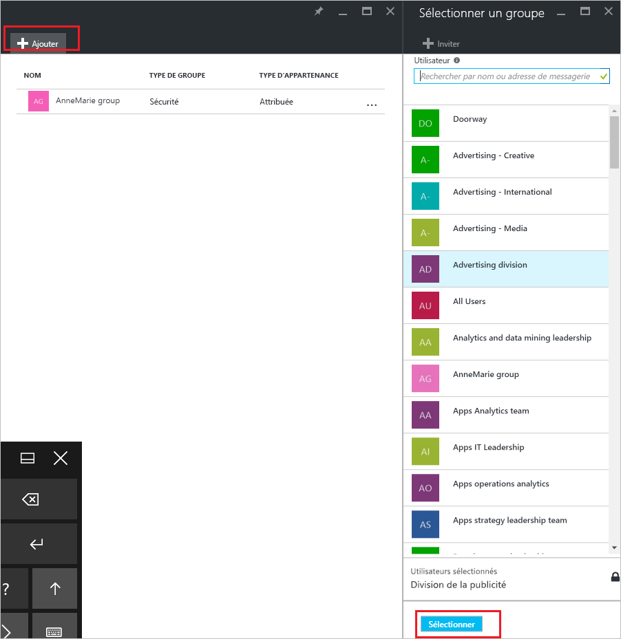
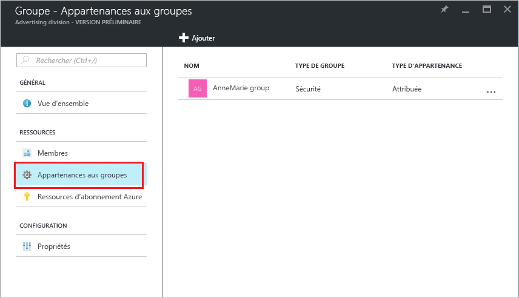

# Comment : ajouter ou supprimer un groupe d’un autre groupe à l’aide d’Azure Active Directory
Cet article vous aide à ajouter et supprimer un groupe d’un autre groupe à l’aide d’Azure Active Directory.

>[!Note]
>Si vous essayez de supprimer le groupe parent, consultez [How to update or delete a group and its members](active-directory-groups-delete-group.md) (Comment mettre à jour ou supprimer un groupe et ses membres).

## Ajouter un groupe en tant que membre d’un autre groupe
Vous pouvez ajouter un groupe existant à un autre groupe existant, en créant un groupe (ou sous-groupe) de membres et un groupe parent. Le groupe de membres hérite des attributs et des propriétés du groupe parent, vous permettant ainsi de gagner du temps de configuration.

### Pour ajouter un groupe en tant que membre d’un autre groupe

1. Connectez-vous au [Portail Azure](https://portal.azure.com) à l’aide d’un compte d’administrateur général pour l’annuaire.

2. Sélectionnez **Azure Active Directory**, puis **Groupes**.

3. Dans la page **Groupes - Tous les groupes**, recherchez et sélectionnez le groupe qui doit devenir un membre d’un autre groupe. Dans cet exercice, nous utilisons le groupe **MDM policy - West** (Stratégie GPM - Ouest).

    >[!Note]
    >Vous pouvez ajouter votre groupe en tant que membre à un seul groupe à la fois. La zone **Sélectionner un groupe** filtre également l’affichage en fonction de la correspondance de votre entrée avec une partie ou l’intégralité d’un nom d’utilisateur ou d’appareil. Les caractères génériques ne sont toutefois pas pris en charge.

    

4. Dans la page **MDM policy - West - Group memberships** (Stratégie GPM - Ouest - Appartenances aux groupes), sélectionnez **Group memberships** (Appartenances aux groupes), sélectionnez **Ajouter**, recherchez le groupe dont votre groupe doit être membre, puis choisissez **Sélectionner**. Dans cet exercice, nous utilisons le groupe **MDM policy - All org** (Stratégie GPM - Toutes les org).

    Le groupe **MDM policy - West** (Stratégie GPM - Ouest) est maintenant un membre du groupe **MDM policy - All org** (Stratégie GPM - Toutes les org), héritant ainsi de toutes les propriétés et de la configuration du groupe Stratégie GPM - Toutes les org.

    

5. Consultez la page **MDM policy - West - Group memberships** (Stratégie GPM - Ouest - Appartenances aux groupes) pour voir la relation de groupe et de membre.

    

6. Pour une vue plus détaillée de la relation de groupe et de membre, sélectionnez le nom du groupe (**MDM policy - All org** (Stratégie GPM - Toutes les org)) et observez les détails de la page **MDM policy - West** (Stratégie GPM - Ouest).

    

## Supprimer un groupe de membres d’un autre groupe
Vous pouvez supprimer un groupe de membres existant d’un autre groupe. Toutefois, la suppression de l’appartenance supprime également les attributs et propriétés hérités pour vos utilisateurs.

### Pour supprimer un groupe de membres d’un autre groupe
1. Dans la page **Groupes - Tous les groupes**, recherchez et sélectionnez le groupe qui doit être supprimé en tant que membre d’un autre groupe. Dans cet exercice, nous utilisons une nouvelle fois le groupe **MDM policy - West** (Stratégie GPM - Ouest).

2. Dans la page **MDM policy - West overview** (Vue d’ensemble de la stratégie GPM - Ouest), sélectionnez **Group memberships** (Appartenances aux groupes).

    

3. Sélectionnez le groupe **MDM policy - All org** (Stratégie GPM - Toutes les org) dans la page **MDM policy - West - Group memberships** (Stratégie GPM - Ouest - Appartenances aux groupes), puis sélectionnez **Supprimer** dans les détails de la page **MDM policy - West** (Stratégie GPM - Ouest).

    

## Informations supplémentaires
Ces articles fournissent des informations supplémentaires sur Azure Active Directory.

- [Afficher vos groupes et vos membres](active-directory-groups-view-azure-portal.md)

- [Créer un groupe de base et ajouter des membres](active-directory-groups-create-azure-portal.md)

- [Ajouter ou supprimer des membres d’un groupe](active-directory-groups-members-azure-portal.md)

- [Modifier vos paramètres de groupe](active-directory-groups-settings-azure-portal.md)

- [Attribuer des licences aux utilisateurs par groupe](../users-groups-roles/licensing-groups-assign.md)
