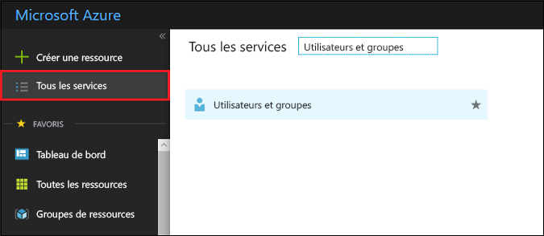
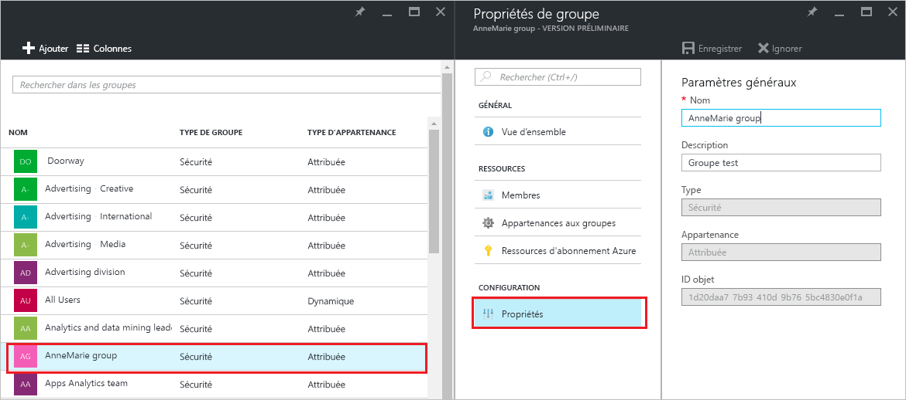
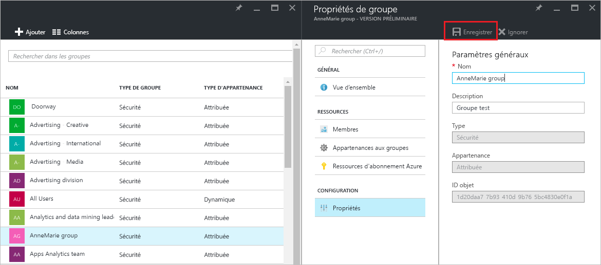

# Gérer les paramètres des groupes dans Azure Active Directory
Cet article explique comment modifier les paramètres d’un groupe dans Azure Active Directory (Azure AD).

## Comment rechercher et modifier les paramètres ?
1. Connectez-vous au [centre d’administration Azure AD](https://aad.portal.azure.com) en utilisant un compte d’administrateur général pour le répertoire.
2. Sélectionnez **Tous les services**, entrez **Utilisateurs et groupes** dans la zone de texte, puis sélectionnez **Entrée**.

   
3. Dans le panneau **Utilisateurs et groupes**, sélectionnez **Tous les groupes**.

   
4. Dans le panneau **Utilisateurs et groupes - Tous les groupes** , sélectionnez un groupe.
5. Dans le panneau **Groupe - *NomGroupe*** sélectionnez **Propriétés**.

   
6. Lorsque vous avez terminé la modification des propriétés du groupe, sélectionnez **Enregistrer**.    

   

## Étapes suivantes
Ces articles fournissent des informations supplémentaires sur Azure Active Directory.

* [Consulter les groupes existants](active-directory-groups-view-azure-portal.md)
* [Création d’un nouveau groupe et ajout de membres](active-directory-groups-create-azure-portal.md)
* [Gérer les membres d’un groupe](active-directory-groups-members-azure-portal.md)
* [Gérer l’appartenance à un groupe](active-directory-groups-membership-azure-portal.md)
* [Gérer les règles dynamiques pour les utilisateurs dans un groupe](../users-groups-roles/groups-dynamic-membership.md)
