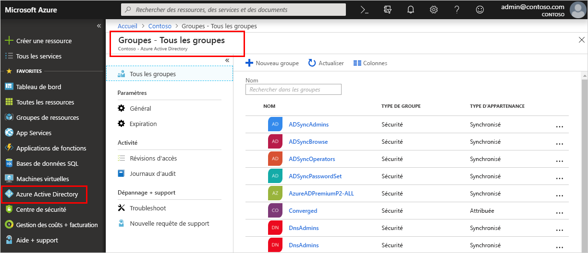

<!--As a brand-new Azure AD administrator, I need to view my organization’s groups along with the assigned members, so I can manage permissions to apps and services for people in my organization-->

# Démarrage rapide : Afficher les membres et groupes de votre organisation dans Azure Active Directory
Vous pouvez afficher les groupes et les membres de groupes existants de votre organisation à l’aide du Portail Azure. Les groupes sont utilisés pour gérer des utilisateurs (membres) qui ont tous besoin des mêmes accès et autorisations pour les services et applications potentiellement limités.

Dans ce démarrage rapide, vous allez afficher tous les groupes existants de votre organisation, ainsi que les membres assignés.

Si vous n’avez pas d’abonnement Azure, créez un [compte gratuit](https://azure.microsoft.com/free/) avant de commencer. 

## Conditions préalables requises
Avant de débuter, vous avez besoin d’effectuer les opérations ci-après :

- Créer un locataire Azure Active Directory. Pour plus d’informations, consultez [Quickstart: Access Azure Active Directory to create a new tenant](active-directory-access-create-new-tenant.md) (Démarrage rapide : Accéder à Azure Active Directory pour créer un locataire).

## Connectez-vous au portail Azure.
Vous devez vous connecter au [Portail Azure](https://portal.azure.com/) à l’aide d’un compte d’administrateur général pour le répertoire.

## Créer un groupe 
Créez un groupe nommé _MDM policy - West_ (Stratégie GPM - Ouest). Pour plus d’informations sur la création d’un groupe, consultez [Créer un groupe et ajouter des membres dans Azure Active Directory](active-directory-groups-create-azure-portal.md).

1. Sélectionnez **Azure Active Directory**, **Groupes**, puis **Nouveau groupe**.

2. Renseignez la page **Groupe** :
    
    - **Type du groupe :** Sélectionnez **Sécurité**
    
    - **Nom du groupe :** Tapez _MDM policy - West_ (Stratégie GPM - Ouest)
    
    - **Type d’appartenance :** Sélectionnez **Assigné**.

3. Sélectionnez **Create** (Créer).

## Créer un utilisateur
Créez un utilisateur nommé _Alain Charon_. Un utilisateur doit exister avant d’être ajouté comme membre du groupe. Consultez d’abord l’onglet « Noms de domaine personnalisés » pour connaître le nom de domaine vérifié dans lequel créer des utilisateurs. Pour plus d’informations sur la création d’un utilisateur, consultez [Démarrage rapide : Ajouter de nouveaux utilisateurs à Azure Active Directory](add-users-azure-active-directory.md).

1. Sélectionnez **Azure Active Directory**, **Utilisateurs**, puis **Nouvel utilisateur**.

2. Renseignez la page **Utilisateur** :

    - **Nom :** Tapez _Alain Charon_.

    - **Nom d'utilisateur :** Tapez *alain\@contoso.com*.

3. Copiez le mot de passe généré automatiquement fourni dans le champ **Mot de passe**, puis sélectionnez **Créer**.

## Ajouter un membre de groupe
Maintenant que vous avez un groupe et un utilisateur, vous pouvez ajouter _Alain Charon_ en tant que membre du groupe _MDM policy - West_ (Stratégie GPM - Ouest). Pour plus d’informations sur l’ajout de membres du groupe, consultez [Gérer l’appartenance à un groupe des utilisateurs dans votre client Azure Active Directory](active-directory-groups-members-azure-portal.md).

1. Sélectionnez **Azure Active Directory** > **Groupes**.

2. Sur la page **Groups - All groups** (Groupes - Tous les groupes), recherchez le groupe **MDM policy - West** (Stratégie GPM - Ouest) et sélectionnez-le.

3. Sur la page **Vue d’ensemble de la stratégie GPM - Ouest**, sélectionnez **Membres** dans la zone **Gérer**.

4. Sélectionnez **Ajouter des membres**, puis recherchez et sélectionnez **Alain Charon**.

5. Choisissez **Select**.

## Afficher tous les groupes
Vous pouvez afficher tous les groupes de votre organisation sur la page **Groups - All groups** (Groupes - Tous les groupes) du Portail Azure.

- Sélectionnez Azure **Active Directory** > **Groupes**.

    La page **Groups - All groups** (Groupes - Tous les groupes) s’affiche, présentant tous vos groupes actifs.

    

## Rechercher le groupe
Recherchez la page **Groups - All groups** (Groupes - Tous les groupes) pour trouver le groupe **MDM policy - West** (Stratégie GPM - Ouest).

1. Sur la page **Groups - All groups** (Groupes - Tous les groupes), tapez _GPM_ dans le champ **Rechercher**.

    Les résultats de recherche s’affichent sous le champ **Recherche**, y compris le groupe _MDM policy - West_ (Stratégie GPM - Ouest).

    

3. Sélectionnez le groupe **MDM policy – West** (Stratégie GPM - Ouest).

4. Affichez les informations de groupe sur la page **MDM policy - West Overview** (Vue d’ensemble de la stratégie GPM - Ouest), y compris le nombre de membres de ce groupe.

    

## Afficher les membres du groupe
Maintenant que vous avez trouvé le groupe, vous pouvez afficher tous les membres assignés.

- Sélectionnez **Membres** dans la zone **Gérer**, puis examinez la liste complète des noms de membres assignés à ce groupe spécifique, y compris _Alain Charon_.

    

## Nettoyer les ressources
Ce groupe est utilisé dans plusieurs procédures qui sont disponibles dans la section **Guides pratiques** de cette documentation. Toutefois, si vous préférez ne pas utiliser ce groupe, vous pouvez le supprimer, ainsi que ses membres assignés, en suivant les étapes ci-après :

1. Sur la page **Groups - All groups** (Groupes - Tous les groupes), recherchez le groupe **MDM policy - West** (Stratégie GPM - Ouest).

2.  Sélectionnez le groupe **MDM policy – West** (Stratégie GPM - Ouest).

    La page **MDM policy - West Overview** (Vue d’ensemble de la stratégie GPM - Ouest) s’affiche.

3. Sélectionnez **Supprimer**.

    Le groupe et ses membres associés sont supprimés.

    

    >[!Important]
    >Cela ne supprime pas l’utilisateur Alain Charon, mais simplement son appartenance au groupe supprimé.

## Étapes suivantes
Passez à l’article suivant pour savoir comment associer un abonnement à votre répertoire Azure AD.

> [!div class="nextstepaction"]
> [Associer un abonnement Azure](active-directory-how-subscriptions-associated-directory.md)
