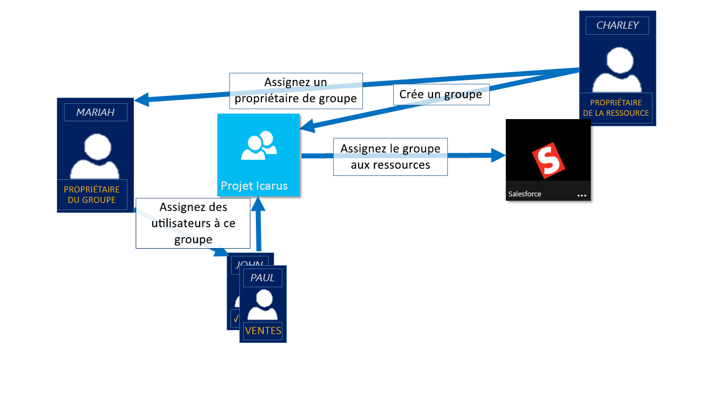
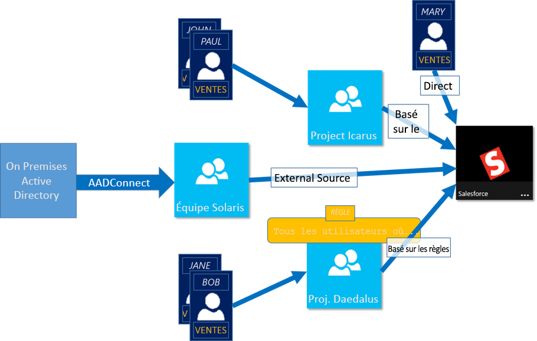

# Gérer l’accès aux applications et aux ressources à l’aide de groupes Azure Active Directory
Azure Active Directory (Azure AD) vous permet d’utiliser des groupes pour gérer l’accès à vos applications basées sur le cloud, applications locales et ressources. Vos ressources peuvent faire partie de l’organisation Azure AD, comme les autorisations de gestion des objets par le biais de rôles dans Azure AD, ou être externes à l’organisation, comme les applications Logiciel en tant que service (SaaS), les services Azure, les sites SharePoint et les ressources locales.

>[!NOTE]
>Pour utiliser Azure Active Directory, vous avez besoin d'un compte Azure. Si vous ne possédez pas encore un compte Azure, vous pouvez [vous inscrire pour en obtenir un gratuitement](https://azure.microsoft.com/free/).
>
> Dans le portail Azure, vous pouvez voir des groupes dont vous ne pouvez pas gérer l’appartenance et les détails dans le portail :
>
> - Les groupes synchronisés à partir d’Active Directory local ne peuvent être gérés que dans Active Directory local.
> - D’autres types de groupes, comme les listes de distribution et les groupes de sécurité à extension messagerie, sont gérés uniquement dans le Centre d’administration Exchange ou le Centre d’administration Microsoft 365. Vous devez vous connecter au Centre d’administration Exchange ou au Centre d’administration Microsoft 365 pour gérer ces groupes.

## Fonctionnement de la gestion de l’accès dans Azure AD

Azure AD vous permet d’accorder des accès aux ressources de votre organisation en fournissant des droits d’accès à un utilisateur individuel ou à tout un groupe Azure AD. L’utilisation de groupes permet au propriétaire de ressources (ou propriétaire de répertoires Azure AD) d’assigner un ensemble d’autorisations d’accès à tous les membres du groupe, plutôt que d’avoir à fournir les droits un par un. Le propriétaire de ressources ou de répertoires peut également accorder des droits de gestion pour la liste des membres à quelqu’un d’autre, comme un responsable de service ou un administrateur du support technique, pour permettre à cette personne d’ajouter et de supprimer des personnes comme nécessaire. Pour plus d’informations sur la gestion des propriétaires de groupes, consultez [Gestion des propriétaires d’un groupe](active-directory-accessmanagement-managing-group-owners.md)

## Méthodes d’assignation des droits d’accès

Quatre méthodes vous permettent d’assigner des droits d’accès aux ressources à vos utilisateurs :

- **Assignation directe.** Le propriétaire de la ressource assigne directement l’utilisateur à la ressource.

- **Assignation de groupe.** Le propriétaire de la ressource assigne un groupe Azure AD à la ressource, ce qui accorde automatiquement l’accès à la ressource à tous les membres du groupe. L’appartenance au groupe est gérée par le propriétaire du groupe et le propriétaire de la ressource, ce qui leur permet d’ajouter ou de supprimer des membres du groupe. Pour plus d’informations sur l’ajout ou la suppression de membres du groupe, consultez [Comment : ajouter ou supprimer un groupe d’un autre groupe à l’aide du portail Azure Active Directory](active-directory-groups-membership-azure-portal.md). 

- **Assignation basée sur des règles.** Le propriétaire de la ressource crée un groupe et utilise une règle pour définir quels sont les utilisateurs assignés à une ressource spécifique. La règle est basée sur des attributs qui sont assignés à des utilisateurs individuels. Le propriétaire de la ressource gère la règle, en déterminant les attributs et les valeurs nécessaires pour autoriser l’accès à la ressource. Pour plus d’informations, consultez [Créer un groupe dynamique et vérifier l’état](../users-groups-roles/groups-create-rule.md).

    Vous pouvez également regarder cette courte vidéo vous expliquant rapidement la création et l’utilisation de groupes dynamiques :

    >[!VIDEO https://channel9.msdn.com/Series/Azure-Active-Directory-Videos-Demos/Azure-AD--Introduction-to-Dynamic-Memberships-for-Groups/player]

- **Assignation d’autorité externe.** L’accès provient d’une source externe, comme un répertoire local ou une application SaaS. Dans cette situation, le propriétaire de la ressource assigne un groupe pour fournir l’accès à la ressource, puis la source externe gère les membres du groupe.

   

## Les utilisateurs peuvent-ils rejoindre des groupes sans assignation ?
Le propriétaire de groupes peut autoriser les utilisateurs à chercher le groupe qu’ils souhaitent rejoindre plutôt que de les assigner à un groupe. En outre, le propriétaire peut configurer le groupe pour qu’il accepte automatiquement tous les utilisateurs qui veulent le rejoindre ou pour qu’il demande une approbation.

Après qu’un utilisateur a demandé à rejoindre un groupe, la requête est transférée au propriétaire du groupe. Si nécessaire, le propriétaire peut approuver la requête, et l’utilisateur reçoit une notification l’informant de son appartenance au groupe. Toutefois, si vous avez plusieurs propriétaires et si l’un d’eux refuse la requête, l’utilisateur en est informé et n’est pas ajouté au groupe. Pour obtenir plus d’informations et d’instructions sur la façon dont vous pouvez autoriser vos utilisateurs à demander à rejoindre des groupes, consultez [Configurer Azure Active Directory pour la gestion de groupes en libre-service](../users-groups-roles/groups-self-service-management.md)

## Étapes suivantes
Maintenant que vous connaissez un peu mieux la gestion des accès à l’aide de groupes, vous commencez à gérer vos ressources et applications.

- [Créer un groupe et ajouter des membres dans Azure Active Directory](active-directory-groups-create-azure-portal.md) ou [Cmdlets d’Azure Active Directory version 2 pour la gestion de groupe](../users-groups-roles/groups-settings-v2-cmdlets.md)

- [Utilisation d’un groupe pour gérer l’accès aux applications SaaS](../users-groups-roles/groups-saasapps.md)

- [Sync an on-premises group to Azure using Azure AD Connect](../hybrid/whatis-hybrid-identity.md) (Synchroniser un groupe local avec Azure à l’aide d’Azure AD Connect)
