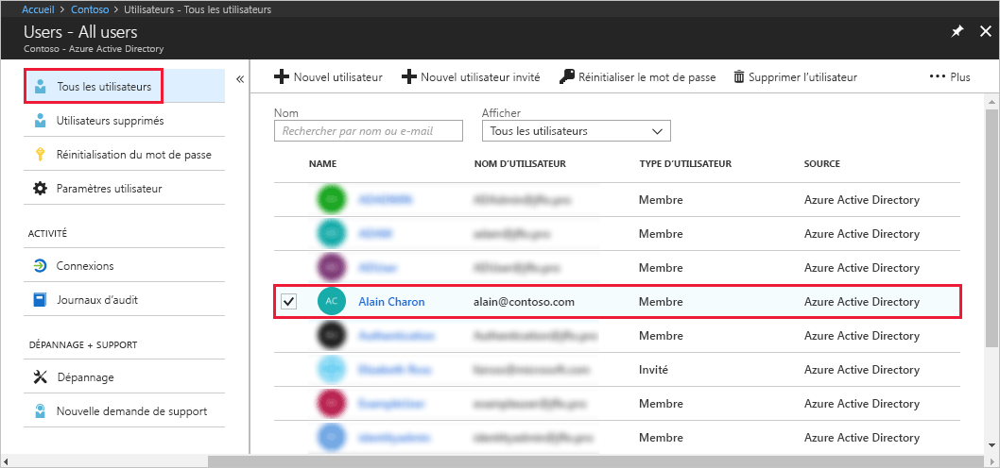
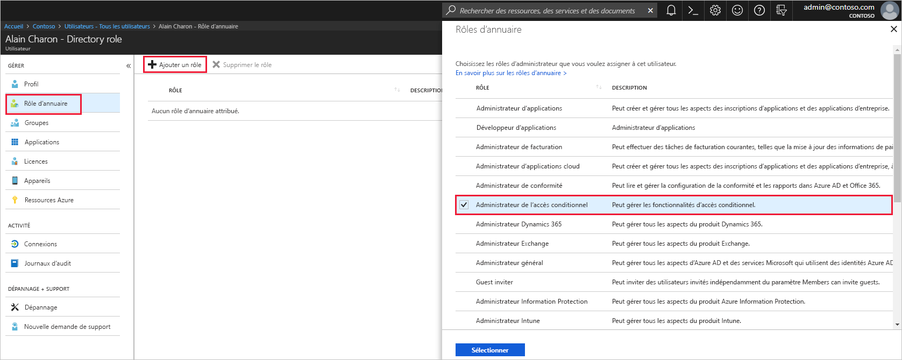

# Affecter des rôles d’administrateur à un utilisateur dans Azure Active Directory
Cet article explique comment affecter un rôle d’administration à un utilisateur dans Azure Active Directory (Azure AD). Pour en savoir plus sur l’ajout d’utilisateurs dans votre organisation, consultez [Ajout de nouveaux utilisateurs à Azure Active Directory](../add-users-azure-active-directory.md). Par défaut, les utilisateurs ajoutés ne reçoivent pas d’autorisations d’administrateur, mais vous pouvez leur attribuer des rôles à tout moment.

## Affecter un rôle à un utilisateur
1. Connectez-vous au [portail Azure](https://portal.azure.com) avec un compte d’administrateur général ou d’administrateur avec un rôle privilégié pour le répertoire.

2. Sélectionnez **Azure Active Directory**, **Utilisateurs**, puis un utilisateur spécifique dans la liste.

    

3. Pour l’utilisateur sélectionné, sélectionnez **Rôle d’annuaire**, **Ajouter un rôle**, puis les rôles d’administrateur appropriés dans la liste **Rôles d’annuaire** (par exemple **Administrateur d’accès conditionnel**). Pour plus d’informations sur les rôles d’administrateur, consultez [Attribution de rôles d’administrateur dans Azure AD](../active-directory-assign-admin-roles-azure-portal.md). 

    

1. Appuyez sur **Sélectionner** pour enregistrer.

## Étapes suivantes
* [Guide de démarrage rapide : Ajouter ou supprimer des utilisateurs dans Azure Active Directory](add-users-azure-active-directory.md)
* [Gérer les profils utilisateur](active-directory-users-profile-azure-portal.md)
* [Ajouter des utilisateurs invités à partir d’un autre répertoire](../b2b/what-is-b2b.md) 
* [Affecter un utilisateur à un rôle dans Azure AD](active-directory-users-assign-role-azure-portal.md)
* [Restaurer un utilisateur supprimé](active-directory-users-restore.md)
