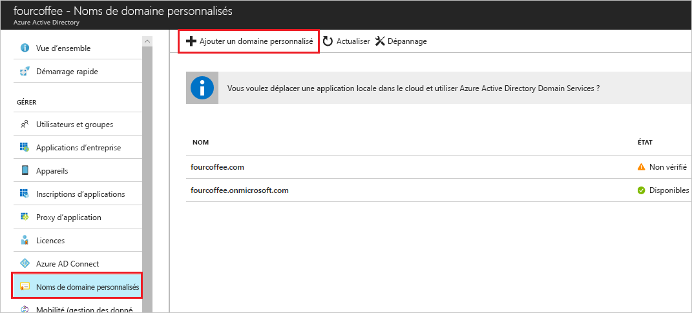

# Ajouter votre nom de domaine personnalisé à l’aide du Portail Azure Active Directory

Chaque nouveau locataire Azure AD est fourni avec un nom de domaine initial, *\<domainname>.onmicrosoft.com* . Vous ne pouvez pas modifier ni supprimer le nom de domaine initial, mais vous pouvez ajouter des noms de votre organisation. L’ajout de noms de domaine personnalisés vous permet de créer des noms d’utilisateur qui sont familiers à vos utilisateurs, par exemple *alain\@contoso.com* .

## Avant de commencer

Avant de pouvoir ajouter un nom de domaine personnalisé, créez votre nom de domaine avec un bureau d’enregistrement de domaines. Pour trouver un bureau d’enregistrement de domaines agréé, consultez la page [ICANN-Accredited Registrars](https://www.icann.org/registrar-reports/accredited-list.html) (Bureaux d’enregistrement agréés par l’ICANN).

## Créer votre annuaire dans Azure AD

Après avoir obtenu votre nom de domaine, vous pouvez créer votre premier annuaire Azure AD. Connectez-vous au portail Azure dans cette intention, avec un compte disposant du rôle **Propriétaire** pour l’abonnement.

Créez votre annuaire en suivant les étapes décrites dans la rubrique [Create a new tenant for your organization](active-directory-access-create-new-tenant.md#create-a-new-tenant-for-your-organization) (Créer un locataire pour votre organisation).

>[!IMPORTANT]
>La personne qui crée le locataire est automatiquement définie comme administrateur général pour ce locataire. L’administrateur général peut ajouter des administrateurs au locataire.

Pour plus d’informations sur les rôles d’abonnement, consultez [Rôles Azure](../../role-based-access-control/rbac-and-directory-admin-roles.md#azure-roles).

>[!TIP]
> Si vous envisagez de fédérer votre instance locale de Windows Server Active Directory avec Azure AD, vous devez sélectionner **Je prévois de configurer ce domaine pour l’authentification unique avec mon annuaire Active Directory local** lorsque vous exécutez l’outil Azure AD Connect pour synchroniser vos annuaires.
>
> Vous devez également inscrire le même nom de domaine que celui que vous comptez fédérer avec votre annuaire local lors de l’étape **Domaine Azure AD** de l’Assistant. Pour voir à quoi ressemble cette configuration, consultez [Vérifier le domaine Azure AD sélectionné pour la fédération](../hybrid/how-to-connect-install-custom.md#verify-the-azure-ad-domain-selected-for-federation). Si vous ne disposez pas de l’outil Azure AD Connect, vous pouvez [le télécharger ici](https://go.microsoft.com/fwlink/?LinkId=615771).

## Ajouter votre nom de domaine personnalisé à Azure AD

Après avoir créé votre annuaire, vous pouvez ajouter votre nom de domaine personnalisé.

1. Connectez-vous au [portail Azure](https://portal.azure.com/) à l’aide d’un compte d’administrateur général pour le répertoire.

1. Recherchez et sélectionnez *Azure Active Directory* à partir de n’importe quelle page. Ensuite, sélectionnez **Noms de domaine personnalisés** > **Ajouter un domaine personnalisé** .

    

1. Dans **Nom de domaine personnalisé** , entrez le nouveau nom de votre organisation, dans cet exemple, *contoso.com* . Sélectionnez **Ajouter un domaine** .

    

    >[!IMPORTANT]
    >Vous devez inclure *.com* , *.net* ou toute autre extension de niveau supérieur pour que le processus fonctionne correctement.

    Le domaine non vérifié est ajouté. La page **contoso.com** apparaît et affiche vos informations DNS. Enregistrez ces informations. Vous en aurez besoin ultérieurement pour créer un enregistrement TXT en vue de configurer DNS.

    

## Ajouter vos informations DNS au bureau d’enregistrement de domaines

Après avoir ajouté votre nom de domaine personnalisé à Azure AD, vous devez revenir à votre bureau d’enregistrement de domaines et ajouter les informations DNS d’Azure AD de votre fichier TXT copié. La création de cet enregistrement TXT pour votre domaine entraîne la vérification de la propriété de votre nom de domaine.

Revenez à votre bureau d’enregistrement de domaines et créez un enregistrement TXT pour votre domaine, en fonction de vos informations DNS copiées. Définissez la durée de vie (TTL) sur 3 600 secondes (60 minutes), puis enregistrez l’enregistrement.

>[!IMPORTANT]
>Vous pouvez enregistrer autant de noms de domaine que vous le souhaitez. Toutefois, chaque domaine obtient son propre enregistrement TXT à partir d’Azure AD. Soyez vigilant lorsque vous entrez les informations du fichier TXT auprès du bureau d’enregistrement de domaines. Si vous entrez des informations incorrectes ou dupliquées par erreur, vous devrez attendre l’expiration de la durée de vie (60 minutes) avant de pouvoir essayer de nouveau.

## Vérifier votre nom de domaine personnalisé

Après avoir enregistré votre nom de domaine personnalisé, assurez-vous qu’il est valide dans Azure AD. La propagation vers Azure AD à partir de votre bureau d’enregistrement de domaines peut être instantanée ou prendre quelques jours selon votre bureau d’enregistrement de domaines.

Pour vérifier votre nom de domaine personnalisé, suivez ces étapes :

1. Connectez-vous au [portail Azure](https://portal.azure.com/) à l’aide d’un compte d’administrateur général pour le répertoire.

1. Recherchez et sélectionnez *Azure Active Directory* à partir de n’importe quelle page, puis sélectionnez **Noms de domaine personnalisés** .

1. Dans **Noms de domaine personnalisés** , sélectionnez le nom de domaine personnalisé. Dans cet exemple, sélectionnez **contoso.com** .

    

1. Sur la page **contoso.com** , sélectionnez **Vérifier** pour vous assurer que votre domaine personnalisé est enregistré correctement et qu’il est valide pour Azure AD.

    

Une fois que vous avez vérifié votre nom de domaine personnalisé, vous pouvez supprimer votre fichier TXT ou MX de vérification.

## Problèmes de vérification courants

Si Azure AD ne parvient pas à vérifier un nom de domaine personnalisé, suivez les suggestions ci-après :

- **Attendez au moins une heure et essayez à nouveau** . Les enregistrements DNS doivent être propagés avant qu’Azure AD puisse vérifier le domaine. Cette opération peut prendre une heure ou davantage.

- **Vérifiez que l’enregistrement DNS est correct.** Revenez sur le site du bureau d’enregistrement de noms de domaine. Assurez-vous que l’entrée y figure et qu’elle correspond aux informations d’entrée DNS fournies par Azure AD.

  Si vous ne pouvez pas mettre à jour l’enregistrement sur le site du bureau d’enregistrement, partagez l’entrée avec une personne qui dispose des autorisations pour ajouter l’entrée et vérifier qu’elle est correcte.

- **Assurez-vous que le nom de domaine n’est pas déjà en cours d’utilisation dans un autre annuaire.** Un nom de domaine ne peut être vérifié que dans un seul annuaire. Par conséquent, si votre nom de domaine est vérifié dans un autre annuaire, il ne peut pas être également vérifié dans le nouvel annuaire. Pour résoudre ce problème de duplication, vous devez supprimer le nom de domaine à partir de l’ancien annuaire. Pour plus d’informations sur la suppression de noms de domaine, voir [Gérer les noms de domaine personnalisés](../enterprise-users/domains-manage.md).

- **Assurez-vous de n’avoir aucun locataire Power BI non managé.** Si vos utilisateurs ont activé Power BI via l’inscription libre-service et créé un locataire non managé pour votre organisation, vous devez reprendre la gestion en tant qu’administrateur interne ou externe à l’aide de PowerShell. Pour plus d’informations, consultez [Prendre le contrôle d’un annuaire non géré en tant qu’administrateur dans Azure Active Directory](../enterprise-users/domains-admin-takeover.md).

## Étapes suivantes

- Ajoutez un autre administrateur général à votre annuaire. Pour plus d’informations, consultez la rubrique [Affecter des rôles d’administrateur à un utilisateur dans Azure Active Directory](active-directory-users-assign-role-azure-portal.md).

- Ajoutez des utilisateurs à votre domaine. Pour plus d’informations, consultez [Guide pratique pour ajouter ou supprimer des utilisateurs](add-users-azure-active-directory.md).

- Gérez vos informations de nom de domaine dans Azure AD. Pour plus d’informations, consultez [Gestion des noms de domaine personnalisés dans Azure Active Directory](../enterprise-users/domains-manage.md).

- Si vous souhaitez utiliser des versions locales de Windows Server avec Azure Active Directory, consultez la rubrique [Intégrer des répertoires locaux à Azure Active Directory](../hybrid/whatis-hybrid-identity.md).