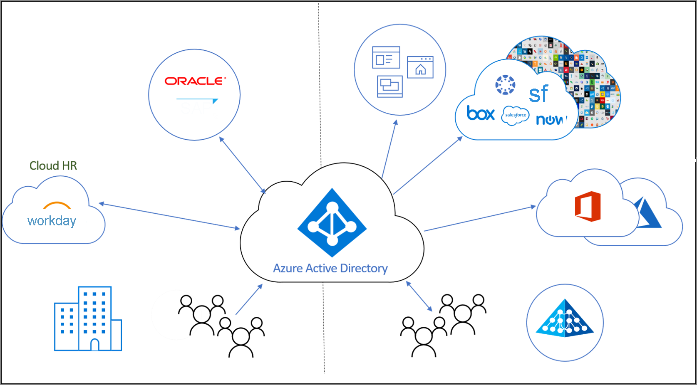

# Qu’est-ce que la gestion du cycle de vie des identités ?

Identity Governance aide les organisations à trouver un équilibre entre productivité (vitesse à laquelle des personnes peuvent accéder aux ressources dont elles ont besoin, par exemple pour joindre mon organisation) et sécurité (comment leur accès doit évoluer au fil du temps, par exemple à la suite de modifications de leur statut professionnel).

La **gestion du cycle de vie des identités** constitue le fondement d’Identity Governance. Une gouvernance efficace à grande échelle implique la modernisation de l’infrastructure de gestion du cycle de vie des identités pour les applications. La gestion du cycle de vie des identités vise à automatiser et à gérer l’intégralité du processus de cycle de vie des identités numériques. 

## Qu’est-ce qu’une identité numérique ?

Une identité numérique est une information sur une entité utilisée par une ou plusieurs ressources de calcul, telles que des systèmes d’exploitation ou des applications. Ces entités peuvent représenter des personnes, des organisations, des applications ou des appareils.  L’identité est généralement décrite par les attributs qui lui sont associés, comme le nom, les identificateurs ainsi que les propriétés telles que les rôles utilisés pour la gestion des accès.  Ces attributs permettent aux systèmes de déterminer notamment qui a accès à quoi et qui est autorisé à utiliser tel ou tel système.  

## Gestion du cycle de vie des identités numériques

La gestion des identités numériques est une tâche complexe, en particulier en ce qui concerne la corrélation des objets réels, tels qu’une personne et sa relation avec une organisation en tant qu’employé de celle-ci, avec une représentation numérique.    Dans les petites entreprises, la conservation de la représentation numérique des individus qui requièrent une identité peut être un processus manuel. Quand quelqu’un est embauché ou qu’un prestataire se présente, un spécialiste informatique peut créer un compte pour ces personnes dans un annuaire et leur attribuer l’accès dont elles ont besoin.  Toutefois, dans les organisations de taille moyenne et grande, l’automatisation peut permettre à l’organisation de se mettre à l’échelle plus efficacement et d’assurer la précision des identités.

La procédure classique d’établissement de la gestion du cycle de vie des identités dans une organisation est la suivante :

1. Déterminez s’il existe déjà des systèmes d’enregistrement : des sources de données que l’organisation considère comme faisant autorité.  Par exemple, l’organisation peut avoir un système RH Workday et ce système fait autorité pour fournir la liste actuelle des employés et certaines de leurs propriétés, telles que le nom ou le service de l’employé.  Un système de messagerie tel qu’Exchange Online peut faire autorité pour l’adresse e-mail d’un employé.

2. Connectez ces systèmes d’enregistrement à un ou plusieurs annuaires et bases de données utilisés par les applications, puis résolvez les incohérences entre les annuaires et les systèmes d’enregistrement. Par exemple, un annuaire peut contenir des données obsolètes, telles qu’un compte pour un ancien employé, qui n’est plus nécessaire. 

3. Identifiez les processus qui peuvent être utilisés pour fournir des informations faisant autorité en l’absence d’un système d’enregistrement.  Par exemple, s’il existe des identités numériques mais que ce sont des visiteurs, et que l’organisation n’a pas de base de données pour les visiteurs, il peut être nécessaire de trouver une autre façon de déterminer quand l’identité numérique d’un visiteur n’est plus nécessaire.

4. Configurez que les modifications du système d’enregistrement ou d’autres processus sont répliquées vers chaque annuaire ou base de données qui nécessite une mise à jour.

## Gestion du cycle de vie des identités pour représenter des employés et d’autres personnes ayant une relation avec l’organisation

Lors de la planification de la gestion du cycle de vie des identités pour les employés, ou d’autres personnes ayant une relation avec l’organisation comme un prestataire ou un étudiant, de nombreuses organisations modélisent le processus « rejoindre, bouger et quitter ».  Ces règles sont les suivantes :
    
   - Rejoindre : quand une personne a besoin d’un accès, une identité est requise par ces applications et une identité numérique doit peut-être être créée s’il n’en existe aucune déjà disponible
   - Bouger : quand une personne se déplace entre des limites, il peut être nécessaire d’ajouter ou de supprimer des autorisations d’accès à son identité numérique
   - Quitter : quand une personne n’a plus besoin d’un accès, il est possible que celui-ci doive être supprimé et, par la suite, l’identité peut ne plus être requise par les applications, si ce n’est à des fins d’audit ou d’investigation

Par exemple, si un nouvel employé qui n’a jamais été affilié à votre organisation auparavant la rejoint, il aura besoin d’une nouvelle identité numérique, représentée sous la forme d’un compte d’utilisateur dans Azure AD.  La création de ce compte relève d’un processus « Recrutement », qui peut être automatisé s’il existe un système d’enregistrement, tel que Workday, pour indiquer le moment auquel le nouvel employé commence à travailler.  Par la suite, si un employé de votre organisation passe par exemple du service Ventes à Marketing, cette opération relève d’un processus « Transfert ».  Cela nécessite la suppression des droits d’accès associés au service Ventes dont il n’a plus besoin et l’octroi de droits dans le service Marketing qu’il nécessite à présent.

## Gestion du cycle de vie des identités pour les invités

Des processus similaires sont également nécessaires pour les invités et d’autres utilisateurs.  La gestion des droits d’utilisation Azure AD emploie Azure AD B2B (Business-to-Business) pour fournir les contrôles de cycle de vie nécessaires à la collaboration avec des personnes extérieures à votre organisation qui requièrent l’accès aux ressources de votre organisation. Avec Azure AD B2B, les utilisateurs externes s’authentifient auprès de leur annuaire de base, mais disposent d’une représentation dans votre annuaire. La représentation dans votre annuaire permet à l’utilisateur d’avoir accès à vos ressources.  La gestion des droits d’utilisation permet à des personnes extérieures à votre organisation de demander l’accès, en créant une identité numérique pour celles-ci en fonction des besoins. Ces identités numériques sont automatiquement supprimées lorsque l’utilisateur perd l’accès.  

## Comment la gestion du cycle de vie des identités est-elle automatisée par Azure AD ?

Azure AD offre actuellement les fonctionnalités suivantes :

* Des utilisateurs représentant des employés peuvent être créés et mis à jour automatiquement dans Azure AD et Active Directory avec le [provisionnement piloté par les RH](what-is-hr-driven-provisioning.md)
* Les utilisateurs déjà présents dans Active Directory peuvent être automatiquement créés et gérés dans Azure AD avec le [provisionnement inter-annuaires](what-is-inter-directory-provisioning.md)
* Les utilisateurs peuvent être automatiquement attribués à des groupes en fonction de leurs propriétés, avec des [groupes dynamiques](../external-identities/use-dynamic-groups.md#what-are-dynamic-groups) et peuvent, à la demande, être attribués à des groupes, des équipes, des rôles Azure AD, des rôles de ressources Azure et des sites SharePoint Online, à l’aide de la [gestion des droits d’utilisation](entitlement-management-scenarios.md) et de [Privileged Identity Management](../privileged-identity-management/pim-configure.md)
* Les mises à jour des utilisateurs peuvent être automatiquement envoyées à d’autres applications avec le [provisionnement d’application](what-is-app-provisioning.md)

## Étapes suivantes 

- [Présentation du provisionnement](what-is-provisioning.md)
- [Régir l’accès des utilisateurs externes dans la gestion des droits d’utilisation Azure AD](/azure/active-directory/governance/entitlement-management-external-users)
- [Qu’est-ce que le provisionnement piloté par les RH ?](what-is-hr-driven-provisioning.md)
- [Qu’est-ce que le provisionnement d’application ?](what-is-app-provisioning.md)
- [Qu’est-ce que le provisionnement inter-annuaires ?](what-is-inter-directory-provisioning.md)
