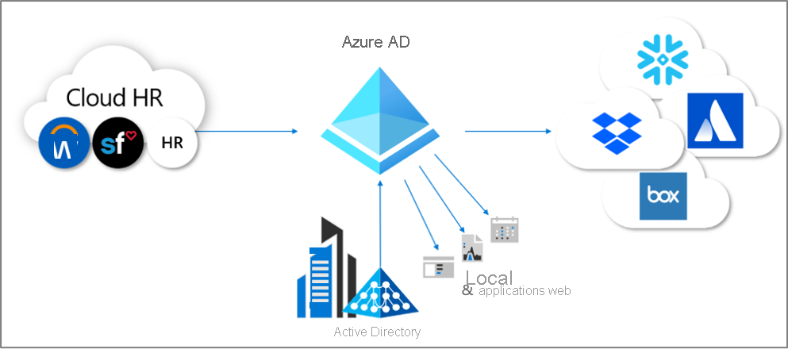
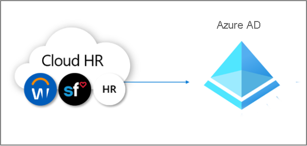
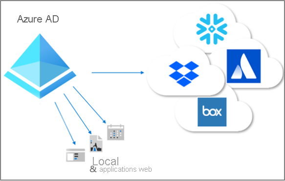

# Qu’est-ce que le provisionnement ?

Le provisionnement et le déprovisionnement sont les processus qui garantissent la cohérence des identités numériques entre plusieurs systèmes.  Ces processus sont généralement exploités dans le cadre de la [gestion du cycle de vie des identités](what-is-identity-lifecycle-management.md).

Le **provisionnement** est le processus de création d’une identité dans un système cible en fonction de certaines conditions.  Le **déprovisionnement** est le processus de suppression de l’identité du système cible, lorsque les conditions ne sont plus remplies. La **synchronisation** est le processus qui consiste à conserver l’objet provisionné à jour, afin que l’objet source et l’objet cible soient similaires.

Par exemple, lorsqu’un nouvel employé rejoint votre organisation, il est entré dans le système RH.  À ce stade, le provisionnement **de** RH **vers** Azure AD (Azure Active Directory) peut créer un compte d’utilisateur correspondant dans Azure AD. Les applications qui interrogent Azure AD peuvent voir le compte pour ce nouvel employé.  Si des applications n’utilisent pas Azure AD, le provisionnement **d’** Azure AD **vers** les bases de données de ces applications garantit que l’utilisateur pourra accéder à toutes les applications dont il a besoin.  Ce processus permet à l’utilisateur de commencer à travailler et d’avoir accès aux applications et systèmes dont il a besoin, dès le premier jour.  De même, quand ses propriétés, comme sa division ou son poste, changent dans le système RH, la synchronisation de ces mises à jour du système RH vers Azure AD ainsi que vers d’autres applications et bases de données cibles garantit la cohérence.

Azure AD offre actuellement trois domaines de provisionnement automatisé.  Il s'agit de :  

- Provisionnement depuis un système d’enregistrement faisant autorité externe autre qu’un annuaire vers Azure AD, via le **[provisionnement piloté par les RH](#hr-driven-provisioning)**  
- Provisionnement depuis Azure AD vers des applications, via le **[provisionnement d’application](#app-provisioning)**  
- Provisionnement entre des services de domaine Azure AD et Active Directory, via le **[provisionnement inter-annuaires](#inter-directory-provisioning)** 

## Provisionnement piloté par les RH

Le provisionnement de RH vers Azure AD implique la création d’objets, généralement des identités utilisateur représentant chaque employé mais, dans certains cas, d’autres objets représentant des services ou d’autres structures, en fonction des informations qui figurent dans votre système RH.  

Le scénario le plus courant correspond à un nouvel employé qui rejoint votre entreprise et qui est entré dans le système RH.  Une fois cette opération effectuée, il est automatiquement provisionné en tant que nouvel utilisateur dans Azure AD, sans la nécessité d’une implication administrative pour chaque nouvelle embauche.  En général, le provisionnement depuis le système RH peut couvrir les scénarios suivants.

- **Nouvelles embauches**  : lorsqu’un nouvel employé est ajouté à un système RH, un compte d’utilisateur est automatiquement créé dans Active Directory, Azure AD et, éventuellement, dans les annuaires d’autres applications prises en charge par Azure AD, avec l’écriture différée de l’adresse e-mail pour le système RH.
- **Mises à jour du profil et des attributs de l’employé**  : quand l’enregistrement d’un employé est mis à jour dans ce système RH (par exemple son nom, sa fonction ou son responsable), le compte d’utilisateur est mis à jour automatiquement dans Active Directory, Azure AD et, éventuellement, d’autres applications prises en charge par Azure AD.
- **Résiliations de contrats d’employés**  : quand le contrat d’un employé est résilié dans le système RH, son compte d’utilisateur n’est plus autorisé à se connecter ou est supprimé automatiquement dans Active Directory, Azure AD et d’autres applications.
- **Réembauches d’employés**  : lorsqu’un employé est réembauché dans le système RH cloud, son ancien compte peut être automatiquement réactivé ou reprovisionné (selon votre préférence).

Il existe trois options de déploiement pour le provisionnement piloté par les RH avec Azure AD :

1. Pour les organisations avec un seul abonnement à Workday ou SuccessFactors et qui n’utilisent pas Active Directory
1. Pour les organisations avec un seul abonnement à Workday ou SuccessFactors, et qui utilisent à la fois Active Directory et Azure AD
1. Pour les organisations avec plusieurs systèmes RH ou un système RH local comme SAP, Oracle eBusiness ou PeopleSoft

Pour plus d’informations, consultez [Qu’est-ce que le provisionnement piloté par les RH ?](what-is-hr-driven-provisioning.md)

## Provisionnement d’applications

Dans Azure AD, le terme **[provisionnement d’application](https://docs.microsoft.com/azure/active-directory/manage-apps/user-provisioning)** désigne la création automatique de copies d’identités utilisateur dans les applications auxquelles les utilisateurs doivent accéder, pour les applications qui ont leur propre magasin de données, distinct d’Azure AD ou d’Active Directory. En plus de créer des identités utilisateur, le provisionnement d’application comprend la maintenance et la suppression d’identités utilisateur dans ces applications en cas de changement de l’état ou des rôles de l’utilisateur. Les scénarios courants incluent le provisionnement d’un utilisateur Azure AD dans des applications comme [Dropbox](https://docs.microsoft.com/azure/active-directory/saas-apps/dropboxforbusiness-provisioning-tutorial), [Salesforce](https://docs.microsoft.com/azure/active-directory/saas-apps/salesforce-provisioning-tutorial), [ServiceNow](https://docs.microsoft.com/azure/active-directory/saas-apps/servicenow-provisioning-tutorial), car chacune de ces applications a son propre dépôt utilisateur distinct d’Azure AD.

Pour plus d’informations, consultez [Qu’est-ce que le provisionnement d’application ?](what-is-app-provisioning.md)

## Provisionnement inter-annuaires

De nombreuses organisations s’appuient sur Active Directory et Azure AD, et peuvent avoir des applications connectées à Active Directory, comme des serveurs de fichiers locaux.

Dans la mesure où de nombreuses organisations ont historiquement déployé le provisionnement piloté par les RH en local, il est possible qu’elles disposent déjà d’identités utilisateur pour tous leurs employés dans Active Directory.   Le scénario le plus courant pour le provisionnement inter-annuaires est celui où un utilisateur déjà dans Active Directory est provisionné dans Azure AD.  Ce provisionnement est généralement effectué par la synchronisation Azure AD Connect ou le provisionnement cloud Azure AD Connect. 

De plus, les organisations peuvent souhaiter provisionner également des systèmes locaux depuis Azure AD.  Par exemple, une organisation peut avoir placé des invités dans l’annuaire Azure AD, mais ces invités doivent accéder aux applications web basées sur l’authentification Windows intégrée locales via le proxy d’application.  Cela nécessite le provisionnement de comptes AD locaux pour ces utilisateurs dans Azure AD.

Pour plus d’informations, consultez [Qu’est-ce que le provisionnement inter-annuaires ?](what-is-inter-directory-provisioning.md)

 
## Étapes suivantes 
- [Qu’est-ce que la gestion du cycle de vie des identités ?](what-is-identity-lifecycle-management.md)
- [Qu’est-ce que le provisionnement piloté par les RH ?](what-is-hr-driven-provisioning.md)
- [Qu’est-ce que le provisionnement d’application ?](what-is-app-provisioning.md)
- [Qu’est-ce que le provisionnement inter-annuaires ?](what-is-inter-directory-provisioning.md)
