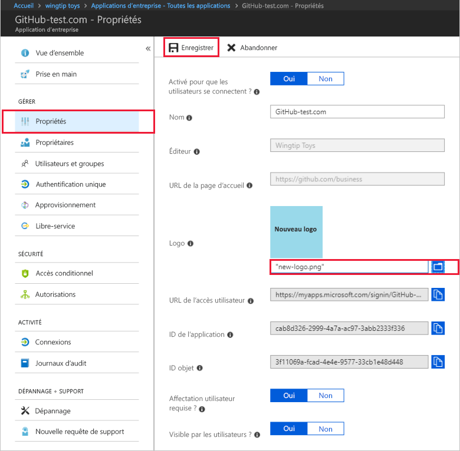

# Démarrage rapide : Configurer les propriétés d’une application dans votre locataire Azure Active Directory (Azure AD)

Dans le guide de démarrage rapide précédent, vous avez ajouté une application à votre locataire Azure Active Directory (Azure AD). Quand vous ajoutez une application, vous indiquez à votre locataire Azure AD qu’il fait office de fournisseur d’identité pour l’application. À présent, vous allez configurer certaines des propriétés de l’application.
 
## Prérequis

Pour configurer les propriétés d’une application dans votre locataire Azure AD, vous avez besoin des éléments suivants :

- Compte Azure avec un abonnement actif. [Créez un compte gratuitement](https://azure.microsoft.com/free/?WT.mc_id=A261C142F).
- Un des rôles suivants : Administrateur général, Administrateur d’application cloud, Administrateur d’application ou propriétaire du principal de service.
- Facultatif : effectuer [Voir vos applications](view-applications-portal.md).
- Facultatif : effectuer [Ajouter une application](add-application-portal.md).

>[!IMPORTANT]
>Pour tester les étapes de ce guide de démarrage rapide, utilisez un environnement de non-production.

## Configurer les propriétés de l’application

Lorsque vous avez terminé l’ajout d’une application à votre locataire Azure AD, la page de vue d’ensemble correspondante s’affiche. Si vous configurez une application qui a déjà été ajoutée, consultez le premier guide de démarrage rapide. Il vous explique étape par étape comment afficher les applications ajoutées à votre locataire. 

Pour modifier les propriétés de l’application :

1. Dans le portail Azure AD, sélectionnez **Applications d’entreprise**. Ensuite, recherchez et sélectionnez l’application que vous souhaitez configurer.
2. Dans la section **Gérer**, sélectionnez **Propriétés** pour ouvrir le volet **Propriétés** à des fins de modification.
3. Prenez le temps de comprendre les options disponibles. Les options disponibles dépendent de la façon dont l’application est intégrée à Azure AD. Par exemple, une application qui utilise l’authentification unique basée sur SAML disposera de champs comme *URL de l’accès utilisateur*, au contraire d’une application qui utilise l’authentification unique basée sur OIDC. De même, notez que les applications ajoutées via **Azure Active Directory > Inscriptions des applications** sont par défaut des applications basées sur OIDC. En revanche, les applications ajoutées via **Azure Active Directory > Applications d’entreprise** peuvent utiliser un des différents standards d’authentification unique. Toutes les applications disposeront de champs permettant de configurer à quel moment une application apparaît et quand elle peut être utilisée. Ces champs sont les suivants :
    - **Connexion permise pour les utilisateurs** détermine si les utilisateurs assignés à l’application peuvent se connecter.
    - **Affectation de l’utilisateur requise** détermine si les utilisateurs qui ne sont pas assignés à l’application peuvent se connecter.
    - **Visible par les utilisateurs ?** détermine si les utilisateurs affectés à une application peuvent la voir dans [Mes applications](https://myapps.microsoft.com) et le lanceur d’applications Microsoft 365. (Voir le menu Gaufre en haut à gauche d’un site web Microsoft 365.)
    
    > [!TIP]
    > L’attribution d’utilisateurs intervient dans la section de navigation **Utilisateurs et groupes**.

    Les trois options peuvent être activées indépendamment les unes des autres et le comportement qui en résulte n’est pas toujours évident. Voici un tableau susceptible de vous aider :
    
    | Connexion permise pour les utilisateurs ? | Assignation requise de utilisateur ? | Visible par les utilisateurs ? | Comportement des utilisateurs attribués ou non à l’application. |
    |---|---|---|---|
    | Oui | Oui | Oui | Les utilisateurs attribués peuvent voir l’application et se connecter. Les utilisateurs non attribués ne peuvent pas voir l’application ni se connecter. |
    | Oui | Oui | Non  | Les utilisations attribués ne peuvent pas voir l’application, mais peuvent se connecter. Les utilisateurs non attribués ne peuvent pas voir l’application ni se connecter. |
    | Oui | Non  | Oui | Les utilisateurs attribués peuvent voir l’application et se connecter. Les utilisateurs non attribués ne peuvent pas voir l’application, mais peuvent se connecter. |
    | Oui | Non  | Non  | Les utilisateurs attribués ne peuvent pas voir l’application, mais peuvent se connecter. Les utilisateurs non attribués ne peuvent pas voir l’application, mais peuvent se connecter. |
    | Non  | Oui | Oui | Les utilisateurs attribués ne peuvent pas voir l’application ni se connecter. Les utilisateurs non attribués ne peuvent pas voir l’application ni se connecter. |
    | Non  | Oui | Non  | Les utilisateurs attribués ne peuvent pas voir l’application ni se connecter. Les utilisateurs non attribués ne peuvent pas voir l’application ni se connecter. |
    | Non  | Non  | Oui | Les utilisateurs attribués ne peuvent pas voir l’application ni se connecter. Les utilisateurs non attribués ne peuvent pas voir l’application ni se connecter. |
    | Non  | Non  | Non  | Les utilisateurs attribués ne peuvent pas voir l’application ni se connecter. Les utilisateurs non attribués ne peuvent pas voir l’application ni se connecter. |

4. Quand vous avez terminé, Sélectionnez **Enregistrer**.

## Utiliser un logo personnalisé

Pour utiliser un logo personnalisé :

1. Créez un logo de 215 x 215 pixels et enregistrez-le au format .png.
2. Dans le portail Azure AD, sélectionnez **Applications d’entreprise**. Ensuite, recherchez et sélectionnez l’application que vous souhaitez configurer.
3. Dans la section **Gérer**, sélectionnez **Propriétés** pour ouvrir le volet **Propriétés** à des fins de modification. 
4. Sélectionnez l’icône permettant de charger le logo.
5. Quand vous avez terminé, Sélectionnez **Enregistrer**.

    

   > [!NOTE]
   > La miniature affichée dans ce volet **Propriétés** n’est pas mise à jour immédiatement. Vous pouvez fermer et rouvrir le volet **Propriétés** pour voir l’icône mise à jour.

> [!TIP]
> Vous pouvez automatiser la gestion des applications à l’aide de l’API Graph. Consultez [Automatiser la gestion des applications avec l’API Microsoft Graph](/graph/application-saml-sso-configure-api).

## Ajouter des notes

Vous pouvez utiliser le champ Notes pour ajouter toutes les informations pertinentes pour la gestion de l’application dans Azure AD. Notes est un champ de texte libre d’une taille maximale de 1 024 caractères.

1. Dans le portail Azure AD, sélectionnez **Applications d’entreprise**. Ensuite, recherchez et sélectionnez l’application que vous souhaitez configurer.
2. Dans la section **Gérer**, sélectionnez **Propriétés** pour ouvrir le volet **Propriétés** à des fins de modification.
3. Mettez à jour le champ Notes, puis sélectionnez **Enregistrer**.

    

    
## Nettoyer les ressources

Si vous n’envisagez pas de poursuivre la série de guides de démarrage rapide, pensez à supprimer l’application pour nettoyer votre locataire de test. La suppression de l’application est traitée dans le dernier guide de démarrage rapide de cette série : consultez [Supprimer une application](delete-application-portal.md).

## Étapes suivantes

Passez à l’article suivant pour découvrir comment affecter des utilisateurs à l’application.
> [!div class="nextstepaction"]
> [Affecter des utilisateurs à une application](add-application-portal-assign-users.md)