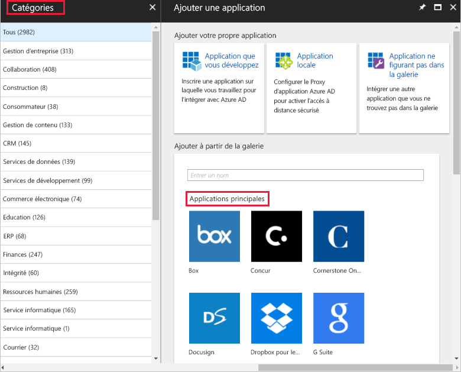
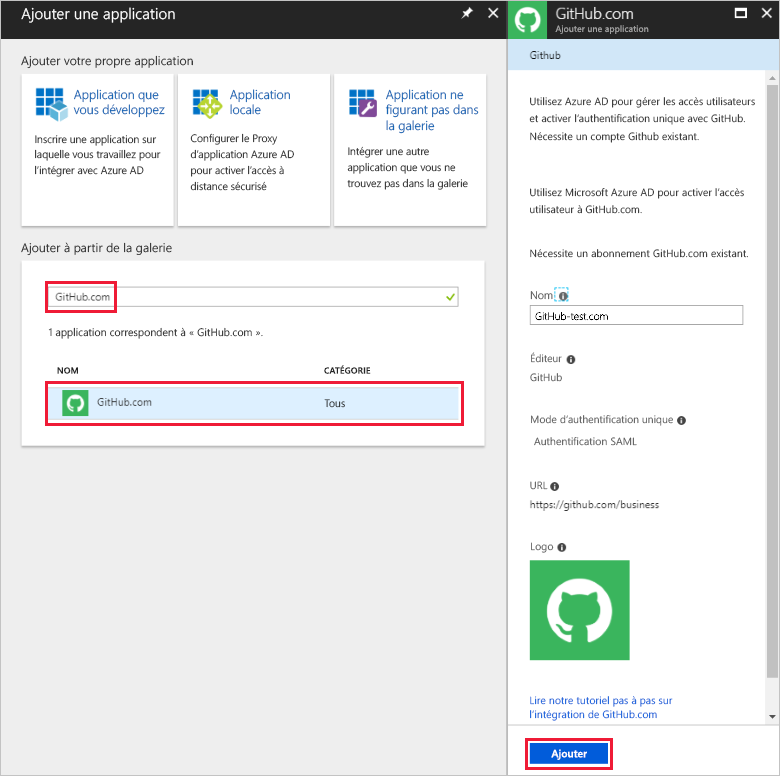

# Démarrage rapide : Ajouter une application à votre locataire Azure Active Directory

Azure Active Directory (Azure AD) dispose d’une galerie contenant des milliers d’applications pré-intégrées. Certaines applications utilisées par votre organisation sont probablement dans la galerie. Ce démarrage rapide utilise le portail Azure pour ajouter une application de la galerie à votre locataire Azure Active Directory (Azure AD).

Une fois qu’une application est ajoutée à votre locataire Azure AD, vous pouvez :

- Gérer l’accès utilisateur à l’application avec une stratégie d’accès conditionnel.
- Configurer les utilisateurs pour une authentification unique à l’application avec leur compte Azure AD.

## Avant de commencer

Pour ajouter une application à votre locataire, vous devez :

- Un abonnement Azure AD
- Un abonnement pour lequel l’authentification unique est activée pour votre application

Connectez-vous au [portail Azure](https://portal.azure.com) en tant qu’administrateur général pour votre client Azure AD, administrateur d’application cloud ou administrateur d’application.

Pour tester les étapes de ce didacticiel, nous recommandons l’utilisation d’un environnement de non-production. Si vous n’avez pas d’environnement de non-production Azure AD, vous pouvez [obtenir un essai d’un mois](https://azure.microsoft.com/pricing/free-trial/).

## Ajouter une application dans votre locataire Azure AD

Pour ajouter une application de la galerie à votre locataire Azure AD :

1. Dans le panneau de navigation gauche du [portail Azure](https://portal.azure.com), sélectionnez **Azure Active Directory**.
1. Dans le volet **Azure Active Directory**, sélectionnez **Applications d’entreprise**.
1. Le volet **Toutes les applications** s’ouvre pour afficher un échantillon aléatoire des applications de votre locataire Azure AD. Sélectionnez **Nouvelle application** en haut du volet **Toutes les applications** pour ajouter une application de galerie à votre locataire.

    

1. Dans le volet **Catégories**, sous la zone **Applications principales**, apparaissent des icônes qui sont un échantillon aléatoire des applications de la galerie. Pour voir plus d’applications, vous pouvez sélectionner **Afficher plus**, mais nous ne recommandons pas d’effectuer des recherches de cette façon, car il existe des milliers d’applications dans la galerie.

    

1. Pour rechercher une application, tapez le nom de l’application que vous souhaitez ajouter sous **Ajouter à partir de la galerie**. Sélectionnez l’application à partir des résultats, puis sélectionnez **Ajouter**. L’exemple suivant montre le formulaire **Ajouter une application** qui apparaît après la recherche de github.com.

    

1. Dans le formulaire spécifique à l’application, vous pouvez modifier les informations de propriété. Par exemple, vous pouvez modifier le nom de l’application afin qu’il corresponde aux besoins de votre organisation. Cet exemple utilise le nom **GitHub-test**.
1. Quand vous avez terminé de modifier les propriétés, sélectionnez **Ajouter**.
1. Une page de démarrage s’affiche avec les options de configuration de l’application pour votre organisation.

Vous avez terminé l’ajout de votre application. Faites une pause si vous le souhaitez. Les sections suivantes vous montrent comment modifier le logo et d’autres propriétés pour votre application.

## Trouver votre application de locataire Azure AD

Supposons que vous deviez partir et que vous souhaitez maintenant continuer la configuration de votre application. La première chose à faire est de trouver votre application.

1. Dans le panneau de navigation gauche du **[portail Azure](https://portal.azure.com)** , sélectionnez **Azure Active Directory**.
1. Dans le volet **Azure Active Directory**, sélectionnez **Applications d’entreprise**.
1. À partir du menu déroulant **Type d’Application**, sélectionnez **Toutes les Applications**, puis sélectionnez **Appliquer**. Pour en savoir plus sur les options d’affichage, consultez [Afficher les applications du locataire](view-applications-portal.md).
1. Vous pouvez maintenant voir une liste de toutes les applications dans votre locataire Azure AD. La liste est un échantillon aléatoire. Pour voir davantage d’applications, sélectionnez **Afficher plus** une ou plusieurs fois.
1. Pour trouver rapidement une application dans votre locataire, entrez le nom de l’application dans la zone de recherche, puis sélectionnez **Appliquer**. Cet exemple recherche l’application GitHub-test ajoutée précédemment.

    

## Configurer les propriétés de connexion de l’utilisateur

Maintenant que vous avez trouvé l’application, vous pouvez l’ouvrir et configurer ces propriétés.

Pour modifier les propriétés de l’application :

1. Sélectionnez l’application pour l’ouvrir.
1. Sélectionnez **Propriétés** pour ouvrir le volet Propriétés pour la modification.

    

1. Prenez un moment pour comprendre les options de connexion. Les options déterminent la façon dont les utilisateurs qui sont assignés ou non assignés à l’application peuvent s’y connecter. De plus, les options déterminent si un utilisateur peut voir l’application dans le volet d’accès.

    - **Connexion permise pour les utilisateurs** détermine si les utilisateurs assignés à l’application peuvent se connecter.
    - **Affectation de l’utilisateur requise** détermine si les utilisateurs qui ne sont pas assignés à l’application peuvent se connecter.
    - **Visible par l’utilisateur** détermine si les utilisateurs assignés à une application peuvent la voir dans le volet d’accès et le lanceur d’applications O365.

1. Utilisez les tableaux suivants pour vous aider à choisir les meilleures options en fonction de vos besoins.

   - Comportement pour les utilisateurs **assignés** :

       | Paramètres de propriété d'application | | | Expérience de l’utilisateur assigné | |
       |---|---|---|---|---|
       | Connexion permise pour les utilisateurs ? | Assignation requise de utilisateur ? | Visible par les utilisateurs ? | Est-ce que les utilisateurs assignés peuvent se connecter ? | Est-ce que les utilisateurs assignés peuvent voir l’application ?* |
       | Oui | Oui | Oui | Oui | Oui  |
       | Oui | Oui | no  | Oui | no   |
       | Oui | no  | Oui | Oui | Oui  |
       | Oui | no  | no  | Oui | no   |
       | no  | Oui | Oui | no  | no   |
       | no  | Oui | no  | no  | no   |
       | no  | no  | Oui | no  | no   |
       | no  | no  | no  | no  | no   |

   - Comportement pour les utilisateurs **non assignés** :

       | Paramètres de propriété d'application | | | Expérience de l’utilisateur non assigné | |
       |---|---|---|---|---|
       | Connexion permise pour les utilisateurs ? | Assignation requise de utilisateur ? | Visible par les utilisateurs ? | Est-ce que les utilisateurs non assignés peuvent se connecter ? | Est-ce que les utilisateurs non assignés peuvent voir l’application ?* |
       | Oui | Oui | Oui | no  | no   |
       | Oui | Oui | no  | no  | no   |
       | Oui | no  | Oui | Oui | no   |
       | Oui | no  | no  | Oui | no   |
       | no  | Oui | Oui | no  | no   |
       | no  | Oui | no  | no  | no   |
       | no  | no  | Oui | no  | no   |
       | no  | no  | no  | no  | no   |

     \* Est-ce que l’utilisateur peut voir l’application dans le volet d’accès et le lanceur d’applications Office 365 ?

## Utiliser un logo personnalisé

Pour utiliser un logo personnalisé :

1. Créez un logo de 215 x 215 pixels et enregistrez-le au format PNG.
1. Étant donné que vous avez déjà trouvé votre application, sélectionnez-la.
1. Dans le volet gauche, sélectionnez **Propriétés**.
1. Téléchargez le logo.
1. Quand vous avez terminé, Sélectionnez **Enregistrer**.

    

## Étapes suivantes

Dans ce guide de démarrage rapide, vous avez appris à ajouter une application de la galerie à votre locataire Azure AD. Vous avez appris à modifier les propriétés d’une application.

Vous êtes maintenant prêt à configurer l’application pour une authentification unique.

> [!div class="nextstepaction"]
> [Configurer l’authentification unique](configure-single-sign-on-portal.md)
