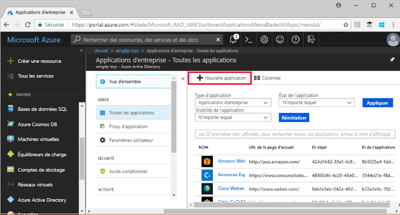
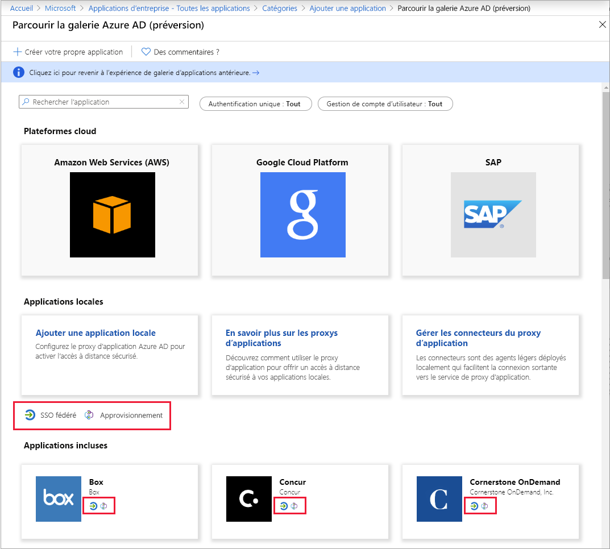

# Démarrage rapide : Ajouter une application à votre locataire Azure Active Directory (Azure AD)

Azure Active Directory (Azure AD) dispose d’une galerie contenant des milliers d’applications pré-intégrées. De nombreuses applications utilisées par votre organisation sont probablement déjà dans la galerie.

Une fois qu’une application est ajoutée à votre locataire Azure AD, vous pouvez :

- Configurer les propriétés de l’application.
- Gérer l’accès utilisateur à l’application avec une stratégie d’accès conditionnel.
- Configurer l’authentification unique afin que les utilisateurs puissent se connecter à l’application avec leurs informations d’identification Azure AD.

## Prérequis

Pour ajouter une application à votre locataire Azure AD, vous avez besoin des éléments suivants :

- Compte Azure avec un abonnement actif. [Créez un compte gratuitement](https://azure.microsoft.com/free/?WT.mc_id=A261C142F).
- Un des rôles suivants : Administrateur général, Administrateur d’application cloud, Administrateur d’application ou propriétaire du principal de service.
- (Facultatif : effectuer [Voir vos applications](view-applications-portal.md)).

>[!IMPORTANT]
>Nous vous recommandons d’utiliser un environnement de non-production pour tester les étapes de ce guide de démarrage rapide.

## Ajouter une application à votre locataire Azure AD

Pour ajouter une application à votre locataire Azure AD :

1. Dans le panneau de navigation gauche du [portail Azure](https://portal.azure.com), sélectionnez **Azure Active Directory**.
2. Dans le volet **Azure Active Directory**, sélectionnez **Applications d’entreprise**. Le volet **Toutes les applications** s’ouvre et affiche un échantillon aléatoire des applications de votre locataire Azure AD.
3. Dans le volet **Applications d’entreprise**, sélectionnez **Nouvelle application**. 
    
4. Basculez vers la nouvelle expérience de la galerie (préversion) : dans la bannière en haut de la page **Ajouter une application**, sélectionnez le lien **Cliquez ici pour essayer la Galerie d’applications nouvelle et améliorée**.
5. Le volet **Parcourir la galerie Azure AD (préversion)** s’ouvre et affiche des vignettes pour les plateformes cloud, les applications locales et les applications principales. Les applications listées dans la section **Applications principales** ont des icônes indiquant si elles prennent en charge l’authentification unique fédérée et le provisionnement. 
    
6. Vous pouvez parcourir la galerie de l’application que vous souhaitez ajouter ou rechercher l’application en entrant son nom dans la zone de recherche. Ensuite, sélectionnez l’application dans les résultats. 
7. L’étape suivante dépend de la façon dont le développeur de l’application a implémenté l’authentification unique (SSO). L’authentification unique peut être implémentée par les développeurs d’applications de quatre manières. Ces quatre manières sont SAML, OpenID Connect, Password et Linked. Lorsque vous ajoutez une application, vous pouvez choisir de filtrer et d’afficher uniquement les applications utilisant une implémentation SSO particulière, comme illustré dans la capture d’écran. Par exemple, Security Assertion Markup Language (SAML) est une norme couramment utilisée pour implémenter l’authentification unique. La norme OpenId Connect (OIDC) est également couramment utilisée. La façon dont vous configurez l’authentification unique avec ces normes diffère et dès lors, notez le type d’authentification unique implémenté par l’application que vous ajoutez.

    :::image type="content" source="media/add-application-portal/sso-types.png" alt-text="Capture d’écran montrant le sélecteur de types d’authentification unique." lightbox="media/add-application-portal/sso-types.png":::

    - Si le développeur de l’application a utilisé la **norme OIDC** pour l’authentification unique, sélectionnez **S’inscrire**. Une page de configuration s'affiche. Accédez ensuite au guide de démarrage rapide relatif à la configuration de l’authentification unique basée sur OIDC.
    :::image type="content" source="media/add-application-portal/sign-up-oidc-sso.png" alt-text="Capture d’écran montrant comment ajouter une application d’authentification unique basée sur OIDC.":::

    - Si le développeur de l’application a utilisé la **norme SAML** pour l’authentification unique, sélectionnez **Créer**. Une page de démarrage s’affiche avec les options de configuration de l’application pour votre organisation. Dans le formulaire, vous pouvez modifier le nom de l’application afin qu’il corresponde aux besoins de votre organisation. Accédez ensuite au guide de démarrage rapide relatif à la configuration de l’authentification unique basée sur SAML.
    :::image type="content" source="media/add-application-portal/create-application.png" alt-text="Capture d’écran montrant comment ajouter une application d’authentification unique basée sur SAML.":::

> [!IMPORTANT]
> Il existe d’importantes différences entre les implémentations d’authentification unique basées sur SAML et OIDC. Avec les applications basées sur SAML, vous pouvez ajouter plusieurs instances de la même application. Par exemple, GitHub1, GitHub2, etc. Avec les applications basées sur OIDC, vous ne pouvez ajouter qu’une seule instance d’une application. Si vous avez déjà ajouté une application basée sur OIDC et que vous essayez d’ajouter à nouveau la même application et de fournir le consentement à deux reprises, elle ne sera pas ajoutée de nouveau au locataire.

Si l’application que vous recherchez ne figure pas dans la galerie, vous pouvez sélectionner le lien **Créer votre propre application**, puis, sous **Que voulez-vous faire avec votre application ?** , choisissez **Intégrer une autre application que vous ne trouvez pas dans la galerie**. Microsoft a déjà travaillé avec de nombreux développeurs d’applications pour préconfigurer les applications en vue de leur utilisation avec Azure AD. Les applications préconfigurées s’affichent dans la galerie. Toutefois, si l’application que vous souhaitez ajouter n’est pas listée, vous pouvez créer une application générique, puis la configurer vous-même ou en suivant les conseils du développeur qui l’a créée.

Vous avez terminé l’ajout d’une application. Le guide de démarrage rapide suivant vous montre comment changer le logo et d’autres propriétés pour votre application.

> [!TIP]
> Vous pouvez automatiser la gestion des applications à l’aide de l’API Graph. Consultez [Automatiser la gestion des applications avec l’API Microsoft Graph](/graph/application-saml-sso-configure-api).

## Nettoyer les ressources

Si vous n’envisagez pas de poursuivre la série de guides de démarrage rapide, pensez à supprimer l’application pour nettoyer votre locataire de test. La suppression de l’application est traitée dans le dernier guide de démarrage rapide de cette série : consultez [Supprimer une application](delete-application-portal.md).

## Étapes suivantes

Passez à l’article suivant pour savoir comment configurer une application.
> [!div class="nextstepaction"]
> [Configurer une application](add-application-portal-configure.md)