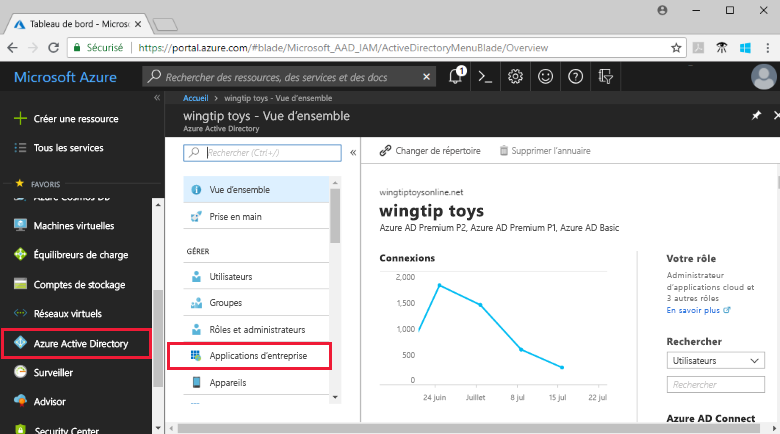

# Ajouter une application de la galerie à votre organisation Azure AD

Azure Active Directory (Azure AD) a une galerie contenant des milliers d’applications pré-intégrées pour lesquelles l’authentification unique de l’entreprise est activée. Cet article décrit les étapes générales nécessaires pour ajouter une application à partir de la galerie à votre organisation Azure AD.

> [!IMPORTANT]
> Recherchez d’abord votre application dans la [Liste de tutoriels sur l’intégration d’applications SaaS à Azure Active Directory](https://azure.microsoft.com/documentation/articles/active-directory-saas-tutorial-list/). Vous trouverez probablement des instructions pas à pas pour l’ajout et la configuration de l’application de la galerie que vous voulez ajouter.

## Ajouter une application de la galerie

1. Connectez-vous au [portail Azure](https://portal.azure.com) en tant qu’administrateur général pour votre tenant Azure AD, administrateur d’application cloud ou administrateur d’application.

1. Dans le panneau de navigation gauche du [portail Azure](https://portal.azure.com), sélectionnez **Azure Active Directory**.

1. Dans le volet **Azure Active Directory**, sélectionnez **Applications d’entreprise**.

    

1. Sélectionnez **Nouvelle application**.

    

1. Sous **Ajouter à partir de la galerie**, dans la zone de recherche, entrez le nom de l’application que vous voulez ajouter. 

    

1. Sélectionnez l’application dans les résultats.

1. (Facultatif) Dans le formulaire spécifique à l’application, vous pouvez modifier le nom de l’application afin qu’il corresponde aux besoins de votre organisation.

1. Sélectionnez **Ajouter**. La page **Vue d’ensemble** de l’application s’ouvre.

## Configurer les propriétés de connexion de l’utilisateur

1. Sélectionnez **Propriétés** pour ouvrir le volet Propriétés pour la modification.

    

1. Définissez les options suivantes pour déterminer comment les utilisateurs qui sont affectés ou non affectés à l’application peuvent s’y connecter, et si un utilisateur peut voir l’application dans le volet d’accès.

    - **Connexion permise pour les utilisateurs** détermine si les utilisateurs assignés à l’application peuvent se connecter.
    - **Affectation de l’utilisateur requise** détermine si les utilisateurs qui ne sont pas assignés à l’application peuvent se connecter.
    - **Visible par l’utilisateur** détermine si les utilisateurs assignés à une application peuvent la voir dans le volet d’accès et le lanceur d’applications O365.

      Comportement pour les utilisateurs **assignés** :

       | Paramètres de propriété d'application | | | Expérience de l’utilisateur assigné | |
       |---|---|---|---|---|
       | Connexion permise pour les utilisateurs ? | Assignation requise de utilisateur ? | Visible par les utilisateurs ? | Est-ce que les utilisateurs assignés peuvent se connecter ? | Est-ce que les utilisateurs assignés peuvent voir l’application ?* |
       | Oui | Oui | Oui | Oui | Oui  |
       | Oui | Oui | no  | Oui | no   |
       | Oui | no  | Oui | Oui | Oui  |
       | Oui | no  | no  | Oui | no   |
       | no  | Oui | Oui | no  | no   |
       | no  | Oui | no  | no  | no   |
       | no  | no  | Oui | no  | no   |
       | no  | no  | no  | no  | no   |

      Comportement pour les utilisateurs **non assignés** :

       | Paramètres de propriété d'application | | | Expérience de l’utilisateur non assigné | |
       |---|---|---|---|---|
       | Connexion permise pour les utilisateurs ? | Assignation requise de utilisateur ? | Visible par les utilisateurs ? | Est-ce que les utilisateurs non assignés peuvent se connecter ? | Est-ce que les utilisateurs non assignés peuvent voir l’application ?* |
       | Oui | Oui | Oui | no  | no   |
       | Oui | Oui | no  | no  | no   |
       | Oui | no  | Oui | Oui | no   |
       | Oui | no  | no  | Oui | no   |
       | no  | Oui | Oui | no  | no   |
       | no  | Oui | no  | no  | no   |
       | no  | no  | Oui | no  | no   |
       | no  | no  | no  | no  | no   |

     \* Est-ce que l’utilisateur peut voir l’application dans le volet d’accès et le lanceur d’applications Office 365 ?

1. Pour utiliser un logo personnalisé, créez un logo de 215 x 215 pixels et enregistrez-le au format PNG. Accédez ensuite à votre logo et chargez-le.

    

1. Quand vous avez terminé, Sélectionnez **Enregistrer**.

## Étapes suivantes

Maintenant que vous avez ajouté l’application à votre organisation Azure AD, [choisissez une méthode d’authentification unique](what-is-single-sign-on.md#choosing-a-single-sign-on-method) que vous voulez utiliser et reportez-vous à l’article approprié ci-dessous :

- [Configurer l’authentification unique SAML](configure-single-sign-on-non-gallery-applications.md)
- [Configurer l’authentification unique par mot de passe](configure-password-single-sign-on-non-gallery-applications.md)
- [Configurer l’authentification liée](configure-linked-sign-on.md)

