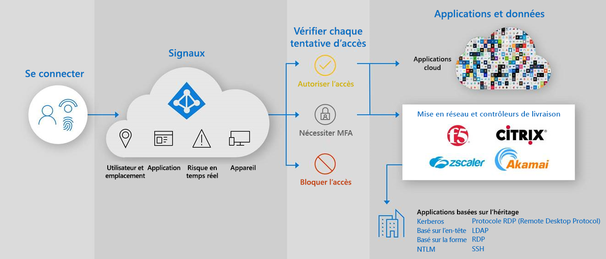

# Sécuriser l’accès hybride : Sécuriser des applications héritées avec Azure Active Directory

Vous pouvez désormais protéger vos applications d’authentification héritées locales et dans le cloud en les connectant à Azure Active Directory (AD) avec :

- [Proxy d’application Azure AD](#secure-hybrid-access-sha-through-azure-ad-application-proxy)

- [Vos contrôleurs et réseaux de remise d’application existants](#sha-through-networking-and-delivery-controllers)

- [Les applications de réseau privé virtuel (VPN) et de périmètre défini par logiciel (SDP)](#sha-through-vpn-and-sdp-applications)

Vous pouvez mener à bien vos transitions et renforcer la sécurité de l’ensemble de vos applications grâce à des fonctionnalités de Azure AD telles que Azure AD [Conditional Access](../conditional-access/overview.md) et Azure AD [Identity Protection](../identity-protection/overview-identity-protection.md).

## Sécurisation de l’accès hybride (SHA) via le proxy d’application Azure AD
  
À l’aide du [Proxy d'application](../app-proxy/what-is-application-proxy.md), vous pouvez fournir un [accès à distance sécurisé](../app-proxy/application-proxy.md) à vos applications web locales. Vos utilisateurs n’ont pas besoin d’utiliser un VPN. Les utilisateurs bénéficient d’une connexion facile à leurs applications à partir de n’importe quel appareil après une [authentification unique](add-application-portal-setup-sso.md). Le proxy d’application fournit l’accès à distance en tant que service et vous permet de [facilement publier vos applications locales](../app-proxy/application-proxy-add-on-premises-application.md) à des utilisateurs en dehors du réseau d’entreprise. Il vous permet de mettre à l’échelle votre gestion des accès cloud sans avoir à modifier vos applications locales. [Planifiez le déploiement d’un proxy d’application Azure AD](application-proxy-deployment-plan.md) comme étape suivante.

## Intégrations de partenaires Azure AD

### SHA via les contrôleurs de livraison et de mise en réseau

En plus du [Proxy d’application Azure AD](./what-is-application-proxy.md), pour vous permettre d’utiliser le [framework de Confiance Zéro](https://www.microsoft.com/security/blog/2020/04/02/announcing-microsoft-zero-trust-assessment-tool/), les partenaires Microsoft avec des fournisseurs tiers. Vous pouvez utiliser votre contrôleur de livraison et de mise en réseau et protéger facilement vos applications héritées, qui sont critiques pour vos processus d’entreprise, mais que vous ne pouviez pas protéger avant avec Azure AD. Il est probable que vous disposiez déjà de tout ce dont vous avez besoin pour commencer à protéger ces applications.

Les fournisseurs réseau suivants proposent des solutions prédéfinies et des conseils détaillés pour l’intégration avec Azure AD.

- [Akamai Enterprise Application Access (EAA)](../saas-apps/akamai-tutorial.md)

- [Citrix Application Delivery Controller (ADC)](../saas-apps/citrix-netscaler-tutorial.md)

- [F5 Big-IP APM](./f5-aad-integration.md)

- [Kemp](../saas-apps/kemp-tutorial.md)

- [Pulse Secure Virtual Traffic Manager (VTM)](../saas-apps/pulse-secure-virtual-traffic-manager-tutorial.md)

### SHA par le biais d’applications VPN et SDP

À l’aide de solutions VPN et SDP, vous pouvez fournir un accès sécurisé à votre réseau d’entreprise à partir de n’importe quel appareil, à tout moment et à tout endroit, tout en protégeant les données de votre organisation. En ayant Azure AD comme fournisseur d’identité (IDP), vous pouvez utiliser des méthodes d’authentification et d’autorisation modernes comme [l’authentification unique](./what-is-single-sign-on.md) et [l’authentification multifacteur](../authentication/concept-mfa-howitworks.md) Azure AD pour sécuriser vos applications héritées locales.  

Les fournisseurs VPN suivants proposent des solutions prédéfinies et des conseils détaillés pour l’intégration avec Azure AD.

- [Cisco AnyConnect](../saas-apps/cisco-anyconnect.md)

- [Fortinet](../saas-apps/fortigate-ssl-vpn-tutorial.md)

- [F5 Big-IP APM](./f5-aad-password-less-vpn.md)

- [Palo Alto Networks Global Protect](../saas-apps/paloaltoadmin-tutorial.md)

- [Pulse Secure Pulse Connect Secure (PCS)](../saas-apps/pulse-secure-pcs-tutorial.md)

Les fournisseurs SDP suivants proposent des solutions prédéfinies et des conseils détaillés pour l’intégration avec Azure AD.

- [Répartiteur d’accès Datawiza](./add-application-portal-setup-oidc-sso.md)Datawiza Access Broker

- [Perimeter 81](../saas-apps/perimeter-81-tutorial.md)

- [Plateforme d’authentification Silverfort](./add-application-portal-setup-oidc-sso.md)

- [Strata](../saas-apps/maverics-identity-orchestrator-saml-connector-tutorial.md)

- [Zscaler Private Access (ZPA)](../saas-apps/zscalerprivateaccess-tutorial.md)
