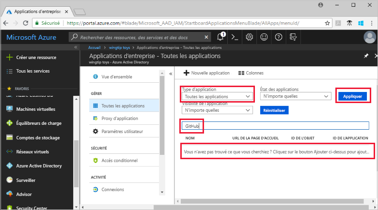
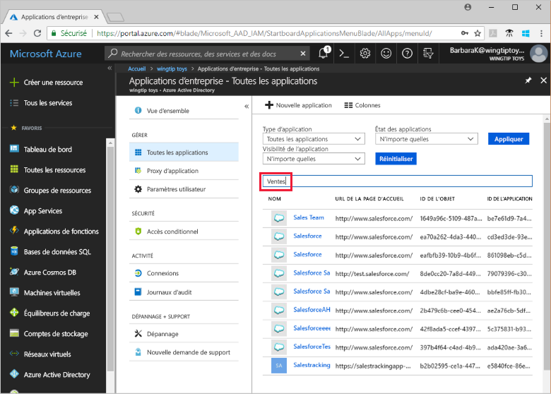

# Démarrage rapide : Afficher la liste des applications qui utilisent votre locataire Azure Active Directory (Azure AD) à des fins de gestion des identités

Prenez en main l’utilisation d’Azure AD comme système de gestion des identités et des accès pour les applications utilisées par votre organisation. Dans ce guide de démarrage rapide, vous allez afficher les applications qui sont déjà configurées pour utiliser votre locataire Azure AD en tant que fournisseur d’identité (IdP).

## Prérequis

Pour afficher les applications qui ont été inscrites dans votre locataire Azure AD, vous avez besoin de l’élément suivant :

- Un compte Azure. [Créez un compte gratuitement](https://azure.microsoft.com/free/?WT.mc_id=A261C142F).

>[!IMPORTANT]
>Nous vous recommandons d’utiliser un environnement de non-production pour tester les étapes de ce guide de démarrage rapide.

## Rechercher la liste des applications dans votre locataire

Les applications qui sont inscrites auprès de votre locataire Azure AD sont visibles dans la section **Applications d’entreprise** du portail Azure.

Pour afficher les applications inscrites dans votre locataire :

1. Connectez-vous à votre [portail Azure](https://portal.azure.com).
2. Dans le volet de navigation de gauche, sélectionnez **Azure Active Directory**.
3. Dans le volet **Azure Active Directory**, sélectionnez **Applications d’entreprise**.
4. À partir du menu déroulant **Type d’Application**, sélectionnez **Toutes les Applications**, puis choisissez **Appliquer**. Un échantillon aléatoire des applications de votre tenant s’affiche.
5. Pour afficher davantage d’applications, sélectionnez **Charger plus** en bas de la liste. S’il y a de nombreuses applications dans votre locataire, il peut être plus facile de rechercher une application particulière que de faire défiler la liste. La recherche d’une application particulière est traitée plus loin dans ce guide de démarrage rapide.

## Sélectionner les options d'affichage

Sélectionnez les options correspondant à ce que vous recherchez.

1. Vous pouvez afficher les applications par **Type d’application**, **État de l’application** et **Visibilité de l’application**.
2. Sous **Type d’Application**, choisissez l’une des options suivantes :
    - **Applications d’entreprise** montre les applications non Microsoft.
    - **Applications Microsoft** montre les applications Microsoft.
    - **Toutes les Applications** montre les applications non Microsoft et Microsoft.
3. Sous **État de l’Application**, choisissez **Quelconque**, **Désactivé**, ou **Activé**. L’option **Quelconque** inclut les applications activées et désactivées.
4. Sous **Visibilité de l’Application**, choisissez **Quelconque** ou **Masqué**. L’option **Masqué** affiche les applications qui sont dans le locataire, mais ne sont pas visibles pour les utilisateurs.
5. Après avoir choisi les options souhaitées, sélectionnez **Appliquer**.

## Rechercher une application

Pour rechercher une application particulière :

1. À partir du menu déroulant **Type d’application**, sélectionnez **Toutes les applications**, puis sélectionnez **Appliquer**.
2. Entrez le nom de l’application recherchée. Si l’application a été ajoutée à votre locataire Azure AD, elle apparaît dans les résultats de recherche. Cet exemple montre que GitHub n’a pas été ajouté aux applications du locataire.
    
3. Essayez d’entrer les premières lettres du nom de l’application. Cet exemple montre toutes les applications qui commencent par **Sales**.
    

> [!TIP]
> Vous pouvez automatiser la gestion des applications à l’aide de l’API Graph. Consultez [Automatiser la gestion des applications avec l’API Microsoft Graph](/graph/application-saml-sso-configure-api).

## Nettoyer les ressources

Vous n’avez pas créé de ressource dans le cadre de ce guide de démarrage rapide. Il n’y a donc rien à nettoyer.

## Étapes suivantes

Passez à l’article suivant pour apprendre à utiliser Azure AD comme fournisseur d’identité pour une application.
> [!div class="nextstepaction"]
> [Ajouter une application](add-application-portal.md)