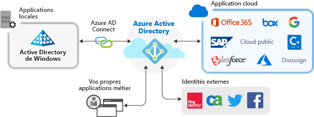

# Gestion des applications avec Azure Active Directory

Azure Active Directory (Azure AD) simplifie la façon dont vous gérez vos applications en fournissant un seul système d’identité pour vos applications cloud et locales. Vous pouvez ajouter vos applications SaaS (software as a service), vos applications locales et vos applications métier (LOB) à Azure AD. Les utilisateurs se connectent une fois pour accéder de manière sécurisée et fluide à ces applications, ainsi qu’aux applications Office 365 et d’autres applications métier de Microsoft. Vous pouvez réduire les coûts d’administration en [automatisant le provisionnement des utilisateurs](../app-provisioning/user-provisioning.md). Vous pouvez aussi utiliser des stratégies d’authentification multifacteur et d’accès conditionnel pour fournir un accès sécurisé aux applications.

## Pourquoi gérer des applications avec une solution cloud ?

Souvent, les organisations comptent des centaines d’applications qui sont indispensables aux utilisateurs pour effectuer leur travail. Les utilisateurs accèdent à ces applications à partir de nombreux appareils et emplacements. De nouvelles applications sont ajoutées, développées et supprimées tous les jours. Avec autant d’applications et de points d’accès, il n’a jamais été aussi pertinent d’utiliser une solution basée sur le cloud pour gérer l’accès des utilisateurs à toutes ces applications.

## Quels types d’applications puis-je intégrer à Azure AD ?

Il existe quatre types d’applications principaux que vous pouvez ajouter à vos **applications d’entreprise** et gérer avec Azure AD :

- **Applications de la galerie Azure AD** : Azure AD a une galerie avec des milliers d’applications préintégrées pour l’authentification unique avec Azure AD. Certaines applications utilisées par votre organisation sont probablement dans la galerie. [Découvrez plus d’informations sur la planification de l’intégration de votre application](plan-an-application-integration.md) ou obtenez la procédure d’intégration détaillée pour chaque application dans les [tutoriels sur les applications SaaS](https://docs.microsoft.com/azure/active-directory/saas-apps/).

- **Applications locales avec le proxy d’application** : Avec le proxy d’application Azure AD, vous pouvez intégrer vos applications web locales à Azure AD pour prendre en charge l’authentification unique. Les utilisateurs finaux peuvent accéder aux applications web locales de la même manière qu’ils accèdent aux application Office 365 et autres applications SaaS. [Découvrez pourquoi utiliser le proxy d’application et comment il fonctionne](what-is-application-proxy.md).

- **Applications personnalisées** : Quand vous créez vos propres applications métier, vous pouvez les intégrer à Azure AD pour prendre en charge l’authentification unique. En inscrivant votre application dans Azure AD, vous pouvez contrôler sa stratégie d’authentification. Pour plus d’informations, consultez l’[aide pour les développeurs](developer-guidance-for-integrating-applications.md).

- **Applications hors galerie** : Apportez vos propres applications ! Prenez en charge l’authentification unique pour les autres applications en les ajoutant à Azure AD. Vous pouvez intégrer tous les liens web que vous voulez et toutes les applications qui affichent un champ de nom d’utilisateur et de mot de passe, qui prennent en charge les protocoles SAML ou OpenID Connect, ou qui prennent en charge SCIM. Pour plus d’informations, consultez [Configurer l’authentification unique pour les applications hors galerie](configure-single-sign-on-non-gallery-applications.md).

## Gérer les risques avec les stratégies d’accès conditionnel

Le couplage de l’authentification unique (SSO) Azure AD avec l’[accès conditionnel](https://docs.microsoft.com/azure/active-directory/conditional-access/overview) offre des niveaux élevés de sécurité pour l’accès aux applications. Les fonctionnalités de sécurité comprennent la protection des identités à l’échelle du cloud, le contrôle d’accès en fonction des risques, l’authentification multifacteur native et les stratégies d’accès conditionnel. Ces fonctionnalités offrent des stratégies de contrôle précises, basées sur les applications ou sur les groupes qui ont besoin d’un niveau plus élevé de sécurité.

## Améliorer la productivité avec l’authentification unique

L’activation de l’authentification unique (SSO) sur les applications et Office 365 offre une expérience de connexion supérieure aux utilisateurs en réduisant ou en éliminant des invites de connexion. L’environnement utilisateur semble plus cohésif et est moins perturbant sans la multiplication des invites ou l’obligation de gérer plusieurs mots de passe. Le groupe professionnel peut gérer et approuver l’accès au moyen de l’appartenance dynamique et en libre-service. Autoriser les bonnes personnes dans l’entreprise à gérer l’accès à une application améliore la sécurité du système des identités.

SSO améliore la sécurité. *Sans l’authentification unique*, les administrateurs doivent créer et mettre à jour des comptes d’utilisateur pour chaque application séparément, ce qui demande du temps. Les utilisateurs doivent aussi conserver plusieurs informations d’identification différentes pour accéder à leurs applications. Par conséquent, ils ont tendance à noter leurs mots de passe ou à utiliser d’autres solutions de gestion de mots de passe, ce qui crée d’autres risques sur la sécurité des données. [Découvrez plus d’informations sur l’authentification unique](what-is-single-sign-on.md).

## Assurer la gouvernance et la conformité

Avec Azure AD, vous pouvez superviser les connexions aux applications par le biais de rapports tirant parti des outils SIEM (Security Incident and Event Monitoring). Vous pouvez accéder aux rapports à partir du portail ou des API. Auditez par programmation toute personne qui a accès à vos applications, puis supprimez l’accès aux utilisateurs inactifs par l’intermédiaire des révisions d’accès.

## Gérer les coûts

En migrant vers Azure AD, vous pouvez réduire les coûts et supprimer la contrainte que représente la gestion de votre infrastructure locale. Azure AD fournit également un accès en libre-service aux applications, ce qui fait gagner du temps aux administrateurs et aux utilisateurs. L’authentification unique élimine les mots de passe propres à l’application. L’authentification unique permet de réduire les coûts liés à la réinitialisation des mots de passe des applications et à la perte de productivité lors de la récupération des mots de passe.

## Étapes suivantes

- [Qu’est-ce que le proxy d’application ?](what-is-application-proxy.md)
- [Démarrage rapide : Ajouter une application de la galerie à votre locataire Azure AD](add-application-portal.md)
