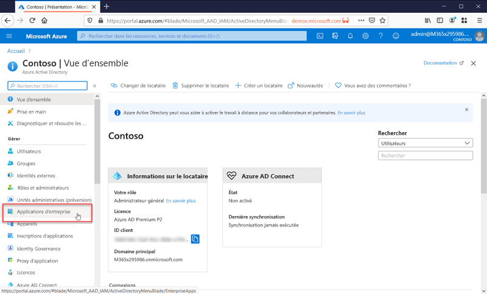

# Qu’est-ce que la gestion des applications ?

Azure AD est un système de gestion des identités et des accès (IAM). Il offre un emplacement unique pour stocker des informations sur les identités numériques. Vous pouvez configurer vos applications logicielles de façon à ce qu’elles utilisent Azure AD comme emplacement de stockage des informations utilisateur.

Azure AD doit être configuré pour être intégré à une application. En d’autres termes, il doit savoir quelles applications l’utilisent pour les identités. Indiquer à Azure AD ce que sont ces applications et comment il doit les gérer constitue la « gestion des applications ».

Vous gérez les applications dans la page **Applications d’entreprise** situé dans la section Gérer du portail Azure Active Directory.

## Qu’est-ce qu’un système de gestion des identités et des accès (IAM) ?

Une application est un élément logiciel qui est utilisé dans un but précis. La plupart des applications requièrent que les utilisateurs se connectent.

Un système d’identités centralisé fournit un emplacement unique pour stocker les informations utilisateur qui peuvent ensuite être utilisées par toutes les applications. Ces systèmes sont connus sous le nom de « systèmes de gestion des identités et des accès (IAM) ». Azure Active Directory est le système IAM pour le cloud Microsoft.

>[!TIP]
>Un système IAM fournit un emplacement unique pour effectuer le suivi d’identités d’utilisateurs. Azure AD est le système IAM pour le cloud Microsoft.

## Pourquoi gérer des applications avec une solution cloud ?

Souvent, les organisations comptent des centaines d’applications qui sont indispensables aux utilisateurs pour effectuer leur travail. Les utilisateurs accèdent à ces applications à partir de nombreux appareils et emplacements. De nouvelles applications sont ajoutées, développées et retirées en permanence. Avec autant d’applications et de points d’accès, il est important de choisir une solution de gestion des identités qui fonctionne avec tous.

>[!TIP]
>La galerie d’applications Azure AD contient de nombreuses applications courantes déjà préconfigurées pour fonctionner avec Azure AD en tant que fournisseur d’identité.

## Comment Azure AD fonctionne-t-il avec les applications ?

Azure AD est en quelque sorte un intermédiaire qui assure la gestion des identités pour les applications cloud et locales.

>[!TIP]
>Réduisez les coûts d’administration en choisissant d’[automatiser le provisionnement des utilisateurs](../app-provisioning/user-provisioning.md). De cette façon, les utilisateurs sont automatiquement ajoutés à Azure AD quand vous les ajoutez au système RH de votre entreprise.

## Quels types d’applications puis-je intégrer à Azure AD ?

Vous pouvez utiliser Azure AD comme système d’identités pour quasiment n’importe quelle application. De nombreuses applications sont déjà préconfigurées et peuvent être installées sans effort. Ces applications préconfigurées sont publiées dans la [galerie d’applications Azure AD](/azure/active-directory/saas-apps/).

Vous pouvez configurer manuellement la plupart des applications pour l’authentification unique si elles ne se trouvent pas déjà dans la galerie. Azure AD propose plusieurs options d’authentification unique. L’authentification unique SAML et l’authentification unique OIDC figurent parmi les plus populaires. Pour en savoir plus sur l’intégration d’applications pour l’authentification unique, examinez les [options d’authentification unique](sso-options.md).

Votre organisation utilise-t-elle des applications locales ? Vous pouvez les intégrer à l’aide du proxy d’application. Pour en savoir plus, consultez [Accès à distance aux applications locales par le bais du service Proxy d’application Azure AD](../app-proxy/application-proxy.md).

>[!TIP]
>Quand vous créez vos propres applications métier, vous pouvez les intégrer à Azure AD pour bénéficier de l’authentification unique. Pour en savoir plus sur le développement d’applications pour Azure AD, consultez [Plateforme d’identités Microsoft](..//develop/v2-overview.md).

## Gérer les risques avec les stratégies d’accès conditionnel

Le couplage de l’authentification unique (SSO) Azure AD avec l’[accès conditionnel](../conditional-access/concept-conditional-access-cloud-apps.md) offre des niveaux élevés de sécurité pour l’accès aux applications. Avec les stratégies d’accès conditionnel, vous pouvez effectuer un contrôle précis des applications sur la base de conditions que vous définissez.

## Améliorer la productivité avec l’authentification unique

L’authentification unique (SSO) offre une expérience utilisateur unifiée entre Microsoft 365 et toutes les autres applications que vous utilisez. Dites adieu à l’obligation d’entrer constamment votre nom d’utilisateur et votre mot de passe !

Pour en savoir plus sur l’authentification unique, consultez [Qu’est-ce que l’authentification unique ?](what-is-single-sign-on.md)

## Assurer la gouvernance et la conformité

Supervisez les applications en vous aidant de rapports qui utilisent des outils SIEM (Security Incident and Event Monitoring). Vous pouvez accéder aux rapports à partir du portail ou des API. Auditez par programmation toute personne qui a accès à vos applications, puis supprimez l’accès aux utilisateurs inactifs par l’intermédiaire des révisions d’accès.

## Gérer les coûts

En migrant vers Azure AD, vous pouvez réduire les coûts et supprimer la contrainte que représente la gestion de votre infrastructure locale. Azure AD fournit également un accès en libre-service aux applications, ce qui fait gagner du temps aux administrateurs et aux utilisateurs. L’authentification unique élimine les mots de passe propres à l’application. L’authentification unique permet de réduire les coûts liés à la réinitialisation des mots de passe des applications et à la perte de productivité lors de la récupération des mots de passe.

Pour les applications de gestion des ressources humaines, ou d’autres applications très largement utilisées, le provisionnement d’application facilite les choses. Le provisionnement d’application automatise le processus d’ajout et de suppression d’utilisateurs. Pour en savoir plus, consultez [Qu’est-ce que le provisionnement d’application ?](../app-provisioning/user-provisioning.md)

## Étapes suivantes

- [Série de guides de démarrage rapide sur la gestion des applications](view-applications-portal.md)
- [Bien démarrer avec l’intégration d’applications](plan-an-application-integration.md)
- [Découvrir comment automatiser l’attribution d’utilisateurs](../app-provisioning/user-provisioning.md)
