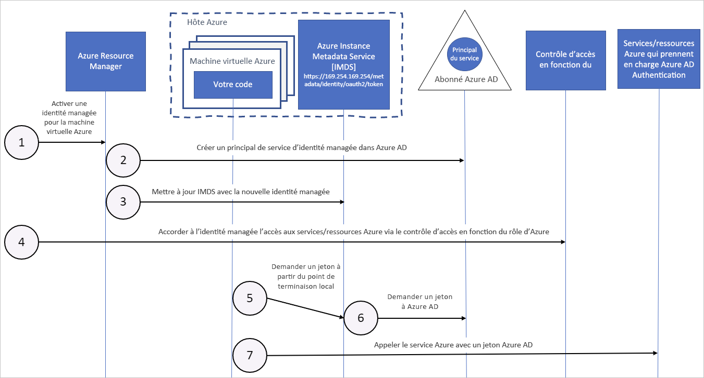

# Fonctionnement des identités managées pour les ressources Azure avec des machines virtuelles Azure

Les identités managées pour ressources Azure fournissent automatiquement aux services Azure une identité managée dans Azure Active Directory. Vous pouvez utiliser cette identité pour vous authentifier sur n’importe quel service prenant en charge l’authentification Azure AD, sans avoir d’informations d’identification dans votre code.

Dans cet article, vous découvrez comment les identités managées fonctionnent avec les machines virtuelles Azure.

## Fonctionnement

En interne, les identités managées sont des principaux de service d’un type spécial, qui peuvent être utilisés uniquement avec les ressources Azure. Lorsqu’une identité managée est supprimée, le principal de service correspondant est automatiquement supprimé.
Par ailleurs, quand une identité affectée par l’utilisateur ou par le système est créée, le fournisseur de ressources d’identités managées émet un certificat en interne pour cette identité. 

Votre code peut utiliser une identité managée pour faire une demande de jetons d’accès pour les services qui prennent en charge l’authentification Azure AD. Azure prend en charge la restauration des informations d’identification utilisées par l’instance de service. 

Le diagramme suivant illustre le fonctionnement des identités de service administré avec les machines virtuelles (VM) Azure :

|  Propriété    | Identité managée affectée par le système | Identité managée affectée par l’utilisateur |
|------|----------------------------------|--------------------------------|
| Création |  Créé dans le cadre d’une ressource Azure (par exemple, une machine virtuelle Azure ou Azure App Service). | Créé comme une ressource Azure autonome. |
| Cycle de vie | Cycle de vie partagé entre la ressource Azure et l’identité managée avec laquelle elle est créée.   Lorsque la ressource parente est supprimée, l’identité managée l’est également. | Cycle de vie indépendant.   Doit être explicitement supprimé. |
| Partage entre ressources Azure | Ne peut pas être partagé.   Ne peut être associé qu’à une seule ressource Azure. | Peut être partagé.   Une même identité managée affectée par l’utilisateur peut être associée à plusieurs ressources Azure. |
| Cas d’utilisation courants | Charges de travail contenues dans une même ressource Azure.   Charges de travail pour lesquelles vous avez besoin d’identités indépendantes.   Par exemple, une application qui s’exécute sur une seule machine virtuelle | Charges de travail qui s’exécutent sur plusieurs ressources et qui peuvent partager une même identité.   Charges de travail qui ont besoin d’une autorisation préalable pour accéder à une ressource sécurisée dans le cadre d’un flux de provisionnement.   Charges de travail dont les ressources sont recyclées fréquemment, mais pour lesquelles les autorisations doivent rester les mêmes.   Par exemple, une charge de travail où plusieurs machines virtuelles doivent accéder à la même ressource |

## Identité managée affectée par le système

1. Azure Resource Manager reçoit une requête pour activer l’identité managée attribuée par le système sur une machine virtuelle.

2. Azure Resource Manager crée un principal de service dans Azure AD pour représenter l’identité de la machine virtuelle. Le principal de service est créé dans le locataire Azure AD approuvé par cet abonnement.

3. Azure Resource Manager configure l’identité sur la machine virtuelle en mettant à jour le point de terminaison d’identité Azure Instance Metadata Service avec l’ID client et le certificat du principal de service.

4. Maintenant que la machine virtuelle possède une identité, utilisez les informations du Principal de service pour accorder aux ressources Azure l’accès à la machine virtuelle. Pour appeler Azure Resource Manager, utilisez le contrôle d’accès en fonction du rôle Azure (RBAC Azure) pour attribuer le rôle approprié au principal de service de la machine virtuelle. Pour appeler Key Vault, accordez à votre code un accès au secret spécifique ou à la clé dans Key Vault.

5. Votre code en cours d’exécution sur la machine virtuelle peut demander un jeton à partir du point de terminaison d’Azure Instance Metadata Service, accessible uniquement à partir de la machine virtuelle : `http://169.254.169.254/metadata/identity/oauth2/token`
    - Le paramètre de ressource spécifie le service vers lequel le jeton est envoyé. Pour vous authentifier à Azure Resource Manager, utilisez `resource=https://management.azure.com/`.
    - Le paramètre de version d’API spécifie la version IMDS, utilisez api-version=2018-02-01 ou version ultérieure.

6. Un appel est passé à Azure AD pour demander un jeton d’accès (comme indiqué à l’étape 5), à l’aide de l’ID client et du certificat configurés à l’étape 3. Azure AD renvoie un jeton d’accès JSON Web Token (JWT).

7. Votre code envoie le jeton d’accès sur un appel à un service qui prend en charge l’authentification Azure AD.

## Identité managée affectée par l’utilisateur

1. Azure Resource Manager reçoit une requête pour créer une identité managée attribuée par l’utilisateur.

2. Azure Resource Manager crée un principal de service dans Azure AD pour représenter l’identité managée attribuée par l’utilisateur. Le principal de service est créé dans le locataire Azure AD approuvé par cet abonnement.

3. Azure Resource Manager reçoit une requête pour configurer l’identité managée affectée par l’utilisateur sur une machine virtuelle, et mettre à jour le point de terminaison d’identité Azure Instance Metadata Service avec l’ID client et le certificat du principal de service de l’identité managée affectée par l’utilisateur.

4. Maintenant que l’identité managée attribuée par l’utilisateur a été créée, utilisez les informations du Principal de service pour lui accorder l’accès aux ressources Azure. Pour appeler Azure Resource Manager, utilisez RBAC Azure pour attribuer le rôle approprié au principal de service de l’identité attribuée par l’utilisateur. Pour appeler Key Vault, accordez à votre code un accès au secret spécifique ou à la clé dans Key Vault.

   > [!Note]
   > Vous pouvez également effectuer cette étape avant l’étape 3.

5. Votre code en cours d’exécution sur la machine virtuelle peut demander un jeton à partir du point de terminaison d’identité d’Azure Instance Metadata Service, accessible uniquement à partir de la machine virtuelle : `http://169.254.169.254/metadata/identity/oauth2/token`
    - Le paramètre de ressource spécifie le service vers lequel le jeton est envoyé. Pour vous authentifier à Azure Resource Manager, utilisez `resource=https://management.azure.com/`.
    - Le paramètre ID client spécifie l’identité pour laquelle le jeton est demandé. Cela est nécessaire pour lever l’ambiguïté lorsque plusieurs identités attribuées par l’utilisateur se trouvent sur une même machine virtuelle.
    - Le paramètre de version d’API spécifie la version d’Azure Instance Metadata Service. Utilisez la version `api-version=2018-02-01` ou ultérieure.

6. Un appel est passé à Azure AD pour demander un jeton d’accès (comme indiqué à l’étape 5), à l’aide de l’ID client et du certificat configurés à l’étape 3. Azure AD renvoie un jeton d’accès JSON Web Token (JWT).
7. Votre code envoie le jeton d’accès sur un appel à un service qui prend en charge l’authentification Azure AD.

## Étapes suivantes

Bien démarrer avec la fonctionnalité des identités managées pour les ressources Azure grâce aux guides de démarrage rapide suivants :

* [Utiliser une identité managée de machine virtuelle Windows attribuée par le système pour accéder à Azure Resource Manager](tutorial-windows-vm-access-arm.md)
* [Utiliser une identité managée de machine virtuelle Linux attribuée par le système pour accéder à Azure Resource Manager](tutorial-linux-vm-access-arm.md)
