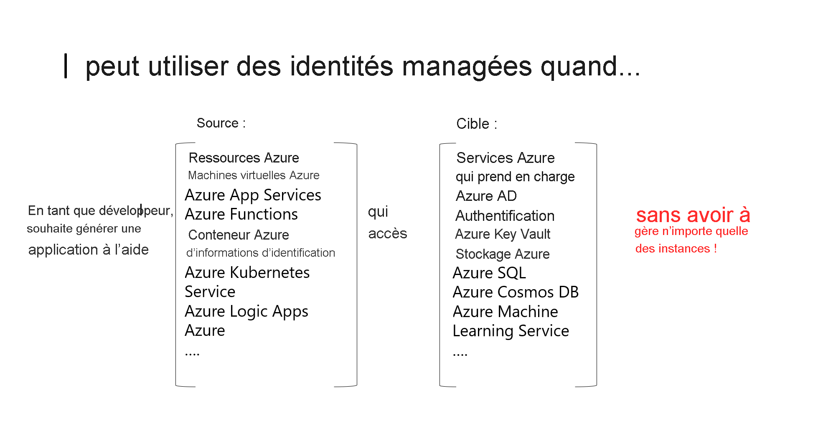

# Que sont les identités managées pour les ressources Azure ?

La gestion des secrets et des informations d’identification pour sécuriser la communication entre les différents services constitue un défi courant pour les développeurs. Sur Azure, les identités managées évitent aux développeurs d’avoir à gérer les informations d’identification en fournissant une identité pour la ressource Azure dans Azure AD et en l’utilisant pour obtenir des jetons Azure Active Directory (Azure AD). Cela permet également d’accéder à [Azure Key Vault](../../key-vault/general/overview.md), où les développeurs peuvent stocker les informations d’identification de manière sécurisée. Les identités managées pour ressources Azure résolvent ce problème en fournissant des services Azure avec une identité managée automatiquement dans Azure AD.

À quoi une identité managée peut-elle servir ?

   > [!VIDEO https://www.youtube.com/embed/5lqayO_oeEo]

Voici quelques-uns des avantages de l’utilisation des identités managées :

- Vous n’avez pas besoin de gérer les informations d’identification. Vous n’avez même pas accès à ces dernières.
- Vous pouvez utiliser des identités managées pour vous authentifier auprès d’un service Azure qui prend en charge l’authentification Azure AD, notamment Azure Key Vault.
- Les identités managées peuvent être utilisées sans coût supplémentaire.

> [!NOTE]
> Identités managées pour les ressources Azure est le nouveau nom du service anciennement nommé Managed Service Identity (MSI).

## Types d’identités managées

Il existe deux types d’identités administrées :

- **Affectation par le système** Certains services Azure vous permettent d’activer une identité managée directement sur une instance de service. Quand vous activez une identité managée affectée par le système, une identité est créée dans Azure AD qui est liée au cycle de vie de cette instance de service. Ainsi, quand la ressource est supprimée, Azure supprime automatiquement l’identité. Par défaut, seule cette ressource Azure peut utiliser cette identité pour demander des jetons à Azure AD.
- **Affectation par l’utilisateur** Vous pouvez également créer une identité managée en tant que ressource Azure autonome. Vous pouvez [créer une identité managée affectée par l’utilisateur](how-to-manage-ua-identity-portal.md) et l’attribuer à une ou plusieurs instances d’un service Azure. Une identité managée affectée par l’utilisateur est gérée séparément des ressources qui l’utilisent.   

  > [!VIDEO https://www.youtube.com/embed/OzqpxeD3fG0]

Le tableau ci-dessous montre les différences entre les deux types d’identités managées.

|  Propriété    | Identité managée affectée par le système | Identité managée affectée par l’utilisateur |
|------|----------------------------------|--------------------------------|
| Création |  Créé dans le cadre d’une ressource Azure (par exemple, une machine virtuelle Azure ou Azure App Service) | Créé en tant que ressource Azure autonome |
| Cycle de vie | Cycle de vie partagé entre la ressource Azure et l’identité managée avec laquelle elle est créée.   Lorsque la ressource parente est supprimée, l’identité managée l’est également. | Cycle de vie indépendant.   Doit être explicitement supprimé. |
| Partage entre ressources Azure | Ne peut pas être partagé.   Ne peut être associé qu’à une seule ressource Azure. | Peut être partagé   Une même identité managée affectée par l’utilisateur peut être associée à plusieurs ressources Azure. |
| Cas d’utilisation courants | Charges de travail contenues dans une même ressource Azure   Charges de travail pour lesquelles vous avez besoin d’identités indépendantes.   Par exemple, une application qui s’exécute sur une seule machine virtuelle | Charges de travail qui s’exécutent sur plusieurs ressources et qui peuvent partager une même identité.   Charges de travail qui ont besoin d’une autorisation préalable pour accéder à une ressource sécurisée dans le cadre d’un flux de provisionnement.   Charges de travail dont les ressources sont recyclées fréquemment, mais pour lesquelles les autorisations doivent rester les mêmes.   Par exemple, une charge de travail où plusieurs machines virtuelles doivent accéder à la même ressource |

>[!IMPORTANT]
>Quel que soit le type d’identité choisi, une identité managée est un principal de service d’un type spécial qui ne peut être utilisé qu’avec des ressources Azure. Lorsqu’une identité managée est supprimée, le principal de service correspondant est automatiquement supprimé.

## Comment puis-je utiliser des identités managées pour les ressources Azure ?

## Quels sont les services Azure qui prennent en charge la fonctionnalité ?

Les identités managées pour les ressources Azure peuvent servir à l’authentification auprès des services prenant en charge l’authentification Azure AD. Pour obtenir la liste des services Azure qui prennent en charge la fonctionnalité d’identités managées pour les ressources Azure, consultez [Services qui prennent en charge les identités managées pour les ressources Azure](./services-support-managed-identities.md).

## Étapes suivantes

* [Utiliser une identité managée de machine virtuelle Windows attribuée par le système pour accéder à Azure Resource Manager](tutorial-windows-vm-access-arm.md)
* [Utiliser une identité managée de machine virtuelle Linux attribuée par le système pour accéder à Azure Resource Manager](tutorial-linux-vm-access-arm.md)
* [Guide pratique pour utiliser des identités managées avec App Service et Azure Functions](../../app-service/overview-managed-identity.md)
* [Comment utiliser des identités managées avec Azure Container Instances](../../container-instances/container-instances-managed-identity.md)
* [Implémentation d’identités managées pour des ressources Microsoft Azure](https://www.pluralsight.com/courses/microsoft-azure-resources-managed-identities-implementing).