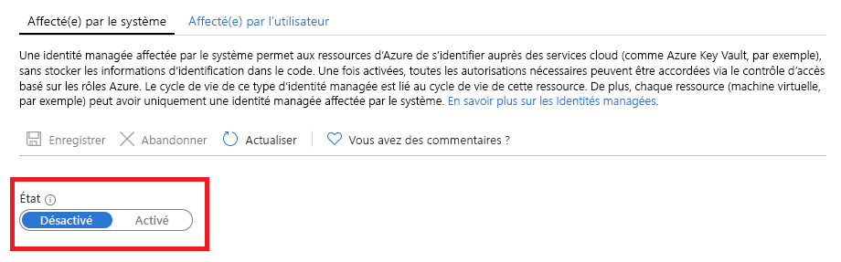

# Que sont les identités managées pour les ressources Azure ?

[!INCLUDE [preview-notice](../../../includes/active-directory-msi-preview-notice.md)]

En tant que développeur cloud, vous recherchez probablement le moyen le plus simple et le plus sûr d’accéder aux ressources Azure dans votre code. 

Les identités managées pour les ressources Azure peuvent vous y aider, car elles :

- **Éliminent** le besoin d’informations d’identification dans votre code.
- **Effectuent la rotation** automatiquement des informations d’identification.
- **Réduisent** au minimum votre implication dans la gestion des identités.

## Fonctionnement 

Toutes les ressources Azure qui prennent en charge les identités managées peuvent obtenir des jetons permettant d’échanger des données sans présenter d’informations d’identification dans le code. Le processus se déroule de la façon suivante :

 
1.  **Activation** : créer l’identité managée pour la ressource.
2.  **Octroi de l’accès** : autoriser l’accès aux ressources avec Azure RBAC.
3.  **Accès** : effectuer les actions autorisées.
4.  **Désactiver** : supprimer l’identité managée. 

## Types d’identités managées

Il existe deux types d’identités administrées :

- Identité managée affectée par le système

- Identité managée affectée par l’utilisateur

Pour les ressources Azure autonomes, vous pouvez activer **les identités managées** affectées par le système. Les identités managées affectées par le système offrent une prise en charge extrêmement pratique du point de vue de la gestion des identités. En un seul clic, vous pouvez activer la gestion automatisée du cycle de vie d’une identité pour votre ressource.   

   

Alors que les identités managées affectées par le système offrent une solution des plus pratiques pour les ressources autonomes, les choses semblent différentes s’il est question de gérer un groupe de ressources Azure pour la même tâche. Dans ce scénario, il est préférable de créer une identité manuellement, puis d’affecter cette identité principale à toutes les ressources Azure que vous devez regrouper. Cette affectation est appelée identité managée **affectée par l’utilisateur**. 
  

## Services pris en charge

Vous pouvez utiliser les identités managées pour les ressources Azure dans l’authentification auprès des services prenant en charge l’authentification Azure AD. Pour obtenir la liste des services Azure qui prennent en charge la fonctionnalité d’identités managées pour les ressources Azure, consultez [Services qui prennent en charge les identités managées pour les ressources Azure](services-support-msi.md).

## Étapes suivantes

Bien démarrer avec la fonctionnalité des identités managées pour les ressources Azure grâce aux guides de démarrage rapide suivants :

* [Utiliser une identité managée de machine virtuelle Windows attribuée par le système pour accéder à Azure Resource Manager](tutorial-windows-vm-access-arm.md)
* [Utiliser une identité managée de machine virtuelle Linux attribuée par le système pour accéder à Azure Resource Manager](tutorial-linux-vm-access-arm.md)
