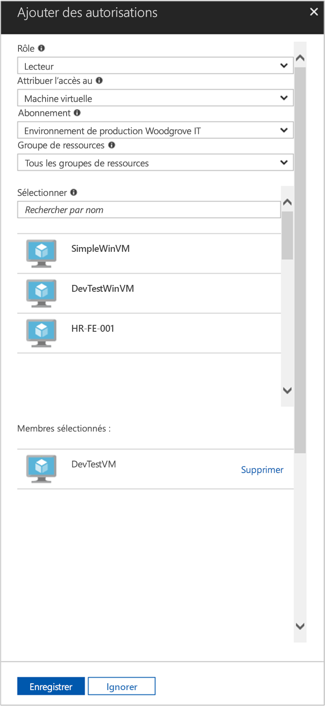

# <a name="use-a-linux-vm-system-assigned-managed-identity-to-access-azure-resource-manager"></a>Utiliser une identité managée affectée par le système de machine virtuelle Linux pour accéder à Azure Resource Manager

[!INCLUDE [preview-notice](../../../includes/active-directory-msi-preview-notice.md)]

Ce démarrage rapide vous indique comment utiliser une identité affectée par le système pour une machine virtuelle Linux afin d’accéder à l’API Azure Resource Manager. Les identités managées pour ressources Azure sont gérées automatiquement par Azure et vous permettent de vous authentifier auprès des services prenant en charge l’authentification Azure AD sans avoir à insérer des informations d’identification dans votre code. Vous allez apprendre à effectuer les actions suivantes :

> [!div class="checklist"]
> * Accorder à votre machine virtuelle l’accès à un groupe de ressources dans Azure Resource Manager 
> * Obtenir un jeton d’accès à l’aide de l’identité de machine virtuelle et l’utiliser pour appeler Azure Resource Manager 

## <a name="prerequisites"></a>Prérequis

- Compréhension des identités managées. Si vous n’êtes pas familiarisé de la fonctionnalité identités managées pour ressources Azure, consultez cette [Vue d’ensemble](overview.md). 
- Un compte Azure. [Inscrivez-vous pour obtenir un compte gratuit](https://azure.microsoft.com/free/).
- Vous avez également besoin d’une machine virtuelle Linux sur laquelle les identités managées attribuées par le système sont activées.
  - Si vous devez créer une machine virtuelle pour ce tutoriel, vous pouvez suivre les instructions de l’article intitulé [Créer une machine virtuelle Linux avec le portail Azure](../../virtual-machines/linux/quick-create-portal.md#create-virtual-machine)

## <a name="grant-access"></a>Accorder l'accès

À l’aide d’identités managées pour ressources Azure, votre code peut obtenir des jetons d’accès pour vous authentifier sur des ressources prenant en charge l’authentification Azure AD. L’API Azure Resource Manager prend en charge l’authentification Azure AD. Tout d’abord, nous devons accorder à cette identité de machine virtuelle l’accès à une ressource dans Azure Resource Manager, dans ce cas le groupe de ressources qui contient la machine virtuelle.  

1. Accédez à l’onglet de **Groupes de ressources**.
2. Sélectionnez le **groupe de ressources** que vous avez utilisé pour votre machine virtuelle.
3. Accédez à **Contrôle d’accès (IAM)** dans le panneau gauche.
4. Cliquez pour **Ajouter** une nouvelle attribution de rôle à votre machine virtuelle. Choisissez **Rôle** en tant que **Lecteur**.
5. Dans la liste déroulante suivante, sélectionnez **Attribuer un accès** à la ressource **Machine virtuelle**.
6. Ensuite, assurez-vous que l’abonnement approprié est répertorié dans la liste déroulante **Abonnement**. Et pour **Groupe de ressources**, sélectionnez **Tous les groupes de ressources**.
7. Enfin, dans **Sélectionner**, choisissez votre machine virtuelle Linux dans la liste déroulante et cliquez sur **Enregistrer**.

    

## <a name="get-an-access-token-using-the-vms-system-assigned-managed-identity-and-use-it-to-call-resource-manager"></a>Obtenir un jeton d’accès par l’identité managée affectée par le système de machine virtuelle et l’utiliser pour appeler Resource Manager

Pour effectuer cette procédure, vous avez besoin d'un client SSH. Si vous utilisez Windows, vous pouvez utiliser le client SSH dans le [Sous-système Windows pour Linux](/windows/wsl/about). Si vous avez besoin d’aide pour configurer les clés de votre client SSH, consultez [Comment utiliser les clés SSH avec Windows sur Azure](../../virtual-machines/linux/ssh-from-windows.md), ou [Comment créer et utiliser une paire de clés publique et privée SSH pour les machines virtuelles Linux dans Azure](../../virtual-machines/linux/mac-create-ssh-keys.md).

1. Dans le portail, accédez à votre machine virtuelle Linux et dans **Vue d’ensemble**, cliquez sur **Connexion**.  
2. **Connectez-vous** à la machine virtuelle à l’aide du client SSH de votre choix. 
3. Dans la fenêtre de terminal, à l’aide de `curl`, adressez une requête au point de terminaison d’identités managées pour ressources Azure en vue d’obtenir un jeton d’accès pour Azure Resource Manager.  
 
    Vous trouverez la requête `curl` pour le jeton d’accès ci-dessous.  
    
    ```bash
    curl 'http://169.254.169.254/metadata/identity/oauth2/token?api-version=2018-02-01&resource=https://management.azure.com/' -H Metadata:true   
    ```
    
    > [!NOTE]
    > La valeur du paramètre « ressource » doit correspondre exactement à ce que demande Azure AD.    Dans le cas de l’ID de ressource de Resource Manager, vous devez inclure la barre oblique finale sur l’URI. 
    
    La réponse inclut le jeton d’accès dont vous avez besoin pour accéder à Azure Resource Manager. 
    
    Réponse :  

    ```bash
    {"access_token":"eyJ0eXAiOi...",
    "refresh_token":"",
    "expires_in":"3599",
    "expires_on":"1504130527",
    "not_before":"1504126627",
    "resource":"https://management.azure.com",
    "token_type":"Bearer"} 
    ```
    
    Vous pouvez utiliser ce jeton d’accès pour accéder à Azure Resource Manager, pour lire les détails du groupe de ressources dont vous avez précédemment accordé l’accès à cette machine virtuelle, par exemple. Remplacez les valeurs de \<SUBSCRIPTION ID\>, \<RESOURCE GROUP\>, et \<ACCESS TOKEN\> par celles que vous avez créées précédemment. 
    
    > [!NOTE]
    > L’URL respecte la casse, par conséquent, assurez-vous que la casse est identique à celle utilisée précédemment lorsque vous avez nommé le groupe de ressources, et que la majuscule « G » dans « resourceGroup » est correcte.  
    
    ```bash 
    curl https://management.azure.com/subscriptions/<SUBSCRIPTION ID>/resourceGroups/<RESOURCE GROUP>?api-version=2016-09-01 -H "Authorization: Bearer <ACCESS TOKEN>" 
    ```
    
    La réponse retourne les informations de groupe de ressources spécifiques : 
     
    ```bash
    {"id":"/subscriptions/98f51385-2edc-4b79-bed9-7718de4cb861/resourceGroups/DevTest","name":"DevTest","location":"westus","properties":{"provisioningState":"Succeeded"}} 
    ```

## <a name="next-steps"></a>Étapes suivantes

Dans ce démarrage rapide, vous avez appris à utiliser une identité managée affectée par le système pour accéder à l’API Azure Resource Manager.  Pour en savoir plus sur Azure Resource Manager, consultez :

> [!div class="nextstepaction"]
>[Azure Resource Manager](../../azure-resource-manager/management/overview.md)
>[Créer, lister ou supprimer une identité managée affectée par l’utilisateur en utilisant Azure PowerShell](how-to-manage-ua-identity-powershell.md)