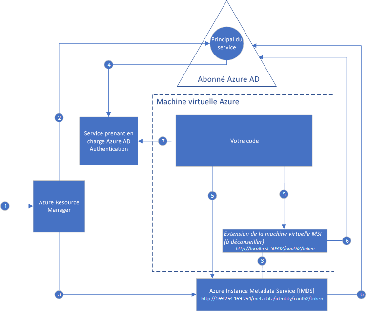

#  Présentation de Managed Service Identity pour les ressources Azure

[!INCLUDE[preview-notice](../../../includes/active-directory-msi-preview-notice.md)]

La gestion des informations d’identification qui doivent se trouver dans votre code pour s’authentifier auprès des services cloud constitue un défi courant lors de la génération d’applications cloud. La sécurisation de ces informations d’identification est une tâche importante. Dans l’idéal, elles ne s’affichent jamais sur les stations de travail de développement ou ne sont jamais archivées dans le contrôle de code source. Azure Key Vault permet de stocker en toute sécurité des informations d’identification et autres clés et secrets, mais votre code doit s’authentifier sur Key Vault pour les récupérer. Managed Service Identity simplifie la résolution de ce problème en donnant aux services Azure une identité automatiquement managée dans Azure Active Directory (Azure AD). Vous pouvez utiliser cette identité pour vous authentifier sur n’importe quel service prenant en charge l’authentification Azure AD, y compris Key Vault, sans avoir d’informations d’identification dans votre code.

Managed Service Identity est fourni avec Azure Active Directory Free, qui est l’abonnement Azure par défaut. L’identité du service administré n’engendre pas de coûts supplémentaires.

## Comment cela fonctionne-t-il ?

Il existe deux types d’identités Managed Service Identities : **celles affectées par le système** et **celles affectées par l’utilisateur**.

- Une **identité affectée par le système** est activée directement sur une instance de service Azure. Lorsque cette fonction est activée, Azure crée une identité pour l’instance de service dans le locataire Azure AD approuvé par l’abonnement de l’instance de service. Une fois l’identité créée, ses informations d’identification sont provisionnées sur l’instance de service. Le cycle de vie d’une identité affectée par le système est directement lié à l’instance de service Azure sur laquelle elle est activée. Si l’instance de service est supprimée, Azure efface automatiquement les informations d’identification et l’identité dans Azure AD.
- Une **identité attribuée à l’utilisateur** est créée en tant que ressource Azure autonome. Via un processus de création, Azure crée une identité dans le locataire Azure AD approuvé par l’abonnement en cours d’utilisation. Une fois l’identité créée, elle peut être affectée à une ou plusieurs instances de service Azure. Le cycle de vie d’une identité affectée par l’utilisateur est géré séparément du cycle de vie des instances de service Azure auxquelles elle est affectée.

Par conséquent, votre code peut utiliser une identité affectée par le système ou par l’utilisateur, pour demander des jetons d’accès pour les services qui prennent en charge l’authentification Azure AD. Azure prend en charge la restauration des informations d’identification utilisées par l’instance de service.

Voici un exemple du fonctionnement des identités affectées par le système avec des machines virtuelles Azure :

1. Azure Resource Manager reçoit une requête pour activer l’identité affectée par le système sur une machine virtuelle.
2. Azure Resource Manager crée un principal de service dans Azure AD pour représenter l’identité de la machine virtuelle. Le principal de service est créé dans l’abonné Azure AD approuvé par cet abonnement.
3. Azure Resource Manager configure l’identité sur la machine virtuelle :
    - Met à jour le point de terminaison d’identité Azure Instance Metadata Service avec l’ID client et le certificat du Principal de service.
    - Provisionne l’extension de machine virtuelle et ajoute l’ID client et le certificat du Principal de service. (fonctionnalité destinée à être déconseillée)
4. Maintenant que la machine virtuelle possède une identité, nous utilisons ses informations du Principal de service pour accorder l’accès à la machine virtuelle aux ressources Azure. Par exemple, si votre code doit appeler Azure Resource Manager, il vous faut ensuite attribuer le rôle approprié au principal de service de la machine virtuelle à l’aide du contrôle d’accès en fonction du rôle (RBAC) dans Azure AD. Si votre code doit appeler Key Vault, cela signifie que vous devez accorder à votre code un accès au secret spécifique ou à la clé dans Key Vault.
5. Votre code en cours d’exécution sur la machine virtuelle peut demander un jeton à partir de deux points de terminaison qui sont uniquement accessibles à partir de la machine virtuelle :

    - Point de terminaison d’identité Azure Instance Metadata Service (IMDS) : http://169.254.169.254/metadata/identity/oauth2/token (recommandé)
        - Le paramètre de ressource spécifie le service vers lequel le jeton est envoyé. Par exemple, si vous souhaitez que votre code s’authentifie sur Azure Resource Manager, vous devez utiliser resource=https://management.azure.com/.
        - Le paramètre de version d’API spécifie la version IMDS, utilisez api-version=2018-02-01 ou version ultérieure.
    - Point de terminaison d’extension de machine virtuelle : http://localhost:50342/oauth2/token (destiné à être déconseillé)
        - Le paramètre de ressource spécifie le service vers lequel le jeton est envoyé. Par exemple, si vous souhaitez que votre code s’authentifie sur Azure Resource Manager, vous devez utiliser resource=https://management.azure.com/.

6. Un appel est passé à Azure AD pour demander un jeton d’accès comme indiqué à l’étape 5, à l’aide de l’ID client et du certificat configurés à l’étape 3. Azure AD renvoie un jeton d’accès JSON Web Token (JWT).
7. Votre code envoie le jeton d’accès sur un appel à un service qui prend en charge l’authentification Azure AD.

Dans le même diagramme, voici un exemple du fonctionnement d’une identité de service administré affectée par l’utilisateur avec des machines virtuelles Azure.

1. Azure Resource Manager reçoit une requête pour créer une identité affectée par l’utilisateur.
2. Azure Resource Manager crée un principal de service dans Azure AD pour représenter l’identité affectée par l’utilisateur. Le principal de service est créé dans l’abonné Azure AD approuvé par cet abonnement.
3. Azure Resource Manager reçoit une requête pour configurer l’identité affectée par l’utilisateur sur une machine virtuelle :
    - Met à jour le point de terminaison d’identité Azure Instance Metadata Service avec l’ID client et le certificat du Principal de service de l’identité affectée par l’utilisateur.
    - Provisionne l’extension de machine virtuelle et ajoute l’ID client et le certificat du Principal de service de l’identité affectée par l’utilisateur (destiné à être déconseillé).
4. Maintenant que l’identité affectée par l’utilisateur a été créée, nous utilisons ses informations du Principal de service pour lui accorder l’accès aux ressources Azure. Par exemple, si votre code doit appeler Azure Resource Manager, alors il vous faut attribuer le rôle approprié au principal de service de l’identité affectée par l’utilisateur à l’aide du contrôle d’accès en fonction du rôle (RBAC) dans Azure AD. Si votre code doit appeler Key Vault, cela signifie que vous devez accorder à votre code un accès au secret spécifique ou à la clé dans Key Vault. Remarque : cette étape peut aussi être effectuée avant l’étape 3.
5. Votre code en cours d’exécution sur la machine virtuelle peut demander un jeton à partir de deux points de terminaison qui sont uniquement accessibles à partir de la machine virtuelle :

    - Point de terminaison d’identité Azure Instance Metadata Service (IMDS) : http://169.254.169.254/metadata/identity/oauth2/token (recommandé)
        - Le paramètre de ressource spécifie le service vers lequel le jeton est envoyé. Par exemple, si vous souhaitez que votre code s’authentifie sur Azure Resource Manager, vous devez utiliser resource=https://management.azure.com/.
        - Le paramètre ID client spécifie l’identité pour laquelle le jeton est demandé. Cela est nécessaire pour lever l’ambiguïté lorsque plusieurs identités affectées par l’utilisateur se trouvent sur une même machine virtuelle.
        - Le paramètre de version d’API spécifie la version IMDS, utilisez api-version=2018-02-01 ou version ultérieure.

    - Point de terminaison d’extension de machine virtuelle : http://localhost:50342/oauth2/token (destiné à être déconseillé)
        - Le paramètre de ressource spécifie le service vers lequel le jeton est envoyé. Par exemple, si vous souhaitez que votre code s’authentifie sur Azure Resource Manager, vous devez utiliser resource=https://management.azure.com/.
        - Le paramètre ID client spécifie l’identité pour laquelle le jeton est demandé. Cela est nécessaire pour lever l’ambiguïté lorsque plusieurs identités affectées par l’utilisateur se trouvent sur une même machine virtuelle.
6. Un appel est passé à Azure AD pour demander un jeton d’accès comme indiqué à l’étape 5, à l’aide de l’ID client et du certificat configurés à l’étape 3. Azure AD renvoie un jeton d’accès JSON Web Token (JWT).
7. Votre code envoie le jeton d’accès sur un appel à un service qui prend en charge l’authentification Azure AD.
     
## Essayer l’identité du service administré

Essayez un didacticiel d’identité du service administré afin d’en savoir plus sur les scénarios de bout en bout pour l’accès à d’autres ressources Azure :
  
| À partir d’une ressource activée d’identité managée | Découvrez comment |
| ------- | -------- |
| Machine virtuelle Azure (Windows) | [Accéder à Azure Data Lake Store avec une identité du service administré d’une machine virtuelle Windows](tutorial-windows-vm-access-datalake.md) |
|                    | [Accéder à Azure Resource Manager avec l’identité du service administré d’une machine virtuelle Windows](tutorial-windows-vm-access-arm.md) |
|                    | [Accéder à Azure SQL avec l’identité MSI (Managed Service Identity) d’une machine virtuelle Windows](tutorial-windows-vm-access-sql.md) |
|                    | [Accéder au stockage Azure via une clé d’accès avec l’identité MSI (Managed Service Identity) d’une machine virtuelle Windows](tutorial-windows-vm-access-storage.md) |
|                    | [Accéder au stockage Azure via la signature d’accès partagé (SAP) avec l’identité MSI (Managed Service Identity) d’une machine virtuelle Windows](tutorial-windows-vm-access-storage-sas.md) |
|                    | [Accéder à une ressource non Azure AD avec l’identité du service administré d’une machine virtuelle Windows et Azure Key Vault](tutorial-windows-vm-access-nonaad.md) |
| Machine virtuelle Azure (Linux)   | [Accéder à Azure Data Lake Store avec une identité du service administré de la machine virtuelle Linux](tutorial-linux-vm-access-datalake.md) |
|                    | [Accéder à Azure Resource Manager avec l’identité du service administré d’une machine virtuelle Linux](tutorial-linux-vm-access-arm.md) |
|                    | [Accéder au stockage Azure via une clé d’accès avec l’identité MSI (Managed Service Identity) d’une machine virtuelle Linux](tutorial-linux-vm-access-storage.md) |
|                    | [Accéder au stockage Azure via la signature d’accès partagé (SAP) avec l’identité MSI (Managed Service Identity) d’une machine virtuelle Linux](tutorial-linux-vm-access-storage-sas.md) |
|                    | [Accéder à une ressource non Azure AD avec l’identité MSI (Managed Service Identity) d’une machine virtuelle Linux et Azure Key Vault](tutorial-linux-vm-access-nonaad.md) |
| Azure App Service  | [Utiliser l’identité du service administré avec Azure App Service ou Azure Functions](/azure/app-service/app-service-managed-service-identity) |
| Azure Functions    | [Utiliser l’identité du service administré avec Azure App Service ou Azure Functions](/azure/app-service/app-service-managed-service-identity) |
| Azure Service Bus  | [Utiliser Azure Service Bus avec une identité de service administré](../../service-bus-messaging/service-bus-managed-service-identity.md) |
| Hubs d'événements Azure   | [Utiliser une identité du service managé avec Azure Event Hubs](../../event-hubs/event-hubs-managed-service-identity.md) |
| Gestion des API Azure | [Utiliser Managed Service Identity avec Gestion des API Azure](../../api-management/api-management-howto-use-managed-service-identity.md) |

## Quels services Azure prennent en charge l’identité du service administré ?

Les identités gérées peuvent servir à l’authentification auprès des services prenant en charge l’authentification Azure AD. Pour obtenir la liste des services Azure qui prennent en charge Managed Service Identity, consultez l’article suivant :
- [Services qui prennent en charge l’identité du service administré](services-support-msi.md)

## Étapes suivantes

Bien démarrer avec Azure Managed Service Identity grâce aux guides de démarrage rapide suivants :

* [Utiliser une identité Managed Service Identity de machine virtuelle Windows pour accéder à Resource Manager : machine virtuelle Windows](tutorial-windows-vm-access-arm.md)
* [Utiliser une identité Managed Service Identity de machine virtuelle Linux pour accéder à Azure Resource Manager : machine virtuelle Linux](tutorial-linux-vm-access-arm.md)
