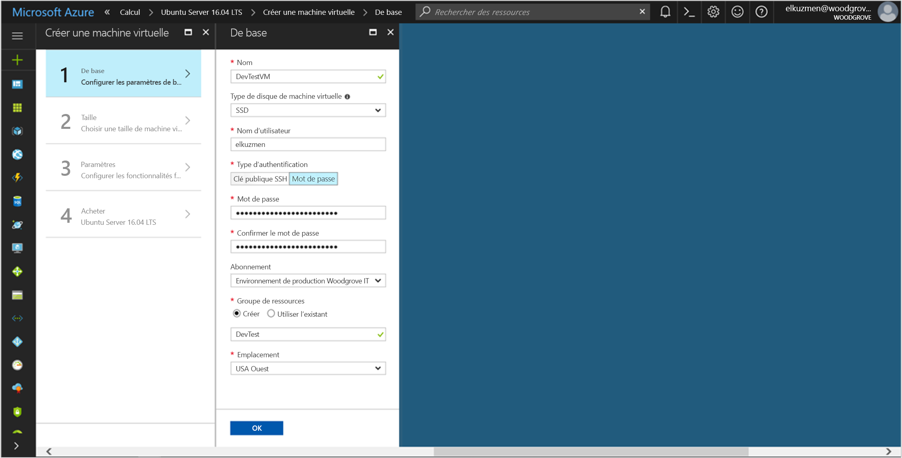
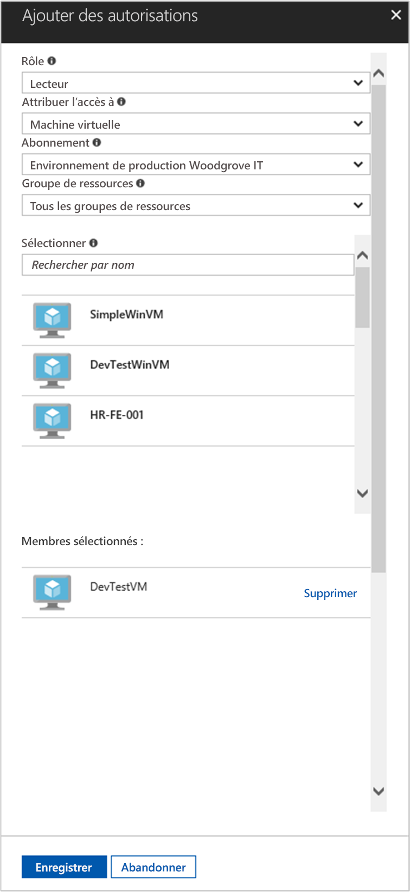

# <a name="use-a-linux-vm-managed-service-identity-to-access-azure-resource-manager"></a>Utiliser une identité MSI (Managed Service Identity) de machine virtuelle Linux pour accéder à Azure Resource Manager

[!INCLUDE[preview-notice](../../../includes/active-directory-msi-preview-notice.md)]

Ce didacticiel vous montre comment activer l’identité MSI (Managed Service Identity) pour une machine virtuelle Linux et comment l’utiliser pour accéder à l’API d’Azure Resource Manager. Les identités du service administré sont gérées automatiquement par Azure et vous permettent de vous authentifier sur les services prenant en charge l’authentification Azure AD sans avoir à insérer des informations d’identification dans votre code. Vous allez apprendre à effectuer les actions suivantes :

> [!div class="checklist"]
> * Activer Managed Service Identity sur une machine virtuelle Linux 
> * Accorder à votre machine virtuelle l’accès à un groupe de ressources dans Azure Resource Manager 
> * Obtenir un jeton d’accès à l’aide de l’identité de machine virtuelle et l’utiliser pour appeler Azure Resource Manager 

## <a name="prerequisites"></a>Prérequis

[!INCLUDE [msi-qs-configure-prereqs](../../../includes/active-directory-msi-qs-configure-prereqs.md)]

[!INCLUDE [msi-tut-prereqs](../../../includes/active-directory-msi-tut-prereqs.md)]

## <a name="sign-in-to-azure"></a>Connexion à Azure

Connectez-vous au portail Azure sur [https://portal.azure.com](https://portal.azure.com).

## <a name="create-a-linux-virtual-machine-in-a-new-resource-group"></a>Créer une machine virtuelle Linux dans un nouveau groupe de ressources

Pour ce didacticiel, nous créons une machine virtuelle Linux. Vous pouvez également activer une identité MSI sur une machine virtuelle existante.

1. Cliquez sur le bouton **Créer une ressource** dans le coin supérieur gauche du portail Azure.
2. Sélectionnez **Compute**, puis sélectionnez **Ubuntu Server 16.04 LTS**.
3. Saisissez les informations de la machine virtuelle. Dans **Type d’authentification**, sélectionnez **Clé publique SSH** ou **Mot de passe**. Les informations d’identification créées vous permettent de vous connecter à la machine virtuelle.

    

4. Choisissez un **Abonnement** pour la machine virtuelle dans la liste déroulante.
5. Pour sélectionner un nouveau **Groupe de ressources** dans lequel vous souhaitez créer la machine virtuelle, choisissez **Créer nouveau**. Lorsque vous avez terminé, cliquez sur **OK**.
6. Choisissez la taille de la machine virtuelle. Pour voir plus de tailles, sélectionnez **Afficher tout** ou modifiez le filtre de type de disque pris en charge. Conservez les valeurs par défaut dans le panneau des paramètres et cliquez sur **OK**.

## <a name="enable-managed-service-identity-on-your-vm"></a>Activer l’identité MSI sur votre machine virtuelle

L’identité MSI d’une machine virtuelle vous permet d’obtenir des jetons d’accès d’Azure AD sans avoir à entrer d’informations d’identification dans votre code. L’activation de Managed Service Identity sur une machine virtuelle effectue deux opérations : elle inscrit votre machine virtuelle auprès d’Azure Active Directory pour créer son identité managée, et elle configure l’identité sur la machine virtuelle.

1. Sélectionnez la **machine virtuelle** sur laquelle vous souhaitez activer une Managed Service Identity.
2. Dans la barre de navigation gauche, cliquez sur **Configuration**.
3. **Identité du service administré** s’affiche. Pour enregistrer et activer une Managed Service Identity, sélectionnez **Oui**. Si vous souhaitez la désactiver, sélectionnez Non.
4. Assurez-vous d’avoir cliqué sur **Enregistrer** pour enregistrer la configuration.

    

## <a name="grant-your-vm-access-to-a-resource-group-in-azure-resource-manager"></a>Accorder à votre machine virtuelle l’accès à un groupe de ressources dans Azure Resource Manager 

À l’aide d’une MSI, votre code peut obtenir des jetons d’accès pour vous authentifier sur des ressources prenant en charge l’authentification Azure AD. L’API Azure Resource Manager prend en charge l’authentification Azure AD. Tout d’abord, nous devons accorder à cette identité de machine virtuelle l’accès à une ressource dans Azure Resource Manager, dans ce cas le groupe de ressources qui contient la machine virtuelle.  

1. Accédez à l’onglet de **Groupes de ressources**.
2. Sélectionnez le **Groupe de ressources** spécifique créé précédemment.
3. Accédez à **Contrôle d’accès (IAM)** dans le panneau gauche.
4. Cliquez pour **Ajouter** une nouvelle attribution de rôle à votre machine virtuelle. Choisissez **Rôle** en tant que **Lecteur**.
5. Dans la liste déroulante suivante, sélectionnez **Attribuer un accès** à la ressource **Machine virtuelle**.
6. Ensuite, vérifiez que l’abonnement approprié apparaît dans la liste déroulante **Abonnement**. Pour **Groupe de ressources**, sélectionnez **Tous les groupes de ressources**.
7. Enfin, dans **Sélectionner**, choisissez votre machine virtuelle Linux dans la liste déroulante et cliquez sur **Enregistrer**.

    

## <a name="get-an-access-token-using-the-vms-identity-and-use-it-to-call-resource-manager"></a>Obtenir un jeton d’accès à l’aide de l’identité de la machine virtuelle et l’utiliser pour appeler Gestionnaire des ressources 

Pour effectuer cette procédure, vous avez besoin d'un client SSH. Si vous utilisez Windows, vous pouvez utiliser le client SSH dans le [Sous-système Windows pour Linux](https://msdn.microsoft.com/commandline/wsl/about). Si vous avez besoin d’aide pour configurer les clés de votre client SSH, consultez [Comment utiliser les clés SSH avec Windows sur Azure](../../virtual-machines/linux/ssh-from-windows.md), ou [Comment créer et utiliser une paire de clés publique et privée SSH pour les machines virtuelles Linux dans Azure](../../virtual-machines/linux/mac-create-ssh-keys.md).

1. Dans le portail, accédez à votre machine virtuelle Linux et dans **Vue d’ensemble**, cliquez sur **Connexion**.  
2. **Connectez-vous** à la machine virtuelle à l’aide du client SSH de votre choix. 
3. Dans la fenêtre de terminal, envoyez une requête contenant CURL au point de terminaison local de la MSI en vue d’obtenir un jeton d’accès pour Azure Resource Manager.  
 
    Vous trouverez la requête CURL pour le jeton d’accès ci-dessous.  
    
    ```bash
    curl 'http://169.254.169.254/metadata/identity/oauth2/token?api-version=2018-02-01&resource=https%3A%2F%2Fmanagement.azure.com%2F' -H Metadata:true   
    ```
    
    > [!NOTE]
    > La valeur du paramètre « ressource » doit correspondre exactement à ce que demande Azure AD.  Dans le cas de l’ID de ressource de Resource Manager, vous devez inclure la barre oblique finale sur l’URI. 
    
    La réponse inclut le jeton d’accès dont vous avez besoin pour accéder à Azure Resource Manager. 
    
    Réponse :  

    ```bash
    {"access_token":"eyJ0eXAiOi...",
    "refresh_token":"",
    "expires_in":"3599",
    "expires_on":"1504130527",
    "not_before":"1504126627",
    "resource":"https://management.azure.com",
    "token_type":"Bearer"} 
    ```
    
    Vous pouvez utiliser ce jeton d’accès pour accéder à Azure Resource Manager, pour lire les détails du groupe de ressources dont vous avez précédemment accordé l’accès à cette machine virtuelle, par exemple. Remplacez les valeurs de \<ID D’ABONNEMENT\>, \<GROUPE DE RESSOURCES\>, et \<JETON D’ACCÈS\> par celles que vous avez créées précédemment. 
    
    > [!NOTE]
    > L’URL respecte la casse, par conséquent, assurez-vous que la casse est identique à celle utilisée précédemment lorsque vous avez nommé le groupe de ressources, et que la majuscule « G » dans « resourceGroup » est correcte.  
    
    ```bash 
    curl https://management.azure.com/subscriptions/<SUBSCRIPTION ID>/resourceGroups/<RESOURCE GROUP>?api-version=2016-09-01 -H "Authorization: Bearer <ACCESS TOKEN>" 
    ```
    
    La réponse retourne les informations de groupe de ressources spécifiques : 
     
    ```bash
    {"id":"/subscriptions/98f51385-2edc-4b79-bed9-7718de4cb861/resourceGroups/DevTest","name":"DevTest","location":"westus","properties":{"provisioningState":"Succeeded"}} 
    ```     

## <a name="next-steps"></a>Étapes suivantes

Dans ce didacticiel, vous avez découvert comment créer une identité assignée à l’utilisateur, puis l’attacher à une machine virtuelle Azure pour accéder à l’API Azure Resource Manager.  Pour en savoir plus sur Azure Resource Manager, consultez :

> [!div class="nextstepaction"]
>[Azure Resource Manager](/azure/azure-resource-manager/resource-group-overview)