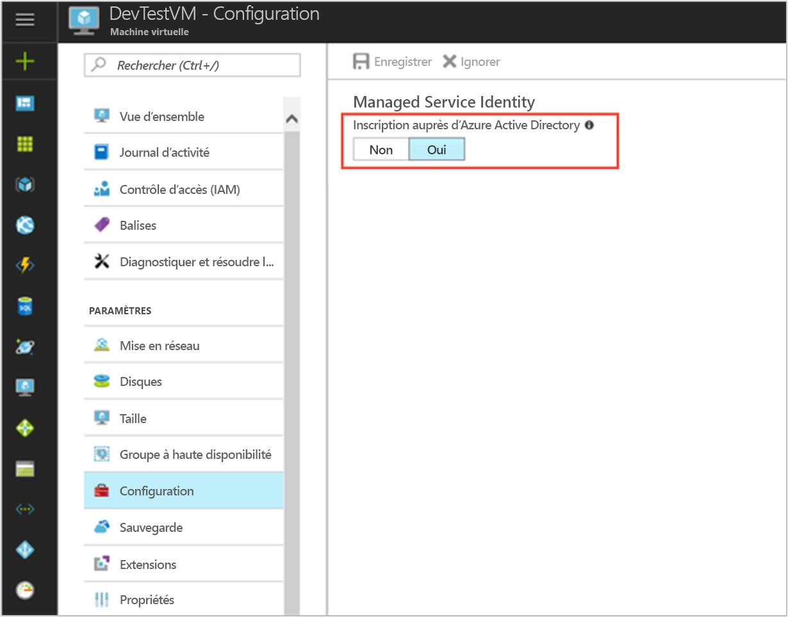

# <a name="use-a-windows-vm-msi-to-access-azure-cosmos-db"></a>Utiliser une MSI de machine virtuelle Windows pour accéder à Azure Cosmos DB

[!INCLUDE[preview-notice](../../../includes/active-directory-msi-preview-notice.md)]

Ce tutoriel vous montre comment créer et utiliser une MSI de machine virtuelle Windows pour accéder à Cosmos DB. Vous allez apprendre à effectuer les actions suivantes :

> [!div class="checklist"]
> * Créer une machine virtuelle Windows MSI 
> * Création d’un compte Cosmos DB
> * Accorder aux clés d’accès du compte Cosmos DB l’accès à la MSI de machine virtuelle Windows
> * Obtenir un jeton d’accès par l’intermédiaire de la MSI de machine virtuelle Windows afin d’appeler Azure Resource Manager
> * Obtenir les clés d’accès à partir d’Azure Resource Manager pour effectuer des appels Cosmos DB

## <a name="prerequisites"></a>Prérequis


[!INCLUDE [msi-qs-configure-prereqs](../../../includes/active-directory-msi-qs-configure-prereqs.md)]

[!INCLUDE [msi-tut-prereqs](../../../includes/active-directory-msi-tut-prereqs.md)]


## <a name="sign-in-to-azure"></a>Connexion à Azure

Connectez-vous au portail Azure sur [https://portal.azure.com](https://portal.azure.com).

## <a name="create-a-windows-virtual-machine-in-a-new-resource-group"></a>Création d'une machine virtuelle Windows dans un nouveau groupe de ressources

Pour ce didacticiel, nous allons créer une machine virtuelle Windows.  Vous pouvez également activer l’identité du service administré sur une machine virtuelle existante.

1. Cliquez sur le bouton **Créer une ressource** dans le coin supérieur gauche du portail Azure.
2. Sélectionnez **Compute**, puis **Windows Server 2016 Datacenter**. 
3. Saisissez les informations de la machine virtuelle. Le **Nom d’utilisateur** et le **Mot de passe** créés ici sont les informations d’identification nécessaires pour vous connecter à la machine virtuelle.
4. Choisissez un **Abonnement** approprié pour la machine virtuelle dans la liste déroulante.
5. Pour sélectionner un nouveau **Groupe de ressources** dans lequel créer votre machine virtuelle, choisissez **Créer un nouveau**. Lorsque vous avez terminé, cliquez sur **OK**.
6. Choisissez la taille de la machine virtuelle. Pour voir plus de tailles, sélectionnez **Afficher tout** ou modifiez le filtre **Type de disque pris en charge**. Conservez les valeurs par défaut dans la page des paramètres et cliquez sur **OK**.

   

## <a name="enable-msi-on-your-vm"></a>Activer l’identité du service administré sur votre machine virtuelle 

L’identité du service administré d’une machine virtuelle permet d’obtenir des jetons d’accès d’Azure AD sans avoir à placer des informations d’identification dans votre code. En arrière-plan, l’activation de MSI sur une machine virtuelle via le portail Azure effectue deux opérations : elle enregistre votre machine virtuelle avec Azure AD pour créer une identité managée et configure l’identité sur la machine virtuelle.

1. Sélectionnez la **Machine virtuelle** sur laquelle vous souhaitez activer l’identité du service administré.  
2. Dans la barre de navigation gauche, cliquez sur **Configuration**. 
3. **Identité du service administré** s’affiche. Pour enregistrer et activer l’identité du service administré, sélectionnez **Oui**. Si vous souhaitez la désactiver, sélectionnez Non. 
4. Assurez-vous d’avoir cliqué sur **Enregistrer** pour enregistrer la configuration.  
   

## <a name="create-a-cosmos-db-account"></a>Création d’un compte Cosmos DB 

Si vous n’en avez pas déjà un, créez un compte Cosmos DB. Vous pouvez ignorer cette étape et utiliser un compte Cosmos DB existant. 

1. Cliquez sur le bouton **+/Créer un service** dans l’angle supérieur gauche du portail Azure.
2. Cliquez sur **Bases de données**, puis sur **Azure Cosmos DB** pour afficher le panneau Nouveau compte.
3. Entrez un **ID** pour le compte Cosmos DB, que vous pourrez utiliser plus tard.  
4. **API** doit être défini sur « SQL ». L’approche décrite dans ce didacticiel peut être utilisée avec les autres types d’API disponibles. Toutefois, les étapes de ce didacticiel correspondent à celles de l’API SQL.
5. Assurez-vous que les champs **Abonnement** et **Groupe de ressources** correspondent à ceux que vous avez spécifiés lorsque vous avez créé votre machine virtuelle à l’étape précédente.  Sélectionnez un **emplacement** où Cosmos DB est disponible.
6. Cliquez sur **Créer**.

## <a name="create-a-collection-in-the-cosmos-db-account"></a>Créer une collection dans le compte Cosmos DB

Ensuite, ajoutez une collection de données dans le compte Cosmos DB que vous pourrez interroger dans les prochaines étapes.

1. Accédez au compte Cosmos DB que vous venez de créer.
2. Sous l’onglet **Vue d’ensemble**, cliquez sur le bouton **+ Ajouter une collection** pour afficher le panneau Ajouter une collection.
3. Attribuez à la collection un ID de base de données et un ID de collection. Sélectionnez une capacité de stockage, entrez une clé de partition et une valeur de débit, puis cliquez sur **OK**.  Pour ce didacticiel, il suffit d’utiliser « Test » comme ID de base de données et ID de collection, et de sélectionner une capacité de stockage fixe et le débit le plus bas (400 RU/s).  

## <a name="grant-windows-vm-msi-access-to-the-cosmos-db-account-access-keys"></a>Accorder aux clés d’accès du compte Cosmos DB l’accès à la MSI de machine virtuelle Windows

Cosmos DB ne prend pas en charge l’authentification Azure AD en mode natif. Toutefois, vous pouvez utiliser une identité MSI pour récupérer une clé d’accès Cosmos DB à partir du Gestionnaire des ressources, puis utiliser cette clé pour accéder à Cosmos DB. Dans cette étape, vous allez accorder l’accès MSI aux clés pour le compte Cosmos DB.

Pour accorder à votre identité MSI l’accès au compte Cosmos DB dans Azure Resource Manager à l’aide de PowerShell, mettez à jour les valeurs pour `<SUBSCRIPTION ID>`, `<RESOURCE GROUP>` et `<COSMOS DB ACCOUNT NAME>` pour votre environnement. Remplacez `<MSI PRINCIPALID>` par la propriété `principalId` retournée par la commande `az resource show` dans [Récupérer le principalID de MSI de la machine virtuelle Linux](#retrieve-the-principalID-of-the-linux-VM's-MSI).  Cosmos DB prend en charge deux niveaux de granularité lors de l’utilisation des clés d’accès : accès en lecture/écriture au compte et accès en lecture seule au compte.  Pour obtenir les clés en lecture/écriture du compte, affectez le rôle `DocumentDB Account Contributor`, et pour obtenir les clés en lecture seule du compte, affectez le rôle `Cosmos DB Account Reader Role` :

```azurepowershell
$spID = (Get-AzureRMVM -ResourceGroupName myRG -Name myVM).identity.principalid
New-AzureRmRoleAssignment -ObjectId $spID -RoleDefinitionName "Reader" -Scope "/subscriptions/<mySubscriptionID>/resourceGroups/<myResourceGroup>/providers/Microsoft.Storage/storageAccounts/<myStorageAcct>"
```

## <a name="get-an-access-token-using-the-windows-vms-msi-to-call-azure-resource-manager"></a>Obtenir un jeton d’accès par l’intermédiaire de la MSI de machine virtuelle Windows afin d’appeler Azure Resource Manager

Pour la suite de ce didacticiel, nous allons utiliser la machine virtuelle que nous avons créée précédemment. 

Dans cette partie, vous devez utiliser les applets de commande PowerShell d’Azure Resource Manager.  Si vous ne l’avez pas installé, [téléchargez la dernière version](https://docs.microsoft.com/powershell/azure/overview) avant de continuer.

Vous devez également installer la dernière version [Azure CLI 2.0](https://docs.microsoft.com/cli/azure/install-azure-cli) sur votre machine virtuelle Windows.

1. Dans le portail Azure, accédez à **Machines virtuelles**, accédez à votre machine virtuelle Windows, puis, en haut de la page **Vue d’ensemble**, cliquez sur **Se connecter**. 
2. Entrez le **Nom d’utilisateur** et le **Mot de passe** que vous avez ajoutés lorsque vous avez créé la machine virtuelle Windows. 
3. Maintenant que vous avez créé une **Connexion au Bureau à distance** avec la machine virtuelle, ouvrez PowerShell dans la session à distance.
4. À l’aide de Invoke-WebRequest de Powershell, envoyez une requête au point de terminaison MSI local pour obtenir un jeton d’accès pour Azure Resource Manager.

    ```powershell
        $response = Invoke-WebRequest -Uri 'http://169.254.169.254/metadata/identity/oauth2/token?api-version=2018-02-01&resource=https%3A%2F%2Fmanagement.azure.com%2F' -Method GET -Headers @{Metadata="true"}
    ```

    > [!NOTE]
    > La valeur du paramètre « ressource » doit correspondre exactement à ce qui est attendu par Azure AD. Lorsque vous utilisez l’ID de ressource Azure Resource Manager, vous devez inclure la barre oblique de fin à l’URI.
    
    Ensuite, extrayez l’élément « Content » qui est stocké sous forme de chaîne au format JSON (JavaScript Objet Notation) dans l’objet $response. 
    
    ```powershell
    $content = $response.Content | ConvertFrom-Json
    ```
    Ensuite, extrayez le jeton d’accès de la réponse.
    
    ```powershell
    $ArmToken = $content.access_token
    ```

## <a name="get-access-keys-from-azure-resource-manager-to-make-cosmos-db-calls"></a>Obtenir les clés d’accès à partir d’Azure Resource Manager pour effectuer des appels Cosmos DB

Maintenant, utilisez PowerShell pour appeler le Gestionnaire des ressources à l’aide du jeton d’accès récupéré dans la section précédente, afin de récupérer la clé d’accès au compte Cosmos DB. Une fois la clé d’accès obtenue, nous pouvons interroger Cosmos DB. N’oubliez pas de remplacer les paramètres `<SUBSCRIPTION ID>`, `<RESOURCE GROUP>` et `<COSMOS DB ACCOUNT NAME>` par vos propres valeurs. Remplacez la valeur `<ACCESS TOKEN>` par le jeton d’accès que vous avez récupéré précédemment.  Si vous souhaitez récupérer les clés en lecture/écriture, utilisez le type d’opération de clé `listKeys`.  Si vous souhaitez récupérer les clés en lecture seule, utilisez le type d’opération de clé `readonlykeys` :

```powershell
Invoke-WebRequest -Uri https://management.azure.com/subscriptions/<SUBSCRIPTION-ID>/resourceGroups/<RESOURCE-GROUP>/providers/Microsoft.DocumentDb/databaseAccounts/<COSMOS DB ACCOUNT NAME>/listKeys/?api-version=2016-12-01 -Method POST -Headers @{Authorization="Bearer $ARMToken"}
```
La réponse vous donne la liste des clés.  Par exemple, si vous obtenez des clés en lecture seule :

```powershell
{"primaryReadonlyMasterKey":"bWpDxS...dzQ==",
"secondaryReadonlyMasterKey":"38v5ns...7bA=="}
```
Maintenant que vous disposez de la clé d’accès pour le compte Cosmos DB, vous pouvez la passer à un SDK Cosmos DB et effectuer des appels pour accéder au compte.  Pour un exemple rapide, vous pouvez passer la clé d’accès à Azure CLI.  Vous pouvez obtenir l’<COSMOS DB CONNECTION URL> sous l’onglet **Vue d’ensemble**, dans le panneau du compte Cosmos DB, dans le portail Azure.  Remplacez <ACCESS KEY> par la valeur que vous avez obtenue ci-dessus :

```bash
az cosmosdb collection show -c <COLLECTION ID> -d <DATABASE ID> --url-connection "<COSMOS DB CONNECTION URL>" --key <ACCESS KEY>
```

Cette commande CLI retourne des informations détaillées sur la collection :

```bash
{
  "collection": {
    "_conflicts": "conflicts/",
    "_docs": "docs/",
    "_etag": "\"00006700-0000-0000-0000-5a8271e90000\"",
    "_rid": "Es5SAM2FDwA=",
    "_self": "dbs/Es5SAA==/colls/Es5SAM2FDwA=/",
    "_sprocs": "sprocs/",
    "_triggers": "triggers/",
    "_ts": 1518498281,
    "_udfs": "udfs/",
    "id": "Test",
    "indexingPolicy": {
      "automatic": true,
      "excludedPaths": [],
      "includedPaths": [
        {
          "indexes": [
            {
              "dataType": "Number",
              "kind": "Range",
              "precision": -1
            },
            {
              "dataType": "String",
              "kind": "Range",
              "precision": -1
            },
            {
              "dataType": "Point",
              "kind": "Spatial"
            }
          ],
          "path": "/*"
        }
      ],
      "indexingMode": "consistent"
    }
  },
  "offer": {
    "_etag": "\"00006800-0000-0000-0000-5a8271ea0000\"",
    "_rid": "f4V+",
    "_self": "offers/f4V+/",
    "_ts": 1518498282,
    "content": {
      "offerIsRUPerMinuteThroughputEnabled": false,
      "offerThroughput": 400
    },
    "id": "f4V+",
    "offerResourceId": "Es5SAM2FDwA=",
    "offerType": "Invalid",
    "offerVersion": "V2",
    "resource": "dbs/Es5SAA==/colls/Es5SAM2FDwA=/"
  }
}
```

## <a name="next-steps"></a>Étapes suivantes

- Pour une vue d’ensemble de l’identité du service administré, consultez [Vue d’ensemble de l’identité du service administré](overview.md).
