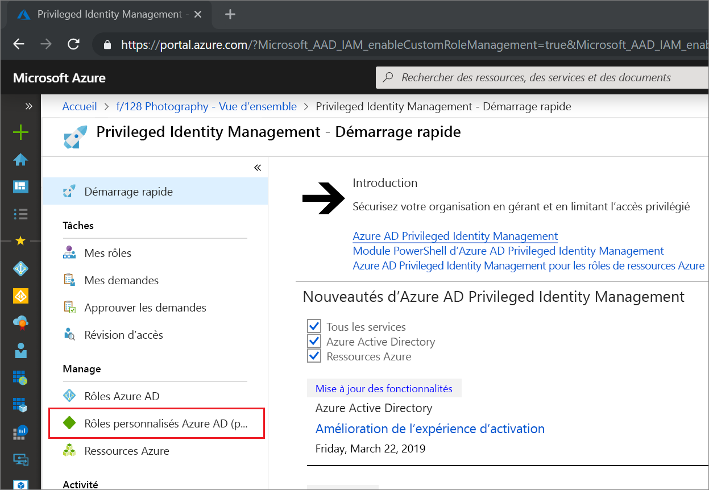
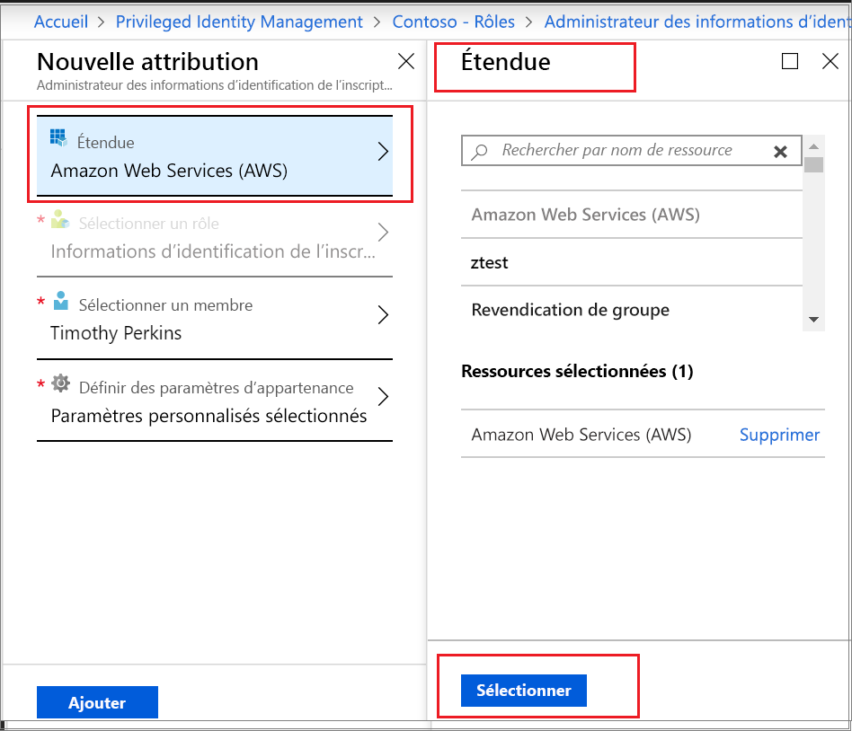

# Activer un rôle personnalisé Azure AD dans Privileged Identity Management

Privileged Identity Management dans Azure Active Directory (Azure AD) prend désormais en charge l’attribution juste-à-temps et limitée dans le temps pour les rôles personnalisés créés pour la gestion des applications dans l’expérience d’administration Gestion de l’identité et de l’accès. Pour plus d’informations sur la création de rôles personnalisés pour déléguer la gestion des applications dans Azure AD, consultez la section [Personnaliser les rôles Administrateur dans Azure Active Directory (préversion)](../roles/custom-overview.md).

> [!NOTE]
> Les rôles personnalisés Azure AD ne sont pas intégrés aux rôles d’annuaire intégrés au cours de la préversion. Une fois la fonctionnalité mise à la disposition générale, la gestion des rôles se déroule dans l’expérience des rôles intégrés. Si vous voyez la bannière suivante, ces rôles doivent être gérés [dans l’expérience des rôles intégrés](pim-how-to-activate-role.md) et cet article ne s’applique pas :
>
> :::image type="content" source="media/pim-how-to-add-role-to-user/pim-new-version.png" alt-text="Sélectionnez Privileged Identity Management dans Azure AD." lightbox="media/pim-how-to-add-role-to-user/pim-new-version.png":::

## Activer un rôle

Lorsque vous avez besoin d’activer un rôle personnalisé Azure AD, demandez une activation en sélectionnant l’option de navigation Mes rôles dans Privileged Identity Management.

1. Connectez-vous au [portail Azure](https://portal.azure.com).
1. Ouvrez Azure AD [Privileged Identity Management](https://portal.azure.com/?Microsoft_AAD_IAM_enableCustomRoleManagement=true&Microsoft_AAD_IAM_enableCustomRoleAssignment=true&feature.rbacv2roles=true&feature.rbacv2=true&Microsoft_AAD_RegisteredApps=demo#blade/Microsoft_Azure_PIMCommon/CommonMenuBlade/quickStart).

1. Sélectionnez **Rôles personnalisés Azure AD** pour afficher la liste de vos attributions de rôle personnalisées Azure AD éligibles.

   

> [!Note] 
> Avant d’attribuer un rôle, vous devez en créer/configurer un. Pour plus d’informations sur la configuration des rôles personnalisés AAD, consultez [Configurer des rôles personnalisés Azure AD dans Privileged Identity Management](azure-ad-custom-roles-configure.md).

1. Dans la page **Rôles personnalisés Azure AD (préversion)** , recherchez l’attribution dont vous avez besoin.
1. Sélectionnez **Activer votre rôle** pour ouvrir la page **Activer**.
1. Si votre rôle exige une authentification multifacteur, sélectionnez **Vérifier votre identité avant de continuer**. Vous ne pouvez vous authentifier qu’une seule fois par session.
1. Sélectionnez **Vérifier mon identité** et suivez les instructions pour effectuer une vérification de sécurité supplémentaire.
1. Pour spécifier une portée d’application personnalisée, sélectionnez **Portée** pour ouvrir le volet de filtre. Vous devez demander l’accès à un rôle au minimum de portée nécessaire. Si votre attribution est à la portée d’une application, vous pouvez l’activer uniquement dans le cadre de cette portée.

   

1. Si nécessaire, spécifiez une heure de début personnalisée pour l’activation. Lorsqu’il est utilisé, le membre de rôle est activé à l’heure spécifiée.
1. Dans la zone de texte **Raison**, entrez le motif de la demande d’activation. Ils peuvent être rendus obligatoires ou non dans le paramètre de rôle.
1. Sélectionnez **Activer**.

Si le rôle ne nécessite pas d’approbation, il est activé en fonction de vos paramètres et est ajouté à la liste des rôles actifs. Si vous souhaitez utiliser le rôle activé, commencez par les étapes indiquées dans la section [Attribuer un rôle personnalisé Azure AD dans Privileged Identity Management](azure-ad-custom-roles-assign.md).

Si le rôle nécessite une approbation pour l’activation, vous recevrez une notification Azure vous informant que la demande est en attente d’approbation.

## Étapes suivantes

- [Attribuer un rôle personnalisé Azure AD](azure-ad-custom-roles-assign.md)
- [Supprimer ou mettre à jour une attribution de rôle personnalisé Azure AD](azure-ad-custom-roles-update-remove.md)
- [Configurer une attribution de rôle Azure AD personnalisée](azure-ad-custom-roles-configure.md)
- [Définitions de rôles dans Azure AD](../roles/permissions-reference.md)
