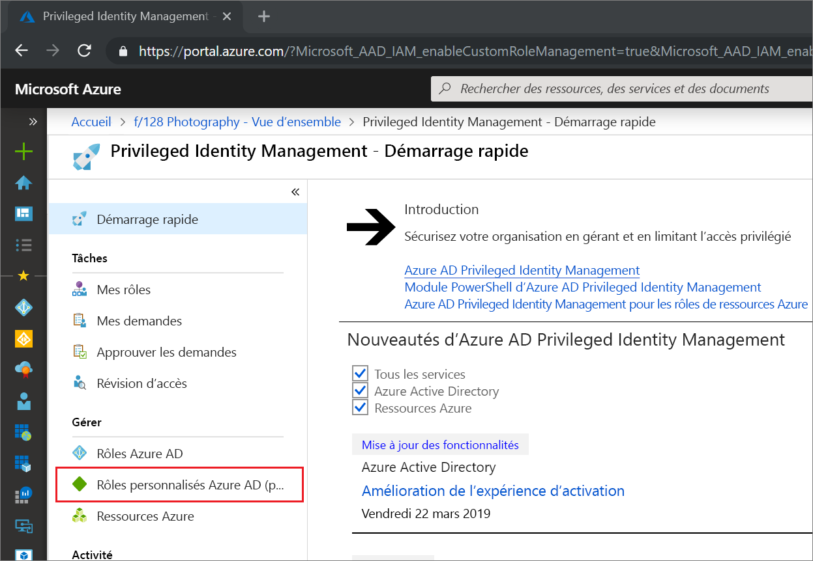
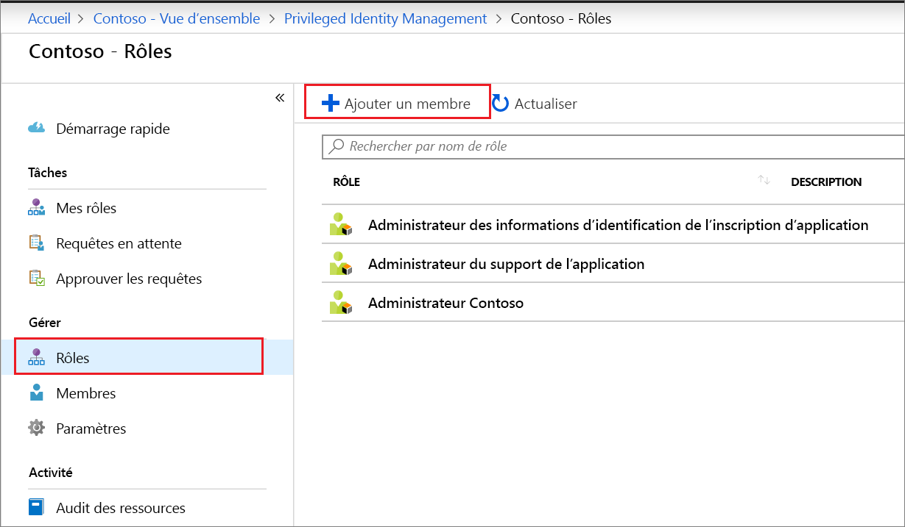
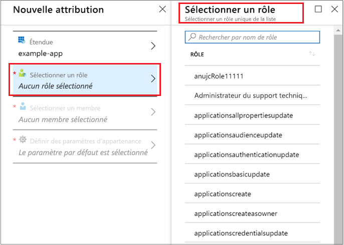
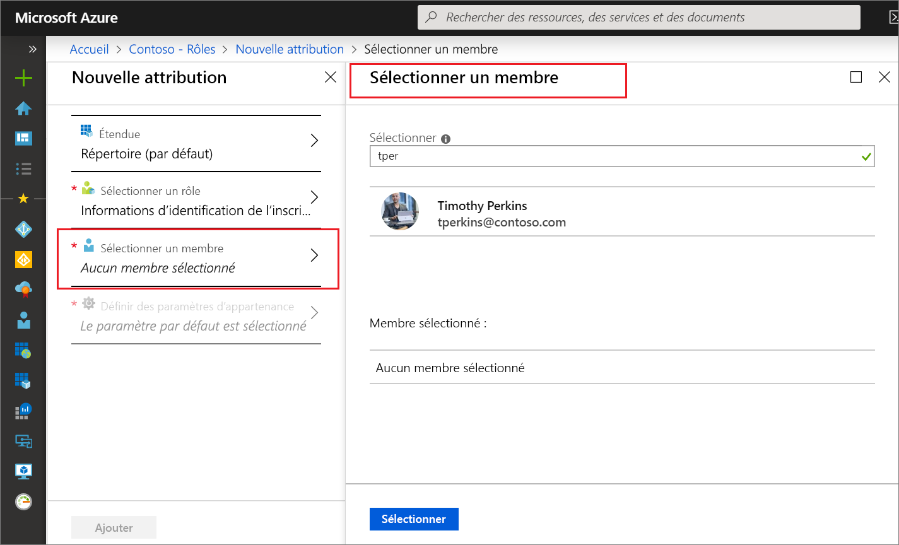
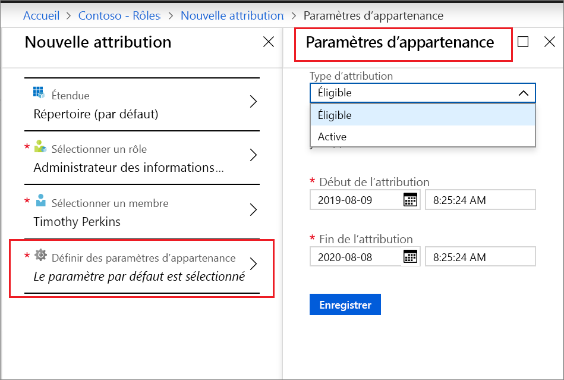
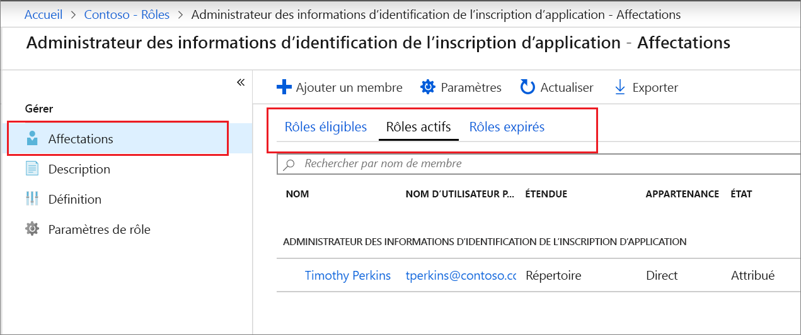

# Attribuer un rôle personnalisé Azure AD dans Privileged Identity Management

Cet article vous explique comment utiliser Privileged Identity Management (PIM) pour créer une attribution juste-à-temps et limitée dans le temps aux rôles personnalisés créés pour la gestion des applications dans l’expérience d’administration Azure Active Directory (Azure AD).

- Pour plus d’informations sur la création de rôles personnalisés pour déléguer la gestion des applications dans Azure AD, consultez la section [Personnaliser les rôles Administrateur dans Azure Active Directory (préversion)](../users-groups-roles/roles-custom-overview.md).
- Si vous n’avez pas encore utilisé Privileged Identity Management, consultez la section [Commencer à utiliser Privileged Identity Management](pim-getting-started.md) pour en savoir plus.
- Pour plus d’informations sur la façon d’accorder l’accès à un autre administrateur pour la gestion de Privileged Identity Management, consultez [Accorder l’accès à d’autres administrateurs pour la gestion de Privileged Identity Management](pim-how-to-give-access-to-pim.md).

> [!NOTE]
> Les rôles personnalisés Azure AD ne sont pas intégrés aux rôles d’annuaire intégrés au cours de la préversion. Une fois la fonctionnalité mise à la disposition générale, la gestion des rôles se déroule dans l’expérience des rôles intégrés. Si vous voyez la bannière suivante, ces rôles doivent être gérés [dans l’expérience des rôles intégrés](pim-how-to-activate-role.md) et cet article ne s’applique pas :
>
> 

## Attribuer un rôle

Privileged Identity Management peut gérer les rôles personnalisés que vous pouvez créer dans la gestion des applications Azure Active Directory (Azure AD).  Les étapes suivantes permettent d’effectuer une attribution éligible à un rôle d’annuaire personnalisé.

1. Connectez-vous à [Privileged Identity Management](https://portal.azure.com/?Microsoft_AAD_IAM_enableCustomRoleManagement=true&Microsoft_AAD_IAM_enableCustomRoleAssignment=true&feature.rbacv2roles=true&feature.rbacv2=true&Microsoft_AAD_RegisteredApps=demo#blade/Microsoft_Azure_PIMCommon/CommonMenuBlade/quickStart) dans le portail Azure en utilisant un compte d’utilisateur qui est affecté au rôle Administrateur de rôle privilégié.
1. Sélectionnez **Rôles personnalisés Azure AD (préversion)** .

    

1. Sélectionnez **Rôles** pour afficher la liste des rôles personnalisés pour les applications Azure AD.

    

1. Sélectionnez **Ajouter un membre** pour ouvrir la page d’attribution.
1. Pour limiter la portée de l’attribution de rôle à une seule application, sélectionnez **Portée** pour spécifier la portée de l’application.

    

1. Sélectionnez **Sélectionner un rôle** pour ouvrir la liste **Sélectionner un rôle**.

    

1. Sélectionnez un rôle que vous souhaitez attribuer et cliquez sur **Sélectionner**. La liste **Sélectionner un membre** s’ouvre.

    

1. Sélectionnez un utilisateur que vous souhaitez attribuer au rôle, puis cliquez sur **Sélectionner**. La liste **Paramètres d'appartenance** s’ouvre.

    

1. Sur la page **Paramètres d'appartenance**, sélectionnez **Éligible** ou **Actif** :

    - Les attributions **éligibles** exigent de l’utilisateur attribué au rôle qu’il effectue une action avant de pouvoir le rôle. Il peut s’agir de procéder à une vérification de l’authentification multifacteur, de fournir une justification professionnelle ou de demander une approbation aux approbateurs désignés.
    - Les attributions **actives** n’exigent pas de l’utilisateur attribué qu’il effectue une action pour utiliser le rôle. Les utilisateurs actifs détiennent à tout moment les privilèges affectés au rôle.

1. Si la case à cocher **Permanent** est affichée et disponible (en fonction des paramètres de rôle), vous pouvez spécifier si l’attribution est permanente. Activez la case à cocher pour que l’attribution soit éligible ou attribuée de façon permanente. Désactivez la case à cocher pour spécifier une durée d’attribution.
1. Pour créer l’attribution de rôle, cliquez sur **Enregistrer**, puis sur **Ajouter**. Une notification de l’état du processus d’attribution s’affiche.

Pour vérifier l’attribution de rôle, dans un rôle ouvert, sélectionnez **Attributions** > **Attribuer**, puis vérifiez que votre attribution de rôle est correctement identifiée en tant que éligible ou active.

 

## Étapes suivantes

- [Activer un rôle personnalisé Azure AD](azure-ad-custom-roles-assign.md)
- [Supprimer ou mettre à jour une attribution de rôle personnalisé Azure AD](azure-ad-custom-roles-update-remove.md)
- [Configurer une attribution de rôle Azure AD personnalisée](azure-ad-custom-roles-configure.md)
- [Définitions de rôles dans Azure AD](../users-groups-roles/directory-assign-admin-roles.md)
