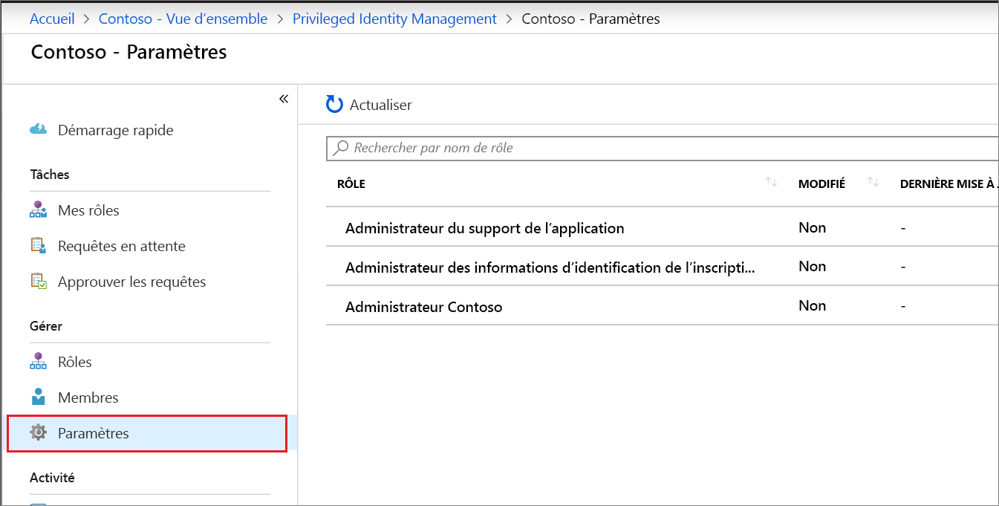
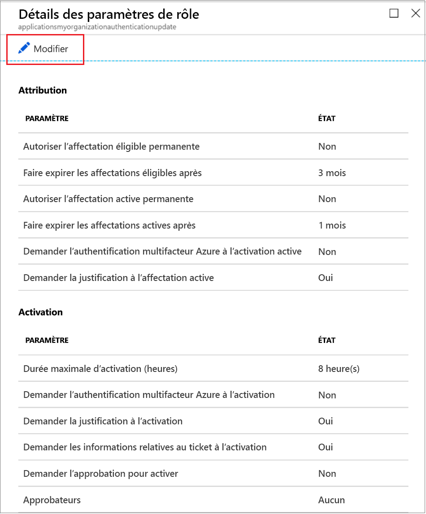
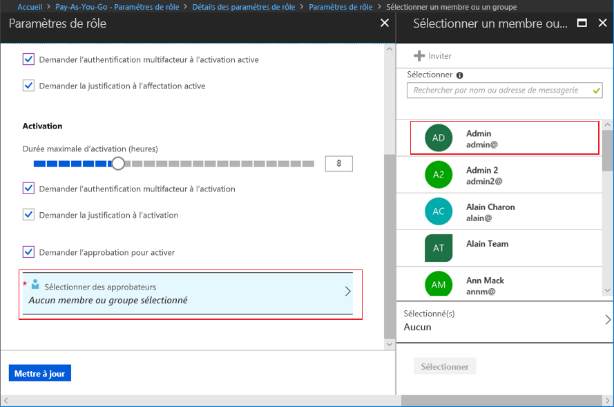

# Configurer les rôles personnalisés Azure AD dans Privileged Identity Management

Un administrateur de rôle privilégié peut modifier les paramètres de rôle qui s’appliquent à un utilisateur lorsqu’il active son attribution à un rôle personnalisé et à d’autres administrateurs d’applications qui attribuent des rôles personnalisés.

## Ouvrir les paramètres des rôles

Suivez ces étapes pour ouvrir les paramètres pour un rôle Azure AD.

1. Connectez-vous à [Privileged Identity Management](https://portal.azure.com/?Microsoft_AAD_IAM_enableCustomRoleManagement=true&Microsoft_AAD_IAM_enableCustomRoleAssignment=true&feature.rbacv2roles=true&feature.rbacv2=true&Microsoft_AAD_RegisteredApps=demo#blade/Microsoft_Azure_PIMCommon/CommonMenuBlade/quickStart) dans le portail Azure avec un compte d’utilisateur affecté au rôle Administrateur de rôle privilégié.
1. Sélectionnez **Rôles personnalisés Azure AD (préversion)** .

    

1. Sélectionnez **Paramètre** pour ouvrir la page **Paramètres**. Sélectionnez le rôle des paramètres que vous souhaitez configurer.
1. Sélectionnez **Modifier** pour ouvrir la page **Paramètres de rôle**.

    

## Paramètres de rôle

Vous pouvez configurer plusieurs paramètres.

### Durée de l’attribution

Vous pouvez choisir entre deux options de durée d’attribution pour chaque type d’attribution (éligible ou actif) lorsque vous configurez les paramètres d’un rôle. Ces options deviennent la durée maximale par défaut lorsqu’un membre est attribué au rôle dans Privileged Identity Management.

Vous pouvez choisir l’une de ces options de durée d’attribution *éligible* :

- **Autoriser une attribution éligible permanente** : Les administrateurs peuvent attribuer une appartenance éligible permanente.
- **Faire expirer les attributions éligibles après** : Les administrateurs peuvent exiger que toutes les attributions éligibles aient une date de début et une date de fin spécifiées.

Vous pouvez également choisir l’une de ces options de durée d’attribution *active* :

- **Autoriser une attribution active permanente** : Les administrateurs peuvent attribuer une appartenance active permanente.
- **Faire expirer les attributions actives après** : Les administrateurs peuvent exiger que toutes les attributions actives aient une date de début et une date de fin spécifiées.

### Exiger l’utilisation de Microsoft Azure Multi-Factor Authentication

Privileged Identity Management permet également l’application facultative d’Azure Multi-Factor Authentication dans deux scénarios distincts.

- **Demander l'authentification multifacteur lors de l'attribution active**

  Si vous souhaitez attribuer un rôle à un membre pour une courte durée uniquement (une journée par exemple), le processus peut être trop lent pour exiger que les membres attribués ne demandent une activation. Dans ce scénario, Privileged Identity Management ne peut pas appliquer l’authentification multifacteur lorsque l’utilisateur active son attribution de rôle, car il est déjà actif dans le rôle depuis son attribution. Pour garantir que l’administrateur qui réalise l’attribution est bien celui qu’il prétend être, sélectionnez la case **Demander l'authentification multifacteur lors de l'attribution active**.

- **Exiger l'authentification multifacteur lors de l'activation**

  Vous pouvez exiger des utilisateurs éligibles à un rôle qu’ils s’inscrivent à Azure Multi-Factor Authentication pour pouvoir s’activer. Ce processus garantit, avec une certitude raisonnable, que l’utilisateur demandant l’activation est bien celui qu’il prétend être. L’application de cette option permet de protéger les rôles critiques au cas où le compte d’utilisateur pourrait être compromis. Pour exiger d’un membre éligible qu’il exécute Azure Multi-Factor Authentication avant l’activation, cochez la case **Exiger l’authentification multifacteur lors de l’activation**.

Pour plus d’informations, consultez [Authentification multifacteur et Privileged Identity Management](pim-how-to-require-mfa.md).

### Durée maximum d'activation

Utilisez le curseur **Durée maximum d'activation** pour définir la durée maximale, en heures, pendant laquelle un rôle reste actif avant d’expirer. Cette valeur peut être comprise entre 1 et 24 heures.

### Demander une justification

Vous pouvez exiger des membres qu’ils entrent une justification lors de l’attribution active ou quand ils effectuent l’activation. Pour demander une justification, cochez la case **Demander une justification lors de l'affectation active** ou la case **Demander une justification lors de l’activation**.

### Demander une approbation pour activation

Si vous souhaitez exiger une approbation pour activer un rôle, procédez comme suit.

1. Cochez la case **Exiger une approbation pour activer**.
1. Sélectionnez **Sélectionner des approbateurs** pour ouvrir la liste **Sélectionner un membre ou un groupe**.

    

1. Sélectionnez au moins un membre ou un groupe, puis cliquez sur **Sélectionner**. Vous devez sélectionner au moins un approbateur. Il n’existe aucun approbateur par défaut. Vos sélections figurent dans la liste des approbateurs sélectionnés.
1. Une fois que vous avez spécifié les paramètres de rôle, sélectionnez **Mettre à jour** pour enregistrer vos modifications.

## Étapes suivantes

- [Activer un rôle personnalisé Azure AD](azure-ad-custom-roles-assign.md)
- [Attribuer un rôle personnalisé Azure AD](azure-ad-custom-roles-assign.md)
- [Supprimer ou mettre à jour une attribution de rôle personnalisée Azure AD](azure-ad-custom-roles-update-remove.md)
- [Définitions de rôles dans Azure AD](../users-groups-roles/directory-assign-admin-roles.md)
