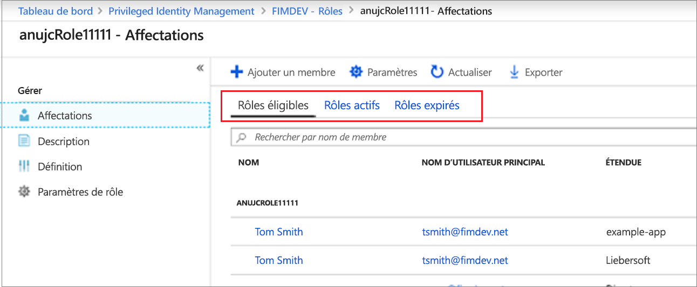
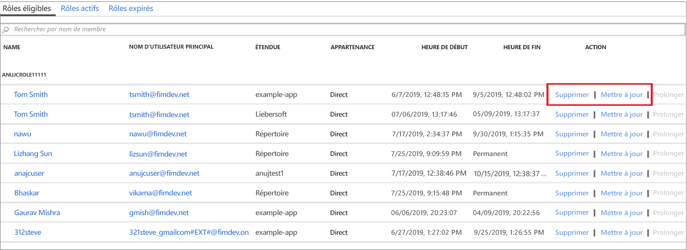

# Mettre à jour ou supprimer un rôle personnalisé Azure AD attribué dans Privileged Identity Management

Cet article vous explique comment utiliser Privileged Identity Management (PIM) pour mettre à jour ou supprimer l’attribution juste-à-temps et limitée dans le temps aux rôles personnalisés créés pour la gestion des applications dans l’expérience d’administration Azure Active Directory (Azure AD). 

- Pour plus d’informations sur la création de rôles personnalisés pour déléguer la gestion des applications dans Azure AD, consultez la section [Personnaliser les rôles Administrateur dans Azure Active Directory (préversion)](../users-groups-roles/roles-custom-overview.md). 
- Si vous n’avez pas encore utilisé Privileged Identity Management, consultez la section [Commencer à utiliser Privileged Identity Management](pim-getting-started.md) pour en savoir plus.

> [!NOTE]
> Les rôles personnalisés Azure AD ne sont pas intégrés aux rôles d’annuaire intégrés au cours de la préversion. Une fois la fonctionnalité mise à la disposition générale, la gestion des rôles se déroule dans l’expérience des rôles intégrés.

## Mettre à jour ou supprimer une attribution

Suivez ces étapes pour mettre à jour ou supprimer une attribution de rôle personnalisée existante.

1. Connectez-vous à [Privileged Identity Management](https://portal.azure.com/?Microsoft_AAD_IAM_enableCustomRoleManagement=true&Microsoft_AAD_IAM_enableCustomRoleAssignment=true&feature.rbacv2roles=true&feature.rbacv2=true&Microsoft_AAD_RegisteredApps=demo#blade/Microsoft_Azure_PIMCommon/CommonMenuBlade/quickStart) dans le portail Azure avec un compte d’utilisateur affecté au rôle Administrateur de rôle privilégié.
1. Sélectionnez **Rôles personnalisés Azure AD (préversion)** .

    

1. Sélectionnez **Rôles** pour afficher la liste des **Attributions** de rôles personnalisés pour les applications Azure AD.

    

1. Sélectionnez le rôle que vous souhaitez mettre à jour ou supprimer.
1. Recherchez l’attribution de rôle sous les onglets **Rôles éligibles** et **Rôles actifs**.
1. Sélectionnez **Mettre à jour** ou **Supprimer** pour mettre à jour ou supprimer l’attribution de rôle.

    

## Étapes suivantes

- [Activer un rôle personnalisé Azure AD](azure-ad-custom-roles-assign.md)
- [Attribuer un rôle personnalisé Azure AD](azure-ad-custom-roles-assign.md)
- [Configurer une attribution de rôle Azure AD personnalisée](azure-ad-custom-roles-configure.md)
