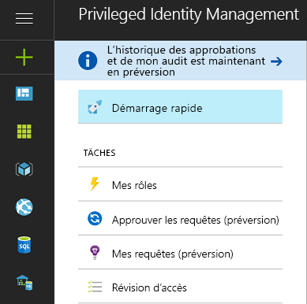
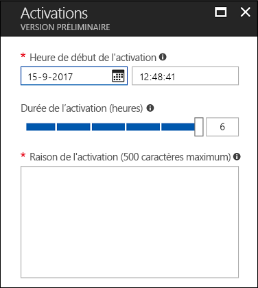
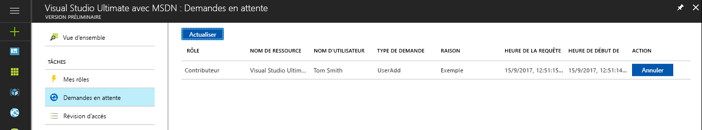
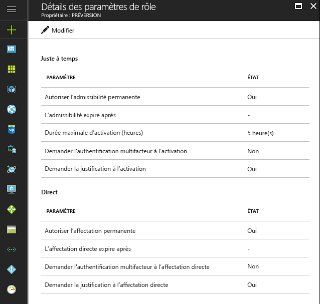

# Qu’est-ce qu’Azure AD Privileged Identity Management ?

Avec Azure Active Directory (Azure AD) Privileged Identity Management, vous pouvez gérer, contrôler et superviser les accès au sein de votre organisation. Cela inclut l’accès aux ressources dans Azure AD, aux ressources Azure et à d’autres services Microsoft Online Services, comme Office 365 ou Microsoft Intune.

> [!NOTE]
> Lorsque vous activez Privileged Identity Management pour votre locataire, vous devez disposer d’une licence payante ou d’essai valide Azure AD Premium P2 ou Enterprise Mobility + Security E5 pour chaque utilisateur qui interagit avec ce service ou en bénéficie. Voici des exemples avec des utilisateurs/utilisateurs d’un groupe :
>
>- Affectés au rôle Administrateur de rôle privilégié 
>- Désignés comme étant éligibles pour d’autres rôles d’annuaire pouvant être gérés via PIM 
>- En mesure d’approuver et de refuser des requêtes dans PIM 
>- Affectés à un rôle de ressource Azure avec des attributions juste-à-temps ou directes (à durée définie)  
>- Affectés à une révision d’accès
>
>Pour plus d’informations, consultez la page [Éditions d’Azure Active Directory](../fundamentals/active-directory-whatis.md).

Il est souhaitable pour les organisations de limiter le nombre de personnes qui ont accès aux informations ou aux ressources sécurisées afin de réduire le risque qu’un utilisateur malveillant accède à ces données ou qu’une ressource sensible soit accidentellement affectée par un utilisateur autorisé.  Cependant, les utilisateurs doivent pouvoir continuer à effectuer des opérations privilégiées dans les applications Azure AD, Azure, Office 365 ou SaaS. Les organisations peuvent donner aux utilisateurs un accès privilégié aux ressources Azure, telles que les abonnements, et à Azure AD. Elles doivent alors pouvoir surveiller ce que ces utilisateurs font avec leurs privilèges administratifs. Azure AD Privileged Identity Management permet de réduire le risque d’utilisation excessive, injustifiée ou malveillante des droits d’accès.

Grâce à Azure AD Privileged Identity Management, votre organisation peut :

- Voir quels utilisateurs disposent de rôles privilégiés pour gérer les ressources Azure et quels utilisateurs disposent de rôles d’administrateur dans Azure AD
- Activer à la demande un accès administratif « juste-à-temps » aux services Microsoft Online Services, comme Office 365 et Intune, et aux ressources Azure des abonnements, groupes de ressources et ressources individuelles, telles que des machines virtuelles 
- Consulter un historique de l’activation d’administrateurs, notamment les modifications apportées par les administrateurs aux ressources Azure
- Recevoir des alertes sur les modifications apportées aux affectations des administrateurs
- Exiger une approbation pour activer les rôles d’administrateur privilégiés Azure AD
- Vérifier l’appartenance aux rôles d’administrateur et demander aux utilisateurs de fournir une justification pour que l’appartenance à leur rôle soit maintenue

Dans Azure AD, Azure AD Privileged Identity Management peut gérer les utilisateurs affectés aux rôles organisationnels intégrés dans Azure AD, tels que celui d’administrateur général. Dans Azure, Azure AD Privileged Identity Management peut gérer les utilisateurs et les groupes affectés via les rôles RBAC Azure, y compris ceux de propriétaire et de contributeur.

## Administrateur des accès immédiats

Jusqu’ici, vous pouviez affecter un utilisateur à un rôle d’administrateur via le portail Azure, les autres portails Microsoft Online Services ou les cmdlets Azure AD dans Windows PowerShell. Cet utilisateur devient ainsi un **administrateur permanent**, toujours actif dans le rôle qui lui a été affecté. Azure AD Privileged Identity Management introduit le concept d **’administrateur éligible**. Les administrateurs éligibles doivent être des utilisateurs qui ont besoin d’un accès privilégié de temps à autre, et non pas en permanence. Ce rôle reste inactif jusqu’à ce l’utilisateur ait besoin d’un tel accès ; dans ce cas, il complète un processus d’activation et devient administrateur actif pour une durée prédéterminée. De plus en plus d’organisations choisissent d’utiliser cette approche pour limiter ou éliminer l’« accès administrateur permanent » aux rôles privilégiés.

## Terminologie

*Utilisateur de rôle éligible* : un utilisateur de rôle éligible est un utilisateur au sein de votre organisation affecté à un rôle Azure AD comme éligible (le rôle requiert une activation).

*Approbateur délégué* : un approbateur délégué est une ou plusieurs personnes ou groupes au sein de votre Azure AD responsables de l’approbation des demandes d’activation de rôles.

## Scénarios

Privileged Identity Management prend en charge les scénarios suivants :

**En tant qu’Administrateur de rôle privilégié, vous pouvez :**

- Activer l’approbation pour des rôles spécifiques
- Spécifier les utilisateurs et/ou groupes approbateurs pour approuver des demandes
- Afficher l’historique des demandes et approbations pour tous les rôles privilégiés

**En tant d’approbateur désigné, vous pouvez :**

- Afficher les approbations (demandes) en attente
- Approuver ou rejeter des demandes d’élévation de rôle (unique et/ou en bloc)
- Justifier mon approbation/rejet 

**En tant qu’un utilisateur de rôle éligible, vous pouvez :**

- Demander l’activation d’un rôle qui nécessite une approbation
- Afficher l’état de votre demande d’activation
- Exécuter la tâche dans Azure AD si l’activation a été approuvée

## Qui peut faire quoi dans PIM ?

Si vous êtes la première personne à utiliser PIM, les rôles [Administrateur de sécurité](../users-groups-roles/directory-assign-admin-roles.md#security-administrator) et [Administrateur de rôle privilégié](../users-groups-roles/directory-assign-admin-roles.md#privileged-role-administrator) vous sont automatiquement attribués pour cet annuaire.

Pour les rôles Azure AD, seul un utilisateur qui possède le rôle d’administrateur de rôle privilégié peut gérer les affectations des autres administrateurs dans PIM. Vous pouvez [accorder l’accès à d’autres administrateurs pour la gestion de PIM](pim-how-to-give-access-to-pim.md). Les administrateurs généraux, les administrateurs de la sécurité et les lecteurs Sécurité peuvent consulter les affectations aux rôles Azure AD dans PIM.

Pour les rôles de ressources Azure, seul un administrateur d’abonnement, un propriétaire de ressource ou un administrateur de l’accès utilisateur aux ressources peut gérer les affectations des autres administrateurs dans PIM. Par défaut, les utilisateurs qui possèdent un rôle d’administrateur de rôle privilégié, d’administrateur de la sécurité ou de lecteur Sécurité ne peuvent pas consulter les affectations aux rôles de ressources Azure dans PIM.

## Vue d’ensemble de Privileged Identity Management (point d’entrée)

Azure AD Privileged Identity Management prend en charge l’administration des rôles d’annuaire Azure AD et des rôles de ressources Azure. Le fonctionnement des rôles pour les ressources Azure diffère de celui des rôles d’administrateur dans Azure AD. Les rôles de ressources Azure fournissent des autorisations granulaires pour la ressource à laquelle ils sont affectés, ainsi que pour toutes les ressources subordonnées dans la hiérarchie des ressources (selon un principe appelé héritage). Vous trouverez plus d’informations sur RBAC, la hiérarchie des ressources et l’héritage [ici](../../role-based-access-control/role-assignments-portal.md). Pour les rôles d’annuaire Azure AD et les ressources Azure, PIM peut être géré en accédant au lien approprié sous la section Gérer du menu de navigation gauche du point d’entrée Vue d’ensemble de PIM.

PIM permet d’activer des rôles et d’afficher les demandes/activations en attente, les approbations en attente (pour les rôles d’annuaire Azure AD), ainsi que les révisions attendant une réponse de votre part en toute simplicité à partir de la section Tâches du menu de navigation gauche.

Lorsque vous accédez à l’un des éléments du menu Tâches à partir du point d’entrée Vue d’ensemble, la vue correspondante contient à la fois les résultats pour les rôles d’annuaire Azure AD et les rôles de ressources Azure.

La section Mes rôles contient une liste d’affectations de rôles actifs et éligibles pour les rôles d’annuaire Azure AD et les rôles de ressources Azure. Vous trouverez plus d’informations sur l’activation des affectations de rôles éligibles [ici](pim-how-to-activate-role.md).

L’activation de rôles pour les ressources Azure introduit une nouvelle expérience permettant aux membres éligibles d’un rôle de planifier une activation à une date/heure future et de sélectionner une durée d’activation spécifique dans la limite autorisée par les administrateurs.

Si une activation planifiée n’est plus nécessaire, les utilisateurs peuvent annuler leur demande en accédant aux demandes en attente dans le menu de navigation gauche, puis en cliquant sur le bouton Annuler en regard de la demande correspondante.

## Tableau de bord d’administration de Privileged Identity Management

Azure AD Privileged Identity Manager fournit un tableau de bord d’administration qui contient des informations importantes telles que :

* Alertes indiquant des possibilités d’amélioration de la sécurité
* Le nombre d'utilisateurs affectés à chaque rôle privilégié  
* Le nombre d’administrateurs éligibles et permanents
* Un graphique des activations de rôle privilégié dans votre annuaire
* Le nombre d’affectations juste-à-temps, limitées dans le temps et permanentes pour les rôles de ressources Azure
* Les utilisateurs et les groupes auxquels de nouveaux rôles ont été affectés au cours des 30 derniers jours (rôles de ressources Azure)

## Gestion des rôles privilégiés

Avec Azure AD Privileged Identity Management, vous pouvez gérer les administrateurs en ajoutant ou en supprimant des administrateurs permanents ou éligibles pour chaque rôle d’annuaire Azure AD. Avec PIM pour les ressources Azure, les propriétaires, les administrateurs de l’accès utilisateur et les administrateurs généraux qui activent la gestion des abonnements dans leur locataire peuvent affecter des utilisateurs ou des groupes aux rôles de ressources Azure en leur octroyant un accès juste-à-temps (rôle éligible), limité dans le temps (activation non nécessaire) avec une date/heure de début et de fin ou permanent (si cette option est activée dans les paramètres de rôle).

## Configurer les paramètres d’activation de rôle

À l’aide des [paramètres de rôle](pim-how-to-change-default-settings.md), vous pouvez configurer les propriétés d’activation de rôle éligible pour les rôles d’annuaire Azure AD, notamment :

* La durée de la période d’activation d’un rôle
* La notification d'activation d’un rôle
* Les informations qu'un utilisateur doit fournir au cours du processus d'activation du rôle
* Un numéro d’incident ou ticket de service
* [Exigences relatives au flux de travail d’approbation](./azure-ad-pim-approval-workflow.md)

Notez que dans l’image, les boutons de **l’authentification multifacteur** sont désactivés. Avec certains rôles dotés de privilèges élevés, l’authentification multifacteur est requise pour garantir une protection renforcée.

Les paramètres de rôle pour les rôles de ressources Azure permettent aux administrateurs de configurer les paramètres d’affectation juste-à-temps et directe, notamment :

- La possibilité d’affecter des utilisateurs ou des groupes à des rôles sans date/heure de fin (affectation permanente)
- La durée par défaut d’une affectation (lorsqu’elle n’est pas permanente)
- La durée d’activation maximale (lorsqu’un membre active un rôle éligible)
- Les informations qu’un utilisateur doit fournir lors de l’activation du rôle (affectations juste-à-temps) ou du processus d’affectation (affectations directes)

## Activation d’un rôle

Pour [activer un rôle](pim-how-to-activate-role.md), un administrateur éligible demande une « activation » limitée dans le temps concernant ce rôle. L'activation peut être demandée à l'aide de l’option **Activate my role** dans Azure AD Privileged Identity Management.

Un administrateur qui souhaite activer un rôle doit initialiser Azure AD Privileged Identity Management sur le portail Azure.

L’activation de rôles est personnalisable. Dans les paramètres de PIM, vous pouvez définir la durée de l’activation, ainsi que les informations que l’administrateur doit fournir pour activer le rôle.

## Passer en revue les activités de rôle

Il existe deux méthodes pour suivre la façon dont vos employés et les administrateurs utilisent les rôles privilégiés. La première option consiste à utiliser l’[historique d’audit des rôles d’annuaire](pim-how-to-use-audit-log.md). L’historique d’audit consigne le suivi des modifications des affectations de rôles privilégiés, l’historique de l’activation de rôles, ainsi que les modifications apportées aux paramètres pour les rôles de ressources Azure. 

La deuxième option consiste à configurer des [révisions d’accès](pim-how-to-start-security-review.md)régulières. Ces révisions d’accès peuvent être effectuées par un réviseur affecté (par exemple, un gestionnaire d’équipe) ou par les employés eux-mêmes. C’est la méthode la plus adaptée pour déterminer les utilisateurs qui nécessitent l’accès et ceux qui n’en ont plus besoin.

## Azure AD PIM à l’expiration de l’abonnement

Votre organisation doit disposer d’un abonnement Azure AD Premium P2 (ou EMS E5) d’évaluation ou payant dans son client pour pouvoir utiliser Azure AD PIM.  En outre, les licences doivent être affectées aux administrateurs du client.  Plus précisément, les licences doivent être affectées aux administrateurs dans les rôles Azure AD gérés via Azure AD PIM, aux administrateurs dans les rôles RBAC Azure gérés via Azure AD PIM et à tous les utilisateurs non administrateurs qui effectuent des révisions d’accès.
Si votre organisation ne renouvelle pas son abonnement Azure AD Premium P2 ou si votre période d’évaluation expire, les fonctionnalités d’Azure AD PIM ne seront plus disponibles dans votre client, les affectations de rôles éligibles seront supprimées et les utilisateurs ne pourront plus activer de rôles. Vous trouverez plus d’informations à ce sujet dans les [spécifications de l’abonnement à Azure AD PIM](./subscription-requirements.md).

## Étapes suivantes

- [Commencer à utiliser PIM](pim-getting-started.md)
- [Exigences en matière d’abonnement pour utiliser PIM](subscription-requirements.md)
- [Sécurisation de l’accès privilégié pour les déploiements hybrides et cloud dans Azure AD](../users-groups-roles/directory-admin-roles-secure.md?toc=%2fazure%2factive-directory%2fprivileged-identity-management%2ftoc.json)
