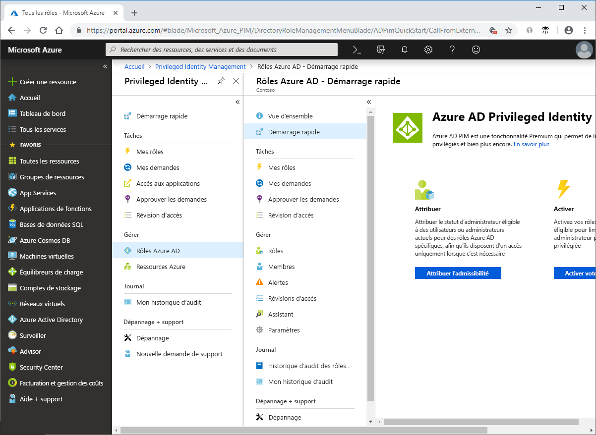

# Qu’est-ce qu’Azure AD Privileged Identity Management ?

Azure Active Directory (Azure AD) Privileged Identity Management (PIM) est un service qui vous permet de gérer, de contrôler et de superviser l’accès aux ressources importantes de votre organisation. Cela inclut l’accès aux ressources dans Azure AD, aux ressources Azure et à d’autres services Microsoft Online Services, comme Office 365 ou Microsoft Intune.

## Pourquoi utiliser PIM?

Les organisations doivent limiter le nombre de personnes qui ont accès aux informations et aux ressources sécurisées, afin de réduire le risque qu’un acteur malveillant accède à ces données, ou qu’une ressource sensible soit accidentellement impactée par un utilisateur autorisé. Cependant, les utilisateurs doivent pouvoir continuer à effectuer des opérations privilégiées dans les applications Azure AD, Azure, Office 365 ou SaaS. Les organisations peuvent donner aux utilisateurs un accès privilégié juste-à-temps (JIT) aux ressources Azure et à Azure AD. Elles doivent alors pouvoir surveiller ce que ces utilisateurs font avec leurs privilèges d’administrateur. PIM permet de réduire le risque d’utilisation excessive, injustifiée ou malveillante des droits d’accès.

## À quoi sert PIM ?

PIM vous permet de gérer qui a accès aux ressources importantes, à quel moment, à quel endroit et pour quel motif. Voici certaines des fonctionnalités essentielles de PIM :

- Fournir un accès privilégié **juste-à-temps** à Azure AD et aux ressources Azure
- Affecter un accès aux ressources **limité dans le temps** à l’aide de dates de début et de fin
- Exiger une **approbation** pour activer les rôles privilégiés
- Appliquer l’**authentification multifacteur** pour l’activation des rôles
- Utiliser la **justification** pour comprendre le motif d’activation des utilisateurs
- Recevoir des **notifications** lors de l’activation de rôles privilégiés
- Effectuer des **révisions d’accès** pour vérifier que les utilisateurs ont toujours besoin de leurs rôles
- Télécharger l’**historique des audits** (internes ou externes)

## Terminologie

Pour mieux comprendre PIM et sa documentation, vous devez connaître les termes suivants.

| Terme ou concept | Catégorie d’attribution de rôle | Description |
| --- | --- | --- |
| Éligible | Type | Attribution de rôle qui oblige l’utilisateur à effectuer une ou plusieurs actions pour utiliser ce rôle. Lorsqu’un utilisateur devient éligible pour un rôle, il peut l’activer pour réaliser des tâches privilégiées. Il n’existe aucune différence entre un accès accordé de façon permanente à un utilisateur et l’affectation d’un rôle éligible. La seule différence réside dans le fait que certaines personnes n’ont pas besoin d’un accès permanent. |
| active | Type | Attribution de rôle qui n’exige aucune action de la part de l’utilisateur pour être utilisée. Les utilisateurs actifs disposent des privilèges affectés au rôle. |
| Activer |  | Processus dans lequel une ou plusieurs actions sont exécutées dans le but d’utiliser un rôle pour lequel un utilisateur est éligible. Il peut s’agir de procéder à une vérification de l’authentification multifacteur (MFA), de fournir une justification professionnelle ou de demander une approbation aux approbateurs désignés. |
| Affecté | État | Utilisateur qui dispose d’une attribution de rôle active. |
| Activé | État | Utilisateur qui dispose d’une attribution de rôle éligible, qui a effectué les actions nécessaires à l’activation du rôle et qui est maintenant actif.  Une fois le rôle activé, l’utilisateur peut s’en servir durant une période prédéfinie avant d’être obligé de l’activer à nouveau. |
| Éligibilité permanente | Duration | Attribution de rôle qui permet à un utilisateur d’être toujours éligible à l’activation du rôle. |
| Active en permanence | Duration | Attribution de rôle qui permet à un utilisateur de toujours utiliser un rôle sans effectuer aucune action. |
| Éligibilité avec expiration | Duration | Attribution de rôle qui permet à un utilisateur d’être éligible à l’activation d’un rôle pendant une période spécifiée. |
| Active avec expiration | Duration | Attribution de rôle qui permet à un utilisateur d’utiliser un rôle sans effectuer aucune action pendant une période spécifiée. |
| Accès juste-à-temps (JIT) |  | Modèle où les utilisateurs reçoivent des autorisations temporaires pour effectuer des tâches privilégiées. De cette façon, les utilisateurs malveillants ou non autorisés ne peuvent pas accéder aux ressources une fois que les autorisations ont expiré. L’accès est accordé uniquement au moment où les utilisateurs en ont besoin. |
| Principe des privilèges d’accès minimum |  | Pratique de sécurité recommandée qui consiste à accorder à chaque utilisateur les privilèges minimum dont il a besoin pour accomplir les tâches qu’il est autorisé à effectuer. Cette pratique réduit le nombre d’administrateurs généraux et utilise à la place des rôles administrateur spécifiques pour certains scénarios. |

## À quoi ressemble PIM ?

Une fois que vous aurez configuré PIM, vous verrez les options **Tâches**, **Gérer** et **Activité** dans le menu de navigation de gauche. En tant qu’administrateur, vous allez choisir entre la gestion de **Rôles Azure AD** et celle de rôles de **Ressource Azure**. Les options disponibles sont similaires pour les deux types de rôles.

## Qui peut faire quoi dans PIM ?

Si vous êtes la première personne à utiliser PIM, les rôles [Administrateur de sécurité](../users-groups-roles/directory-assign-admin-roles.md#security-administrator) et [Administrateur de rôle privilégié](../users-groups-roles/directory-assign-admin-roles.md#privileged-role-administrator) vous sont automatiquement attribués pour cet annuaire.

Pour les rôles Azure AD, seul un utilisateur qui possède le rôle d’administrateur de rôle privilégié peut gérer les affectations des autres administrateurs dans PIM. Vous pouvez [accorder l’accès à d’autres administrateurs pour la gestion de PIM](pim-how-to-give-access-to-pim.md). Les administrateurs généraux, les administrateurs de la sécurité et les lecteurs Sécurité peuvent consulter les attributions de rôles Azure AD dans PIM.

Pour les rôles de ressources Azure, seul un administrateur d’abonnement, un propriétaire de ressource ou un administrateur de l’accès utilisateur aux ressources peut gérer les affectations des autres administrateurs dans PIM. Par défaut, les utilisateurs qui possèdent un rôle d’administrateur de rôle privilégié, d’administrateur de la sécurité ou de lecteur Sécurité ne peuvent pas consulter les affectations aux rôles de ressources Azure dans PIM.

## Scénarios

PIM prend en charge les scénarios suivants :

**En tant qu’Administrateur de rôle privilégié, vous pouvez :**

- Activer l’approbation pour des rôles spécifiques
- Spécifier les utilisateurs et/ou groupes approbateurs pour approuver des demandes
- Afficher l’historique des demandes et approbations pour tous les rôles privilégiés

**En tant qu’approbateur, vous pouvez :**

- Afficher les approbations (demandes) en attente
- Approuver ou rejeter des demandes d’élévation de rôle (unique et/ou en bloc)
- Justifier mon approbation/rejet 

**En tant qu’utilisateur de rôle éligible, vous pouvez :**

- Demander l’activation d’un rôle qui nécessite une approbation
- Afficher l’état de votre demande d’activation
- Exécuter la tâche dans Azure AD si l’activation a été approuvée

## Conditions de licence :

[!INCLUDE [Azure AD Premium P2 license](../../../includes/active-directory-p2-license.md)]

Pour plus d’informations sur les licences utilisateur, consultez [Exigences relatives aux licences pour l’utilisation de PIM](subscription-requirements.md).

## Étapes suivantes

- [Exigences relatives aux licences pour l’utilisation de PIM](subscription-requirements.md)
- [Sécurisation de l’accès privilégié pour les déploiements hybrides et cloud dans Azure AD](../users-groups-roles/directory-admin-roles-secure.md?toc=%2fazure%2factive-directory%2fprivileged-identity-management%2ftoc.json)
- [Déployer PIM (Privileged Identity Management)](pim-deployment-plan.md)
