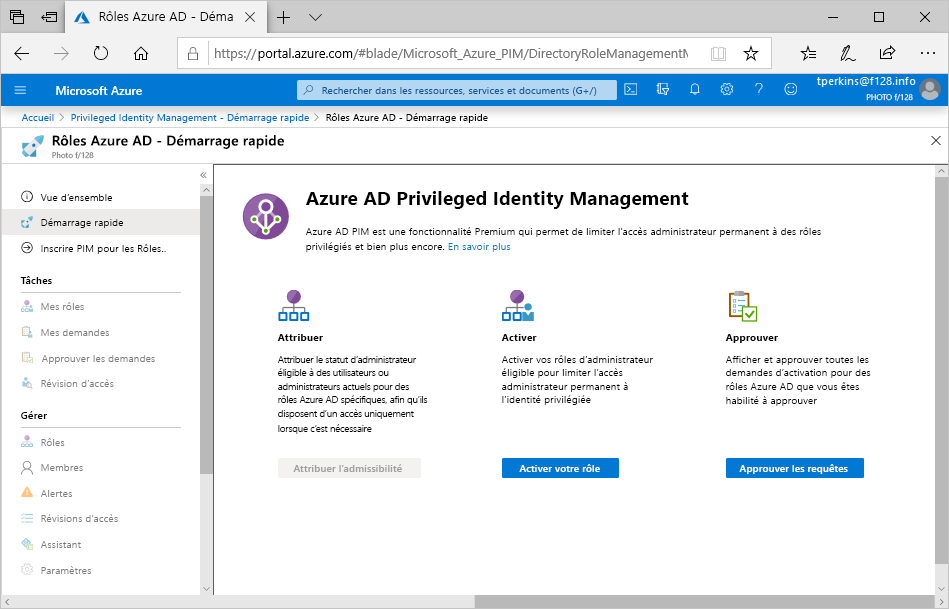

# Qu’est-ce qu’Azure AD Privileged Identity Management ?

 Privileged Identity Management (PIM) est un service dans Azure Active Directory (Azure AD) qui vous permet de gérer, de contrôler et de superviser l’accès aux ressources importantes de votre organisation. Ces ressources incluent des ressources dans Azure AD et Azure ainsi que d’autres services Microsoft Online Services tels que Microsoft 365 ou Microsoft Intune. La vidéo suivante présente les fonctionnalités et concepts importants d’Azure AD Privileged Identity Management (PIM).
  

> [!VIDEO https://www.youtube.com/embed/f-0K7mRUPpQ]

## Motifs d’utilisation

Les organisations doivent limiter le nombre de personnes qui ont accès aux informations et aux ressources sécurisées, afin de réduire le risque qu’un acteur malveillant accède à ces données, ou qu’une ressource sensible soit accidentellement impactée par un utilisateur autorisé. Cependant, les utilisateurs doivent pouvoir continuer à effectuer des opérations privilégiées dans les applications Azure AD, Azure, Microsoft 365 ou SaaS. Les organisations peuvent donner aux utilisateurs un accès privilégié juste-à-temps aux ressources Azure et à Azure AD. Elles doivent alors pouvoir surveiller ce que ces utilisateurs font avec leurs privilèges d’administrateur.

## Fonction

Privileged Identity Management assure une activation de rôle basée sur l’heure et l’approbation pour atténuer les risques d’autorisations d’accès excessives, injustifiées ou malveillantes sur les ressources qui vous intéressent. Voici quelques-unes des principales fonctionnalités de Privileged Identity Management :

- Fournir un accès privilégié **juste-à-temps** à Azure AD et aux ressources Azure
- Affecter un accès aux ressources **limité dans le temps** à l’aide de dates de début et de fin
- Exiger une **approbation** pour activer les rôles privilégiés
- Appliquer l’**authentification multifacteur** pour l’activation des rôles
- Utiliser la **justification** pour comprendre le motif d’activation des utilisateurs
- Recevoir des **notifications** lors de l’activation de rôles privilégiés
- Effectuer des **révisions d’accès** pour vérifier que les utilisateurs ont toujours besoin de leurs rôles
- Télécharger l’**historique des audits** (internes ou externes)

## À quoi sert PIM ?

Une fois que vous aurez configuré Privileged Identity Management, vous verrez les options **Tâches**, **Gérer** et **Activité** dans le menu de navigation de gauche. En tant qu’administrateur, vous avez le choix entre des options telles que la gestion des **rôles Azure AD**, la gestion des rôles de **ressources Azure** ou les groupes d’accès privilégié. Lorsque vous choisissez ce que vous souhaitez gérer, vous voyez l’ensemble d’options approprié correspondant à cette option.

## Qui peut faire quoi ?

Pour les rôles Azure AD dans Privileged Identity Management, seul un utilisateur qui détient le rôle Administrateur de rôle privilégié ou Administrateur général peut gérer les affectations des autres administrateurs. Vous pouvez [accorder l’accès à d’autres administrateurs pour la gestion de Privileged Identity Management](pim-how-to-give-access-to-pim.md). Les administrateurs généraux, les administrateurs de la sécurité, les lecteurs généraux et les lecteurs Sécurité peuvent aussi consulter les attributions de rôles Azure AD dans Privileged Identity Management.

Pour les rôles de ressources Azure dans Privileged Identity Management, seul un administrateur d’abonnement, un propriétaire de ressource ou un administrateur de l’accès utilisateur aux ressources peut gérer les affectations des autres administrateurs. Par défaut, les utilisateurs qui possèdent un rôle d’administrateur de rôle privilégié, d’administrateur de la sécurité ou de lecteur Sécurité ne peuvent pas consulter les attributions de rôles de ressources Azure dans Privileged Identity Management.

## Scénarios

Privileged Identity Management prend en charge les scénarios suivants :

### Autorisations d’administrateur de rôle privilégié

- Activer l’approbation pour des rôles spécifiques
- Spécifier les utilisateurs ou groupes approbateurs pour approuver des demandes
- Afficher l’historique des demandes et approbations pour tous les rôles privilégiés

### Autorisations d’approbateur

- Afficher les approbations (demandes) en attente
- Approuver ou rejeter des demandes d’élévation de rôle (unique et en bloc)
- Justifier mon approbation ou rejet

### Autorisations d’utilisateur de rôle éligible

- Demander l’activation d’un rôle qui nécessite une approbation
- Afficher l’état de votre demande d’activation
- Exécuter la tâche dans Azure AD si l’activation a été approuvée

## Terminologie

Pour mieux comprendre Privileged Identity Management et sa documentation, vous devez connaître les termes suivants.

| Terme ou concept | Catégorie d’attribution de rôle | Description |
| --- | --- | --- |
| Éligible | Type | Attribution de rôle qui oblige l’utilisateur à effectuer une ou plusieurs actions pour utiliser ce rôle. Lorsqu’un utilisateur devient éligible pour un rôle, il peut l’activer pour réaliser des tâches privilégiées. Il n’existe aucune différence entre un accès accordé de façon permanente à un utilisateur et l’affectation d’un rôle éligible. La seule différence réside dans le fait que certaines personnes n’ont pas besoin d’un accès permanent. |
| active | Type | Attribution de rôle qui n’exige aucune action de la part de l’utilisateur pour être utilisée. Les utilisateurs actifs disposent des privilèges affectés au rôle. |
| Activer |  | Processus dans lequel une ou plusieurs actions sont exécutées dans le but d’utiliser un rôle pour lequel un utilisateur est éligible. Il peut s’agir de procéder à une vérification de l’authentification multifacteur (MFA), de fournir une justification professionnelle ou de demander une approbation aux approbateurs désignés. |
| Affecté | State | Utilisateur qui dispose d’une attribution de rôle active. |
| Activé | State | Utilisateur qui dispose d’une attribution de rôle éligible, qui a effectué les actions nécessaires à l’activation du rôle et qui est maintenant actif.  Une fois le rôle activé, l’utilisateur peut s’en servir durant une période prédéfinie avant d’être obligé de l’activer à nouveau. |
| Éligibilité permanente | Duration | Attribution de rôle qui permet à un utilisateur d’être toujours éligible à l’activation du rôle. |
| Active en permanence | Duration | Attribution de rôle qui permet à un utilisateur de toujours utiliser un rôle sans effectuer aucune action. |
| éligible avec limitation dans le temps | Duration | Attribution de rôle qui permet à un utilisateur d’être éligible à l’activation d’un rôle uniquement pendant une période. |
| actif avec limitation dans le temps | Duration | Attribution de rôle qui permet à un utilisateur d’utiliser un rôle uniquement pendant une période. |
| Accès juste-à-temps (JIT) |  | Modèle où les utilisateurs reçoivent des autorisations temporaires pour effectuer des tâches privilégiées. De cette façon, les utilisateurs malveillants ou non autorisés ne peuvent pas accéder aux ressources une fois que les autorisations ont expiré. L’accès est accordé uniquement au moment où les utilisateurs en ont besoin. |
| Principe des privilèges d’accès minimum |  | Pratique de sécurité recommandée qui consiste à accorder à chaque utilisateur les privilèges minimum dont il a besoin pour accomplir les tâches qu’il est autorisé à effectuer. Cette pratique réduit le nombre d’administrateurs généraux et utilise à la place des rôles d’administrateur spécifiques pour certains scénarios. |

## Conditions de licence :

[!INCLUDE [Azure AD Premium P2 license](../../../includes/active-directory-p2-license.md)]

Pour plus d’informations sur les licences utilisateur, consultez [Exigences relatives aux licences pour l’utilisation de Privileged Identity Management](subscription-requirements.md).

## Étapes suivantes

- [Exigences relatives aux licences pour l’utilisation de Privileged Identity Management](subscription-requirements.md)
- [Sécurisation de l’accès privilégié pour les déploiements hybrides et cloud dans Azure AD](../roles/security-planning.md?toc=%2fazure%2factive-directory%2fprivileged-identity-management%2ftoc.json)
- [Déployer Privileged Identity Management](pim-deployment-plan.md)
