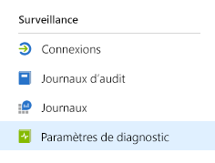
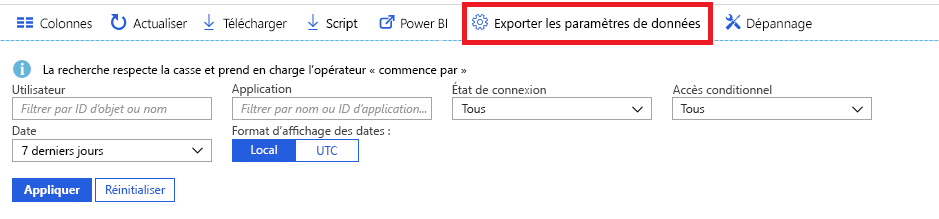

# En quoi consiste la surveillance d’Azure Active Directory ?

La supervision d’Azure Active Directory (Azure AD) vous permet désormais d’acheminer vos journaux d’activité Azure AD vers différents points de terminaison. Vous pouvez ensuite la conserver pour une utilisation à long terme ou l’intégrer à des outils SIEM (Security Information and Event Management) tiers pour obtenir davantage d’informations sur votre environnement.

Actuellement, vous pouvez acheminer les journaux d’activité vers :

- Un compte de stockage Azure.
- Un Azure Event Hub pour vous permettre d’intégrer vos instances Splunk et Sumologic.
- Espace de travail Azure Log Analytics, dans lequel vous pouvez analyser les données, créer un tableau de bord et signaler des événements spécifiques

**Rôle prérequis** : Administrateur général

> [!VIDEO https://www.youtube.com/embed/syT-9KNfug8]

[!INCLUDE [azure-monitor-log-analytics-rebrand](../../../includes/azure-monitor-log-analytics-rebrand.md)]

## Licences et prérequis pour les fonctionnalités de création de rapports et de supervision Azure AD

Vous avez besoin d’une licence Azure AD Premium pour accéder aux journaux de connexion Azure AD.

Pour obtenir des informations détaillées sur les fonctionnalités et les licences, consultez le [guide des tarifs Azure Active Directory](https://azure.microsoft.com/pricing/details/active-directory/).

Pour déployer les fonctionnalités de supervision et de création de rapports Azure AD, vous avez besoin d’un utilisateur qui dispose du rôle d’administrateur général ou d’administrateur de la sécurité sur le locataire Azure AD.

En fonction de la destination finale de vos données de journal, vous aurez besoin de l’un des éléments suivants :

* Un compte de stockage Azure doté des autorisations ListKeys. Nous vous recommandons d’utiliser un compte de stockage général et pas un compte de stockage blob. Pour plus d’informations sur la tarification du stockage, utilisez la [Calculatrice de prix pour le stockage Azure](https://azure.microsoft.com/pricing/calculator/?service=storage).

* Un espace de noms Azure Event Hubs pour intégrer avec des solutions SIEM tierces.

* Un espace de travail Azure Log Analytics pour l’envoi de journaux d’activité aux journaux d’activité Azure Monitor.

## Configuration des paramètres de diagnostic

Pour configurer les paramètres de supervision des journaux d’activité Azure AD, connectez-vous d’abord au [Portail Azure](https://portal.azure.com), puis sélectionnez **Azure Active Directory**. Vous pouvez ensuite accéder à la page de configuration des paramètres de diagnostic de deux façons :

* Sélectionnez **Paramètres de diagnostic** dans la section **Surveillance**.

    
    
* Sélectionnez **Journaux d’audit** ou **Connexions**, puis sélectionnez **Exporter les paramètres**. 

    

## Acheminer des journaux d’activité vers un compte de stockage

Si vous acheminez les journaux d’activité vers un compte de stockage Azure, vous pouvez les conserver pendant plus longtemps que la période de rétention par défaut décrite dans nos [stratégies de rétention](reference-reports-data-retention.md). Découvrez comment [acheminer les données vers votre compte de stockage](quickstart-azure-monitor-route-logs-to-storage-account.md).

## Transmettre en continu des journaux d’activité vers un Event Hub

L’acheminement des journaux d’activité vers un Azure Event Hub vous permet d’intégrer des outils SIEM tiers comme Sumologic et Splunk. Cette intégration vous permet d’associer les données du journal d’activité d’Azure AD à d’autres données gérées par votre SIEM pour offrir des insights plus fournis sur votre environnement. Découvrez comment [transmettre les journaux d’activité à un Event Hub](tutorial-azure-monitor-stream-logs-to-event-hub.md).

## Envoyer des journaux d’activité aux journaux d’activité Azure Monitor

La solution des [journaux d’activité Azure Monitor](../../azure-monitor/logs/log-query-overview.md) regroupe les données de supervision provenant de différentes sources et fournit un langage de requête et un moteur d’analytique offrant des insights sur le fonctionnement de vos applications et de vos ressources. Si vous envoyez les journaux d’activité Azure AD aux journaux d’activité Azure Monitor, vous pouvez rapidement récupérer, superviser et signaler les données collectées. Découvrez comment [envoyer des données aux journaux d’activité Azure Monitor](howto-integrate-activity-logs-with-log-analytics.md).

Vous pouvez également installer les vues prédéfinies des journaux d’activité d’Azure AD afin de surveiller les scénarios courants qui entraînent des connexions et des événements d’audit. Découvrez comment [installer et utiliser les vues Log Analytics pour les journaux d’activité Azure AD](howto-install-use-log-analytics-views.md).

## Étapes suivantes

* [Journaux d’activité dans Azure Monitor](concept-activity-logs-azure-monitor.md)
* [Transmettre en continu des journaux d’activité vers un Event Hub](tutorial-azure-monitor-stream-logs-to-event-hub.md)
* [Envoyer des journaux d’activité aux journaux d’activité Azure Monitor](howto-integrate-activity-logs-with-log-analytics.md)
