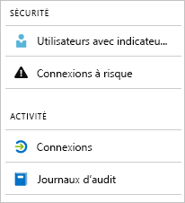

# Présentation des rapports Azure Active Directory

Les rapports Azure Active Directory (Azure AD) fournissent une vue complète de l’activité dans votre environnement. Les données fournies vous permettent de :

- déterminer la façon dont les applications et les services sont utilisés ;
- détecter les risques potentiels affectant l’intégrité de votre environnement ;
- résoudre les problèmes empêchant les utilisateurs d’effectuer leur travail.  

L’architecture de création de rapports s’appuie sur deux axes principaux :

- [Rapports de sécurité](#security-reports)
- [Rapports d’activité](#activity-reports)

## Rapports de sécurité

Les rapports de sécurité vous aident à protéger les identités de votre organisation. Il existe deux types de rapports de sécurité :

- **Utilisateurs avec indicateur de risque** : le [rapport de sécurité de ce type](concept-user-at-risk.md) présente une vue d’ensemble des comptes d’utilisateurs qui peuvent avoir été compromis.

- **Connexions à risque** : le [rapport de sécurité de ce type](concept-risky-sign-ins.md) contient un indicateur pour les tentatives de connexion susceptibles d’avoir été effectuées par une personne autre que le propriétaire légitime d’un compte d’utilisateur. 

### De quelle licence Azure AD avez-vous besoin pour accéder à un rapport de sécurité ?  

Toutes les éditions d’Azure AD vous indiquent les rapports de sécurité Utilisateurs avec indicateur de risque et Connexions à risque. Toutefois, le niveau de granularité d’un rapport varie entre les éditions : 

- Dans les **éditions Azure Active Directory Free et Basic**, vous obtenez la liste des utilisateurs marqués à risque et à connexions à risque. 

- L’édition **Azure Active Directory Premium 1** étend ce modèle en vous permettant également d’examiner certaines détections de risques sous-jacentes qui ont été détectées pour chaque rapport. 

- L’édition **Azure Active Directory Premium 2** vous fournit les informations les plus détaillées sur les détections de risques sous-jacentes. Elle vous permet également de configurer des stratégies de sécurité répondant automatiquement aux niveaux de risque configurés.

## Rapports d’activité

Les rapports d’activité vous aident à comprendre le comportement des utilisateurs de votre organisation. Il existe deux types de rapports d’activité dans Azure AD :

- **Journaux d’audit** : le [rapport d’activité de ce type](concept-audit-logs.md) vous permet d’accéder à l’historique de toutes les tâches effectuées dans votre locataire.

- **Connexions** : le [rapport d’activité de ce type](concept-sign-ins.md) vous permet d’identifier qui a effectué les tâches signalées par le rapport de journaux d’audit.

### Rapport de journaux d’audit 

Le [rapport de journaux d’audit](concept-audit-logs.md) vous fournit les enregistrements des activités du système relatifs à la conformité. Ces données vous permettent de résoudre des scénarios courants, tels que :

- Une personne de mon locataire a obtenu l’accès à un groupe d’administration. Qui lui a fourni cet accès ? 

- Je souhaite connaître la liste des utilisateurs se connectant à une application spécifique, car j’ai récemment intégré l’application et souhaite savoir si j’ai bien fait.

- Je souhaite connaître le nombre de réinitialisations de mot de passe qui se produisent dans mon locataire.

#### De quelle licence Azure AD avez-vous besoin pour accéder au rapport de journaux d’audit ?  

Le rapport de journaux d’audit est disponible pour les fonctionnalités dont vous disposez les licences. Si vous possédez une licence pour une fonctionnalité spécifique, vous avez également accès aux informations du journal d’audit correspondantes. Pour plus de détails, consultez [Fonctionnalités Azure Active Directory](https://www.microsoft.com/cloud-platform/azure-active-directory-features).   

### Rapport de connexions

Le [rapport de connexions](concept-sign-ins.md) vous permet de trouver les réponses aux questions suivantes :

- Quel est le modèle de connexion d’un utilisateur ?
- Combien d’utilisateurs se sont connectés au cours d’une semaine ?
- Quel est l’état de ces connexions ?

#### De quelle licence Azure AD avez-vous besoin pour accéder au rapport d’activité des connexions ?  

Pour accéder au rapport d’activité des connexions, votre locataire doit posséder une licence Azure AD Premium qui lui est associée.

## Accès par programme

En plus de l’interface utilisateur, Azure AD vous fournit également un [accès programmatique](concept-reporting-api.md) aux données des rapports par le biais d’un ensemble d’API REST. Vous pouvez appeler ces API à partir de divers outils et langages de programmation. 

## Étapes suivantes

- [Rapport sur les connexions à risque](concept-risky-sign-ins.md)
- [Rapport de journaux d’audit](concept-audit-logs.md)
- [Rapport de journaux d’activité de connexions](concept-sign-ins.md)
