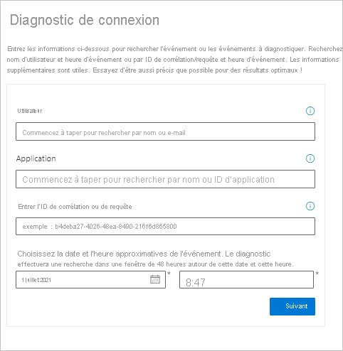
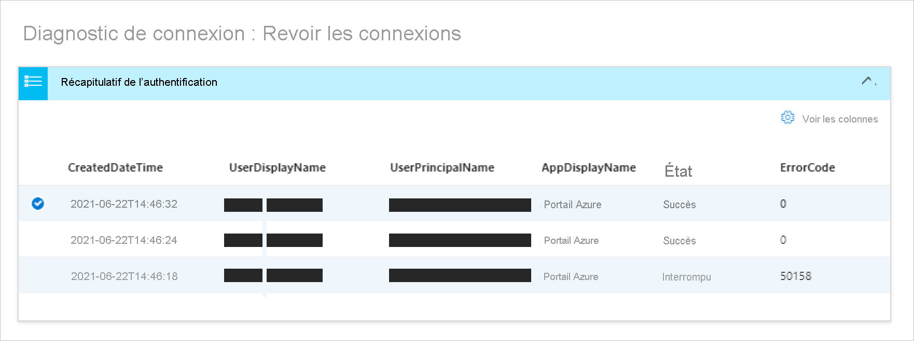
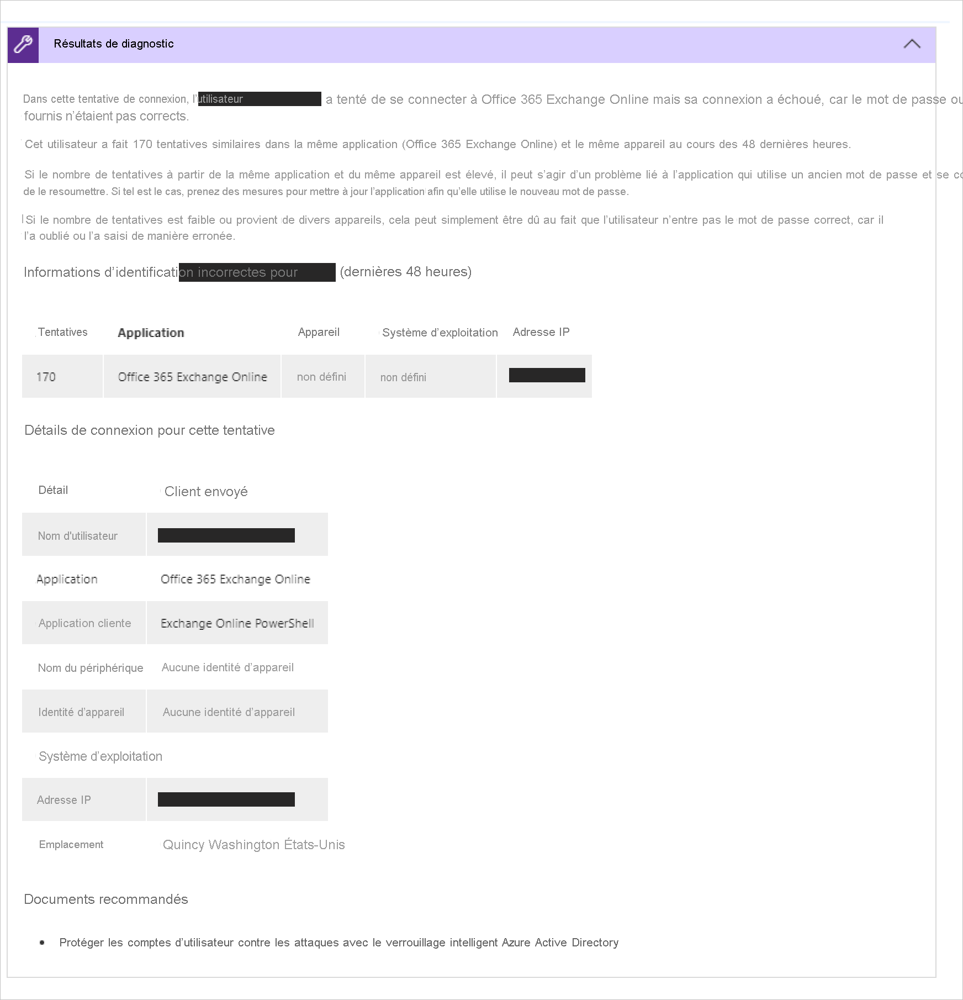
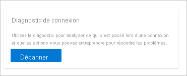
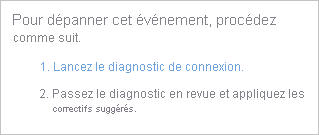

# Qu’est-ce que le diagnostic de connexion dans Azure AD ?

La détermination de la raison de l’échec de la connexion peut rapidement devenir une tâche difficile. Vous devez analyser ce qui s’est produit lors de la tentative de connexion et rechercher les recommandations disponibles pour résoudre le problème. Dans l’idéal, vous souhaitez résoudre le problème sans impliquer d’autres personnes, comme le support Microsoft. Si vous vous trouvez dans une situation comme celle-ci, vous pouvez utiliser le diagnostic de connexion dans Azure AD, un outil qui vous aide à examiner les connexions dans Azure AD. 

Cet article vous donne une vue d’ensemble du diagnostic et de la façon dont vous pouvez l’utiliser pour résoudre les erreurs liées à la connexion. 

## Fonctionnement  

Dans Azure AD, les tentatives de connexion sont contrôlées par :

- **Qui** : l’utilisateur effectue une tentative de connexion.
- **Comment** : une tentative de connexion a été effectuée.

Par exemple, vous pouvez configurer des stratégies d’accès conditionnel qui permettent aux administrateurs de configurer tous les aspects du locataire lorsqu’ils se connectent à partir du réseau d’entreprise. En revanche, ce même utilisateur peut très bien être bloqué lorsqu’il se connecte avec le même compte à partir d’un réseau non approuvé. 

En raison de la très grande flexibilité du système qui permet de répondre à une tentative de connexion, vous pouvez vous retrouver dans des scénarios où vous devrez résoudre des problèmes de connexion. Le diagnostic de connexion est une fonctionnalité conçue pour permettre l’autodiagnostic des problèmes de connexion avec :  

- Analyse des données à partir des événements de connexion.  

- Affichage d’informations sur ce qui s’est produit.  

- Recommandations pour résoudre les problèmes.  

Pour démarrer et suivre le processus de diagnostic, vous devez :   

1. **Identifier l’événement** : entrez les informations relatives à l’événement de connexion 

2. **Sélectionner un événement** : sélectionnez un événement en fonction des informations partagées. 

3. **Prendre des mesures** : examinez les résultats de diagnostic et suivez les étapes.

### Identifier l’événement 

Pour identifier les événements appropriés pour vous, vous pouvez filtrer en fonction des options suivantes :

- Nom de l’utilisateur
- Application 
- ID de corrélation ou ID de requête 
- Date et heure

### Sélectionner un événement  

En fonction de vos critères de recherche, Azure AD récupère toutes les événements de connexion correspondants et les présente dans une vue Résumé de l’authentification.  

Vous pouvez modifier le contenu affiché dans les colonnes en fonction de vos préférences. Voici quelques exemples :

- Détails du risque
- État de l’accès conditionnel
- Emplacement
- ID de ressource
- Type d’utilisateur
- Informations sur l’authentification

### Effectuer une action

Pour l’événement de connexion sélectionné, vous obtenez des résultats de diagnostic. Lisez les résultats pour identifier l’action que vous pouvez entreprendre pour résoudre le problème. Ces résultats ajoutent des étapes recommandées et dévoilent les informations pertinentes, telles que les stratégies associées, les détails de connexion et la documentation de prise en charge. La résolution d’un problème sans aide supplémentaire n’étant pas toujours possible, il peut s’avérer souhaitable d’ouvrir un ticket de support. 

## Procédure d'accès

Pour utiliser le diagnostic, vous devez être connecté au client en tant qu’administrateur général ou lecteur global. Si vous n’avez pas ce niveau d’accès, utilisez [Privileged Identity Management, PIM](../privileged-identity-management/pim-resource-roles-activate-your-roles.md), pour élever votre accès à l’administrateur/lecteur global au sein du locataire. Cela vous permettra d’avoir un accès temporaire au diagnostic.  

Avec le niveau d’accès correct, vous pouvez trouver le diagnostic à différents emplacements : 

**Option A** : Diagnostiquer et résoudre les problèmes 

1. Ouvrez **Azure Active Directory AAD ou l’accès conditionnel Azure AD**. 

2. Dans le menu principal, cliquez sur **Diagnostiquer & résoudre les problèmes**.  

3. Dans les **Utilitaires de résolution des problèmes**, il existe une vignette Diagnostic de la connexion. 

4. Cliquez sur le bouton **Résoudre les problèmes**.  

 

 

**Option B** : Événements de connexion 

1. Ouvrez Azure Active Directory. 

2. Dans le menu principal, dans la section **Surveillance**, sélectionnez **Connexions**. 

3. Dans la liste des connexions, sélectionnez une connexion avec un état **Échec**. Vous pouvez filtrer votre liste par État pour faciliter la recherche des connexions ayant échoué. 

4. L’onglet **Détails de l'activité : connexions** s’ouvre pour la connexion sélectionnée. Cliquez sur l’icône en pointillés pour afficher plus d’icônes de menu. Sélectionnez l’onglet **Résolution des problèmes et support**. 

5. Cliquez sur le lien pour **Lancer le diagnostic de connexion**. 

 

**Option C** : Demande de support 

Le diagnostic peut également être trouvé lors de la création d’un dossier de support pour vous donner la possibilité d’effectuer un diagnostic automatique avant de devoir soumettre un cas. 

## Étapes suivantes

- [Diagnostics de connexion pour les scénarios de Azure AD](concept-sign-in-diagnostics-scenarios.md)
