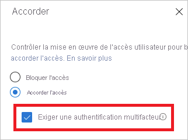

# Qu’est-ce que le diagnostic de connexion dans Azure AD ?

Azure Active Directory (Azure AD) fournit un modèle de sécurité flexible afin de contrôler ce que les utilisateurs peuvent faire avec les ressources managées. L’accès à ces ressources n’est pas uniquement contrôlé par leur *identité*, mais également par le *moyen* qu’ils utilisent pour accéder aux ressources. En général, un modèle flexible s’accompagne d’un certain degré de complexité dû au nombre d’options de configuration dont vous disposez. De cette complexité peut découler une augmentation du risque d’erreurs.

En tant qu’administrateur informatique, vous avez besoin d’une solution qui vous procure des insights concernant les activités de votre système. Cette visibilité peut vous permettre de diagnostiquer et de résoudre les problèmes lorsqu’ils se produisent. Le diagnostic de connexion pour Azure AD est un exemple de ce type de solution. Vous pouvez utiliser le diagnostic pour analyser ce qui s’est produit lors d’une tentative de connexion et obtenir des recommandations afin de résoudre les problèmes sans avoir à contacter le support Microsoft.

Cet article trace un panorama des possibilités de la solution et de la façon dont vous pouvez l’utiliser.

## Spécifications

Le diagnostic de connexion est disponible dans toutes les éditions d’Azure AD.

Vous devez être administrateur global dans Azure AD pour l’utiliser.

## Fonctionnement

Dans Azure AD, la réponse à une tentative de connexion est liée à l’*identité* de l’utilisateur et à la *façon* dont il accède au locataire. Par exemple, un administrateur peut généralement configurer tous les aspects du locataire lorsqu’il se connecte à partir du réseau d’entreprise. En revanche, ce même utilisateur peut très bien être bloqué lorsqu’il se connecte avec le même compte à partir d’un réseau non approuvé.

En raison de la très grande flexibilité du système qui permet de répondre à une tentative de connexion, vous pouvez vous retrouver dans des scénarios où vous devrez résoudre des problèmes de connexion. Le diagnostic de connexion est une fonctionnalité qui :

- Analyse les données à partir des événements de connexion.

- Affiche ce qui s’est passé.

- Fournit des recommandations sur la façon de résoudre les problèmes.

Le diagnostic de connexion pour Azure AD est conçu pour permettre le diagnostic automatique des erreurs de connexion. Pour suivre le processus de diagnostic, vous devez :

1. Définir l’étendue des événements de connexion qui vous intéressent.

2. Sélectionner la connexion que vous souhaitez examiner.

3. Examiner le résultat du diagnostic.

4. Prendre des mesures.

### Définir l’étendue

L’objectif de cette étape est de définir l’étendue des événements de connexion à examiner. Votre étendue est basée soit sur un utilisateur, soit sur un identificateur (correlationId, requestId) et un intervalle de temps. Pour préciser davantage l’étendue, vous pouvez spécifier un nom d’application. Azure AD utilise les informations d’étendue pour localiser les événements appropriés qui vous intéressent.  

### Sélectionner la connexion  

En fonction de vos critères de recherche, Azure AD récupère toutes les événements de connexion correspondants et les présente dans une vue Résumé de l’authentification.

Vous pouvez personnaliser les colonnes affichées dans cette vue.

### Examiner le diagnostic

Pour l’événement de connexion sélectionné, Azure AD fournit des résultats de diagnostic.

Ces résultats commencent par une évaluation, qui explique ce qui s’est produit en quelques phrases. L’explication vous aide à comprendre le comportement du système.

Ensuite est présenté un résumé des stratégies d’accès conditionnel associées qui ont été appliquées à l’événement de connexion sélectionné. Les résultats de diagnostic incluent également les étapes de correction recommandées pour résoudre votre problème. La résolution d’un problème sans aide supplémentaire n’étant pas toujours possible, il peut s’avérer souhaitable d’ouvrir un ticket de support.

### Effectuer une action

À ce stade, vous devez disposer des informations qui vous sont nécessaires pour résoudre votre problème.

## Scénarios

Les scénarios suivants sont couverts par le diagnostic de connexion :

- Blocage par l’accès conditionnel

- Échec de l’accès conditionnel

- Authentification multifacteur (MFA) à partir de l’accès conditionnel

- Authentification multifacteur à partir d’autres conditions exigées

- Validation par l’authentification multifacteur exigée

- Validation par l’authentification multifacteur exigée (emplacement de connexion risqué)

- Connexion réussie

### Blocage par l’accès conditionnel

Dans ce scénario, une tentative de connexion a été bloquée par une stratégie d’accès conditionnel.

La section de diagnostic de ce scénario affiche des informations détaillées sur l’événement de connexion utilisateur et les stratégies appliquées.

### Échec de l’accès conditionnel

Ce scénario est le résultat classique de l’échec d’une tentative de connexion dû à une stratégie d’accès conditionnel dont les conditions n’ont pas été remplies. Voici des exemples courants :

- Exiger un appareil joint à Azure AD hybride

- Demander une application cliente approuvée

- Exiger une stratégie de protection des applications

La section de diagnostic de ce scénario affiche des informations détaillées sur la tentative de connexion utilisateur et les stratégies appliquées.

### Authentification multifacteur à partir de l’accès conditionnel

Dans ce scénario, une stratégie d’accès conditionnel impose que l’utilisateur se connecte au moyen de l’authentification multifacteur.

La section de diagnostic de ce scénario affiche des informations détaillées sur la tentative de connexion utilisateur et les stratégies appliquées.

### Authentification multifacteur à partir d’autres conditions exigées

Dans ce scénario, une exigence relative à l’authentification multifacteur n’a pas été appliquée par une stratégie d’accès conditionnel. Par exemple, l’authentification multifacteur par utilisateur.

Le but de ce scénario de diagnostic est de fournir plus de détails sur les éléments suivants :

- Source de l’interruption de l’authentification multifacteur
- Résultat de l’interaction avec le client

Vous pouvez également afficher tous les détails de la tentative de connexion de l’utilisateur.

### Validation par l’authentification multifacteur exigée

Dans ce scénario, les tentatives de connexion ont été interrompues par des demandes de configuration de l’authentification multifacteur. Cette configuration est également appelée « validation ».

La validation par l’authentification multifacteur se produit lorsqu’un utilisateur est obligé d’utiliser l’authentification multifacteur mais qu’il ne l’a pas encore configurée, ou lorsqu’un administrateur a exigé de l’utilisateur qu’il la configure.

L’objectif de ce scénario de diagnostic est de révéler que l’interruption de l’authentification multifacteur était due à une absence de configuration par l’utilisateur. La solution recommandée consiste à ce que l’utilisateur effectue la validation.

### Validation par l’authentification multifacteur exigée (emplacement de connexion risqué)

Dans ce scénario, les tentatives de connexion ont été interrompues par une demande de configuration de l’authentification multifacteur à partir d’un emplacement de connexion risqué.

L’objectif de ce scénario de diagnostic est de révéler que l’interruption de l’authentification multifacteur était due à une absence de configuration par l’utilisateur. La solution recommandée consiste à ce que l’utilisateur effectue la validation, plus précisément à partir d’un emplacement réseau qui n’est pas risqué.

Par exemple, si un réseau d’entreprise est défini en tant qu’emplacement nommé, l’utilisateur doit plutôt essayer d’effectuer la validation à partir du réseau d’entreprise.

### Connexion réussie

Dans ce scénario, les événements de connexion n’ont pas été interrompus par l’accès conditionnel ou l’authentification multifacteur.

Ce scénario de diagnostic fournit des détails sur les événements de connexion utilisateur qui étaient censés être interrompus en raison des stratégies d’accès conditionnel ou de l’authentification multifacteur.

## Étapes suivantes

- [Présentation des rapports Azure Active Directory](overview-reports.md)
- [Présentation de la supervision d’Azure Active Directory](overview-monitoring.md)
