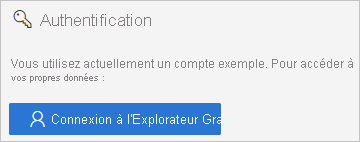

# Démarrage rapide : Accéder aux journaux d’Azure AD avec l’API Microsoft Graph 

Les informations contenues dans le journal des connexions Azure AD vous permettent de comprendre la cause de l’échec de la connexion d’un utilisateur. Ce démarrage rapide explique comment accéder au journal des connexions à l’aide de l’API Graph.

## Prérequis

Pour suivre le scénario décrit dans ce démarrage rapide, vous avez besoin de ce qui suit :

- **Accès à un locataire Azure AD** : si vous n’avez pas accès à un locataire Azure AD, consultez [Créez votre compte gratuit Azure dès aujourd’hui](https://azure.microsoft.com/free/?WT.mc_id=A261C142F). 
- **Un compte d’essai nommé Isabella Simonsen** : si vous ignorez comment créer un compte d’essai, voir [Ajouter des utilisateurs basés sur le cloud](../fundamentals/add-users-azure-active-directory.md#add-a-new-user).

## Provoquer un échec de connexion

L’objectif de cette étape est de créer un enregistrement d’échec de connexion dans le journal des connexions Azure AD.

**Pour effectuer cette étape :**

1. Connectez-vous à votre [portail Azure](https://portal.azure.com/) en tant que Isabella Simonsen en utilisant un mot de passe incorrect.

2. Attendez 5 minutes pour vous assurer de trouver un enregistrement de la connexion dans le journal des connexions. Pour plus d’informations, consultez [Rapports d’activité](reference-reports-latencies.md#activity-reports).

## Rechercher l’échec de connexion

Cette section vous fournit les étapes à suivre pour obtenir des informations sur votre connexion à l’aide de l’API Graph.

    

**Pour examiner l’échec de connexion :**

1. Accédez à l’[explorateur Microsoft Graph](https://developer.microsoft.com/en-us/graph/graph-explorer).

2. Connectez-vous à votre locataire en tant qu’administrateur général.

       

3. Dans la **liste déroulante des verbes HTTP**, sélectionnez **GET**.

4. Dans la **liste déroulante des versions d’API**, sélectionnez **bêta**.

5. Dans la **barre d’adresse Demande de requête**, saisissez `https://graph.microsoft.com/beta/auditLogs/signIns?$top=100&$filter=userDisplayName eq 'Isabella Simonsen'`.
 
6. Cliquez sur **Exécuter la requête**.

Examinez le résultat de votre requête.

    

## Nettoyer les ressources

Lorsque vous n’en avez plus besoin, supprimez l’utilisateur de test. Si vous ignorez comment supprimer un utilisateur Azure AD, voir [Supprimer des utilisateurs d’Azure AD](../fundamentals/add-users-azure-active-directory.md#delete-a-user).

## Étapes suivantes

> [!div class="nextstepaction"]
> [Présentation des rapports Azure Active Directory](overview-reports.md)
