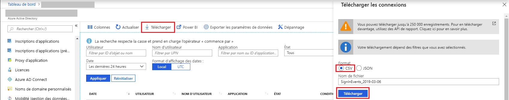

# Démarrage rapide : Télécharger un rapport de connexion avec le portail Azure

Dans ce guide de démarrage rapide, vous apprenez à télécharger les données de connexion des dernières 24 heures pour votre locataire. Vous pouvez télécharger jusqu’à 250 000 enregistrements à partir du portail Azure. Les enregistrements sont triés par date. Par défaut, les 250 000 enregistrements les plus récents s’affichent. 

## Conditions préalables requises

Ce dont vous avez besoin :

* Un locataire Azure Active Directory, avec une licence Premium pour afficher le rapport d’activité de connexion. Consultez [Bien démarrer avec Azure Active Directory Premium](../fundamentals/active-directory-get-started-premium.md) pour mettre à niveau votre édition d’Azure Active Directory. Notez que si vous ne disposiez d'aucune donnée d'activité avant la mise à niveau, quelques jours seront nécessaires pour que les données s'affichent dans les rapports après la mise à niveau vers une licence premium.
* Un utilisateur dans le rôle **Administrateur de la sécurité**, **Lecteur Sécurité**, **Lecteur de rapport** ou **Administrateur général** pour le locataire. De plus, tout utilisateur du locataire peut accéder à ses propres connexions.

## Démarrage rapide : Télécharger un rapport de connexion

1. Accédez au [portail Azure](https://portal.azure.com).
2. Sélectionnez **Azure Active Directory** à partir du volet de navigation gauche et utilisez le bouton **Changer de répertoire** pour sélectionner votre instance Active Directory.
3. Dans le tableau de bord, sélectionnez **Azure Active Directory**, puis **Connexions**. 
4. Choisissez **Dernières 24 heures** dans la liste déroulante du filtre **Date** et sélectionnez **Appliquer** pour afficher les connexions des dernières 24 heures. 
5. Sélectionnez le bouton **Télécharger**, sélectionnez **CSV** comme format de fichier, et spécifiez un nom de fichier pour télécharger un fichier CSV contenant les enregistrements filtrés. 

## Étapes suivantes

* [Rapports d’activité de connexion dans le portail Azure Active Directory](concept-sign-ins.md)
* [Rétention des rapports Azure Active Directory](reference-reports-data-retention.md)
* [Latences de création de rapports Azure Active Directory - Préversion](reference-reports-latencies.md)
