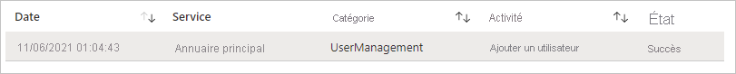
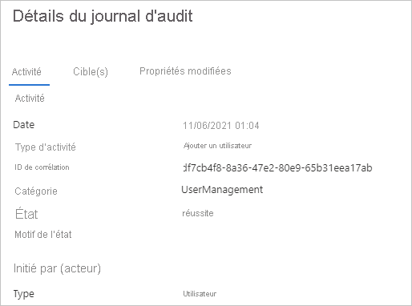

# Démarrage rapide : filtrer votre journal d’audit Azure AD 

Avec les informations de votre journal d’audit dans Azure AD, vous accédez aux enregistrements des activités du système pour la conformité. Ce démarrage rapide montre comment vous pouvez localiser un compte utilisateur nouvellement créé dans votre journal d’audit.

## Prérequis

Pour suivre le scénario décrit dans ce démarrage rapide, vous avez besoin de ce qui suit :

- **Accès à un locataire Azure AD** : si vous n’avez pas accès à un locataire Azure AD, consultez [Créez votre compte gratuit Azure dès aujourd’hui](https://azure.microsoft.com/free/?WT.mc_id=A261C142F). 
- **Un compte d’essai nommé Isabella Simonsen** : si vous ignorez comment créer un compte d’essai, voir [Ajouter des utilisateurs basés sur le cloud](../fundamentals/add-users-azure-active-directory.md#add-a-new-user).

## Rechercher le nouveau compte d'utilisateur

Cette section explique comment filtrer votre journal d'audit.

**Pour rechercher le nouvel utilisateur :**

1. Accédez au [journal d’audit](https://portal.azure.com/#blade/Microsoft_AAD_IAM/ActiveDirectoryMenuBlade/Audit).

2. Pour afficher uniquement les enregistrements pour Isabella Simonsen :

    a. Dans la barre d’outils, cliquez sur **Ajouter des filtres**.
    
       

    b. Dans la liste **Choisir un champ**, sélectionnez **Cible**, puis cliquez sur **Appliquer**

    c. Dans la zone de texte **Cible**, entrez le **nom d’utilisateur principal** d’**Isabella Simonsen**, puis cliquez sur **Appliquer**.

3. Cliquez sur l’élément filtré.

      

4.  Examinez les **détails du journal d'audit**.
 
      
 
  

## Nettoyer les ressources

Lorsque vous n’en avez plus besoin, supprimez l’utilisateur de test. Si vous ignorez comment supprimer un utilisateur Azure AD, voir [Supprimer des utilisateurs d’Azure AD](../fundamentals/add-users-azure-active-directory.md#delete-a-user).

## Étapes suivantes

> [!div class="nextstepaction"]
> [Présentation des rapports Azure Active Directory](overview-reports.md)
