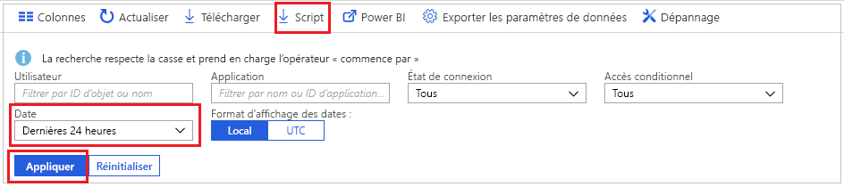
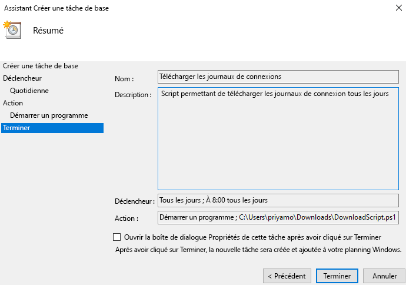

# Tutoriel : Télécharger et utiliser un script pour accéder aux journaux de connexion

Vous pouvez télécharger les données des activités de connexion si vous souhaitez les utiliser en dehors du portail Azure. L’option **Télécharger** du portail Azure crée un fichier CSV contenant les 5 000 enregistrements les plus récents. Si vous avez besoin d’une plus grande flexibilité, par exemple pour télécharger plus de 5 000 enregistrements à la fois ou pour télécharger les journaux à intervalles planifiés, vous pouvez utiliser le bouton **Script** pour générer un script PowerShell visant à télécharger vos données.

Dans ce tutoriel, vous allez apprendre à générer un script pour télécharger tous les journaux de connexion des dernières 24 heures et planifier son exécution tous les jours. 

## Prérequis

Vous devez avoir

* Un locataire Azure Active Directory avec une licence premium (P1/P2). Notez que si vous n’aviez aucune donnée d’activité avant la mise à niveau, l’affichage des données dans les rapports prendra quelques jours une fois la mise à niveau vers une licence premium effectuée. 
* Un utilisateur dans le rôle **Administrateur général**, **Administrateur de la sécurité**, **Lecteur Sécurité** ou **Lecteur de rapport** pour le locataire. De plus, tout utilisateur peut accéder à ses propres connexions. 
* Si vous souhaitez exécuter le script téléchargé sur votre ordinateur Windows 10, [configurez le module Azure PowerShell et définissez une stratégie d’exécution](concept-sign-ins.md#running-the-script-on-a-windows-10-machine).

## Didacticiel

1. Accédez au [portail Azure](https://portal.azure.com) et sélectionnez votre annuaire.
2. Sélectionnez **Azure Active Directory**, puis **Connexions** dans la section **Supervision**. 
3. Utilisez le filtre **Plage de dates** dans la liste déroulante et sélectionnez **24 heures** pour obtenir les données des dernières 24 heures. 
4. Sélectionnez **Appliquer** et vérifiez que le filtre est appliqué comme prévu. 
5. Sélectionnez **Script** dans le menu supérieur pour télécharger le script Powershell avec les filtres appliqués.

     
     
6. Ouvrez l’application **Planificateur de tâches** sur votre ordinateur Windows et sélectionnez **Créer une tâche de base**.
7. Spécifiez un nom et une description pour la tâche et cliquez sur **Suivant**.
8. Sélectionnez la case d’option **Tous les jours** pour autoriser la tâche à s’exécuter tous les jours, puis entrez la date et l’heure de début.
9. Dans le menu d’action, sélectionnez **Démarrer un programme**, puis sélectionnez le script téléchargé et **Suivant**. 
10. Passez en revue la tâche planifiée et sélectionnez **Terminer** pour créer la tâche.

     

À partir de maintenant, votre tâche va s’exécuter tous les jours et enregistrer les informations de connexion des dernières 24 heures dans un fichier au format **AAD_SignInReport_YYYYMMDD_HHMMSS.csv**. Vous pouvez également modifier le script PowerShell téléchargé pour l’enregistrer sous un autre nom de fichier ou pour changer le nombre d’enregistrements téléchargés. 

## Étapes suivantes

* [Stratégies de rétention des rapports Azure Active Directory](reference-reports-data-retention.md)
* [Prise en main de l’API de création de rapports Azure Active Directory](concept-reporting-api.md)
* [Accéder à l’API de création de rapports avec des certificats](tutorial-access-api-with-certificates.md)
