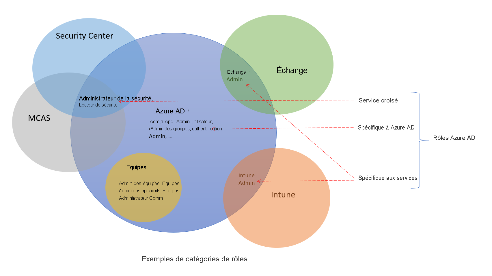

# Présentation des rôles dans Azure Active Directory

Il existe environ 60 rôles intégrés Azure Active Directory (Azure AD), qui sont des rôles avec un ensemble fixe d’autorisations de rôle. Pour compléter les rôles intégrés, Azure AD prend également en charge des rôles personnalisés. Utilisez des rôles personnalisés pour sélectionner les autorisations de rôle souhaitées. Par exemple, vous pouvez en créer un pour gérer des ressources Azure AD spécifiques, telles que des applications ou des principaux de service.

Cet article explique ce que sont les rôles Azure AD et comment ils peuvent être utilisés.

## Différences entre les rôles Azure AD et les autres rôles Microsoft 365

Il existe de nombreux services différents dans Microsoft 365, comme Azure AD et Intune. Certains de ces services disposent de leurs propres systèmes de contrôle d’accès en fonction du rôle, plus spécifiquement :

- Azure AD
- Exchange
- Intune
- Security Center
- Centre de conformité
- Microsoft Cloud App Security
- Commerce

D’autres services, tels que Teams, SharePoint et Managed Desktop, n’ont pas de systèmes de contrôle d’accès en fonction du rôle distincts. Ils utilisent des rôles Azure AD pour leur accès administratif. Azure dispose de son propre système de contrôle d’accès en fonction du rôle pour les ressources Azure, comme les machines virtuelles, et ce système diffère des rôles Azure AD.

Par « système distinct de contrôle d’accès en fonction du rôle », nous voulons dire qu’il existe un magasin de données différent dans lequel sont stockées les définitions de rôles et les attributions de rôles. De même, les contrôles d’accès se produisent à un point de décision de stratégie différent. Pour plus d’informations, consultez [Rôles pour les services Microsoft 365 dans Azure AD](m365-workload-docs.md) et [Rôles d’administrateur d’abonnement classique, rôles Azure et rôles Azure AD](../../role-based-access-control/rbac-and-directory-admin-roles.md).

## Pourquoi certains rôles Azure AD sont-ils pour d’autres services ?

Microsoft 365 a un certain nombre de systèmes de contrôle d’accès en fonction du rôle qui ont été développés indépendamment au fil du temps, chacun avec son propre portail de service. Pour faciliter la gestion des identités dans Microsoft 365 à partir du portail Azure AD, nous avons ajouté des rôles intégrés propres aux services, chacun d’eux accordant un accès administratif à un service Microsoft 365. Le rôle d’Administrateur Exchange dans Azure AD constitue un exemple de cet ajout. Ce rôle équivaut au [groupe de rôles Gestion de l’organisation](/exchange/organization-management-exchange-2013-help) dans le système de contrôle d’accès en fonction du rôle d’Exchange, et peut gérer tous les aspects d’Exchange. De même, nous avons ajouté le rôle d’Administrateur Intune, d’Administrateur Teams, d’Administrateur SharePoint, et ainsi de suite. Les rôles propres au service sont l’une des catégories de rôles intégrés Azure AD décrites dans la section suivante.

## Catégories de rôles Azure AD

Les rôles intégrés Azure AD diffèrent quant à l’emplacement où ils peuvent être utilisés. Ils peuvent appartenir aux trois grandes catégories suivantes.

- **Rôles propres à Azure AD** : ces rôles accordent des autorisations pour gérer des ressources dans Azure AD uniquement. Par exemple, les rôles Administrateur d’utilisateurs, Administrateur d’application, Administrateur de groupes accordent tous des autorisations pour gérer des ressources qui résident dans Azure AD.
- **Rôles propres à un service** : pour les principaux services Microsoft 365 (non-Azure AD), nous avons créé des rôles propres au service qui accordent des autorisations pour gérer toutes les fonctionnalités au sein du service.  Par exemple, les rôles Administrateur Microsoft Exchange, Administrateur Intune, Administrateur SharePoint et Administrateur  Teams peuvent gérer les fonctionnalités avec leurs services respectifs. L’Administrateur Exchange peut gérer les boîtes aux lettres, l’Administrateur Intune peut gérer les stratégies des appareils, l’Administrateur SharePoint peut gérer les collections de sites, l’Administrateur Teams peut gérer les qualités des appels, et ainsi de suite.
- **Rôles inter-services** : certains rôles s’appliquent à plusieurs services. Il existe deux rôles généraux : Administrateur général et Lecteur général. Tous les services Microsoft 365 honorent ces deux rôles. Il existe également des rôles liés à la sécurité, comme Administrateur de la sécurité et Lecteur Sécurité, qui accordent l’accès à plusieurs services de sécurité au sein de Microsoft 365. Par exemple, à l’aide des rôles d’Administrateur de sécurité dans Azure AD, vous pouvez gérer le Centre de sécurité Microsoft 365, Microsoft Defender Advanced Threat Protection et Microsoft Cloud App Security. De même, le rôle d’Administrateur de conformité vous permet de gérer les paramètres de conformité dans le Centre de conformité Microsoft 365, Exchange, et ainsi de suite.

Le tableau suivant a pour but d’aider à la compréhension de ces catégories de rôles. Les catégories sont nommées de manière arbitraire, et ne sont pas censées impliquer d’autres fonctionnalités au-delà des [autorisations de rôle documentées](permissions-reference.md).

Category | Role
---- | ----
Rôles propres à Azure AD | Administrateur d’application Développeur d’applications Administrateur d’authentification Administrateur de jeux de clés B2C IEF Administrateur de stratégies B2C IEF Administrateur d'applications cloud Administrateur d’appareil cloud Administrateur de l’accès conditionnel Administrateurs d’appareils Lecteurs de répertoires Comptes de synchronisation d’annuaires Enregistreurs de répertoire Administrateur de flux d’utilisateurs ID externe Administrateur d’attribut de flux d’utilisateurs ID externe Administrateur de fournisseurs d’identité externes Administrateur de groupes Inviteur Administrateur du support technique Administrateur d’identité hybride Administrateur de licence Prise en charge de niveau 1 de partenaire Prise en charge de niveau 2 de partenaire Administrateur de mots de passe Administrateur d’authentification privilégié Administrateur de rôle privilégié Lecteur de rapports Administrateur de compte utilisateur
Rôles inter-services | Administrateur général Administrateur de conformité Administrateur des données de conformité Lecteur général Administrateur de sécurité Opérateur de sécurité Lecteur Sécurité Administrateur de support de service
Rôles propres à un service | Administrateur Azure DevOps Administrateur Azure Information Protection Administrateur de facturation Administrateur de services CRM Approbateur d’accès à Customer LockBox Administrateur Desktop Analytics Administrateur de services Exchange Administrateur Insights Leader d’entreprise Insights Administrateur de services Intune Administrateur Kaizala Administrateur de services Lync Lecteur de confidentialité du Centre de messages Lecteur du Centre de messages Utilisateur de Commerce moderne Administrateur réseau Administrateur d’applications Office Administrateur du service Power BI Administrateur de plateforme Power Administrateur d’imprimantes Technicien en charge des imprimantes Administrateur de recherche Éditeur de recherche Administrateur de services SharePoint Administrateur des communications Teams Ingénieur de support des communications Teams Spécialiste du support des communications Teams Administrateur d’appareils Teams Administrateur du service Teams

## Étapes suivantes

- [Vue d’ensemble du contrôle d’accès en fonction du rôle Azure AD](custom-overview.md)
- Créer des attributions de rôles à l’aide du [portail Azure, d’Azure AD PowerShell et de l’API Graph](custom-create.md)
- [Afficher les affectations d’un rôle](custom-view-assignments.md)
