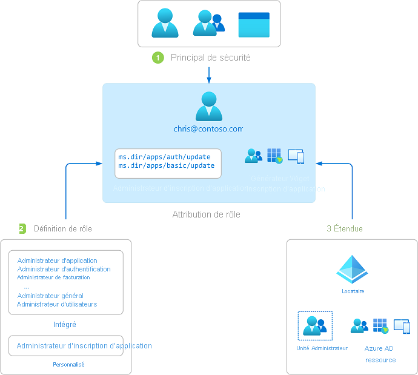

# Vue d’ensemble du contrôle d’accès en fonction du rôle dans Azure Active Directory

Cet article explique ce qu’est le contrôle d’accès en fonction du rôle Azure AD (Azure Active Directory). Les rôles Azure AD vous permettent d’accorder des autorisations précises à vos administrateurs, en respectant le principe du moindre privilège. Les rôles personnalisés et intégrés Azure AD utilisent des concepts similaires à ceux du [système de contrôle d’accès en fonction du rôle pour les ressources Azure](../../role-based-access-control/overview.md) (rôles Azure). La [différence entre ces deux systèmes de contrôle d’accès en fonction du rôle](../../role-based-access-control/rbac-and-directory-admin-roles.md) est la suivante :

- Les rôles Azure AD contrôlent l’accès aux ressources Azure AD telles que les utilisateurs, les groupes et les applications à l’aide de l’API Graph.
- Les rôles Azure contrôlent l’accès aux ressources Azure, telles que les machines virtuelles ou le stockage, à l’aide de Gestion des ressources Azure.

Les deux systèmes contiennent des définitions de rôles et des attributions de rôles à l’usage similaire. Toutefois, les autorisations de rôle Azure AD ne peuvent pas être utilisées dans les rôles personnalisés Azure, et vice versa.

## Présentation du contrôle d’accès en fonction du rôle Azure AD
Azure AD prend en charge 2 types de définitions de rôles : 
* [Rôles intégrés](https://docs.microsoft.com/azure/active-directory/roles/permissions-reference)
* [Rôles personnalisés](https://docs.microsoft.com/azure/active-directory/roles/custom-create)

Les rôles intégrés sont des rôles prêts à l’emploi qui possèdent un ensemble fixe d’autorisations. Ces définitions de rôles ne peuvent pas être modifiées. Il existe de nombreux rôles [intégrés](https://docs.microsoft.com/azure/active-directory/roles/permissions-reference) pris en charge par Azure AD, et la liste s’agrandit. Pour s’ajuster au mieux et satisfaire à vos exigences plus complexes, Azure AD prend également en charge les [rôles personnalisés](https://docs.microsoft.com/azure/active-directory/roles/custom-create). L’octroi d’une autorisation à l’aide de rôles Azure AD personnalisés est un processus en deux étapes qui implique la création d’une définition de rôle personnalisé, puis son affectation à l’aide d’une attribution de rôle. Une définition de rôle personnalisé est une collection d’autorisations que vous ajoutez à partir d’une liste prédéfinie. Il s’agit des mêmes autorisations que celles utilisées dans les rôles intégrés.  

Une fois que vous avez créé votre définition de rôle personnalisé (ou à l’aide d’un rôle intégré), affectez-la à un utilisateur en créant une attribution de rôle. Une attribution de rôle accorde à l’utilisateur les autorisations dans une définition de rôle au niveau d’une étendue spécifiée. Ce processus en deux étapes vous permet de créer une définition de rôle unique et de l’attribuer plusieurs fois à différentes étendues. Une étendue définit l’ensemble des ressources Azure AD auxquelles le membre du rôle a accès. L’étendue la plus courante est l’étendue à l’échelle de l’organisation (échelle-org). Un rôle personnalisé peut être attribué à une étendue d’échelle de l’organisation, ce qui signifie que le membre du rôle dispose des autorisations de rôle sur toutes les ressources de l’organisation. Un rôle personnalisé peut également être attribué au niveau de l’étendue d’objet. Un exemple d’étendue d’objet est une application unique. Le même rôle peut être attribué à un utilisateur sur toutes les applications de l’organisation, puis à un autre utilisateur avec une étendue limitée à l’application Contoso Expense Reports.  

Les rôles personnalisés et intégrés Azure AD utilisent des concepts similaires au [Contrôle d’accès en fonction du rôle (RBAC) Azure](../../active-directory-b2c/overview.md). La [différence entre ces deux systèmes de contrôle d’accès en fonction du rôle](../../role-based-access-control/rbac-and-directory-admin-roles.md) est qu’Azure RBAC contrôle l’accès aux ressources Azure, telles que les machines virtuelles ou le stockage à l’aide de la gestion des ressources Azure, et que les rôles personnalisés Azure AD contrôlent l’accès aux ressources Azure AD à l’aide de l’API Graph. Les deux systèmes utilisent le concept de définition de rôle et d’attribution de rôle. Les autorisations RBAC Azure AD ne peuvent pas être incluses dans les rôles Azure et inversement.

### Comment Azure AD détermine si un utilisateur a accès à une ressource

Voici les principales étapes suivies par Azure AD pour déterminer si vous avez accès à une ressource de gestion. Utilisez ces informations pour résoudre les problèmes d’accès.

1. Un utilisateur (ou un principal de service) acquiert un jeton pour le point de terminaison Microsoft Graph ou Azure AD Graph.
1. L’utilisateur effectue un appel d’API à Azure Active Directory (Azure AD) via Microsoft Graph ou Azure AD Graph à l’aide du jeton émis.
1. Selon les circonstances, Azure AD effectue l’une des actions suivantes :
   - Évalue les appartenances aux rôles de l’utilisateur en fonction de la [revendication wids](../../active-directory-b2c/access-tokens.md) dans le jeton d’accès de l’utilisateur.
   - Récupère toutes les attributions de rôles qui s’appliquent à l’utilisateur, directement ou via l’appartenance à un groupe, à la ressource sur laquelle l’action est effectuée.
1. Azure AD détermine si l’action contenue dans l’appel d’API est incluse dans les rôles dont l’utilisateur dispose pour cette ressource.
1. Si l’utilisateur n’a aucun rôle avec l’action appropriée dans l’étendue demandée, l’accès n’est pas octroyé. Autrement, l’accès est accordé.

## Attribution de rôle

Une attribution de rôle est une ressource Azure AD qui associe une *définition de rôle* à un *utilisateur* dans une *étendue* particulière pour accorder l’accès aux ressources Azure AD. La création d’une attribution de rôle permet d’accorder un accès, qui peut être révoqué par la suppression d’une attribution de rôle. À son cœur, une attribution de rôle se compose de trois éléments :

- Utilisateur Azure AD
- Définition de rôle
- Étendue des ressources

Vous pouvez [créer des attributions de rôles](custom-create.md) à l’aide du portail Azure, d’Azure AD PowerShell ou de l’API Graph. Vous pouvez également [Afficher les attributions d’un rôle personnalisé](custom-view-assignments.md#view-the-assignments-of-a-role).

Le diagramme suivant montre un exemple d’attribution de rôle. Dans cet exemple, Chris Green s’est vu attribuer le rôle personnalisé d’administrateur d’inscription des applications dans l’étendue de l’inscription de l’application Contoso Widget Builder. Cette attribution accorde à Chris les autorisations du rôle administrateur d’inscription d’application sur cette inscription d’application spécifique uniquement.

### Principal de sécurité

Un principal de sécurité représente l’utilisateur auquel l’accès aux ressources Azure AD doit être attribué. Un utilisateur est une personne disposant d’un profil utilisateur dans Azure Active Directory.

### Role

Une définition de rôle, ou rôle, est une collection d’autorisations. Une définition de rôle répertorie les opérations qui peuvent être effectuées sur des ressources Azure AD, telles que créer, lire, mettre à jour et supprimer. Il existe deux types de rôles dans Azure AD :

- Les rôles intégrés créés par Microsoft qui ne peuvent pas être modifiés.
- Rôles personnalisés créés et gérés par votre organisation.

### Étendue

Une étendue est la restriction des actions autorisées à une ressource Azure AD particulière dans le cadre d’une attribution de rôle. Lorsque vous attribuez un rôle, vous pouvez spécifier une étendue qui limite l’accès de l’administrateur à une ressource spécifique. Par exemple, si vous souhaitez accorder à un développeur un rôle personnalisé, mais uniquement pour gérer une inscription d’application spécifique, vous pouvez inclure l’inscription d’application spécifique en tant qu’étendue dans l’attribution de rôle.

## Plan de licence obligatoire

L’utilisation de rôles intégrés dans Azure AD est gratuite, par contre les rôles personnalisés nécessitent une licence Azure AD Premium P1. Pour trouver la licence appropriée à vos besoins, consultez [Comparaison des fonctionnalités mises à la disposition générale des éditions gratuite, de base et Premium](https://azure.microsoft.com/pricing/details/active-directory).

## Étapes suivantes

- [Comprendre les rôles Azure AD](concept-understand-roles.md)
- Créer des attributions de rôles personnalisés à l’aide du [portail Azure, d’Azure AD PowerShell et de l’API Graph](custom-create.md)
- [Afficher les attributions d’un rôle personnalisé](custom-view-assignments.md)
