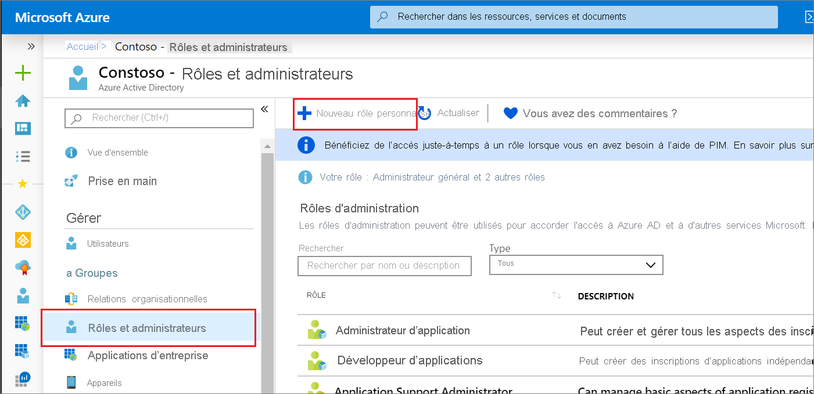

# <a name="quickstart-grant-permission-to-create-unlimited-app-registrations"></a>Démarrage rapide : Accorder l’autorisation de créer un nombre illimité d’inscriptions d’applications

Dans ce démarrage rapide, vous allez créer un rôle personnalisé autorisé à créer un nombre illimité d’inscriptions d’applications, puis attribuer ce rôle à un utilisateur. L’utilisateur attribué peut ensuite utiliser le portail Azure AD, Azure AD PowerShell ou l’API Microsoft Graph pour créer des inscriptions d’applications. Contrairement au rôle de développeur d’applications intégré, ce rôle personnalisé accorde la possibilité de créer un nombre illimité d’inscriptions d’applications. Le rôle Développeur d’applications octroie cette capacité, mais le nombre total d’objets créés est limité à 250 pour empêcher d’atteindre le [quota d’objets à l’ensemble du répertoire](../enterprise-users/directory-service-limits-restrictions.md). Le rôle le moins privilégié requis pour créer et assigner des rôles Azure AD personnalisés est l’administrateur de rôle privilégié.

Si vous ne disposez pas d’abonnement Azure, créez un [compte gratuit](https://azure.microsoft.com/free/) avant de commencer.

## <a name="create-a-custom-role-using-the-azure-ad-portal"></a>Créer un rôle personnalisé à l’aide du portail Azure AD

1. Connectez-vous au [centre d’administration Azure AD](https://aad.portal.azure.com) avec des autorisations Administrateur de rôle privilégié ou Administrateur général dans l’organisation Azure AD.
1. Sélectionnez **Azure Active Directory** , **Rôles et administrateurs** , puis **Nouveau rôle personnalisé**.

    

1. Sous l'onglet **Notions de base** , indiquez « Créateur de l’inscription des applications » comme nom du rôle et « Peut créer un nombre illimité d’inscriptions d’applications » pour la description du rôle, puis sélectionnez **Suivant**.

    

1. Sous l'onglet **Autorisations** , entrez « microsoft.directory/applications/create » dans la zone de recherche, puis activez les cases à cocher en regard des autorisations souhaitées, puis sélectionnez **Suivant**.

    

1. Sur l’onglet **Vérifier + Créer** , vérifiez les permissions, puis sélectionnez **Créer**.

### <a name="assign-the-role-in-the-azure-ad-portal"></a>Attribuer le rôle dans le portail Azure AD

1. Connectez-vous au [centre d’administration Azure AD](https://aad.portal.azure.com) avec des autorisations Administrateur de rôle privilégié ou Administrateur général dans votre organisation Azure AD.
1. Sélectionnez **Azure Active Directory** , puis **Rôles et administrateurs**.
1. Sélectionnez le rôle Créateur d’inscription d’application et sélectionnez **Ajouter une attribution**.
1. Sélectionnez l’utilisateur souhaité, puis cliquez sur **Sélectionner** pour ajouter l’utilisateur au rôle.

Vous avez terminé. Dans ce guide de démarrage rapide, vous allez créer avec succès un rôle personnalisé avec l’autorisation de créer un nombre illimité d’inscriptions d’applications, puis attribuer ce rôle à un utilisateur.

> [!TIP]
> Pour affecter le rôle à une application à l’aide du portail Azure AD, entrez le nom de l’application dans la zone de recherche de la page d’affectation. Par défaut, les applications ne sont pas affichées dans la liste, mais elles sont retournées dans les résultats de la recherche.

### <a name="app-registration-permissions"></a>Autorisations d’inscription d’application

Deux autorisations sont disponibles pour accorder la possibilité de créer des inscriptions d’applications, chacune avec un comportement différent.

- microsoft.directory/applications/createAsOwner: En attribuant cette autorisation, le créateur est ajouté en tant que premier propriétaire de l'enregistrement de l'application créée. L'enregistrement de l'application créée est comptabilisé dans le quota de 250 objets créés du créateur.
- microsoft.directory/applications/create : En attribuant cette autorisation, le créateur n’est pas ajouté en tant que premier propriétaire de l'enregistrement de l'application créée. L'enregistrement de l'application créée est comptabilisé dans le quota de 250 objets créés du créateur. Utilisez cette autorisation avec précaution, car rien n’empêche l’intervenant de créer des inscriptions d’applications tant que le quota au niveau du répertoire n’a pas été atteint. Si les deux autorisations sont affectées, l’autorisation est prioritaire.

## <a name="create-a-custom-role-in-azure-ad-powershell"></a>Créer un rôle personnalisé dans Azure AD PowerShell

### <a name="prepare-powershell"></a>Préparer PowerShell

Tout d’abord, installez le module Azure AD PowerShell à partir de la [PowerShell Gallery](https://www.powershellgallery.com/packages/AzureADPreview/2.0.0.17). Importez ensuite le module de préversion Azure AD PowerShell à l’aide de la commande suivante :

```powershell
import-module azureadpreview
```

Pour vérifier que le module est prêt à l’emploi, faites correspondre la version retournée par la commande suivante à celle répertoriée ici :

```powershell
get-module azureadpreview
  ModuleType Version      Name                         ExportedCommands
  ---------- ---------    ----                         ----------------
  Binary     2.0.0.115    azureadpreview               {Add-AzureADAdministrati...}
```

### <a name="create-the-custom-role-in-azure-ad-powershell"></a>Créer le rôle personnalisé dans Azure AD PowerShell

Créez un nouveau rôle à l’aide du script PowerShell suivant :

```powershell

# Basic role information
$displayName = "Application Registration Creator"
$description = "Can create an unlimited number of application registrations."
$templateId = (New-Guid).Guid

# Set of permissions to grant
$allowedResourceAction =
@(
    "microsoft.directory/applications/create"
    "microsoft.directory/applications/createAsOwner"
)
$rolePermissions = @{'allowedResourceActions'= $allowedResourceAction}

# Create new custom admin role
$customRole = New-AzureAdMSRoleDefinition -RolePermissions $rolePermissions -DisplayName $displayName -Description $description -TemplateId $templateId -IsEnabled $true
```

### <a name="assign-the-role-in-azure-ad-powershell"></a>Attribuer le rôle dans Azure AD PowerShell

Créez le rôle à l’aide du script PowerShell suivant :

```powershell
# Get the user and role definition you want to link
$user = Get-AzureADUser -Filter "userPrincipalName eq 'Adam@contoso.com'"
$roleDefinition = Get-AzureADMSRoleDefinition -Filter "displayName eq 'Application Registration Creator'"

# Get resource scope for assignment
$resourceScope = '/'

# Create a scoped role assignment
$roleAssignment = New-AzureADMSRoleAssignment -ResourceScope $resourceScope -RoleDefinitionId $roleDefinition.Id -PrincipalId $user.objectId
```

## <a name="create-a-custom-role-in-the-microsoft-graph-api"></a>Créer un rôle personnalisé dans l’API Microsoft Graph

Requête HTTP pour créer le rôle personnalisé.

POST

``` HTTP
https://graph.microsoft.com/beta/roleManagement/directory/roleDefinitions
```

body

```HTTP
{
    "description":"Can create an unlimited number of application registrations.",
    "displayName":"Application Registration Creator",
    "isEnabled":true,
    "rolePermissions":
    [
        {
            "resourceActions":
            {
                "allowedResourceActions":
                [
                    "microsoft.directory/applications/create"
                    "microsoft.directory/applications/createAsOwner"
                ]
            },
            "condition":null
        }
    ],
    "templateId":"<PROVIDE NEW GUID HERE>",
    "version":"1"
}
```

### <a name="assign-the-role-in-the-microsoft-graph-api"></a>Attribuer le rôle dans l’API Microsoft Graph

L’attribution de rôle combine un ID de principal de sécurité (qui peut être un utilisateur ou un principal de service), un ID de définition de rôle (rôle) et une étendue de ressource de Azure AD.

Requête HTTP pour assigner un rôle personnalisé.

POST

``` HTTP
https://graph.microsoft.com/beta/roleManagement/directory/roleAssignments
```

body

``` HTTP
{
    "principalId":"<PROVIDE OBJECTID OF USER TO ASSIGN HERE>",
    "roleDefinitionId":"<PROVIDE OBJECTID OF ROLE DEFINITION HERE>",
    "resourceScopes":["/"]
}
```

## <a name="next-steps"></a>Étapes suivantes

- N’hésitez pas à nous donner votre avis sur le [forum des rôles d’administrateur Azure AD](https://feedback.azure.com/forums/169401-azure-active-directory?category_id=166032).
- Pour plus d’informations sur les attributions de rôles Azure AD, consultez [Attribuer des rôles d’administrateur](permissions-reference.md).
- Pour en savoir plus sur les autorisations d’utilisateur par défaut, consultez la [comparaison entre les autorisations par défaut d’un utilisateur invité et d’un utilisateur membre](../fundamentals/users-default-permissions.md).
