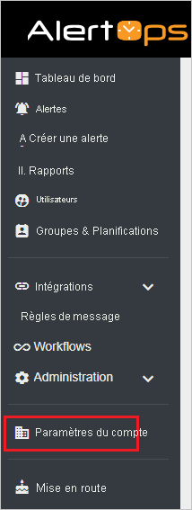
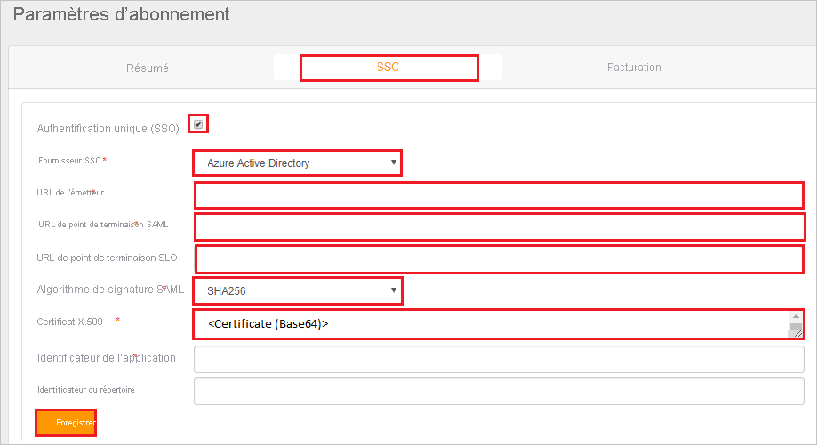
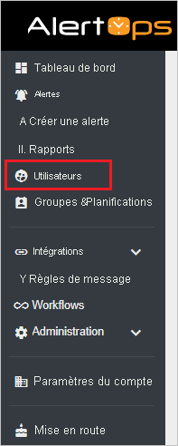
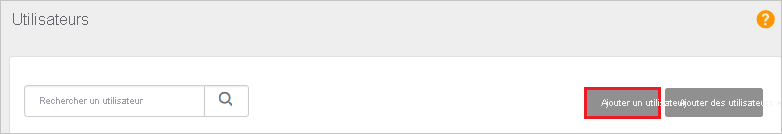

# Tutoriel : Intégrer AlertOps à Azure Active Directory

Dans ce tutoriel, vous allez découvrir comment intégrer AlertOps à Azure Active Directory (Azure AD). Lorsque vous intégrez AlertOps à Azure AD, vous pouvez :

* Contrôler qui a accès à AlertOps dans Azure AD.
* Permettre à vos utilisateurs de se connecter automatiquement à AlertOps avec leur compte Azure AD.
* Gérer vos comptes à un emplacement central : le Portail Azure.

## Prérequis

Pour commencer, vous devez disposer de ce qui suit :

* Un abonnement Azure AD Si vous ne disposez d’aucun abonnement, vous pouvez obtenir [un compte gratuit](https://azure.microsoft.com/free/).
* Un abonnement AlertOps pour lequel l’authentification unique (SSO) est activée.

## Description du scénario

Dans ce tutoriel, vous allez configurer et tester l’authentification unique Azure AD dans un environnement de test.

* AlertOps prend en charge l’authentification unique initiée par **le fournisseur de services et le fournisseur d’identité**.

## Ajout d’AlertOps à partir de la galerie

Pour configurer l’intégration d’AlertOps à Azure AD, vous devez ajouter AlertOps à partir de la galerie à votre liste d’applications SaaS managées.

1. Connectez-vous au portail Azure avec un compte professionnel ou scolaire ou avec un compte personnel Microsoft.
1. Dans le panneau de navigation gauche, sélectionnez le service **Azure Active Directory**.
1. Accédez à **Applications d’entreprise**, puis sélectionnez **Toutes les applications**.
1. Pour ajouter une nouvelle application, sélectionnez **Nouvelle application**.
1. Dans la section **Ajouter à partir de la galerie**, tapez **AlertOps** dans la zone de recherche.
1. Sélectionnez **AlertOps** dans le volet de résultats, puis ajoutez l’application. Patientez quelques secondes pendant que l’application est ajoutée à votre locataire.

## Configurer et tester l’authentification unique Azure AD pour AlertOps

Configurez et testez l’authentification unique Azure AD avec AlertOps à l’aide d’un utilisateur de test appelé **B.Simon**. Pour que l’authentification unique fonctionne, vous devez établir un lien entre un utilisateur Azure AD et l’utilisateur AlertOps associé.

Pour configurer et tester Azure AD SSO avec AlertOps, effectuez les étapes suivantes :

1. **[Configurer l’authentification unique Azure AD](#configure-azure-ad-sso)** pour permettre à vos utilisateurs d’utiliser cette fonctionnalité.
    1. **[Créer un utilisateur de test Azure AD](#create-an-azure-ad-test-user)** pour tester l’authentification unique Azure AD avec B. Simon.
    1. **[Affecter l’utilisateur de test Azure AD](#assign-the-azure-ad-test-user)** pour permettre à B. Simon d’utiliser l’authentification unique Azure AD.
1. **[Configurer l’authentification unique AlertOps](#configure-alertops-sso)** pour configurer les paramètres de l’authentification unique côté application.
    1. **[Créer un utilisateur de test AlertOps](#create-alertops-test-user)** pour avoir un équivalent de B.Simon dans AlertOps qui soit lié à la représentation de l’utilisateur Azure AD.
1. **[Tester l’authentification unique](#test-sso)** pour vérifier si la configuration fonctionne.

## Configurer l’authentification unique Azure AD

Effectuez les étapes suivantes pour activer l’authentification unique Azure AD dans le Portail Azure.

1. Dans le portail Azure, accédez à la page d’intégration de l’application **AlertOps**, recherchez la section **Gérer** et sélectionnez **Authentification unique**.
1. Dans la page **Sélectionner une méthode d’authentification unique**, sélectionnez **SAML**.
1. Dans la page **Configurer l’authentification unique avec SAML**, cliquez sur l’icône de crayon pour **Configuration SAML de base** afin de modifier les paramètres.

   

1. Dans la section **Configuration SAML de base**, si vous souhaitez configurer l’application en mode lancé par le **fournisseur d’identité**, effectuez les étapes suivantes :

    1. Dans la zone de texte **Identificateur**, tapez une URL au format suivant : `https://<SUBDOMAIN>.alertops.com`

    1. Dans la zone de texte **URL de réponse**, tapez une URL au format suivant : `https://<SUBDOMAIN>.alertops.com/login.aspx`

1. Si vous souhaitez configurer l’application en **mode démarré par le fournisseur de services**, cliquez sur **Définir des URL supplémentaires**, puis effectuez les étapes suivantes :

    Dans la zone de texte **URL de connexion**, tapez une URL au format suivant : `https://<SUBDOMAIN>.alertops.com/login.aspx`

    > [!NOTE]
    > Il ne s’agit pas de valeurs réelles. Mettez à jour ces valeurs avec l’identificateur, l’URL de réponse et l’URL de connexion réels. Pour obtenir ces valeurs, contactez l’[équipe du support client AlertOps](mailto:support@alertops.com). Vous pouvez également consulter les modèles figurant à la section **Configuration SAML de base** dans le portail Azure.

1. Dans la page **Configurer l’authentification unique avec SAML**, dans la section **Certificat de signature SAML**, recherchez **Certificat (Base64)** , puis sélectionnez **Télécharger** pour télécharger le certificat et l’enregistrer sur votre ordinateur.

   

1. Dans la section **Configurer AlertOps**, copiez la ou les URL appropriées en fonction de vos besoins.

   

### Créer un utilisateur de test Azure AD

Dans cette section, vous allez créer un utilisateur de test appelé Britta Simon dans le Portail Azure.

1. Dans le volet gauche du Portail Azure, sélectionnez **Azure Active Directory**, **Utilisateurs**, puis **Tous les utilisateurs**.
1. Sélectionnez **Nouvel utilisateur** dans la partie supérieure de l’écran.
1. Dans les propriétés **Utilisateur**, effectuez les étapes suivantes :
   1. Dans le champ **Nom**, entrez `Britta Simon`.  
   1. Dans le champ **Nom de l’utilisateur**, entrez username@companydomain.extension. Par exemple : `BrittaSimon@contoso.com`.
   1. Cochez la case **Afficher le mot de passe**, puis notez la valeur affichée dans le champ **Mot de passe**.
   1. Cliquez sur **Créer**.

### Affecter l’utilisateur de test Azure AD

Dans cette section, vous allez autoriser Britta Simon à utiliser l’authentification unique Azure en lui accordant l’accès à AlertOps.

1. Dans le portail Azure, sélectionnez **Applications d’entreprise**, puis **Toutes les applications**.
1. Dans la liste des applications, sélectionnez **AlertOps**.
1. Dans la page de vue d’ensemble de l’application, recherchez la section **Gérer** et sélectionnez **Utilisateurs et groupes**.
1. Sélectionnez **Ajouter un utilisateur**, puis **Utilisateurs et groupes** dans la boîte de dialogue **Ajouter une attribution**.
1. Dans la boîte de dialogue **Utilisateurs et groupes**, sélectionnez **Britta Simon** dans la liste Utilisateurs, puis cliquez sur le bouton **Sélectionner** en bas de l’écran.
1. Si vous attendez une valeur de rôle dans l’assertion SAML, dans la boîte de dialogue **Sélectionner un rôle**, sélectionnez le rôle approprié pour l’utilisateur dans la liste, puis cliquez sur le bouton **Sélectionner** en bas de l’écran.
1. Dans la boîte de dialogue **Ajouter une attribution**, cliquez sur le bouton **Attribuer**.

## Configurer AlertOps

1. Pour automatiser la configuration dans AlertOps, vous devez installer l’**extension de navigateur My Apps Secure Sign-in** en cliquant sur **Installer l’extension**.

    

2. Après l’ajout de l’extension au navigateur, cliquez sur **Configurer AlertOps** pour être redirigé vers l’application AlertOps. À partir de là, indiquez les informations d’identification de l’administrateur pour vous connecter à AlertOps. Cette extension de navigateur configure automatiquement l’application et automatise les étapes 3 à 5.

    

3. Si vous souhaitez configurer manuellement AlertOps, ouvrez une nouvelle fenêtre de navigateur web, connectez-vous à votre site d’entreprise AlertOps en tant qu’administrateur, puis effectuez les étapes suivantes :

4. Sélectionnez **Account Settings** (Paramètres du compte) dans le volet de navigation gauche.

    

5. Dans la page **Subscription Settings** (Paramètres d’abonnement) , sélectionnez **SSO** et effectuez les étapes suivantes :

    

    a. Cochez la case **Use Single Sign-On(SSO)** (Utiliser l’authentification unique).

    b. Sélectionnez **Azure Active Directory** comme **SSO Provider** (Fournisseur d’authentification unique) dans la liste déroulante.

    c. Dans la zone de texte **Issuer URL** (URL de l’émetteur), utilisez la même valeur d’identificateur que celle de la section **Configuration SAML de base** du portail Azure.

    d. Dans la zone de texte **SAML endpoint URL** (URL de point de terminaison SAML), collez l’**URL de connexion** que vous avez copiée à partir du portail Azure.

    e. Dans la zone de texte **SLO endpoint URL** (URL de point de terminaison SLO), collez l’**URL de connexion** que vous avez copiée à partir du portail Azure.

    f. Sélectionnez **SHA256** comme **SAML Signature Algorithm** (Algorithme de Signature SAML) dans la liste déroulante.

    g. Ouvrez votre Certificat (Base64) téléchargé dans le Bloc-notes. Copiez son contenu dans le Presse-papiers, puis collez-le dans la zone de texte X.509 Certificate (Certificat X.509).

### Créer un utilisateur de test AlertOps

1. Dans une autre fenêtre de navigateur, connectez-vous à votre site d’entreprise AlertOps en tant qu’administrateur.

2. Cliquez sur **Users** (Utilisateurs) dans le panneau de navigation gauche.

    

3. Sélectionnez **Add User** (Ajouter un utilisateur).

    

4. Dans la boîte de dialogue **Ajouter un utilisateur**, procédez comme suit :

    

    a. Dans la zone de texte **Login User Name** (Nom d’utilisateur de connexion), entrez le nom d’un utilisateur, par exemple **Brittasimon**.

    b. Dans la zone de texte **E-mail officiel**, entrez l’adresse e-mail de l’utilisateur, par exemple **Brittasimon\@contoso.com**.

    c. Dans la zone de texte **Prénom**, entrez le prénom de l’utilisateur, par exemple **Britta**.

    d. Dans la zone de texte **Last name** (Nom), tapez le nom de famille de l’utilisateur, par exemple **Simon**.

    e. Sélectionnez la valeur **Type** dans la liste déroulante en fonction de votre organisation.

    f. Sélectionnez le **Rôle** de l’utilisateur dans la liste déroulante en fonction de votre organisation.

    g. Sélectionnez **Ajouter**.

## Tester l’authentification unique (SSO)

Dans cette section, vous allez tester votre configuration de l’authentification unique Azure AD avec les options suivantes. 

#### Lancée par le fournisseur de services :

* Cliquez sur **Tester cette application** dans le portail Azure. Vous êtes redirigé vers l’URL de connexion à AlertOps à partir de laquelle vous pouvez lancer le flux de connexion.  

* Accédez directement à l’URL de connexion à AlertOps pour lancer le flux de connexion.

#### Lancée par le fournisseur d’identité :

* Cliquez sur **Tester cette application** dans le portail Azure : vous devez être connecté automatiquement à l’instance d’AlertOps pour laquelle vous avez configuré l’authentification unique. 

Vous pouvez aussi utiliser Mes applications de Microsoft pour tester l’application dans n’importe quel mode. Si, lorsque vous cliquez sur la vignette AlertOps dans Mes applications, le mode Fournisseur de services est configuré, vous êtes redirigé vers la page de connexion de l’application pour lancer le flux de connexion ; s’il s’agit du mode Fournisseur d’identité, vous êtes automatiquement connecté à l’instance d’AlertOps pour laquelle vous avez configuré l’authentification unique. Pour plus d’informations sur Mes applications, consultez [Présentation de Mes applications](../user-help/my-apps-portal-end-user-access.md).

## Étapes suivantes

Une fois que vous avez configuré AlertOps, vous pouvez appliquer le contrôle de session, qui protège contre l’exfiltration et l’infiltration des données sensibles de votre organisation en temps réel. Le contrôle de session est étendu à partir de l’accès conditionnel. [Découvrez comment appliquer un contrôle de session avec Microsoft Cloud App Security](/cloud-app-security/proxy-deployment-aad).