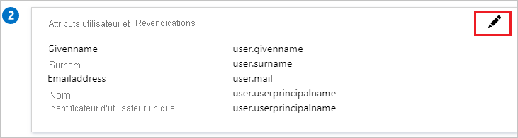
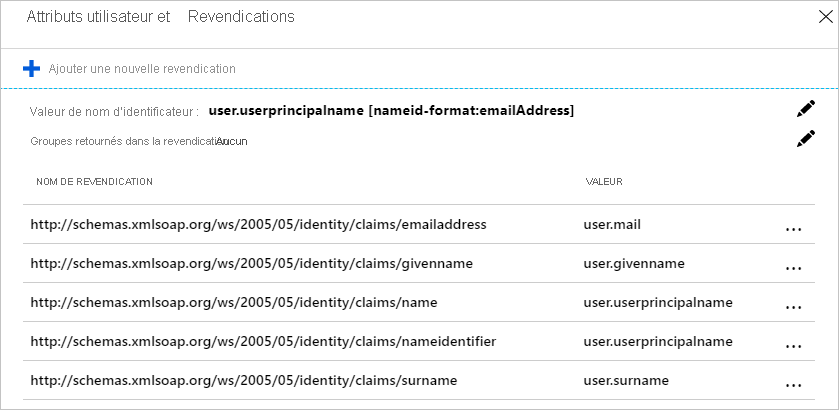
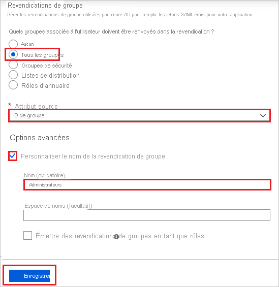
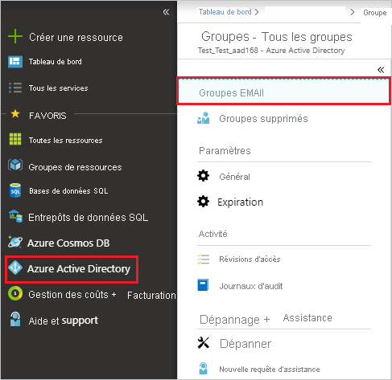
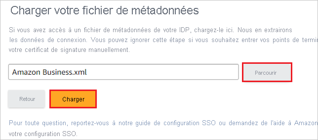
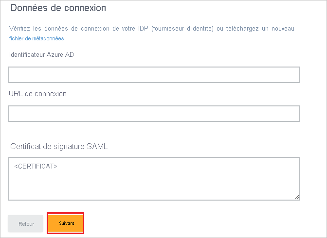
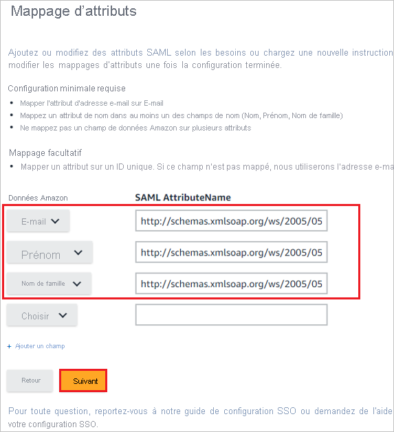
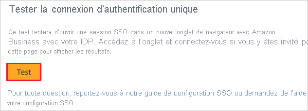
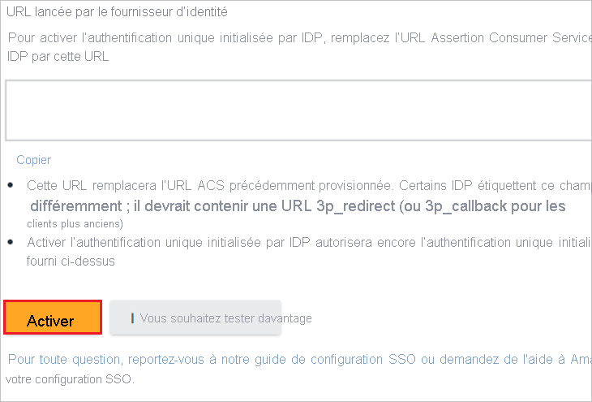
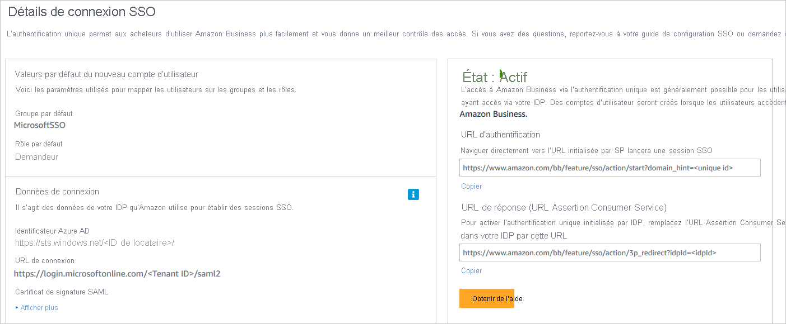

# Tutoriel : Intégrer Amazon Business à Azure Active Directory

Dans ce tutoriel, vous allez découvrir comment intégrer Amazon Business à Azure Active Directory (Azure AD). Quand vous intégrez Amazon Business à Azure AD, vous pouvez :

* Contrôler dans Azure AD qui a accès à Amazon Business.
* Permettre à vos utilisateurs de se connecter automatiquement à Amazon Business avec leur compte Azure AD.
* Gérer vos comptes à un emplacement central : le Portail Azure.

## Prérequis

Pour commencer, vous devez disposer de ce qui suit :

* Un abonnement Azure AD Si vous ne disposez d’aucun abonnement, vous pouvez obtenir [un compte gratuit](https://azure.microsoft.com/free/).
* Un abonnement Amazon Business pour lequel l’authentification unique (SSO) est activée Accédez à la page [Amazon Business](https://www.amazon.com/business/register/org/landing?ref_=ab_reg_mlp) pour créer un compte Amazon Business.

## Description du scénario

Dans ce tutoriel, vous allez configurer et tester l’authentification unique Azure AD dans un compte Amazon Business existant.

* Amazon Business prend en charge l’authentification unique lancée par **le fournisseur de services et le fournisseur d’identité**.
* Amazon Business prend en charge le provisionnement d’utilisateurs **Juste-à-temps**.

> [!NOTE]
> L’identificateur de cette application étant une valeur de chaîne fixe, une seule instance peut être configurée dans un locataire.

## Ajout d’Amazon Business à partir de la galerie

Pour configurer l’intégration d’Amazon Business à Azure AD, vous devez ajouter Amazon Business depuis la galerie à votre liste d’applications SaaS gérées.

1. Connectez-vous au portail Azure avec un compte professionnel ou scolaire ou avec un compte personnel Microsoft.
1. Dans le panneau de navigation gauche, sélectionnez le service **Azure Active Directory**.
1. Accédez à **Applications d’entreprise**, puis sélectionnez **Toutes les applications**.
1. Pour ajouter une nouvelle application, sélectionnez **Nouvelle application**.
1. Dans la section **Ajouter à partir de la galerie**, tapez **Amazon Business** dans la zone de recherche.
1. Sélectionnez **Amazon Business** dans le panneau de résultats, puis ajoutez l’application. Patientez quelques secondes pendant que l’application est ajoutée à votre locataire.

## Configurer et tester l’authentification unique Azure AD pour Amazon Business

Configurez et testez l’authentification unique Azure AD avec Amazon Business pour un utilisateur de test nommé **B.Simon**. Pour que l’authentification unique fonctionne, vous devez établir une relation entre un utilisateur Azure AD et l’utilisateur Amazon Business associé.

Pour configurer et tester l’authentification unique Azure AD avec Amazon Business, effectuez les étapes suivantes :

1. **[Configurer l’authentification unique Azure AD](#configure-azure-ad-sso)** pour permettre à vos utilisateurs d’utiliser cette fonctionnalité.
    1. **[Créer un utilisateur de test Azure AD](#create-an-azure-ad-test-user)** pour tester l’authentification unique Azure AD avec B. Simon.
    1. **[Affecter l’utilisateur de test Azure AD](#assign-the-azure-ad-test-user)** pour permettre à B. Simon d’utiliser l’authentification unique Azure AD.
1. **[Configurer l’authentification unique Amazon Business](#configure-amazon-business-sso)** pour configurer les paramètres de l’authentification unique côté application.
    1. **[Créer un utilisateur de test Amazon Business](#create-amazon-business-test-user)** pour avoir un équivalent de B.Simon dans Amazon Business lié à sa représentation dans Azure AD.
1. **[Tester l’authentification unique](#test-sso)** pour vérifier si la configuration fonctionne.

## Configurer l’authentification unique Azure AD

Effectuez les étapes suivantes pour activer l’authentification unique Azure AD dans le Portail Azure.

1. Dans le portail Azure, dans la page d’intégration de l’application **Amazon Business**, recherchez la section **Gérer** et sélectionnez **Authentification unique**.
1. Dans la page **Sélectionner une méthode d’authentification unique**, sélectionnez **SAML**.
1. Dans la page **Configurer l’authentification unique avec SAML**, cliquez sur l’icône de crayon pour **Configuration SAML de base** afin de modifier les paramètres.

    

1. Dans la section **Configuration SAML de base**, si vous souhaitez configurer en mode lancé par le **fournisseur d’identité**, suivez les étapes ci-dessous :

    1. Dans la zone de texte **Identificateur (ID d’entité)** , tapez une des URL suivantes :

       | URL | Région |
       |-|-|
       | `https://www.amazon.com`| Amérique du Nord |
       | `https://www.amazon.co.jp`| Asie Est |
       | `https://www.amazon.de`| Europe |

    1. Dans la zone de texte **URL de réponse** , tapez une URL en utilisant un des modèles suivants :

       | URL | Région |
       |-|-|
       | `https://www.amazon.com/bb/feature/sso/action/3p_redirect?idpid={idpid}`| Amérique du Nord |
       | `https://www.amazon.co.jp/bb/feature/sso/action/3p_redirect?idpid={idpid}`| Asie Est |
       | `https://www.amazon.de/bb/feature/sso/action/3p_redirect?idpid={idpid}`| Europe |

       > [!NOTE]
       > La valeur de l’URL de réponse n’est pas réelle. Mettez à jour la valeur avec l’URL de réponse réelle. Vous obtenez la valeur `<idpid>` de la section de configuration de l’authentification unique Amazon Business, qui est expliquée plus loin dans le tutoriel. Vous pouvez également consulter les modèles figurant à la section **Configuration SAML de base** dans le portail Azure.

1. Si vous souhaitez configurer l’application en mode lancée par le **fournisseur de services**, vous devez ajouter l’URL complète fournie dans la configuration Amazon Business à l’**URL de connexion** dans la section **Définir des URL supplémentaires**.

1. La capture d’écran suivante montre la liste des attributs par défaut. Modifiez les attributs en cliquant sur l’icône **crayon** dans la section **Attributs et revendications de l’utilisateur**.

    

1. Éditez les attributs et copiez la valeur de **Espace de noms** de ces attributs dans le Bloc-notes.

    

1. En plus de ce qui précède, l’application Amazon Business s’attend à ce que quelques attributs supplémentaires soient passés dans la réponse SAML. Dans la section **Attributs et revendications de l’utilisateur** de la boîte de dialogue **Revendications de groupe** , effectuez les étapes suivantes :

    1. Cliquez sur le **stylo** en regard de **Groupes renvoyés dans la revendication**.

        

        

    1. Sélectionnez **Tous les groupes** dans la liste d’options.

    1. Sélectionnez **ID de groupe** comme **Attribut de la source**.

    1. Cochez la case **Personnaliser le nom de la revendication de groupe** et entrez le nom du groupe en fonction des besoins de votre organisation.

    1. Cliquez sur **Enregistrer**.

1. Dans la page **Configurer l’authentification unique avec SAML**, dans la section **Certificat de signature SAML**, recherchez **XML des métadonnées**, puis sélectionnez **Télécharger** pour télécharger le certificat et l’enregistrer sur votre ordinateur.

    

1. Dans la section **Configurer Amazon Business**, copiez la ou les URL appropriées en fonction de vos besoins.

    

### Créer un utilisateur de test Azure AD

Dans cette section, vous allez créer un utilisateur de test appelé B. Simon dans le portail Azure.

> [!NOTE]
> Si nécessaire, les administrateurs doivent créer les utilisateurs de test dans leur locataire. Les étapes suivantes montrent comment créer un utilisateur de test.

1. Dans le volet gauche du Portail Azure, sélectionnez **Azure Active Directory**, **Utilisateurs**, puis **Tous les utilisateurs**.
1. Sélectionnez **Nouvel utilisateur** dans la partie supérieure de l’écran.
1. Dans les propriétés **Utilisateur**, effectuez les étapes suivantes :
   1. Dans le champ **Nom**, entrez `B.Simon`.  
   1. Dans le champ **Nom de l’utilisateur**, entrez username@companydomain.extension. Par exemple : `B.Simon@contoso.com`.
   1. Cochez la case **Afficher le mot de passe**, puis notez la valeur affichée dans le champ **Mot de passe**.
   1. Cliquez sur **Créer**.

### Créer un groupe de sécurité Azure Active Directory dans le portail Azure

1. Cliquez sur **Azure Active Directory > Tous les groupes**.

    

1. Cliquez sur **Nouveau groupe**.

    

1. Complétez les champs **Type de groupe**, **Nom du groupe**, **Description du groupe**, **Type d’appartenance**. Cliquez sur la flèche pour sélectionner des membres, puis recherchez le membre que vous souhaitez ajouter au groupe ou cliquez dessus. Cliquez sur **Sélectionner** pour ajouter les membres sélectionnés, puis cliquez sur **Créer**.

    

### Affecter l’utilisateur de test Azure AD

Dans cette section, vous allez autoriser B. Simon à utiliser l’authentification unique Azure en lui accordant l’accès à Amazon Business.

1. Dans le portail Azure, sélectionnez **Applications d’entreprise**, puis **Toutes les applications**.
1. Dans la liste des applications, sélectionnez **Amazon Business**.
1. Dans la page de vue d’ensemble de l’application, recherchez la section **Gérer** et sélectionnez **Utilisateurs et groupes**.
1. Sélectionnez **Ajouter un utilisateur**, puis **Utilisateurs et groupes** dans la boîte de dialogue **Ajouter une attribution**.
1. Dans la boîte de dialogue **Utilisateurs et groupes**, sélectionnez **B. Simon** dans la liste Utilisateurs, puis cliquez sur le bouton **Sélectionner** au bas de l’écran.
1. Si vous attendez une valeur de rôle dans l’assertion SAML, dans la boîte de dialogue **Sélectionner un rôle**, sélectionnez le rôle approprié pour l’utilisateur dans la liste, puis cliquez sur le bouton **Sélectionner** en bas de l’écran.
1. Dans la boîte de dialogue **Ajouter une attribution**, cliquez sur le bouton **Attribuer**.

    >[!NOTE]
    > Si vous n’affectez pas les utilisateurs dans Azure AD, vous recevez l’erreur suivante.

    

### Affecter un groupe de sécurité Azure Active Directory dans le portail Azure

1. Dans le portail Azure, sélectionnez **Applications d’entreprise**, **Toutes les applications**, puis **Amazon Business**.
2. Dans la liste des applications, tapez et sélectionnez **Amazon Business**.
3. Dans le menu de gauche, sélectionnez **Utilisateurs et groupes**.
4. Cliquez sur le **Ajouter un utilisateur**.
5. Recherchez le groupe de sécurité à utiliser, puis cliquez sur le groupe pour l’ajouter à la section Sélectionner des membres. Cliquez sur **Sélectionner**, puis sur **Affecter**.

    

    > [!NOTE]
    > Cochez les notifications dans la barre de menus pour être informé que le groupe a été correctement affecté à l’Application d’entreprise dans le portail Azure.

## Configurer l’authentification unique Amazon Business

1. Dans une autre fenêtre de navigateur web, connectez-vous au site Amazon Business de votre entreprise en tant qu’administrateur.

1. Cliquez sur **User profile** (Profil utilisateur) et sélectionnez **Business Settings** (Paramètres de l’entreprise).

    

1. Dans l’Assistant **System integrations** (Intégrations système), sélectionnez **Single Sign-On (SSO)** (Authentification unique).

    

1. Dans l’Assistant **Set up SSO** (Configurer l’authentification unique), sélectionnez le fournisseur en fonction des exigences de votre organisation, puis cliquez sur **Next** (Suivant).

    

    > [!NOTE]
    > Bien que l’option Microsoft ADFS soit listée, elle ne fonctionnera pas avec l’authentification unique Azure AD.

1. Dans l’Assistant **New user account defaults** (Valeurs par défaut pour les nouveaux comptes d’utilisateur), sélectionnez le **Default Group** (Groupe par défaut), puis sélectionnez **Default Buying Role** (Rôle d’achat par défaut) en fonction du rôle de l’utilisateur dans votre organisation, puis cliquez sur **Next** (Suivant).

    

1. Dans l’Assistant **Upload your metadata file** (Charger votre fichier de métadonnées), cliquez sur **Browse** (Parcourir) pour charger le fichier **Metadata XML** (XML de métadonnées) que vous avez téléchargé à partir du portail Azure, puis cliquez sur **Upload** (Télécharger).

    

1. Une fois que vous avez chargé le fichier de métadonnées téléchargé, les champs de la section **Connection data** (Données de connexion) sont renseignés automatiquement. Après cela, cliquez sur **Next** (Suivant).

    

1. Dans l’Assistant **Upload your Attribute statement** (Charger votre déclaration d’attributs), cliquez sur **Skip** (Ignorer).

    

1. Dans l’Assistant **Attribute mapping** (Mappage d’attributs), ajoutez les champs des spécifications en cliquant sur l’option **+ Add a field** (+ Ajouter un champ). Ajoutez les valeurs des attributs en y incluant l’espace de noms que vous avez copié depuis la section **Attributs et revendications de l’utilisateur** du portail Azure dans le champ **SAML AttributeName** (Nom d’attribut SAML), puis cliquez sur **Next** (Suivant).

    

1. Dans l’Assistant **Amazon connection data** (Données de connexion Amazon), cliquez sur **Next** (Suivant).

    

1. Vérifiez l’**État** des étapes qui ont été configurées, puis cliquez **Start testing** (Démarrer le test).

    

1. Dans l’Assistant **Test SSO Connection** (Tester la connexion d’authentification unique), cliquez sur **Test** (Tester).

    

1. Dans l’Assistant **IDP initiated URL** (URL lancée par le fournisseur d’identité), avant de cliquer sur **Activate** (Activer), copiez la valeur qui est affectée à **idpid** et collez-la dans le paramètre **idpid** de **URL de réponse** dans la section **Configuration SAML de base** du portail Azure.

    

1. Dans l’Assistant **Are you ready to switch to active SSO?** (Êtes-vous prêt à passer à l’authentification unique ?), cochez la case **I have fully tested SSO and am ready to go live** (J’ai entièrement testé l’authentification unique et je suis prêt à l’activer), puis cliquez sur **Switch to active** (Passer à l’activation).

    

1. Enfin, dans la section **SSO Connection details** (Détails de la connexion SSO), l’**État** apparaît comme étant **Active** (Actif).

    

    > [!NOTE]
    > Si vous souhaitez configurer l’application en mode lancée par le **fournisseur de services**, effectuez l’étape suivante, et collez l’URL de connexion à partir de la capture d’écran ci-dessus dans la zone de texte **URL de connexion** de la section **Définir des URL supplémentaires** dans le portail Azure. Utilisez le format suivant :
    >
    > `https://www.amazon.<TLD>/bb/feature/sso/action/start?domain_hint=<UNIQUE_ID>`

### Créer un utilisateur de test Amazon Business

Dans cette section, un utilisateur appelé B.Simon est créé dans Amazon Business. Amazon Business prend en charge le provisionnement d’utilisateurs juste-à-temps, qui est activée par défaut. Vous n’avez aucune opération à effectuer dans cette section. S’il n’existe pas encore d’utilisateur dans Amazon Business, un utilisateur est créé après l’authentification.

## Tester l’authentification unique (SSO)

Dans cette section, vous allez tester votre configuration de l’authentification unique Azure AD avec les options suivantes. 

#### Lancée par le fournisseur de services :

* Cliquez sur **Tester cette application** dans le portail Azure. Vous êtes alors redirigé vers l’URL de connexion à Amazon Business, où vous pouvez lancer le flux de connexion.  

* Accédez directement à l’URL de connexion à Amazon Business et lancez le flux de connexion.

#### Lancée par le fournisseur d’identité :

* Cliquez sur **Tester cette application** dans le portail Azure. Vous êtes alors automatiquement connecté à l’instance d’Amazon Business pour laquelle vous avez configuré l’authentification unique. 

Vous pouvez aussi utiliser Mes applications de Microsoft pour tester l’application dans n’importe quel mode. Si, lorsque vous cliquez sur la vignette Amazon Business dans Mes applications, le mode Fournisseur de services est configuré, vous êtes redirigé vers la page de connexion de l’application pour lancer le flux de connexion ; s’il s’agit du mode Fournisseur d’identité, vous êtes automatiquement connecté à l’instance d’Amazon Business pour laquelle vous avez configuré l’authentification unique. Pour plus d’informations sur Mes applications, consultez [Présentation de Mes applications](../user-help/my-apps-portal-end-user-access.md).

## Étapes suivantes

Après avoir configuré Amazon Business, vous pouvez appliquer le contrôle de session, qui protège contre l’exfiltration et l’infiltration des données sensibles de votre organisation en temps réel. Le contrôle de session est étendu à partir de l’accès conditionnel. [Découvrez comment appliquer un contrôle de session avec Microsoft Cloud App Security](/cloud-app-security/proxy-deployment-aad).
