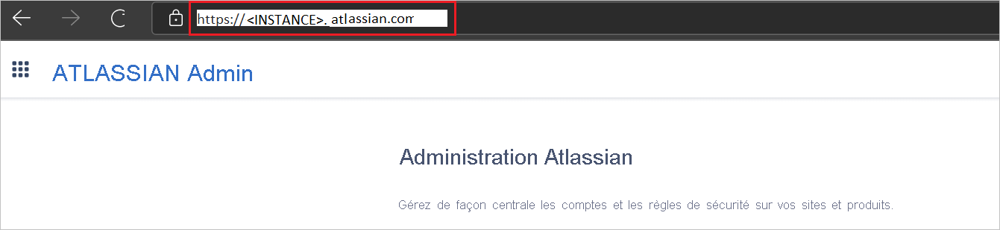
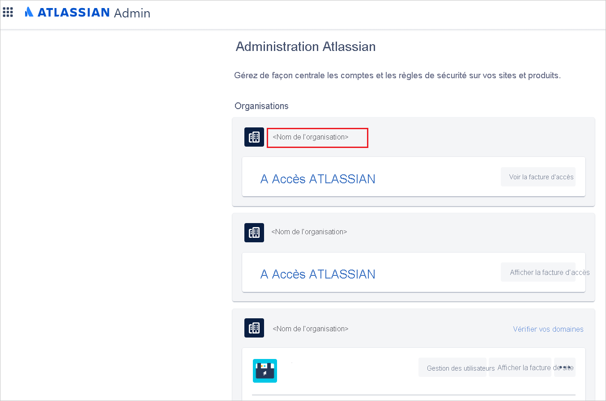
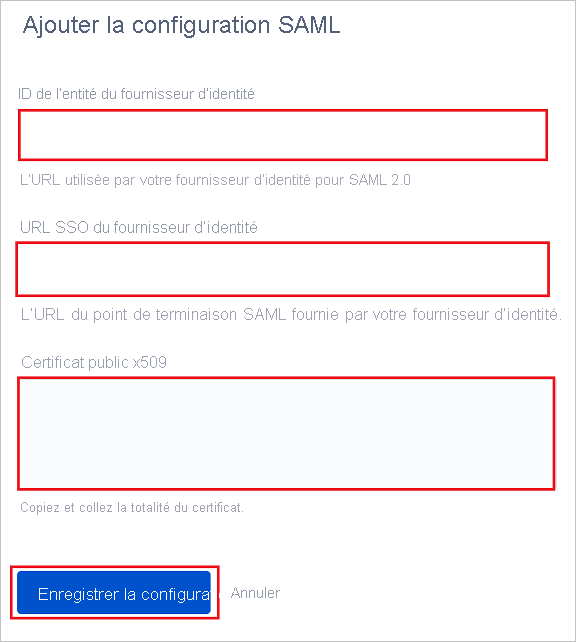
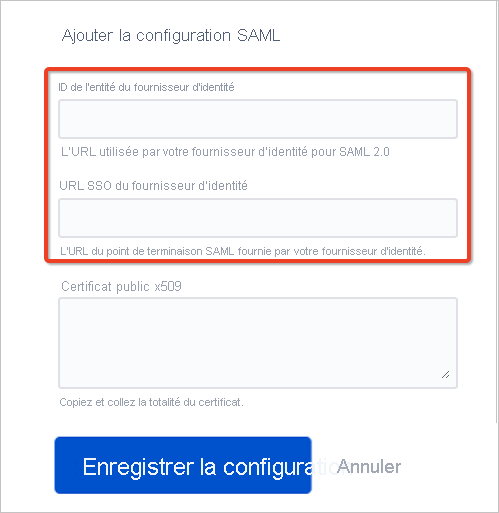
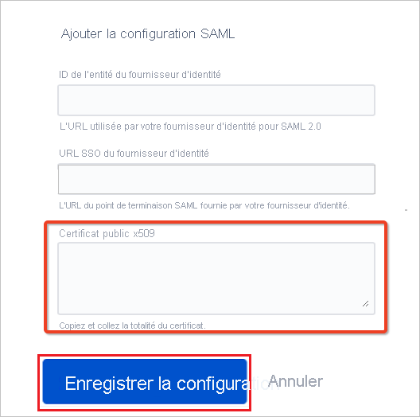
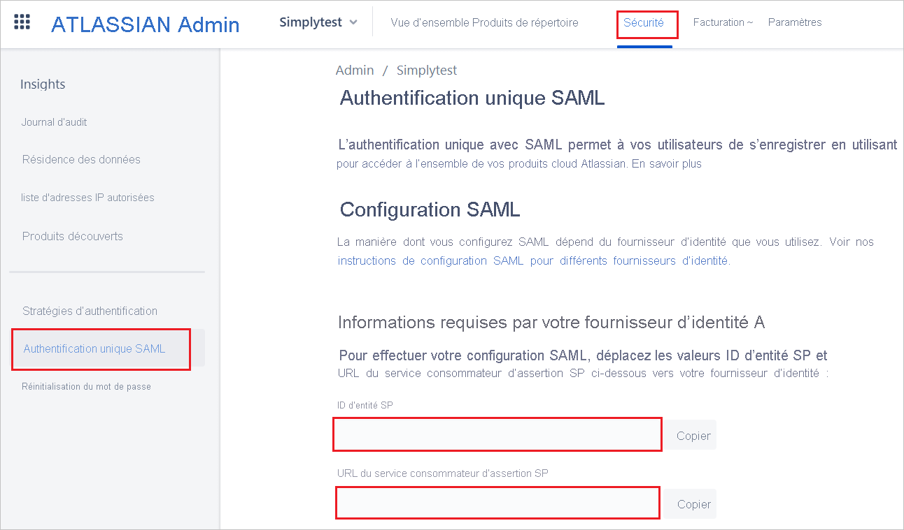
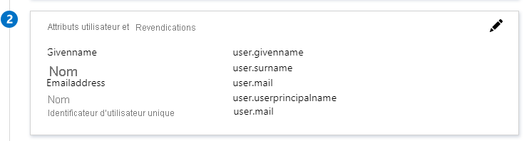
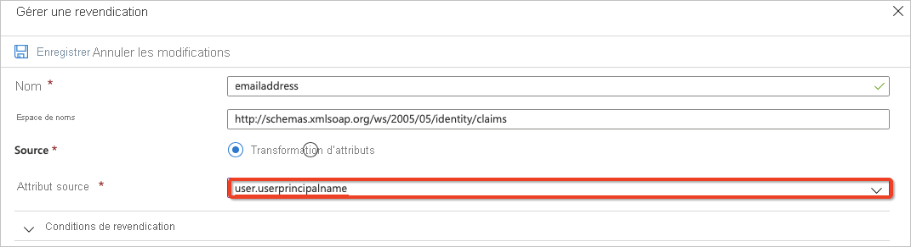
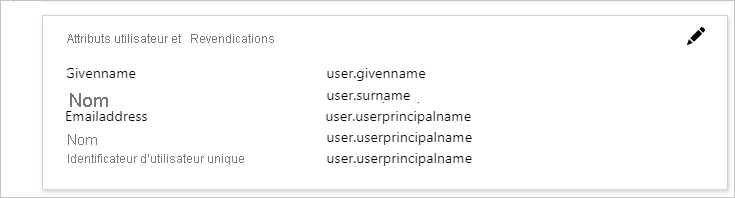
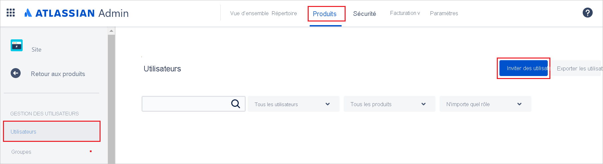

# Tutoriel : Intégrer Atlassian Cloud à Azure Active Directory

Dans ce didacticiel, vous allez apprendre à intégrer Atlassian Cloud à Azure Active Directory (Azure AD). Lorsque vous intégrez Atlassian Cloud à Azure AD, vous pouvez :

* Dans Azure AD, contrôlez qui a accès à Atlassian Cloud.
* Permettre à vos utilisateurs de se connecter automatiquement à Atlassian Cloud avec leur compte Azure AD.
* Gérer vos comptes à un emplacement central : le Portail Azure.

## Prérequis

Pour commencer, vous devez disposer de ce qui suit :

* Un abonnement Azure AD Si vous ne disposez d’aucun abonnement, vous pouvez obtenir [un compte gratuit](https://azure.microsoft.com/free/).
* Un abonnement Atlassian Cloud pour lequel l’authentification unique est activée.
* Si vous souhaitez activer l’authentification unique SAML (Security Assertion Markup Language) pour les produits Atlassian Cloud, vous devez configurer Atlassian Access. En savoir plus sur [Atlassian Access]( https://www.atlassian.com/enterprise/cloud/identity-manager)

> [!NOTE]
> Cette intégration peut également être utilisée à partir de l’environnement cloud US Government Azure AD. Cette application est disponible dans la Galerie d’applications cloud US Government Azure AD et peut être configurée de la même façon que dans le cloud public.

## Description du scénario

Dans ce tutoriel, vous allez configurer et tester l’authentification unique Azure AD dans un environnement de test. 

* Atlassian Cloud prend en charge l’authentification unique lancée par **le fournisseur de services et le fournisseur d’identité**.
* Atlassian Cloud prend en charge le [provisionnement et le déprovisionnement automatiques des utilisateurs](atlassian-cloud-provisioning-tutorial.md).

## Ajouter Atlassian Cloud à partir de la galerie

Pour configurer l’intégration d’Atlassian Cloud à Azure AD, vous devez ajouter Atlassian Cloud de la galerie à votre liste d’applications SaaS gérées.

1. Connectez-vous au portail Azure avec un compte professionnel ou scolaire ou avec un compte personnel Microsoft.
1. Dans le panneau de navigation gauche, sélectionnez le service **Azure Active Directory**.
1. Accédez à **Applications d’entreprise**, puis sélectionnez **Toutes les applications**.
1. Pour ajouter une nouvelle application, sélectionnez **Nouvelle application**.
1. Dans la section **Ajouter à partir de la galerie**, tapez **Atlassian Cloud** dans la zone de recherche.
1. Sélectionnez **Atlassian Cloud** dans le volet de résultats, puis ajoutez l’application. Patientez quelques secondes pendant que l’application est ajoutée à votre locataire.

## Configurer et tester l’authentification unique Azure AD

Configurez et testez l’authentification unique Azure AD avec Atlassian Cloud à l’aide d’un utilisateur de test appelé **B. Simon**. Pour que l’authentification unique fonctionne, vous devez établir un lien entre un utilisateur Azure AD et l’utilisateur Atlassian Cloud associé.

Pour configurer et tester l’authentification unique Azure AD avec Atlassian Cloud, effectuez les étapes suivantes :

1. **[Configurer Azure AD avec l'authentification unique Atlassian](#configure-azure-ad-with-atlassian-cloud-sso)** - pour permettre à vos utilisateurs d'utiliser l'authentification unique Azure AD basée sur SAML avec Atlassian Cloud.
    1. **[Créer un utilisateur de test Azure AD](#create-an-azure-ad-test-user)** pour tester l’authentification unique Azure AD avec B. Simon.
    1. **[Affecter l’utilisateur de test Azure AD](#assign-the-azure-ad-test-user)** pour permettre à B. Simon d’utiliser l’authentification unique Azure AD.
1. **[Créer un utilisateur de test Atlassian Cloud](#create-atlassian-cloud-test-user)** pour avoir un équivalent de B. Simon dans Atlassian Cloud lié à la représentation Azure AD associée.
1. **[Tester l’authentification unique](#test-sso)** pour vérifier si la configuration fonctionne.

## Configurer Azure AD avec l’authentification unique d’Atlassian

Effectuez les étapes suivantes pour activer l’authentification unique Azure AD dans le Portail Azure.

1. Pour automatiser la configuration dans Atlassian Cloud, vous devez installer l’**extension de navigateur My Apps Secure Sign-in** en cliquant sur **Install the extension**.

    

1. Une fois l’extension ajoutée au navigateur, le fait de cliquer sur **Configurer Atlassian Cloud** vous redirige vers l’application Atlassian Cloud. À partir de là, indiquez les informations d’identification de l’administrateur pour vous connecter à Atlassian Cloud. Cette extension de navigateur configure automatiquement l’application pour vous.

    

1. Si vous voulez configurer manuellement Atlassian Cloud, connectez-vous à votre site d’entreprise Atlassian Cloud en tant qu’administrateur, puis effectuez les étapes suivantes.

1. Avant de commencer, accédez à l’instance de votre produit Atlassian et copiez/enregistrez son URL.
   > [!NOTE]
   > L’URL doit correspondre au modèle `https://<INSTANCE>.atlassian.com`.

   

1. Ouvrez le [portail d’administration Atlassian](https://admin.atlassian.com/) et cliquez sur le nom de votre organisation.

   

1. Vous devez vérifier votre domaine avant de passer à la configuration de l’authentification unique. Pour plus d’informations, consultez le document [Domain verification(Vérification de domaine) d’Atlassian](https://confluence.atlassian.com/cloud/domain-verification-873871234.html).

1. Dans le portail **ATLASSIAN Admin**, accédez à l’onglet **Security** (Sécurité), sélectionnez **SAML single sign-on** (Authentification unique SAML), puis cliquez sur **Add SAML configuration** (Ajouter une configuration SAML).

   

1. Dans la section **Add SAML configuration** (Ajouter une configuration SAML), remplissez les champs obligatoires que vous avez copiés à partir du portail Azure puis cliquez sur **Save configuration** (Enregistrer la configuration).

   

1. Dans le portail Azure, accédez à la page d’intégration de l’application **Atlassian Cloud**, recherchez la section **Gérer** et sélectionnez **Configurer l’authentification unique**.

   

1. Dans la page **Sélectionner une méthode d’authentification unique**, sélectionnez **SAML**.

   

1. Sur la page **Configurer l’authentification unique avec SAML**, faites défiler jusqu’à **Configurer Atlassian Cloud**.
   
   a. Cliquez sur **URL de configuration**.

   
   
   b. Copiez la valeur du champ **Identificateur Azure AD** à partir du portail Azure et collez-la dans la zone de texte **ID d’entité du fournisseur d’identité** d’Atlassian.
   
   c. Copiez la valeur du champ **URL de connexion** à partir du portail Azure et collez-la dans la zone de texte **URL d’authentification unique du fournisseur d’identité** d’Atlassian.

   

   

1. Dans la page **Configurer l’authentification unique avec SAML**, dans la section **Certificat de signature SAML**, recherchez **Certificat (Base64)** , puis sélectionnez **Télécharger** pour télécharger le certificat et l’enregistrer sur votre ordinateur.

   

   

1. **Ajoutez** et **enregistrez** la configuration SAML dans Atlassian.

1. Dans la section **Configuration SAML de base**, procédez comme suit.

   a. Copiez la valeur du champ **ID d’entité du fournisseur de services** d’Atlassian, collez-la dans la zone **Identificateur (ID d’entité)** d’Azure et définissez-la comme valeur par défaut.
   
   b. Copiez la valeur du champ **URL Assertion Consumer Service du fournisseur de services** d’Atlassian, collez-la dans la zone **URL de réponse (URL Assertion Consumer Service)** d’Azure et définissez-la comme valeur par défaut.
   
   c. Copiez la valeur du champ **URL de l’instance**, que vous avez copiée à l’étape 4, et collez-la dans la zone **État de relais** d’Azure.

   

   

   
   
1. L’application Atlassian Cloud attend les assertions SAML dans un certain format, ce qui oblige à ajouter des mappages d’attributs personnalisés à la configuration des attributs du jeton SAML. Vous pouvez modifier le mappage d'attribut en cliquant sur l'icône **Modifier**. 

   
   
   1. Mappage d’attributs pour un locataire Azure AD doté d’une licence Microsoft 365.
      
      a. Cliquez sur la revendication **Identificateur d’utilisateur unique (ID de nom)** .

      
      
      b. Atlassian Cloud s’attend à ce que **nameidentifier** (**Identificateur d’utilisateur unique**) soit mappé avec l’adresse e-mail de l’utilisateur (**user.email**). Modifiez l'**attribut source** et remplacez-le par **user.mail**. Enregistrez les modifications apportées à la revendication.

      
      
      c. Les mappages d'attributs finaux doivent se présenter comme suit.

      
      
   1. Mappage d’attributs pour un locataire Azure AD sans licence Microsoft 365. 

      a. Cliquez sur la revendication `http://schemas.xmlsoap.org/ws/2005/05/identity/claims/emailaddress` .

      
         
      b. Azure ne renseigne pas l’attribut **user.mail** pour les utilisateurs créés dans des locataires Azure AD sans licence Microsoft 365, il stocke l’e-mail de ces utilisateurs dans l’attribut **userprincipalname**. Atlassian Cloud s’attend à ce que **nameidentifier** (**Identificateur d’utilisateur unique**) soit mappé avec l’adresse e-mail de l’utilisateur (**user.userprincipalname**).  Modifiez l'**attribut source** et remplacez-le par **user.userprincipalname**. Enregistrez les modifications apportées à la revendication.

      
         
      c. Les mappages d'attributs finaux doivent se présenter comme suit.

      

1. Pour appliquer l’authentification unique SAML dans une stratégie d’authentification, procédez comme suit.

   a.   Dans le portail **Atlassian Admin**, sélectionnez l’onglet **Security** (Sécurité), puis cliquez sur **Authentication policies** (Stratégies d’authentification).

   b.   Sélectionnez **Edit** (Modifier) pour la stratégie que vous souhaitez appliquer. 

   c.   Dans **Settings** (Paramètres), activez l’option **Enforce single sign-on** (Appliquer l’authentification unique) pour les utilisateurs gérés par Atlassian pour que la redirection SAML soit réussie. 

   d.   Cliquez sur **Update**. 

       

   > [!NOTE]
   > Les administrateurs peuvent d’abord tester la configuration SAML en n’activant l’authentification unique (SSO) appliquée que pour un sous-ensemble d’utilisateurs dans le cadre d’une stratégie d’authentification distincte, puis en activant la stratégie pour tous les utilisateurs si aucun problème ne se pose.

### Créer un utilisateur de test Azure AD

Dans cette section, vous allez créer un utilisateur de test appelé B. Simon dans le portail Azure.

1. Dans le volet gauche du Portail Azure, sélectionnez **Azure Active Directory**, **Utilisateurs**, puis **Tous les utilisateurs**.
1. Sélectionnez **Nouvel utilisateur** dans la partie supérieure de l’écran.
1. Dans les propriétés **Utilisateur**, effectuez les étapes suivantes :
   1. Dans le champ **Nom**, entrez `B.Simon`.  
   1. Dans le champ **Nom de l’utilisateur**, entrez username@companydomain.extension. Par exemple : `B.Simon@contoso.com`.
   1. Cochez la case **Afficher le mot de passe**, puis notez la valeur affichée dans le champ **Mot de passe**.
   1. Cliquez sur **Créer**.

### Affecter l’utilisateur de test Azure AD

Dans cette section, vous allez autoriser B. Simon à utiliser l’authentification unique Azure en lui accordant l’accès à Atlassian Cloud.

1. Dans le portail Azure, sélectionnez **Applications d’entreprise**, puis **Toutes les applications**.
1. Dans la liste des applications, sélectionnez **Atlassian Cloud**.
1. Dans la page de vue d’ensemble de l’application, recherchez la section **Gérer** et sélectionnez **Utilisateurs et groupes**.
1. Sélectionnez **Ajouter un utilisateur**, puis **Utilisateurs et groupes** dans la boîte de dialogue **Ajouter une attribution**.
1. Dans la boîte de dialogue **Utilisateurs et groupes**, sélectionnez **B. Simon** dans la liste Utilisateurs, puis cliquez sur le bouton **Sélectionner** au bas de l’écran.
1. Si vous attendez qu’un rôle soit attribué aux utilisateurs, vous pouvez le sélectionner dans la liste déroulante **Sélectionner un rôle** . Si aucun rôle n’a été configuré pour cette application, vous voyez le rôle « Accès par défaut » sélectionné.
1. Dans la boîte de dialogue **Ajouter une attribution**, cliquez sur le bouton **Attribuer**.

### Créer un utilisateur de test Atlassian Cloud

Pour permettre aux utilisateurs d’Azure AD de se connecter à Atlassian Cloud, attribuez manuellement les comptes d’utilisateur dans Atlassian Cloud en suivant les étapes ci-dessous :

1. Accédez à l’onglet **Products** (Produits), sélectionnez **Users** (Utilisateurs), puis cliquez sur **Invite users** (Inviter des utilisateurs).

    

1. Dans la zone de texte **Email address** (Adresse e-mail), entrez l’adresse e-mail de l’utilisateur, puis cliquez sur **Invite user** (Inviter l’utilisateur).

    

### Tester l’authentification unique (SSO)

Dans cette section, vous allez tester votre configuration de l’authentification unique Azure AD avec les options suivantes. 

#### Lancée par le fournisseur de services :

* Cliquez sur **Tester cette application** dans le portail Azure. Cette opération redirige vers l’URL de connexion Atlassian Cloud où vous pouvez lancer le processus de connexion.  

* Accédez directement à l’URL de connexion Atlassian Cloud pour lancer le processus de connexion à partir de là.

#### Lancée par le fournisseur d’identité :

* Cliquez sur **Tester cette application** dans Portail Azure : vous devez être connecté automatiquement à l’instance d’Atlassian pour laquelle vous avez configuré l’authentification unique. 

Vous pouvez aussi utiliser Mes applications de Microsoft pour tester l’application dans n’importe quel mode. Si, quand vous cliquez sur la vignette Atlassian Cloud dans Mes applications, le mode Fournisseur de services est configuré, vous êtes redirigé vers la page de connexion de l’application pour lancer le flux de connexion ; si c’est le mode Fournisseur d’identité qui est configuré, vous êtes automatiquement connecté à l’instance d’Atlassian Cloud pour laquelle vous avez configuré l’authentification unique. Pour plus d’informations sur Mes applications, consultez [Présentation de Mes applications](../user-help/my-apps-portal-end-user-access.md).

## Étapes suivantes

Une fois que vous avez configuré Atlassian Cloud, vous pouvez appliquer le contrôle de session, qui protège l’exfiltration et l’infiltration des données sensibles de votre organisation en temps réel. Le contrôle de session est étendu à partir de l’accès conditionnel. [Découvrez comment appliquer un contrôle de session avec Microsoft Cloud App Security](/cloud-app-security/proxy-deployment-any-app).