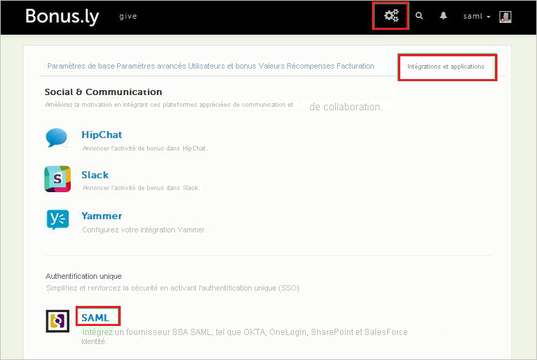
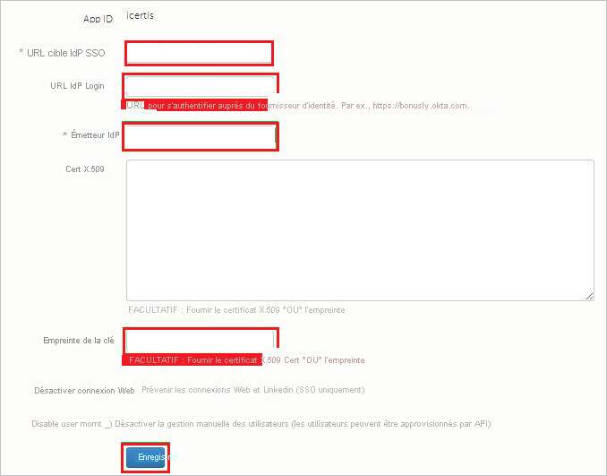
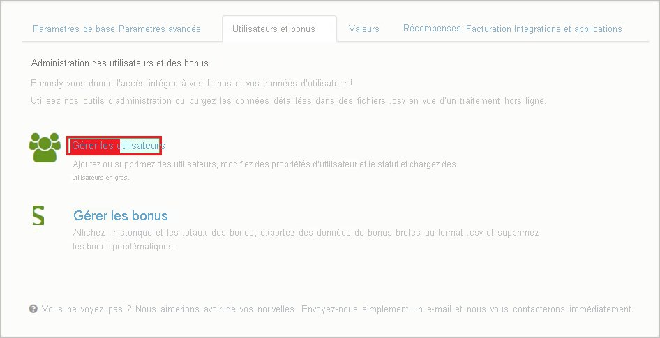
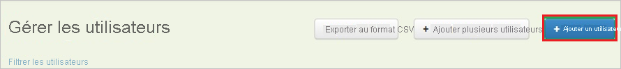
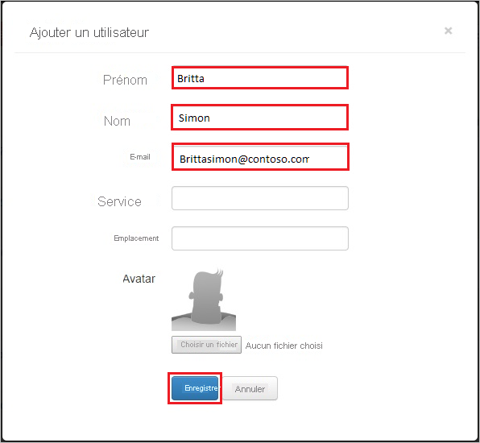

# Didacticiel : Intégration d’Azure Active Directory avec Bonusly

Dans ce tutoriel, vous allez apprendre à intégrer Bonusly à Azure Active Directory (Azure AD). Quand vous intégrez Bonusly à Azure AD, vous pouvez :

* Contrôler dans Azure AD qui a accès à Bonusly.
* Permettre à vos utilisateurs de se connecter automatiquement à Bonusly avec leur compte Azure AD.
* Gérer vos comptes à un emplacement central : le Portail Azure.

## Prérequis

Pour configurer l’intégration d’Azure AD avec Bonusly, vous avez besoin des éléments suivants :

* Un abonnement Azure AD Si vous n’avez pas d’environnement Azure AD, vous pouvez obtenir un [compte gratuit](https://azure.microsoft.com/free/).
* Un abonnement Bonusly pour lequel l’authentification unique est activée

## Description du scénario

Dans ce didacticiel, vous configurez et testez l’authentification unique Azure AD dans un environnement de test.

* Bonusly prend en charge l’authentification unique initiée par le **fournisseur d’identité**.

> [!NOTE]
> L’identificateur de cette application étant une valeur de chaîne fixe, une seule instance peut être configurée dans un locataire.

## Ajouter Bonusly à partir de la galerie

Pour configurer l’intégration de Bonusly dans Azure AD, vous devez ajouter Bonusly à votre liste d’applications SaaS gérées à partir de la galerie.

1. Connectez-vous au portail Azure avec un compte professionnel ou scolaire ou avec un compte personnel Microsoft.
1. Dans le panneau de navigation gauche, sélectionnez le service **Azure Active Directory**.
1. Accédez à **Applications d’entreprise**, puis sélectionnez **Toutes les applications**.
1. Pour ajouter une nouvelle application, sélectionnez **Nouvelle application**.
1. Dans la section **Ajouter à partir de la galerie**, saisissez **Bonusly** dans la zone de recherche.
1. Sélectionnez **Bonusly** dans le volet de résultats, puis ajoutez l’application. Patientez quelques secondes pendant que l’application est ajoutée à votre locataire.

## Configurer et tester l’authentification unique Azure AD pour Bonusly

Configurez et testez l’authentification unique Azure AD avec Bonusly à l’aide d’un utilisateur de test appelé **B.Simon**. Pour que l’authentification unique fonctionne, vous devez établir un lien entre un utilisateur Azure AD et l’utilisateur associé dans Bonusly.

Pour configurer et tester l’authentification unique Azure AD avec Bonusly, procédez comme suit :

1. **[Configurer l’authentification unique Azure AD](#configure-azure-ad-sso)** pour permettre à vos utilisateurs d’utiliser cette fonctionnalité.
    1. **[Créer un utilisateur de test Azure AD](#create-an-azure-ad-test-user)** pour tester l’authentification unique Azure AD avec B. Simon.
    1. **[Affecter l’utilisateur de test Azure AD](#assign-the-azure-ad-test-user)** pour permettre à B. Simon d’utiliser l’authentification unique Azure AD.
1. **[Configurer l’authentification unique de Bonusly](#configure-bonusly-sso)** pour configurer les paramètres de l’authentification unique côté application.
    1. **[Créer un utilisateur de test Bonusly](#create-bonusly-test-user)** pour avoir un équivalent de B.Simon dans Bonusly lié à la représentation Azure AD de l’utilisateur.
1. **[Tester l’authentification unique](#test-sso)** pour vérifier si la configuration fonctionne.

## Configurer l’authentification unique Azure AD

Effectuez les étapes suivantes pour activer l’authentification unique Azure AD dans le Portail Azure.

1. Dans le portail Azure, accédez à la page d’intégration de l’application **Bonusly**, recherchez la section **Gérer** et sélectionnez **Authentification unique**.
1. Dans la page **Sélectionner une méthode d’authentification unique**, sélectionnez **SAML**.
1. Dans la page **Configurer l’authentification unique avec SAML**, cliquez sur l’icône de crayon de **Configuration SAML de base** afin de modifier les paramètres.

   

4. Dans la section **Configuration SAML de base**, effectuez l’étape suivante :

    Dans la zone de texte **URL de réponse**, tapez une URL au format suivant : `https://Bonus.ly/saml/<TENANT_NAME>`

    > [!NOTE]
    > Cette valeur n’est pas la valeur réelle. Mettez à jour la valeur avec l’URL de réponse réelle. Pour obtenir cette valeur, contactez l’[équipe du support technique Bonusly](https://bonus.ly/contact). Vous pouvez également consulter les modèles figurant à la section **Configuration SAML de base** dans le portail Azure.

5. Dans la section **Certificat de signature SAML**, cliquez sur le bouton **Modifier** pour ouvrir la boîte de dialogue **Certificat de signature SAML**.

    

6. Dans la section **Certificat de signature SAML**, copiez l’**EMPREINTE** et enregistrez-la sur votre ordinateur.

    

7. Dans la section **Configurer Bonusly**, copiez la ou les URL appropriées, selon vos besoins.

    

### Créer un utilisateur de test Azure AD

Dans cette section, vous allez créer un utilisateur de test appelé B. Simon dans le portail Azure.

1. Dans le volet gauche du Portail Azure, sélectionnez **Azure Active Directory**, **Utilisateurs**, puis **Tous les utilisateurs**.
1. Sélectionnez **Nouvel utilisateur** dans la partie supérieure de l’écran.
1. Dans les propriétés **Utilisateur**, effectuez les étapes suivantes :
   1. Dans le champ **Nom**, entrez `B.Simon`.  
   1. Dans le champ **Nom de l’utilisateur**, entrez username@companydomain.extension. Par exemple : `B.Simon@contoso.com`.
   1. Cochez la case **Afficher le mot de passe**, puis notez la valeur affichée dans le champ **Mot de passe**.
   1. Cliquez sur **Créer**.

### Affecter l’utilisateur de test Azure AD

Dans cette section, vous allez autoriser B.Simon à utiliser l’authentification unique Azure en lui accordant l’accès à Bonusly.

1. Dans le portail Azure, sélectionnez **Applications d’entreprise**, puis **Toutes les applications**.
1. Dans la liste des applications, sélectionnez **Bonusly**.
1. Dans la page de vue d’ensemble de l’application, recherchez la section **Gérer** et sélectionnez **Utilisateurs et groupes**.
1. Sélectionnez **Ajouter un utilisateur**, puis **Utilisateurs et groupes** dans la boîte de dialogue **Ajouter une attribution**.
1. Dans la boîte de dialogue **Utilisateurs et groupes**, sélectionnez **B. Simon** dans la liste Utilisateurs, puis cliquez sur le bouton **Sélectionner** au bas de l’écran.
1. Si vous attendez qu’un rôle soit attribué aux utilisateurs, vous pouvez le sélectionner dans la liste déroulante **Sélectionner un rôle** . Si aucun rôle n’a été configuré pour cette application, vous voyez le rôle « Accès par défaut » sélectionné.
1. Dans la boîte de dialogue **Ajouter une attribution**, cliquez sur le bouton **Attribuer**.

## Configurer l’authentification unique de Bonusly

1. Dans une autre fenêtre de navigateur, connectez-vous à votre locataire **Bonusly**.

1. Dans la barre d’outils située en haut, cliquez sur **Settings** (Paramètres), puis sélectionnez **Integrations and apps** (Intégrations et applications).

    
1. Sous **Single Sign-On**, sélectionnez **SAML**.

1. Dans la page de boîte de dialogue **SAML** , procédez comme suit :

    

    a. Dans la zone de texte **IdP SSO target URL** (URL cible d’authentification unique IdP), collez la valeur **URL de connexion**, que vous avez copiée à partir du portail Azure.

    b. Dans la zone de texte **IdP Login URL** (URL de connexion IdP), collez la valeur **URL de connexion** que vous avez copiée dans le portail Azure.

    c. Dans la zone de texte **IdP Issuer** (Émetteur IdP), collez la valeur **Identificateur Azure AD** que vous avez copiée à partir du portail Azure.
    
    d. Copiez la valeur située sous **Empreinte** dans le portail Azure, puis collez-la dans la zone de texte **Empreinte du certificat**.
    
    e. Cliquez sur **Enregistrer**.

### Créer un utilisateur de test Bonusly

Pour permettre aux utilisateurs Azure AD de se connecter à Bonusly, vous devez les provisionner dans Bonusly. En l’occurrence, cet approvisionnement est une tâche manuelle.

> [!NOTE]
> Vous pouvez utiliser tout autre outil ou n’importe quelle API de création de compte d’utilisateur fournis par Bonusly pour provisionner des comptes d’utilisateurs Azure AD. 

**Pour configurer l'approvisionnement des utilisateurs, procédez comme suit :**

1. Dans une fenêtre de navigateur web, connectez-vous à votre locataire Bonusly.

1. Cliquez sur **Settings**.

    

1. Cliquez sur l’onglet **Users and bonuses** .

     (Utilisateurs et bonus)

1. Cliquez sur **Manage Users**.

    

1. Cliquez sur **Add User**.

    

1. Dans la boîte de dialogue **Ajouter un utilisateur**, procédez comme suit :

      

    a. Dans la zone de texte **First name**, entrez le prénom de l’utilisateur, par exemple **Britta**.

    b. Dans la zone de texte **Last name**, tapez le nom de l’utilisateur, par exemple **Simon**.

    c. Dans la zone de texte **E-mail**, entrez l’adresse e-mail de l’utilisateur, par exemple `brittasimon@contoso.com`.

    d. Cliquez sur **Enregistrer**.

    > [!NOTE]
    > Le titulaire du compte Azure AD reçoit alors un e-mail contenant un lien pour confirmer le compte avant qu’il ne soit activé.  

## Tester l’authentification unique (SSO)

Dans cette section, vous allez tester votre configuration de l’authentification unique Azure AD avec les options suivantes.

* Cliquez sur Tester cette application dans Portail Azure : vous devez être connecté automatiquement à l’instance de Bonusly pour laquelle vous avez configuré l’authentification unique.

* Vous pouvez utiliser Mes applications de Microsoft. Quand vous cliquez sur la vignette Bonusly dans Mes applications, vous êtes automatiquement connecté à l’instance de Bonusly pour laquelle vous avez configuré l’authentification unique. Pour plus d’informations sur Mes applications, consultez [Présentation de Mes applications](../user-help/my-apps-portal-end-user-access.md).

## Étapes suivantes

Une fois que vous avez configuré Bonusly, vous pouvez appliquer le contrôle de session, qui protège contre l’exfiltration et l’infiltration des données sensibles de votre organisation en temps réel. Le contrôle de session est étendu à partir de l’accès conditionnel. [Découvrez comment appliquer un contrôle de session avec Microsoft Cloud App Security](/cloud-app-security/proxy-deployment-aad).
