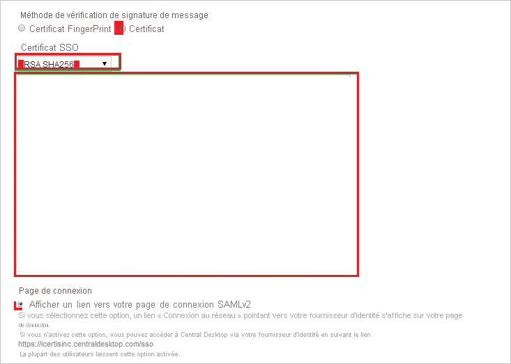
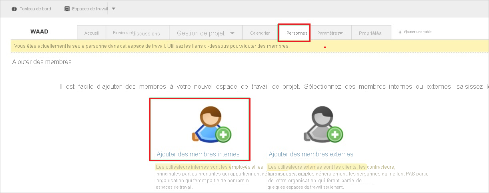
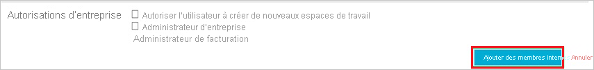

# Didacticiel : Intégration d’Azure Active Directory à Central Desktop

Dans ce tutoriel, vous allez apprendre à intégrer Central Desktop à Azure Active Directory (Azure AD). Quand vous intégrez Central Desktop à Azure AD, vous pouvez :

* dans Azure AD, contrôler qui a accès à Central Desktop.
* permettre à vos utilisateurs de se connecter automatiquement à Central Desktop avec leurs comptes Azure AD.
* Gérer vos comptes à un emplacement central : le Portail Azure.

## Prérequis

Pour commencer, vous devez disposer de ce qui suit :

* Un abonnement Azure AD Si vous ne disposez d’aucun abonnement, vous pouvez obtenir [un compte gratuit](https://azure.microsoft.com/free/)
* Abonnement Central Desktop pour lequel l’authentification unique (SSO) est activée.

## Description du scénario

Dans ce didacticiel, vous configurez et testez l’authentification unique Azure AD dans un environnement de test.

* Central Desktop prend en charge l’authentification unique initiée par le **fournisseur de services**.

## Ajouter Central Desktop à partir de la galerie

Pour configurer l’intégration de Central Desktop à Azure AD, vous devez ajouter Central Desktop à partir de la galerie à votre liste d’applications SaaS gérées.

1. Connectez-vous au portail Azure avec un compte professionnel ou scolaire ou avec un compte personnel Microsoft.
1. Dans le panneau de navigation gauche, sélectionnez le service **Azure Active Directory**.
1. Accédez à **Applications d’entreprise**, puis sélectionnez **Toutes les applications**.
1. Pour ajouter une nouvelle application, sélectionnez **Nouvelle application**.
1. Dans la section **Ajouter à partir de la galerie**, tapez **Central Desktop** dans la zone de recherche.
1. Sélectionnez **Central Desktop** dans le volet de résultats, puis ajoutez l’application. Patientez quelques secondes pendant que l’application est ajoutée à votre locataire.

## Configurer et tester l’authentification unique (SSO) Azure AD pour Central Desktop

Configurez et testez l’authentification unique Azure AD avec Central Desktop au moyen d’un utilisateur de test nommé **B.Simon**. Pour que l’authentification unique fonctionne, vous devez établir une relation entre un utilisateur Azure AD et l’utilisateur Central Desktop associé.

Pour configurer et tester l’authentification unique Azure AD avec Central Desktop, effectuez les étapes suivantes :

1. **[Configurer l’authentification unique Azure AD](#configure-azure-ad-sso)** pour permettre à vos utilisateurs d’utiliser cette fonctionnalité.
    1. **[Créer un utilisateur de test Azure AD](#create-an-azure-ad-test-user)** pour tester l’authentification unique Azure AD avec B. Simon.
    1. **[Affecter l’utilisateur de test Azure AD](#assign-the-azure-ad-test-user)** pour permettre à B. Simon d’utiliser l’authentification unique Azure AD.
1. **[Configurer l’authentification unique Central Desktop](#configure-central-desktop-sso)** pour configurer les paramètres de l’authentification unique côté application.
    1. **[Créer un utilisateur de test Central Desktop](#create-central-desktop-test-user)** pour avoir dans Central Desktop un équivalent de B.Simon lié à la représentation de l’utilisateur Azure AD.
1. **[Tester l’authentification unique](#test-sso)** pour vérifier si la configuration fonctionne.

## Configurer l’authentification unique Azure AD

Effectuez les étapes suivantes pour activer l’authentification unique Azure AD dans le Portail Azure.

1. Sur le Portail Azure, dans la page d’intégration de l’application **Central Desktop**, recherchez la section **Gérer** et sélectionnez **Authentification unique**.
1. Dans la page **Sélectionner une méthode d’authentification unique**, sélectionnez **SAML**.
1. Dans la page **Configurer l’authentification unique avec SAML**, cliquez sur l’icône de crayon de **Configuration SAML de base** afin de modifier les paramètres.

   

4. Dans la section **Configuration SAML de base**, effectuez les étapes suivantes :

    a. Dans la zone **Identificateur**, tapez une URL en utilisant un des modèles suivants :

    | **Identificateur** |
    |-------|
    | `https://<companyname>.centraldesktop.com/saml2-metadata.php` |
    | `https://<companyname>.imeetcentral.com/saml2-metadata.php` |

    b. Dans la zone de texte **URL de réponse**, tapez une URL au format suivant : `https://<companyname>.centraldesktop.com/saml2-assertion.php`

    c. Dans la zone de texte **URL de connexion**, tapez une URL au format suivant : `https://<companyname>.centraldesktop.com`.

    > [!NOTE]
    > Il ne s’agit pas de valeurs réelles. Mettez à jour ces valeurs avec l’identificateur, l’URL de réponse et l’URL de connexion réels. Pour obtenir ces valeurs, contactez [l’équipe du support client de Central Desktop](https://imeetcentral.com/contact-us). Vous pouvez également consulter les modèles figurant à la section **Configuration SAML de base** dans le portail Azure.

5. Dans la page **Configurer l’authentification unique avec SAML**, à la section **Certificat de signature SAML**, cliquez sur **Télécharger** pour télécharger le **Certificat (Raw)** en fonction des options définies, puis enregistrez-le sur votre ordinateur.

    

6. Dans la section **Configurer Central Desktop**, copiez la ou les URL appropriées correspondant à vos besoins.

    

### Créer un utilisateur de test Azure AD

Dans cette section, vous allez créer un utilisateur de test appelé B. Simon dans le portail Azure.

1. Dans le volet gauche du Portail Azure, sélectionnez **Azure Active Directory**, **Utilisateurs**, puis **Tous les utilisateurs**.
1. Sélectionnez **Nouvel utilisateur** dans la partie supérieure de l’écran.
1. Dans les propriétés **Utilisateur**, effectuez les étapes suivantes :
   1. Dans le champ **Nom**, entrez `B.Simon`.  
   1. Dans le champ **Nom de l’utilisateur**, entrez username@companydomain.extension. Par exemple : `B.Simon@contoso.com`.
   1. Cochez la case **Afficher le mot de passe**, puis notez la valeur affichée dans le champ **Mot de passe**.
   1. Cliquez sur **Créer**.

### Affecter l’utilisateur de test Azure AD

Dans cette section, vous allez autoriser B.Simon à utiliser l’authentification unique Azure en accordant l’accès à Central Desktop.

1. Dans le portail Azure, sélectionnez **Applications d’entreprise**, puis **Toutes les applications**.
1. Dans la liste des applications, sélectionnez **Central Desktop**.
1. Dans la page de vue d’ensemble de l’application, recherchez la section **Gérer** et sélectionnez **Utilisateurs et groupes**.
1. Sélectionnez **Ajouter un utilisateur**, puis **Utilisateurs et groupes** dans la boîte de dialogue **Ajouter une attribution**.
1. Dans la boîte de dialogue **Utilisateurs et groupes**, sélectionnez **B. Simon** dans la liste Utilisateurs, puis cliquez sur le bouton **Sélectionner** au bas de l’écran.
1. Si vous attendez qu’un rôle soit attribué aux utilisateurs, vous pouvez le sélectionner dans la liste déroulante **Sélectionner un rôle** . Si aucun rôle n’a été configuré pour cette application, vous voyez le rôle « Accès par défaut » sélectionné.
1. Dans la boîte de dialogue **Ajouter une attribution**, cliquez sur le bouton **Attribuer**.

## Configurer l’authentification unique Central Desktop

1. Connectez-vous à votre locataire **Central Desktop**.

2. Accédez à **Settings**. Sélectionnez **Advanced**, puis **Single Sign On**.

    

3. Dans la page **Single Sign On Settings**, procédez comme suit :

    

    a. Sélectionnez **Enable SAML v2 Single Sign On**.

    b. Dans la zone **SSO URL**, collez la valeur **Identificateur Azure AD** copiée à partir du portail Azure.

    c. Dans la zone **SSO Login URL** (URL de connexion SSO), collez la valeur de l’**URL de connexion** que vous avez copiée à partir du portail Azure.

    d. Dans la zone **SSO Logout URL** (URL de déconnexion SSO), collez la valeur de l’**URL de déconnexion** que vous avez copiée à partir du portail Azure.

4. Dans la section **Message Signature Verification Method**, procédez comme suit :

    

    a. Sélectionnez **Certificate**.

    b. Dans la liste **SSO Certificate**, sélectionnez **RSH SHA256**.

    c. Ouvrez votre certificat téléchargé dans le Bloc-notes. Ensuite, copiez le contenu du certificat et collez-le dans le champ **SSO Certificate**.

    d. Sélectionnez **Display a link to your SAMLv2 login page**.

    e. Sélectionnez **Update**.

### Créer l’utilisateur de test Central Desktop

Pour que les utilisateurs Azure AD puissent se connecter, ils doivent être provisionnés dans l’application Central Desktop. Cette section explique comment créer des comptes d’utilisateur Azure AD dans Central Desktop.

> [!NOTE]
> Pour provisionner des comptes d’utilisateur Azure AD, vous pouvez utiliser tout autre outil ou n’importe quelle API de création de compte d’utilisateur fournis par Central Desktop.

**Pour approvisionner des comptes d’utilisateur dans Central Desktop :**

1. Connectez-vous à votre locataire Central Desktop.

2. Sélectionnez **People** (Contacts), puis sélectionnez **Add Internal Members** (Ajouter des membres internes).

    

3. Dans la zone de texte **Email Address of New Members**, tapez un compte Azure AD à provisionner, puis sélectionnez **Next**.

    

4. Sélectionnez **Add Internal member(s)**.

    

   > [!NOTE]
   > Les utilisateurs que vous ajoutez reçoivent un e-mail contenant un lien de confirmation pour l’activation de leur compte.

## Tester l’authentification unique (SSO)

Dans cette section, vous allez tester votre configuration de l’authentification unique Azure AD avec les options suivantes. 

* Cliquez sur **Tester cette application** dans le portail Azure. Cette opération redirige vers l’URL de connexion Central Desktop, où vous pouvez lancer le flux de connexion. 

* Accédez directement à l’URL de connexion Central Desktop pour y lancer le flux de connexion.

* Vous pouvez utiliser Mes applications de Microsoft. Quand vous cliquez sur la mosaïque Central Desktop dans Mes applications, une redirection est effectuée vers l’URL de connexion Central Desktop. Pour plus d’informations sur Mes applications, consultez [Présentation de Mes applications](https://support.microsoft.com/account-billing/sign-in-and-start-apps-from-the-my-apps-portal-2f3b1bae-0e5a-4a86-a33e-876fbd2a4510).

## Étapes suivantes

Après avoir configuré Central Desktop, vous pouvez appliquer le contrôle de session, qui protège contre l’exfiltration et l’infiltration des données sensibles de votre organisation en temps réel. Le contrôle de session est étendu à partir de l’accès conditionnel. [Découvrez comment appliquer un contrôle de session avec Microsoft Cloud App Security](/cloud-app-security/proxy-deployment-aad).