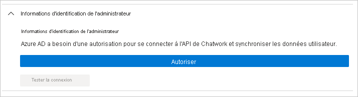

# Tutoriel : Configurer Chatwork pour l’approvisionnement automatique d’utilisateurs

Ce tutoriel décrit les étapes à suivre dans Chatwork et Azure Active Directory (Azure AD) pour configurer l’attribution automatique d’utilisateurs. Une fois configurée, Azure AD provisionne et déprovisionne automatiquement les utilisateurs et les groupes pour [Chatwork](https://corp.chatwork.com/) à l’aide du service de provisionnement Azure AD. Pour découvrir les informations importantes sur ce que fait ce service, comment il fonctionne et consulter le forum aux questions, reportez-vous à l’article [Automatiser l’attribution et l’annulation de l’attribution des utilisateurs dans les applications SaaS avec Azure Active Directory](../app-provisioning/user-provisioning.md). 

## Fonctionnalités prises en charge
> [!div class="checklist"]
> * Créez des utilisateurs dans Chatwork.
> * Supprimer des utilisateurs dans Chatwork lorsqu’ils n’ont plus besoin d’accès.
> * Conserver les attributs utilisateur synchronisés entre Azure AD et Chatwork.
> * [Authentification unique](chatwork-tutorial.md) auprès de Chatwork (obligatoire).

## Prérequis

Le scénario décrit dans ce tutoriel part du principe que vous disposez des prérequis suivants :

* [Un locataire Azure AD](../develop/quickstart-create-new-tenant.md). 
* Un compte d’utilisateur dans Azure AD avec l’[autorisation](../roles/permissions-reference.md) de configurer l’approvisionnement (par exemple, administrateur d’application, administrateur d’application Cloud, propriétaire d’application ou administrateur général). 
* Un locataire [Chatwork](https://corp.chatwork.com/).
* Un compte d’utilisateur dans Chatwork avec des autorisations d’administration.
* Organisations ayant souscrit au plan Chatwork Entreprise ou KDDI Chatwork.

## Étape 1. Planifier votre déploiement de l’approvisionnement
1. En savoir plus sur le [fonctionnement du service d’approvisionnement](../app-provisioning/user-provisioning.md).
1. Déterminez qui sera dans l’[étendue pour l’approvisionnement](../app-provisioning/define-conditional-rules-for-provisioning-user-accounts.md).
1. Déterminez les données à [mapper entre Azure AD et Chatwork](../app-provisioning/customize-application-attributes.md). 

## Étape 2. Configurer Chatwork pour prendre en charge l’approvisionnement avec Azure AD

### 1. Ouvrez la **Synchronisation de l’utilisateur** à partir de la page d’administration de Chatwork

Accédez au portail d’administration de Chatwork en tant qu’utilisateur disposant de droits d’administrateur. Si vous disposez de privilèges d’administrateur, vous serez en mesure d’accéder à la page **Synchronisation de l’utilisateur**. 

La page **Synchronisation utilisateur** contient des remarques et des restrictions concernant l’utilisation de la fonctionnalité d’approvisionnement d’utilisateurs. Vérifiez tous les éléments.

### 2. Configurez les paramètres de connexion SAML.

Si vous utilisez Azure AD et l’approvisionnement d’utilisateurs, connectez-vous à Chatwork à l’aide de votre ID Azure AD. 

### 3. Cochez les cases après avoir accepté les différents éléments.

Activez les cases à cocher après avoir accepté les avertissements et les restrictions concernant l’utilisation de la fonction d’approvisionnement d’utilisateurs.

Lorsque tous les éléments sont cochés, cliquez sur le bouton **Activer la synchronisation de l’utilisateur**.

Lorsque la fonction d’approvisionnement d’utilisateurs est activée, un message s’affiche en haut de la page indiquant qu’elle a été activée.

## Étape 3. Ajouter Chatwork à partir de la galerie d’applications Azure AD

Ajoutez Chatwork à partir de la galerie d’applications Azure AD pour commencer à gérer l’approvisionnement sur Chatwork. Si vous avez déjà configuré Chatwork pour l’authentification unique, vous pouvez utiliser la même application. Toutefois, il est recommandé de créer une application distincte lors du test initial de l’intégration. En savoir plus sur l’ajout d’une application à partir de la galerie [ici](../manage-apps/add-application-portal.md).

## Étape 4. Définir qui sera dans l’étendue pour l’approvisionnement 

Le service d’approvisionnement Azure AD vous permet de définir l’étendue des utilisateurs approvisionnés en fonction de l’affectation à l’application et/ou en fonction des attributs de l’utilisateur/groupe. Si vous choisissez de définir l’étendue de l’approvisionnement pour votre application en fonction de l’attribution, vous pouvez utiliser les étapes de [suivantes](../manage-apps/assign-user-or-group-access-portal.md) pour affecter des utilisateurs et des groupes à l’application. Si vous choisissez de définir l’étendue de l’approvisionnement en fonction uniquement des attributs de l’utilisateur ou du groupe, vous pouvez utiliser un filtre d’étendue comme décrit [ici](../app-provisioning/define-conditional-rules-for-provisioning-user-accounts.md). 

* Lorsque vous attribuez des utilisateurs et des groupes à Chatwork, vous devez sélectionner un rôle autre que **Accès par défaut**. Les utilisateurs disposant du rôle Accès par défaut sont exclus de l’approvisionnement et sont marqués comme non autorisés dans les journaux de configuration. Si le seul rôle disponible sur l’application est le rôle d’accès par défaut, vous pouvez [mettre à jour le manifeste d’application](../develop/howto-add-app-roles-in-azure-ad-apps.md) pour ajouter plus de rôles. 

* Commencez progressivement. Testez avec un petit ensemble d’utilisateurs et de groupes avant d’effectuer un déploiement général. Lorsque l’étendue de l’approvisionnement est définie sur les utilisateurs et les groupes attribués, vous pouvez contrôler cela en affectant un ou deux utilisateurs ou groupes à l’application. Lorsque l’étendue est définie sur tous les utilisateurs et groupes, vous pouvez spécifier un [filtre d’étendue basé sur l’attribut](../app-provisioning/define-conditional-rules-for-provisioning-user-accounts.md). 

## Étape 5. Configurer l’approvisionnement automatique d’utilisateurs sur Chatwork 

Cette section vous guide tout au long des étapes de configuration du service de provisionnement d’Azure AD pour créer, mettre à jour et désactiver des utilisateurs et/ou des groupes dans Chatwork en fonction des attributions d’utilisateurs et/ou de groupes dans Azure AD.

### Pour configurer l’approvisionnement automatique d’utilisateurs pour Chatwork dans Azure AD :

1. Connectez-vous au [portail Azure](https://portal.azure.com). Sélectionnez **Applications d’entreprise**, puis **Toutes les applications**.

    

1. Dans la liste des applications, sélectionnez **Chatwork**.

    

1. Sélectionnez l’onglet **Approvisionnement**.

    

1. Définissez le **Mode d’approvisionnement** sur **Automatique**.

    

1. Dans la section **Informations d’identification de l’administrateur**, cliquez sur Autoriser, et vérifiez que vous entrez les informations d’identification d’administrateur de votre compte Chatwork. Cliquez sur **Tester la connexion** pour vérifier qu’Azure AD peut se connecter à Chatwork. Si la connexion échoue, vérifiez que votre compte Chatwork dispose des autorisations d’administrateur et réessayez.

   
1. Dans le champ **E-mail de notification**, entrez l’adresse e-mail de la personne ou du groupe qui doit recevoir les notifications d’erreur de provisionnement et sélectionnez la case à cocher **Envoyer une notification par e-mail en cas de défaillance**.

    

1. Sélectionnez **Enregistrer**.

1. Dans la section **Mappages**, sélectionnez **Synchroniser les utilisateurs Azure Active Directory avec Chatwork**.

1. Dans la section **Mappages des attributs**, passez en revue les attributs utilisateur qui sont synchronisés entre Azure AD et Chatwork. Les attributs sélectionnés en tant que propriétés de **Correspondance** sont utilisés pour établir une correspondance avec les comptes d’utilisateur Chatwork en vue de mises à jour ultérieures. Si vous choisissez de modifier l’[attribut cible correspondant](../app-provisioning/customize-application-attributes.md), vous devez vérifier que l’API Chatwork prend en charge le filtrage des utilisateurs en fonction de cet attribut. Cliquez sur le bouton **Enregistrer** pour valider les modifications.

   |Attribut|Type|Pris en charge pour le filtrage|
   |---|---|---|
   |userName|String|&check;
   |active|Boolean|   
   |title|String|
   |externalId|String|
   |urn:ietf:params:scim:schemas:extension:enterprise:2.0:User:department|String|
   |urn:ietf:params:scim:schemas:extension:enterprise:2.0:User:organization|String|

1. Pour configurer des filtres d’étendue, reportez-vous aux instructions suivantes fournies dans [Approvisionnement d’applications basé sur les attributs avec filtres d’étendue](../app-provisioning/define-conditional-rules-for-provisioning-user-accounts.md).

1. Pour activer le service de provisionnement Azure AD pour Chatwork, définissez le paramètre **État de provisionnement** sur **Activé** dans la section **Paramètres**.

    

1. Définissez les utilisateurs et/ou les groupes que vous souhaitez attribuer à Chatwork en choisissant les valeurs souhaitées dans **Étendue**, dans la section **Paramètres**.

    

1. Lorsque vous êtes prêt à effectuer l’approvisionnement, cliquez sur **Enregistrer**.

    

Cette opération démarre le cycle de synchronisation initiale de tous les utilisateurs et groupes définis dans **Étendue** dans la section **Paramètres**. Le cycle de synchronisation initiale prend plus de temps que les cycles de synchronisation suivants, qui se produisent toutes les 40 minutes environ tant que le service de provisionnement Azure AD est en cours d’exécution. 

## Étape 6. Surveiller votre déploiement
Une fois que vous avez configuré l’approvisionnement, utilisez les ressources suivantes pour surveiller votre déploiement :

* Utilisez les [journaux d’approvisionnement](../reports-monitoring/concept-provisioning-logs.md) pour déterminer quels utilisateurs ont été configurés avec succès ou échoué.
* Consultez la [barre de progression](../app-provisioning/application-provisioning-when-will-provisioning-finish-specific-user.md) pour afficher l’état du cycle d’approvisionnement et quand il se termine
* Si la configuration de l’approvisionnement semble se trouver dans un état non sain, l’application passe en quarantaine. Pour en savoir plus sur les états de quarantaine, cliquez [ici](../app-provisioning/application-provisioning-quarantine-status.md).  

## Plus de ressources

* [Gestion de l’approvisionnement de comptes d’utilisateur pour les applications d’entreprise](../app-provisioning/configure-automatic-user-provisioning-portal.md)
* [Qu’est-ce que l’accès aux applications et l’authentification unique avec Azure Active Directory ?](../manage-apps/what-is-single-sign-on.md)

## Étapes suivantes

* [Découvrez comment consulter les journaux d’activité et obtenir des rapports sur l’activité d’approvisionnement](../app-provisioning/check-status-user-account-provisioning.md)