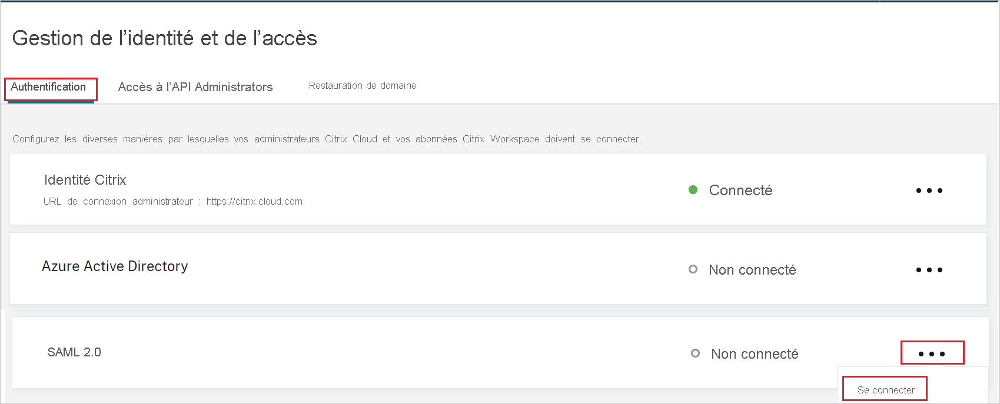

# Tutoriel : Intégration de l’authentification unique (SSO) Azure Active Directory à l’authentification unique SAML Citrix Cloud

Ce tutoriel explique comment intégrer l’authentification unique SAML Citrix Cloud à Azure Active Directory (Azure AD). Quand vous intégrez l’authentification unique SAML Citrix Cloud à Azure AD, vous pouvez :

* Contrôler dans Azure AD qui a accès à l’authentification unique SAML Citrix Cloud.
* Permettre à vos utilisateurs de se connecter automatiquement à l’authentification unique SAML Citrix Cloud avec leur compte Azure AD.
* Gérer vos comptes à un emplacement central : le Portail Azure.

## Prérequis

Pour commencer, vous devez disposer de ce qui suit :

* Un abonnement Azure AD Si vous ne disposez d’aucun abonnement, vous pouvez obtenir [un compte gratuit](https://azure.microsoft.com/free/).
* Un abonnement Citrix Cloud. Si vous n’avez pas d’abonnement, inscrivez-vous pour en bénéficier. 

## Description du scénario

Dans ce tutoriel, vous allez configurer et tester l’authentification unique Azure AD dans un environnement de test.

* L’authentification unique SAML Citrix Cloud prend en charge l’authentification unique lancée par le **fournisseur de services**.

> [!NOTE]
> L’identificateur de cette application étant une valeur de chaîne fixe, une seule instance peut être configurée dans un locataire.

## Ajout de l’authentification unique SAML Citrix Cloud à partir de la galerie

Pour configurer l’intégration de l’authentification unique SAML Citrix Cloud à Azure AD, vous devez ajouter l’authentification unique SAML Citrix Cloud à partir de la galerie à votre liste d’applications SaaS gérées.

1. Connectez-vous au portail Azure avec un compte professionnel ou scolaire ou avec un compte personnel Microsoft.
1. Dans le panneau de navigation gauche, sélectionnez le service **Azure Active Directory**.
1. Accédez à **Applications d’entreprise**, puis sélectionnez **Toutes les applications**.
1. Pour ajouter une nouvelle application, sélectionnez **Nouvelle application**.
1. Dans la section **Ajouter à partir de la galerie**, tapez **Authentification unique SAML Citrix Cloud** dans la zone de recherche.
1. Sélectionnez **l’authentification unique SAML Citrix Cloud** dans le volet de résultats, puis ajoutez l’application. Patientez quelques secondes pendant que l’application est ajoutée à votre locataire.

## Configurer et tester l’authentification unique Azure AD pour l’authentification unique SAML Citrix Cloud

Configurez et testez l’authentification unique Azure AD avec l’authentification unique SAML Citrix Cloud à l’aide d’un utilisateur de test appelé **B.Simon**. Pour que l’authentification unique fonctionne, vous devez établir une relation entre un utilisateur Azure AD et l’utilisateur associé dans Citrix Cloud. Cet utilisateur doit également exister dans votre Active Directory synchronisé avec Azure AD Connect à votre abonnement Azure AD.

Pour configurer et tester l’authentification unique Azure AD avec l’authentification unique SAML Citrix Cloud, effectuez les étapes suivantes :

1. **[Configurer l’authentification unique Azure AD](#configure-azure-ad-sso)** pour permettre à vos utilisateurs d’utiliser cette fonctionnalité.
    1. **[Créer un utilisateur de test Azure AD](#create-an-azure-ad-test-user)** pour tester l’authentification unique Azure AD avec B. Simon.
    1. **[Affecter l’utilisateur de test Azure AD](#assign-the-azure-ad-test-user)** pour permettre à B. Simon d’utiliser l’authentification unique Azure AD.
1. **[Configurer l’authentification unique SAML Citrix Cloud](#configure-citrix-cloud-saml-sso)** pour configurer les paramètres de l’authentification unique côté application.
1. **[Tester l’authentification unique](#test-sso)** pour vérifier si la configuration fonctionne.

## Configurer l’authentification unique Azure AD

Effectuez les étapes suivantes pour activer l’authentification unique Azure AD dans le Portail Azure.

1. Sur le portail Azure, dans la page d’intégration d’application de l’**authentification unique SAML Citrix Cloud**, recherchez la section **Gérer**, puis sélectionnez **Authentification unique**.
1. Dans la page **Sélectionner une méthode d’authentification unique**, sélectionnez **SAML**.
1. Dans la page **Configurer l’authentification unique avec SAML**, cliquez sur l’icône de crayon de **Configuration SAML de base** afin de modifier les paramètres.

   

1. Dans la section **Configuration SAML de base**, effectuez l’étape suivante :

    Dans la zone de texte **URL de connexion**, tapez une URL au format suivant : `https://<SUBDOMAIN>.cloud.com`

    > [!NOTE]
    > Cette valeur n’est pas la valeur réelle. Mettez à jour la valeur avec l’URL de votre espace de travail Citrix. Accédez à votre compte Citrix Cloud pour récupérer la valeur. Vous pouvez également consulter les modèles figurant à la section **Configuration SAML de base** dans le portail Azure.

1. L’authentification unique SAML Citrix Cloud attend les assertions SAML dans un format spécifique, ce qui vous oblige à ajouter des mappages d’attributs personnalisés à votre configuration d’attributs de jetons SAML. La capture d’écran suivante montre la liste des attributs par défaut.

    

1. En plus de ce qui précède, l’authentification unique SAML Citrix Cloud s’attend à ce que quelques attributs supplémentaires soient repassés dans la réponse SAML, comme indiqué ci-dessous. Ces attributs sont également préremplis, mais vous pouvez les examiner conformément à vos besoins. Les valeurs passées dans la réponse SAML doivent correspondre aux attributs Active Directory de l’utilisateur.
    
    | Nom | Attribut source |
    | -----|-----|
    | cip_sid | user.onpremisesecurityidentifier |
    | cip_upn | user.userprincipalname |
    | cip_oid | ObjectGUID (attribut d’extension) |
    | cip_email | user.mail |
    | displayName | user.displayname |

    > [!NOTE]
    > ObjectGUID doit être configuré manuellement en fonction de vos besoins.

1. Dans la page **Configurer l’authentification unique avec SAML**, dans la section **Certificat de signature SAML**, recherchez **Certificat (PEM)** , puis sélectionnez **Télécharger** pour télécharger le certificat et l’enregistrer sur votre ordinateur.

    

1. Dans la section **Configurer l’authentification unique SAML Citrix Cloud**, copiez la ou les URL appropriées, en fonction de vos besoins.

    

### Créer un utilisateur de test Azure AD

Dans cette section, vous allez créer un utilisateur de test appelé B. Simon dans le portail Azure.

1. Dans le volet gauche du Portail Azure, sélectionnez **Azure Active Directory**, **Utilisateurs**, puis **Tous les utilisateurs**.
1. Sélectionnez **Nouvel utilisateur** dans la partie supérieure de l’écran.
1. Dans les propriétés **Utilisateur**, effectuez les étapes suivantes :
   1. Dans le champ **Nom**, entrez `B.Simon`.  
   1. Dans le champ **Nom de l’utilisateur**, entrez username@companydomain.extension. Par exemple : `B.Simon@contoso.com`.
   1. Cochez la case **Afficher le mot de passe**, puis notez la valeur affichée dans le champ **Mot de passe**.
   1. Cliquez sur **Créer**.

    > [!NOTE]
    > Cet utilisateur doit être synchronisé à partir d’Active Directory. Pour que l’authentification unique fonctionne, vous devez établir un lien entre un utilisateur Azure AD et l’utilisateur de l’authentification unique SAML Citrix Cloud associé.
    
### Affecter l’utilisateur de test Azure AD

Dans cette section, vous allez autoriser B.Simon à utiliser l’authentification unique Azure en lui accordant l’accès à l’authentification unique SAML Citrix Cloud.

1. Dans le portail Azure, sélectionnez **Applications d’entreprise**, puis **Toutes les applications**.
1. Dans la liste des applications, sélectionnez **Authentification unique SAML Citrix Cloud**.
1. Dans la page de vue d’ensemble de l’application, recherchez la section **Gérer** et sélectionnez **Utilisateurs et groupes**.
1. Sélectionnez **Ajouter un utilisateur**, puis **Utilisateurs et groupes** dans la boîte de dialogue **Ajouter une attribution**.
1. Dans la boîte de dialogue **Utilisateurs et groupes**, sélectionnez **B. Simon** dans la liste Utilisateurs, puis cliquez sur le bouton **Sélectionner** au bas de l’écran.
1. Si vous attendez qu’un rôle soit attribué aux utilisateurs, vous pouvez le sélectionner dans la liste déroulante **Sélectionner un rôle** . Si aucun rôle n’a été configuré pour cette application, vous voyez le rôle « Accès par défaut » sélectionné.
1. Dans la boîte de dialogue **Ajouter une attribution**, cliquez sur le bouton **Attribuer**.

## Authentification unique SAML Citrix Cloud

1. Connectez-vous à votre site d’entreprise de l’authentification unique SAML Citrix Cloud en tant qu’administrateur.

1. Accédez au menu Cloud Citrix et sélectionnez **Gestion des identités et des accès**.

     

1. Sous **Authentification**, localisez **SAML 2.0** et sélectionnez **Connecter** dans le menu des points de suspension.

    

1. Dans la page **Configurer le SAML**, procédez comme suit.

    

    a. Dans la zone de texte **ID d’entité**, collez la valeur **Identificateur Azure AD** que vous avez copiée dans le portail Azure.

    b. Dans **Signer une requête d’authentification**, sélectionnez **Non**.

    c. Dans la zone de texte **URL de service de l’authentification unique**, collez la valeur de l’**URL de connexion** que vous avez copiée dans le portail Azure.

    d. Sélectionner un **mécanisme de liaison** dans la liste déroulante, vous pouvez sélectionner la liaison **HTTP-POST** ou **HTTP-redirection**.

    e. Sous **Réponse SAML**, sélectionnez **Signer la réponse ou l’assertion** dans la liste déroulante.

    f. Télécharger le **certificat (PEM)** du Portail Azure dans la section du **certificat X.509**.

    g. Dans le **contexte d’authentification**, sélectionnez **Non spécifié** et **Exact** dans la liste déroulante.

    h. Cliquez sur **Tester et Terminer**.

## Tester l’authentification unique (SSO) 

Dans cette section, vous allez tester votre configuration de l’authentification unique Azure AD avec les options suivantes. 

* Accédez directement à l’URL de l’espace de travail de Citrix pour y lancer le flux de connexion.

* Connectez-vous avec votre utilisateur Active Directory synchronisé avec AD dans votre espace de travail Citrix pour terminer le test.

## Étapes suivantes

Après avoir configuré l’authentification unique SAML Citrix Cloud, vous pouvez appliquer le contrôle de session, qui protège contre l’exfiltration et l’infiltration des données sensibles de votre organisation en temps réel. Le contrôle de session est étendu à partir de l’accès conditionnel. [Découvrez comment appliquer un contrôle de session avec Microsoft Cloud App Security](/cloud-app-security/proxy-deployment-aad).