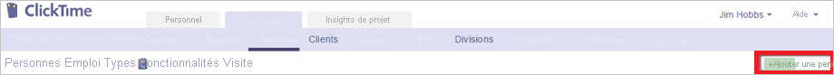

# Tutoriel : Intégration de l’authentification unique Azure AD à ClickTime

Dans ce tutoriel, vous allez découvrir comment intégrer ClickTime à Azure Active Directory (Azure AD). Quand vous intégrez ClickTime à Azure AD, vous pouvez :

* Contrôler, dans Azure AD, qui a accès à ClickTime.
* Autoriser les utilisateurs à se connecter automatiquement à ClickTime avec leur compte Azure AD.
* Gérer vos comptes à un emplacement central : le Portail Azure.

## Prérequis

Pour commencer, vous devez disposer de ce qui suit :

* Un abonnement Azure AD Si vous ne disposez d’aucun abonnement, vous pouvez obtenir [un compte gratuit](https://azure.microsoft.com/free/).
* Un abonnement ClickTime pour lequel l’authentification unique (SSO) est activée.

## Description du scénario

Dans ce didacticiel, vous configurez et testez l’authentification unique Azure AD dans un environnement de test.

* ClickTime prend en charge l’authentification unique lancée par le **fournisseur d’identité**.

> [!NOTE]
> L’identificateur de cette application étant une valeur de chaîne fixe, une seule instance peut être configurée dans un locataire.

## Ajouter ClickTime à partir de la galerie

Pour configurer l’intégration de ClickTime à Azure AD, vous devez ajouter ClickTime à partir de la galerie à votre liste d’applications SaaS managées.

1. Connectez-vous au portail Azure avec un compte professionnel ou scolaire ou avec un compte personnel Microsoft.
1. Dans le panneau de navigation gauche, sélectionnez le service **Azure Active Directory**.
1. Accédez à **Applications d’entreprise**, puis sélectionnez **Toutes les applications**.
1. Pour ajouter une nouvelle application, sélectionnez **Nouvelle application**.
1. Dans la section **Ajouter à partir de la galerie**, tapez **ClickTime** dans la zone de recherche.
1. Sélectionnez **ClickTime** dans le volet de résultats, puis ajoutez l’application. Patientez quelques secondes pendant que l’application est ajoutée à votre locataire.

## Configurer et tester l’authentification unique Azure AD pour ClickTime

Configurez et testez l’authentification unique Azure AD avec ClickTime pour un utilisateur test nommé **B.Simon**. Pour que l’authentification unique fonctionne, vous devez établir un lien entre un utilisateur Azure AD et l’utilisateur correspondant dans ClickTime.

Pour configurer et tester l’authentification unique Azure AD avec ClickTime, effectuez les étapes suivantes :

1. **[Configurer l’authentification unique Azure AD](#configure-azure-ad-sso)** pour permettre à vos utilisateurs d’utiliser cette fonctionnalité.
    1. **[Créer un utilisateur de test Azure AD](#create-an-azure-ad-test-user)** pour tester l’authentification unique Azure AD avec B. Simon.
    1. **[Affecter l’utilisateur de test Azure AD](#assign-the-azure-ad-test-user)** pour permettre à B. Simon d’utiliser l’authentification unique Azure AD.
1. **[Configurer l’authentification unique ClickTime](#configure-clicktime-sso)** pour configurer les paramètres de l’authentification unique côté application.
    1. **[Créer un utilisateur test ClickTime](#create-clicktime-test-user)** pour avoir, dans ClickTime, un équivalent de B.Simon lié à la représentation Azure AD de l’utilisateur.
1. **[Tester l’authentification unique](#test-sso)** pour vérifier si la configuration fonctionne.

## Configurer l’authentification unique Azure AD

Effectuez les étapes suivantes pour activer l’authentification unique Azure AD dans le Portail Azure.

1. Dans le portail Azure, accédez à la page d’intégration de l’application **ClickTime**, recherchez la section **Gérer** et sélectionnez **Authentification unique**.
1. Dans la page **Sélectionner une méthode d’authentification unique**, sélectionnez **SAML**.
1. Dans la page **Configurer l’authentification unique avec SAML**, cliquez sur l’icône de crayon de **Configuration SAML de base** afin de modifier les paramètres.

   

4. Sur la page **Configurer l’authentification unique avec SAML**, effectuez les étapes suivantes :

    a. Dans la zone de texte **Identificateur**, tapez une l’URL : `https://app.clicktime.com/sp/`

    b. Dans la zone de texte **URL de réponse**, tapez l’une des URL suivantes :

    | **URL de réponse** |
    |----|
    | `https://app.clicktime.com/Login/` |
    | `https://app.clicktime.com/App/Login/Consume.aspx` |

4. Dans la page **Configurer l’authentification unique avec SAML**, dans la section **Certificat de signature SAML**, cliquez sur **Télécharger** pour télécharger le **Certificat (Base64)** en fonction des options définies par rapport à vos besoins, puis enregistrez-le sur votre ordinateur.

    

6. Dans la section **Configurer ClickTime**, copiez la ou les URL appropriées en fonction de vos besoins.

    

### Créer un utilisateur de test Azure AD 

Dans cette section, vous allez créer un utilisateur de test appelé B. Simon dans le portail Azure.

1. Dans le volet gauche du Portail Azure, sélectionnez **Azure Active Directory**, **Utilisateurs**, puis **Tous les utilisateurs**.
1. Sélectionnez **Nouvel utilisateur** dans la partie supérieure de l’écran.
1. Dans les propriétés **Utilisateur**, effectuez les étapes suivantes :
   1. Dans le champ **Nom**, entrez `B.Simon`.  
   1. Dans le champ **Nom de l’utilisateur**, entrez username@companydomain.extension. Par exemple : `B.Simon@contoso.com`.
   1. Cochez la case **Afficher le mot de passe**, puis notez la valeur affichée dans le champ **Mot de passe**.
   1. Cliquez sur **Créer**.

### Affecter l’utilisateur de test Azure AD

Dans cette section, vous allez autoriser B.Simon à utiliser l’authentification unique Azure en lui accordant l’accès à ClickTime.

1. Dans le portail Azure, sélectionnez **Applications d’entreprise**, puis **Toutes les applications**.
1. Dans la liste des applications, sélectionnez **ClickTime**.
1. Dans la page de vue d’ensemble de l’application, recherchez la section **Gérer** et sélectionnez **Utilisateurs et groupes**.
1. Sélectionnez **Ajouter un utilisateur**, puis **Utilisateurs et groupes** dans la boîte de dialogue **Ajouter une attribution**.
1. Dans la boîte de dialogue **Utilisateurs et groupes**, sélectionnez **B. Simon** dans la liste Utilisateurs, puis cliquez sur le bouton **Sélectionner** au bas de l’écran.
1. Si vous attendez qu’un rôle soit attribué aux utilisateurs, vous pouvez le sélectionner dans la liste déroulante **Sélectionner un rôle** . Si aucun rôle n’a été configuré pour cette application, vous voyez le rôle « Accès par défaut » sélectionné.
1. Dans la boîte de dialogue **Ajouter une attribution**, cliquez sur le bouton **Attribuer**.

## Configurer l’authentification unique ClickTime

1. Dans une autre fenêtre de navigateur web, connectez-vous à votre site d’entreprise ClickTime en tant qu’administrateur.

1. Dans la barre d’outils située en haut, cliquez sur **Preferences**, puis sur **Security Settings**.

1. Dans la section de configuration **Single Sign-On Preferences** , procédez comme suit :

    

    a.  Sélectionnez **Autoriser** la connexion à l’aide de l’authentification unique (SSO) avec **Azure AD**.

    b. Dans la zone de texte **Identity Provider Endpoint** (Point de terminaison du fournisseur d’identité), collez la valeur **URL de connexion** que vous avez copiée à partir du portail Azure.

    c.  Dans le **Bloc-notes**, ouvrez le **certificat codé en base 64** téléchargé dans le portail Azure, copiez son contenu, puis collez-le dans la zone de texte **X.509 Certificate** (Certificat X.509).

    d.  Cliquez sur **Enregistrer**.

### Créer un utilisateur de test ClickTime

Pour se connecter à ClickTime, les utilisateurs d’Azure AD doivent être approvisionnés dans ClickTime.  
Dans le cas de ClickTime, l’approvisionnement est une tâche manuelle.

> [!NOTE]
> Vous pouvez utiliser n’importe quel autre outil ou API de création de compte d’utilisateur fourni par ClickTime pour approvisionner des comptes d’utilisateurs Azure AD.

**Pour approvisionner un compte d’utilisateur, procédez comme suit :**

1. Connectez-vous à votre client **ClickTime** .

1. Dans la barre d’outils située en haut, cliquez sur **Company**, puis sur **People**.

    

1. Cliquez sur **Add Person**.

    

1. Dans la section New Person, procédez comme suit :

    

    a.  Dans la zone de texte **Full Name** (Nom complet), tapez le nom complet d’un utilisateur, par exemple, **Britta Simon**. 

    b.  Dans la zone de texte **Email address** (Adresse e-mail), tapez l’e-mail de l’utilisateur, par exemple **brittasimon\@contoso.com**.

    > [!NOTE]
    > Si vous le souhaitez, vous pouvez définir d’autres propriétés relatives à l’objet de la nouvelle personne.

    c.  Cliquez sur **Enregistrer**.

## Tester l’authentification unique (SSO)

Dans cette section, vous allez tester votre configuration de l’authentification unique Azure AD avec les options suivantes.

* Cliquez sur Tester cette application dans le portail Azure. Vous êtes alors automatiquement connecté à l’instance ClickTime pour laquelle vous avez configuré l’authentification unique.

* Vous pouvez utiliser Mes applications de Microsoft. Quand vous cliquez sur la vignette ClickTime dans Mes applications, vous êtes connecté automatiquement à l’instance ClickTime pour laquelle vous avez configuré l’authentification unique. Pour plus d’informations sur Mes applications, consultez [Présentation de Mes applications](../user-help/my-apps-portal-end-user-access.md).

## Étapes suivantes

Après avoir configuré ClickTime, vous pouvez appliquer le contrôle de session, qui protège contre l’exfiltration et l’infiltration des données sensibles de votre organisation en temps réel. Le contrôle de session est étendu à partir de l’accès conditionnel. [Découvrez comment appliquer un contrôle de session avec Microsoft Cloud App Security](/cloud-app-security/proxy-deployment-aad).