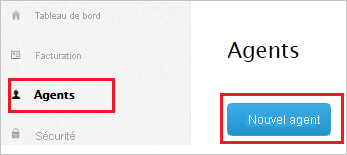
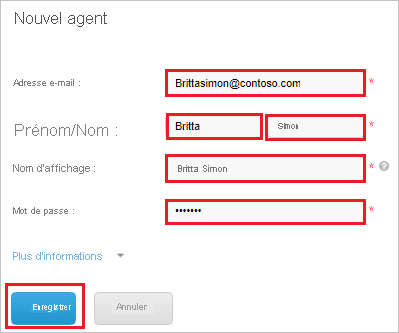

# Tutoriel : Intégration de l’authentification unique Azure Active Directory à Comm100 Live Chat

Dans ce tutoriel, vous allez découvrir comment intégrer Comm100 Live Chat à Azure Active Directory (Azure AD). Quand vous intégrez Comm100 Live Chat avec Azure AD, vous pouvez :

* Contrôler dans Azure AD qui a accès à Comm100 Live Chat.
* Permettre à vos utilisateurs de se connecter automatiquement à Comm100 Live Chat avec leur compte Azure AD.
* Gérer vos comptes à un emplacement central : le Portail Azure.

## Prérequis

Pour commencer, vous devez disposer de ce qui suit :

* Un abonnement Azure AD Si vous ne disposez d’aucun abonnement, vous pouvez obtenir [un compte gratuit](https://azure.microsoft.com/free/).
* Un abonnement Comm100 Live Chat pour lequel l’authentification unique est activée

## Description du scénario

Dans ce tutoriel, vous allez configurer et tester l’authentification unique Azure AD dans un environnement de test.

* Comm100 Live Chat prend en charge l’authentification unique lancée par le **fournisseur de services**.

> [!NOTE]
> L’identificateur de cette application étant une valeur de chaîne fixe, une seule instance peut être configurée dans un locataire.

## Ajout de Comm100 Live Chat à partir de la galerie

Pour configurer l’intégration de Comm100 Live Chat avec Azure AD, vous devez ajouter Comm100 Live Chat à votre liste d’applications SaaS gérées à partir de la galerie.

1. Connectez-vous au portail Azure avec un compte professionnel ou scolaire ou avec un compte personnel Microsoft.
1. Dans le panneau de navigation gauche, sélectionnez le service **Azure Active Directory**.
1. Accédez à **Applications d’entreprise**, puis sélectionnez **Toutes les applications**.
1. Pour ajouter une nouvelle application, sélectionnez **Nouvelle application**.
1. Dans la section **Ajouter à partir de la galerie**, tapez **Comm100 Live Chat** dans la zone de recherche.
1. Sélectionnez **Comm100 Live Chat** dans le volet de résultats, puis ajoutez l’application. Patientez quelques secondes pendant que l’application est ajoutée à votre locataire.

## Configurer et tester l’authentification unique Azure AD pour Comm100 Live Chat

Configurez et testez l’authentification unique Azure AD avec Comm100 Live Chat à l’aide d’un utilisateur de test appelé **B. Simon**. Pour que l’authentification unique fonctionne, vous devez établir un lien entre un utilisateur Azure AD et l’utilisateur Comm100 Live Chat associé.

Pour configurer et tester l’authentification unique Azure AD avec Comm100 Live Chat, effectuez les étapes suivantes :

1. **[Configurer l’authentification unique Azure AD](#configure-azure-ad-sso)** pour permettre à vos utilisateurs d’utiliser cette fonctionnalité.
   1. **[Créer un utilisateur de test Azure AD](#create-an-azure-ad-test-user)** pour tester l’authentification unique Azure AD avec B. Simon.
   1. **[Affecter l’utilisateur de test Azure AD](#assign-the-azure-ad-test-user)** pour permettre à B. Simon d’utiliser l’authentification unique Azure AD.
1. **[Configurer l’authentification unique Comm100 Live Chat](#configure-comm100-live-chat-sso)** pour configurer les paramètres de l’authentification unique côté application.
   1. **[Créer un utilisateur de test Comm100 Live Chat](#create-comm100-live-chat-test-user)** pour avoir un équivalent de B.Simon dans Comm100 Live Chat lié à la représentation Azure AD de l’utilisateur.
1. **[Tester l’authentification unique](#test-sso)** pour vérifier si la configuration fonctionne.

## Configurer l’authentification unique Azure AD

Effectuez les étapes suivantes pour activer l’authentification unique Azure AD dans le Portail Azure.

1. Dans le Portail Azure, accédez à la page d’intégration de l’application **Comm100 Live Chat**, recherchez la section **Gérer** et sélectionnez **Authentification unique**.
1. Dans la page **Sélectionner une méthode d’authentification unique**, sélectionnez **SAML**.
1. Dans la page **Configurer l’authentification unique avec SAML**, cliquez sur l’icône de crayon de **Configuration SAML de base** afin de modifier les paramètres.

   

1. Dans la section **Configuration SAML de base**, effectuez l’étape suivante :

    Dans la zone de texte **URL de connexion**, tapez une URL au format suivant : `https://<SUBDOMAIN>.comm100.com/AdminManage/LoginSSO.aspx?siteId=<SITEID>`

    > [!NOTE] 
    > La valeur de l’URL de connexion n’est pas réelle. Vous mettrez à jour cette valeur avec l’URL de connexion réelle. La procédure est expliquée plus loin dans le didacticiel.

1. L’application Comm100 Live Chat s’attend à recevoir les assertions SAML dans un format spécifique, ce qui vous oblige à ajouter des mappages d’attributs personnalisés à votre configuration d’attributs de jetons SAML. La capture d’écran suivante montre la liste des attributs par défaut.

    

1. En plus de ce qui précède, l’application Comm100 Live Chat s’attend à ce que quelques attributs supplémentaires soient repassés dans la réponse SAML. Ces attributs sont également préremplis, mais vous pouvez les examiner pour voir s’ils répondent à vos besoins.

    | Nom |  Attribut source|
    | ---------------| --------------- |
    |   email    | user.mail |

1. Dans la page **Configurer l’authentification unique avec SAML**, dans la section **Certificat de signature SAML**, recherchez **Certificat (en base64)** , puis sélectionnez **Télécharger** pour télécharger le certificat et l’enregistrer sur votre ordinateur.

    

1. Dans la section **Configurer Comm100 Live Chat**, copiez la ou les URL appropriées en fonction de vos besoins.

    

### Créer un utilisateur de test Azure AD

Dans cette section, vous allez créer un utilisateur de test appelé B. Simon dans le portail Azure.

1. Dans le volet gauche du Portail Azure, sélectionnez **Azure Active Directory**, **Utilisateurs**, puis **Tous les utilisateurs**.
1. Sélectionnez **Nouvel utilisateur** dans la partie supérieure de l’écran.
1. Dans les propriétés **Utilisateur**, effectuez les étapes suivantes :
   1. Dans le champ **Nom**, entrez `B.Simon`.  
   1. Dans le champ **Nom de l’utilisateur**, entrez username@companydomain.extension. Par exemple : `B.Simon@contoso.com`.
   1. Cochez la case **Afficher le mot de passe**, puis notez la valeur affichée dans le champ **Mot de passe**.
   1. Cliquez sur **Créer**.

### Affecter l’utilisateur de test Azure AD

Dans cette section, vous allez autoriser B.Simon à utiliser l’authentification unique Azure en lui accordant l’accès à Comm100 Live Chat.

1. Dans le portail Azure, sélectionnez **Applications d’entreprise**, puis **Toutes les applications**.
1. Dans la liste des applications, sélectionnez **Comm100 Live Chat**.
1. Dans la page de vue d’ensemble de l’application, recherchez la section **Gérer** et sélectionnez **Utilisateurs et groupes**.
1. Sélectionnez **Ajouter un utilisateur**, puis **Utilisateurs et groupes** dans la boîte de dialogue **Ajouter une attribution**.
1. Dans la boîte de dialogue **Utilisateurs et groupes**, sélectionnez **B. Simon** dans la liste Utilisateurs, puis cliquez sur le bouton **Sélectionner** au bas de l’écran.
1. Si vous attendez une valeur de rôle dans l’assertion SAML, dans la boîte de dialogue **Sélectionner un rôle**, sélectionnez le rôle approprié pour l’utilisateur dans la liste, puis cliquez sur le bouton **Sélectionner** en bas de l’écran.
1. Dans la boîte de dialogue **Ajouter une attribution**, cliquez sur le bouton **Attribuer**.

## Configurer l’authentification unique Comm100 Live Chat

1. Ouvrez une autre fenêtre de navigateur web et connectez-vous à Comm100 Live Chat en tant qu’administrateur de la sécurité.

1. Dans l’angle supérieur droit de la page, cliquez sur **My Account** (Mon compte).

   

1. Dans le menu, à gauche, cliquez sur **Security** (Sécurité), puis sur **Agent Single Sign-On** (Authentification unique des agents).

   

1. Dans la page **Agent Single Sign-On** (Authentification unique des agents), effectuez les opérations suivantes :

   

   a. Copiez le premier lien mis en surbrillance et collez-le dans la zone de texte **URL d’authentification** de la section **Configuration SAML de base** du portail Azure.

   b. Dans la zone de texte **SAML SSO URL** (URL d’authentification unique SAML), collez la valeur **URL de connexion** que vous avez copiée dans le portail Azure.

   c. Dans la zone de texte **Remote Logout URL** (URL de déconnexion à distance), collez la valeur de l’**URL de déconnexion** que vous avez copiée à partir du Portail Azure.

   d. Sous **Certificat**, cliquez sur **Choose a File** (Choisir un fichier) pour charger le certificat codé en base 64 que vous avez téléchargé à partir du Portail Azure.

   e. Cliquez sur **Enregistrer les modifications**.

### Créer un utilisateur de test Comm100 Live Chat

Pour permettre aux utilisateurs d’Azure AD de se connecter à Comm100 Live Chat, vous devez les provisionner dans Comm100 Live Chat. Dans Comm100 Live Chat, l’approvisionnement est une tâche manuelle.

**Pour approvisionner un compte d’utilisateur, procédez comme suit :**

1. Connectez-vous à Comm100 Live Chat en tant qu’administrateur de la sécurité.

2. Dans l’angle supérieur droit de la page, cliquez sur **My Account** (Mon compte).

    

3. Dans le menu, à gauche, cliquez sur **Agents**, puis sur **New Agent** (Nouvel agent).

    

4. Dans la page **New Agent** (Nouvel agent), effectuez les opérations suivantes :

    

    a. a. Dans la zone de texte **Email**, tapez l’adresse e-mail de l’utilisateur, par exemple **B.simon\@contoso.com**.

    b. Dans la zone de texte **First Name** (Prénom), tapez le prénom de l’utilisateur, par exemple **B**.

    c. Dans la zone de texte **Last Name** (Nom), saisissez le nom de famille de l’utilisateur, par exemple **Simon**.

    d. Dans la zone de texte **Display Name** (Nom d’affichage), tapez le nom d’affichage de l’utilisateur, par exemple **B.Simon**.

    e. Dans la zone de texte **Password** (Mot de passe), tapez votre mot de passe.

    f. Cliquez sur **Enregistrer**.

## Tester l’authentification unique (SSO) 

Dans cette section, vous allez tester votre configuration de l’authentification unique Azure AD avec les options suivantes. 

* Cliquez sur **Tester cette application** dans le portail Azure. Vous êtes alors redirigé vers l’URL de connexion à Comm100 Live Chat à partir de laquelle vous pouvez lancer le flux de connexion. 

* Accédez directement à l’URL de connexion à Comm100 Live Chat pour lancer de là le flux de connexion.

* Vous pouvez utiliser Mes applications de Microsoft. Lorsque vous cliquez sur la mosaïque Comm100 Live Chat dans Mes applications, vous êtes redirigé vers l’URL de connexion Comm100 Live Chat. Pour plus d’informations sur Mes applications, consultez [Présentation de Mes applications](../user-help/my-apps-portal-end-user-access.md).

## Étapes suivantes

Après avoir configuré Comm100 Live Chat, vous pouvez appliquer le contrôle de session qui protège l’exfiltration et l’infiltration des données sensibles de votre organisation en temps réel. Le contrôle de session est étendu à partir de l’accès conditionnel. [Découvrez comment appliquer un contrôle de session avec Microsoft Cloud App Security](/cloud-app-security/proxy-deployment-aad).